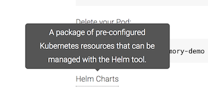
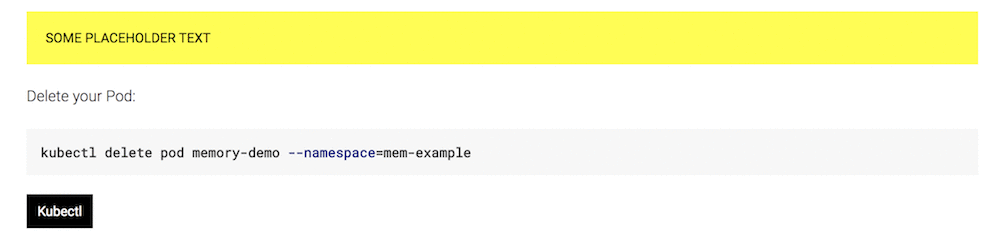

# Custom Jekyll Plugins

This directory contains `*.rb` files that extend the original Jekyll
classes and provide custom formatting for the docs site:

### `glossary_tags.rb`

A full list of glossary terms is available on the [Standardized Glossary](https://kubernetes.io/docs/reference/glossary/?fundamental=true) page.
For further information about term schemas, see the [README](../_includes/templates/glossary/README.md) and the provided [`_example.yml`](../_data/glossary/_example.yml).

*NOTE: The "tags" referenced here are Liquid tags like ``, **not** the glossary canonical tags that are used to categorize terms.*

#### (1) `glossary_definition` tag

This renders the definition of the glossary term inside a `<div>`, preserving Markdown formatting where possible. It uses the [`snippet.md` template](../_includes/templates/glossary/snippet.md).

**Usage:**

```

```

**Parameters:**


| Name | Default | Description |
| --- | --- | --- |
| `term_id` | Not Applicable (Required) | The `id` of the glossary term whose definition will be used. (This `id` is the same as the filename of the term, i.e. `_data/glossary/<ID>.yml`.) |
| `length` | "short" | Specifies which term definition should be used ("short" for the `short-description`, "long" for `long-description`, "all" when both should be included). |
| `prepend` | "Service Catalog is" | A prefix which can be attached in front of a term's short description (which is one or more sentence fragments). |

#### (2) `glossary_tooltip` tag

This renders the glossary term with a tooltip--when the term is moused over by the user, its definition is displayed above.

**Usage:**

```

```

This renders the following:



**Parameters:**


| Name | Default | Description |
| --- | --- | --- |
| `text` | the `name` of the glossary term | The text that the user will hover over to display the glossary definition. **You should include this if using the tooltip inside of a glossary term's YAML short-description.** |
| `term_id` | Not Applicable (Required) | The `id` of the associated glossary term. (This `id` is the same as the filename of the term, i.e. `_data/glossary/<ID>.yml`.) |

#### (3) `glossary_injector` tag

This takes the definition of the term specified by the `term_id` and uses it to populate the contents of another HTML element specified by `placeholder_id`.

**Usage:**

```

```

This renders the following:



*NOTE: Neither the placeholder nor the term's styling/CSS is determined by this Jekyll tag. You will need to specify this yourself in your Markdown/HTML files, i.e. by assigning a custom class.*

**Parameters:**


| Name | Default | Description |
| --- | --- | --- |
| `text` | the `name` of the glossary term | The text that the user will hover over to display the glossary definition. |
| `term_id` | Not Applicable (Required) | The `id` of the glossary term whose definition will be used. (This `id` is the same as the filename of the term, i.e. `_data/glossary/<ID>.yml`.) |
| `placeholder_id` | Not Applicable (Required) | The `id` of  the HTML element whose contents will be populated with the definition of `term_id` |
| `length` | "short" | Specifies which term definition should be used ("short" for the `short-description`, "long" for `long-description`, "all" when both should be included). |
