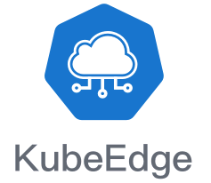
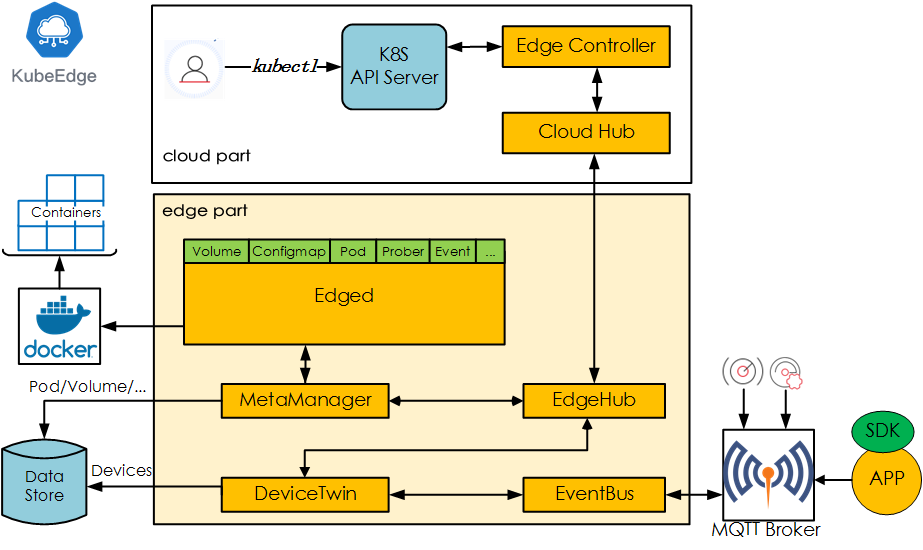

**Author:** Sanil Kumar D (Huawei), Jun Du(Huawei)

## KubeEdge becomes the first Kubernetes Native Edge Computing Platform with both Edge and Cloud components open sourced!

Open source edge computing is going through its most dynamic phase of development in the industry. So many open source platforms, so many consolidations and so many initiatives for standardization! This shows the strong drive to build better platforms to bring cloud computing to edges to meet ever increasing demand. KubeEdge, which was announced last year, now, brings great news for cloud native computing! It provides a complete edge computing solution based on kubernetes with separate cloud and edge core modules. Currently it has both cloud and edge modules open sourced. It can work in offline mode, light weight, containerized, and support heterogeneous hardware at edge. This makes it the most compelling edge computing platforms in the world currently, based on Kubernetes!

## Kube(rnetes)Edge! - Opening up a new kubernetes based ecosystem for Edge Computing

The key goal for KubeEdge is extending Kuberentes ecosystem from cloud to edge. From the time it was announced to public (Shanghai KubeCon, Nov, 2018), the architecture direction for KubeEdge was aligned to Kubernetes, as its name!

It started with its v0.1 providing the basic edge computing features. Now, with its latest release v0.2, it brings the cloud components to connect and complete the loop. With consistent and scalable kubernetes based interfaces, KubeEdge enables the orchestration and management of edge clusters similar to how Kubernetes manages in the cloud. This opens up seamless possibilities of bringing cloud computing capabilities to the edge, quick and efficient.

**KubeEdge Links:**

  - [Website](https://kubeedge.io)

  - [SourceCode](https://github.com/kubeedge/kubeedge)

  - [Documentation](https://docs.kubeedge.io)

Based on its roadmap and architecture, it tries to support all edge nodes, applications, devices and even the cluster management consistent with kuberenetes interface. This will help the edge cloud enact exactly like a cloud cluster. This can save a lot of time and cost on the edge cloud development deployment based on KubeEdge.

KubeEdge provides a containerized edge computing platform, which is inherently scalable. As it's modular and optimized, it is light weight (66MB foot print and ~30MB running memory) and could be deployed on low resource devices. Similarly, the edge node can be of different hardware architecture and with different hardware configurations. For the device connectivity it can support multiple protocols (getting extended the list) and it uses a standard MQTT based communication. This helps in scaling the edge clusters with new nodes and devices efficiently. 

**
You heard it right!
**
**
KubeEdge Cloud Core modules are open sourced!
**

By open sourcing both edge and cloud modules KubeEdge brings a complete cloud vendor agnostic light weight heterogeneous edge computing platform. It is now ready to support building a complete kubernetes ecosystem for edge computing, exploiting most of the existing cloud native projects or software modules. This can enable a mini-cloud at edge to support demanding use cases like data analytics, video analytics, machine learning and more.

## KubeEdge Architecture: Building Kuberenetes Native Edge computing!

The core architecture tenet for KubeEdge is to build interfaces those are consistent with Kubernetes, be it in the cloud side or edge side. 

**Edged**: Manages containerized Applications at the Edge

**EdgeHub**: Communication interface module at Edge. It is a web socket client responsible for interacting with Cloud Service for the edge computing. 

**CloudHub**: Communication interface module at Cloud. A web socket server responsible for watching changes at the cloud side, caching and sending messages to EdgeHub.

**EdgeController**: Manages the edge nodes. It is an extended kubernetes controller which manages edge nodes and pods metadata so that the data can be targeted to a specific edge node.

**EventBus**: Handles the internal edge communications using MQTT. It is an MQTT client to interact with MQTT servers (mosquitto), offering publish and subscribe capabilities to other components.

**DeviceTwin**: It is software mirror for devices that handles the device metadata. This module helps in handling device status and syncing the same to cloud. It also provides query interfaces for applications, as it interfaces to a lightweight database (SQLite).

**MetaManager**: It manages the metadata at edge node. This is the message processor between edged and edgehub. It is also responsible for storing/retrieving metadata to/from a lightweight database (SQLite).

Even if want to add more control plane module based on the architecture refinement and improvement (for example enhanced security), it is simple as it uses consistent registration and modular communication within these modules.

**
KubeEdge provides scalable light weight Kubernetes Native Edge Computing Platform which can work in offline mode.
** 

**
It helps simplified edge application development and deployment.
**

**
Cloud vendor agnostic and can run the cloud core modules on any compute node.
**

## Release 0.1 to 0.2 -- game changer!

KubeEdge v0.1 was released by end of Dec, 2018 with very basic edge features to manage edge application along with kubernetes API primitives for node, pod, config etc. In ~2 months, KubeEdge came with the release v0.2 on 5th March, 2019. This release provides the cloud core modules and enables the end to end open source edge computing solution. The cloud core modules can be deployed to any compute node from any cloud vendors or on-prem.

Now, the complete edge solution can be installed and tested very easily, also with a laptop.

## Run Anywhere - Simple and Light

As described, the KubeEdge Edge and Cloud core components can be deployed easily and can run the user applications. The edge core has a foot print of 66MB and just needs 30MB memory to run. Similarly the cloud core can run on any cloud nodes. (User can experience by running it on a laptop as well)

The installation is simple and can be done in few steps:

  1. Setup the pre-requisites Docker, Kubernetes, MQTT and openssl
  
  2. Clone and Build KubeEdge Cloud and Edge
  
  3. Run Cloud
  
  4. Run Edge

The detailed steps for each are available at [KubeEdge/kubeedge](https://github.com/kubeedge/kubeedge)

## Future : Taking off with competent features and community collaboration

KubeEdge has been developed by members from community who are active contributors to Kubernetes/CNCF and doing research in edge computing. KubeEdge team is also actively collaborating with Kubernetes IOT/EDGE WORKING GROUP. Within few months of KubeEdge announcement it could attract members from different organizations including JingDong, Zhejiang University, SEL Lab, Eclipse, China Mobile, ARM, Intel to collaborate in building the platform and ecosystem.

KubeEdge has a clear roadmap for its upcoming major releases in 2019. vc1.0 targets to provide a complete edge cluster and device management solution with standard edge to edge communication, while v2.0 targets to have advanced features like service mesh, function service , data analytics etc at edge. Also, for all the features, KubeEdge architecture would attempt to utilize the existing CNCF projects/software.

KubeEdge community needs varied organizations, their requirements, use cases and support to build it. Please join to make a kubernetes native edge computing platform which can extends the cloud native computing paradigm to edge cloud.

## How to Get Involved?

We welcome more collaboration to build the kubernetes native edge computing ecosystem. Please join us!

- twitter    : https://twitter.com/kubeedge

- slack      : kubeedge.slack.com

- website    : https://kubeedge.io

- github     : https://github.com/kubeedge/kubeedge

- email      : kubeedge@gmail.com
