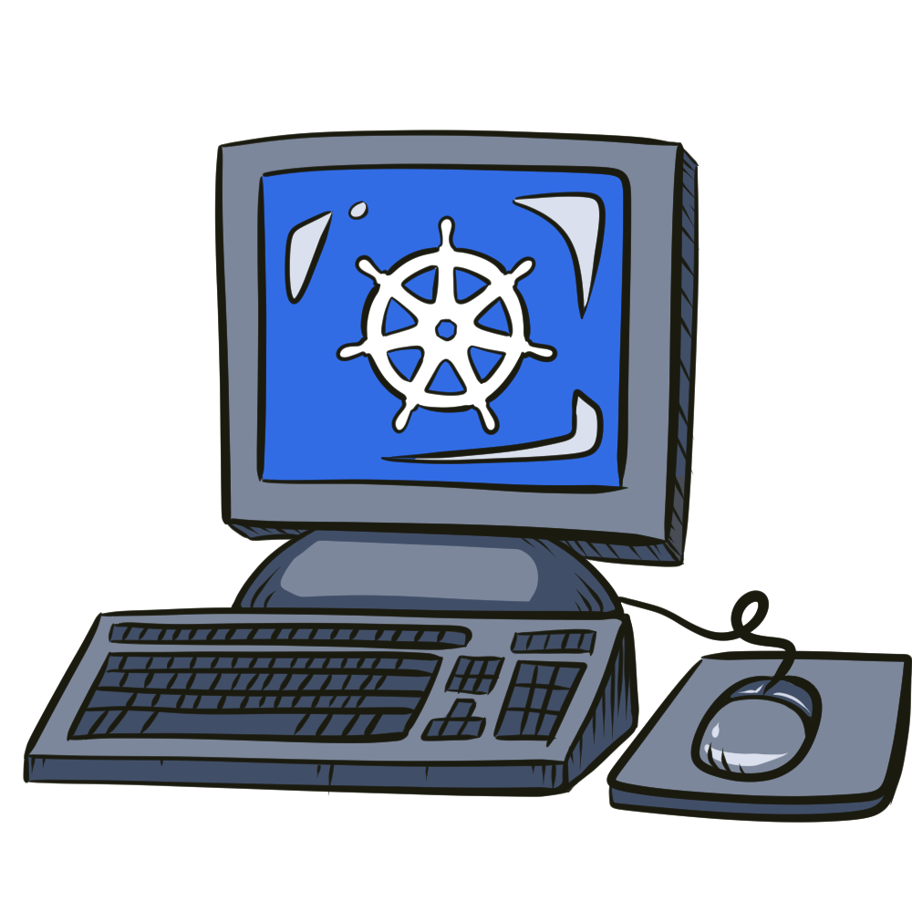
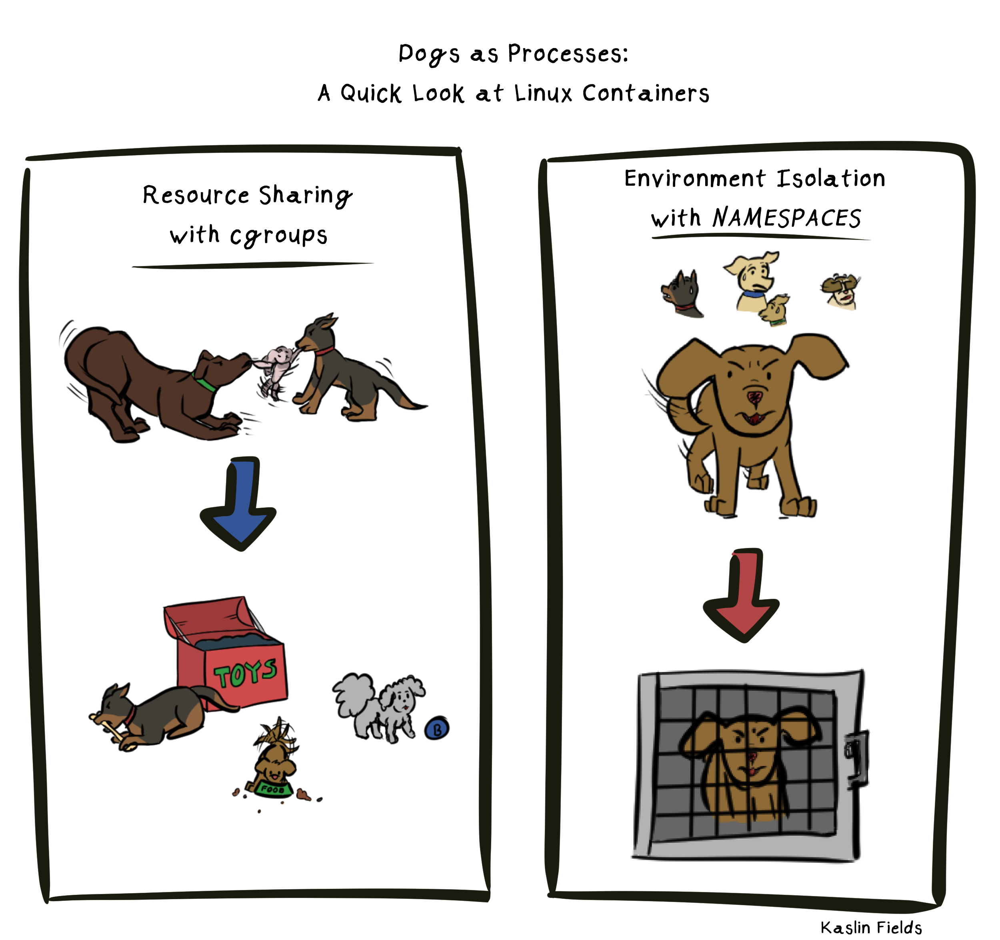

_This post tells the story of how Kubernetes contributors work together to provide a container orchestrator that works for both Linux and Windows._

Most people who are familiar with Kubernetes are probably used to associating it with Linux. The connection makes sense, since Kubernetes ran on Linux from its very beginning. However, many teams and organizations working on adopting Kubernetes need the ability to orchestrate containers on Windows. Since the release of Docker and rise to popularity of containers, there have been efforts both from the community and from Microsoft itself to make container technology as accessible in Windows systems as it is in Linux systems.

Within the Kubernetes community, those who are passionate about making Kubernetes accessible to the Windows community can find a home in the Windows Special Interest Group. To learn more about SIG-Windows and the future of Kubernetes on Windows, I spoke to co-chairs [Mark Rossetti](https://github.com/marosset)  and [Michael Michael](https://github.com/michmike) about the SIG's goals and how others can contribute.

## Intro to Windows Containers & Kubernetes

Kubernetes is the most popular tool for orchestrating container workloads, so to understand the Windows Special Interest Group (SIG) within the Kubernetes project, it's important to first understand what we mean when we talk about running containers on Windows.

***
_"When looking at Windows support in Kubernetes," says SIG (Special Interest Group) Co-chairs Mark Rossetti and Michael Michael, "many start drawing comparisons to Linux containers. Although some of the comparisons that highlight limitations are fair, it is important to distinguish between operational limitations and differences between the Windows and Linux operating systems. Windows containers run the Windows operating system and Linux containers run Linux."_
***

In essence, any "container" is simply a process being run on its host operating system, with some key tooling in place to isolate that process and its dependencies from the rest of the environment. The goal is to make that running process safely isolated, while taking up minimal resources from the system to perform that isolation. On Linux, the tooling used to isolate processes to create "containers" commonly boils down to cgroups and namespaces (among a few others), which are themselves tools built in to the Linux Kernel.

#### _If dogs were processes: containerization would be like giving each dog their own resources like toys and food using cgroups, and isolating troublesome dogs using namespaces._

Native Windows processes are processes that are or must be run on a Windows operating system. This makes them fundamentally different from a process running on a Linux operating system. Since Linux containers are Linux processes being isolated by the Linux kernel tools known as cgroups and namespaces, containerizing native Windows processes meant implementing similar isolation tools within the Windows kernel itself. Thus, "Windows Containers" and "Linux Containers" are fundamentally different technologies, even though they have the same goals (isolating processes) and in some ways work similarly (using kernel level containerization).

So when it comes to running containers on Windows, there are actually two very important concepts to consider:

* Native Windows processes running as native Windows Server style containers,
* and traditional Linux containers running on a Linux Kernel, generally hosted on a lightweight Hyper-V Virtual Machine.

You can learn more about Linux and Windows containers in this [tutorial](https://docs.microsoft.com/en-us/virtualization/windowscontainers/deploy-containers/linux-containers) from Microsoft.

### Kubernetes on Windows

Kubernetes was initially designed with Linux containers in mind and was itself designed to run on Linux systems. Because of that, much of the functionality of Kubernetes involves unique Linux functionality. The Linux-specific work is intentional--we all want Kubernetes to run optimally on Linux--but there is a growing demand for similar optimization for Windows servers. For cases where users need container orchestration on Windows, the Kubernetes contributor community of SIG-Windows has incorporated functionality for Windows-specific use cases.

***
_"A common question we get is, will I be able to have a Windows-only cluster. The answer is NO. Kubernetes control plane components will continue to be based on Linux, while SIG-Windows is concentrating on the experience of having Windows worker nodes in a Kubernetes cluster."_
***

Rather than separating out the concepts of "Windows Kubernetes," and "Linux Kubernetes," the community of SIG-Windows works toward adding functionality to the main Kubernetes project which allows it to handle use cases for Windows. These Windows capabilities mirror, and in some cases add unique functionality to, the Linux use cases Kubernetes has served since its release in 2014 (want to learn more history? Scroll through this [original design document](https://github.com/kubernetes/kubernetes/blob/e2b948dbfbba62b8cb681189377157deee93bb43/DESIGN.md).

## What Does SIG-Windows Do?

***
_"SIG-Windows is really the center for all things Windows in Kubernetes,"_ SIG chairs Mark and Michael said, _"We mainly focus on the compute side of things, but really anything related to running Kubernetes on Windows is in scope for SIG-Windows."_
***

In order to best serve users, SIG-Windows works to make the Kubernetes user experience as consistent as possible for users of Windows and Linux. However some use cases simply only apply to one Operating System, and as such, the SIG-Windows group also works to create functionality that is unique to Windows-only workloads.

Many SIGs, or "Special Interest Groups" within Kubernetes have a narrow focus, allowing members to dive deep on a certain facet of the technology. While specific expertise is welcome, those interested in SIG-Windows will find it to be a great community to build broad understanding across many focus areas of Kubernetes. "Members from our SIG interface with storage, network, testing, cluster-lifecycle and others groups in Kubernetes."

### Who are SIG-Windows' Users?
The best way to understand the technology a group makes, is often to understand who their customers or users are.

#### "A majority of the users we've interacted with have business-critical infrastructure running on Windows developed over many years and can't move those workloads to Linux for various reasons (cost, time, compliance, etc)," the SIG chairs shared. "By transporting those workloads into Windows containers and running them in Kubernetes they are able to quickly modernize their infrastructure and help migrate it to the cloud."

As anyone in the Kubernetes space can attest, companies around the world, in many different industries, see Kubernetes as their path to modernizing their infrastructure. Often this involves re-architecting or event totally re-inventing many of the ways they've been doing business. With the goal being to make their systems more scalable, more robust, and more ready for anything the future may bring. But not every application or workload can or should change the core operating system it runs on, so many teams need the ability to run containers at scale on Windows, or Linux, or both.

"Sometimes the driver to Windows containers is a modernization effort and sometimes it’s because of expiring hardware warranties or end-of-support cycles for the current operating system. Our efforts in SIG-Windows enable Windows developers to take advantage of cloud native tools and Kubernetes to build and deploy distributed applications faster. That’s exciting! In essence, users can retain the benefits of application availability while decreasing costs."

## Who are SIG-Windows?

Who are these contributors working on enabling Windows workloads for Kubernetes? It could be you!

Like with other Kubernetes SIGs, contributors to SIG-Windows can be anyone from independent hobbyists to professionals who work at many different companies. They come from many different parts of the world and bring to the table many different skill sets.

_"Like most other Kubernetes SIGs, we are a very welcome and open community," explained the SIG co-chairs Michael Michael and Mark Rosetti._

### Becoming a contributor

For anyone interested in getting started, the co-chairs added, "New contributors can view old community meetings on GitHub (we record every single meeting going back three years), read our documentation, attend new community meetings, ask questions in person or on Slack, and file some issues on Github. We also attend all KubeCon conferences and host 1-2 sessions, a contributor session, and meet-the-maintainer office hours."

The co-chairs also shared a glimpse into what the path looks like to becoming a member of the SIG-Windows community:

"We encourage new contributors to initially just join our community and listen, then start asking some questions and get educated on Windows in Kubernetes. As they feel comfortable, they could graduate to improving our documentation, file some bugs/issues, and eventually they can be a code contributor by fixing some bugs. If they have long-term and sustained substantial contributions to Windows, they could become a technical lead or a chair of SIG-Windows. You won't know if you love this area unless you get started :) To get started, [visit this getting-started page](https://github.com/kubernetes/community/tree/master/sig-windows). It's a one stop shop with links to everything related to SIG-Windows in Kubernetes."

When asked if there were any useful skills for new contributors, the co-chairs said,

"We are always looking for expertise in Go and Networking and Storage, along with a passion for Windows. Those are huge skills to have. However, we don’t require such skills, and we welcome any and all contributors, with varying skill sets. If you don’t know something, we will help you acquire it."

You can get in touch with the folks at SIG-Windows in their [Slack channel](https://kubernetes.slack.com/archives/C0SJ4AFB7) or attend one of their regular meetings - currently 30min long on Tuesdays at 12:30PM EST! You can find links to their regular meetings as well as past meeting notes and recordings from the [SIG-Windows README](https://github.com/kubernetes/community/tree/master/sig-windows#readme) on GitHub.

As a closing message from SIG-Windows:

***
#### _"We welcome you to get involved and join our community to share feedback and deployment stories, and contribute to code, docs, and improvements of any kind."_
***
