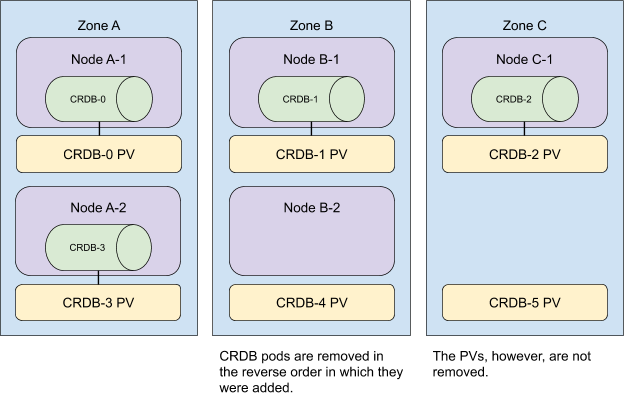
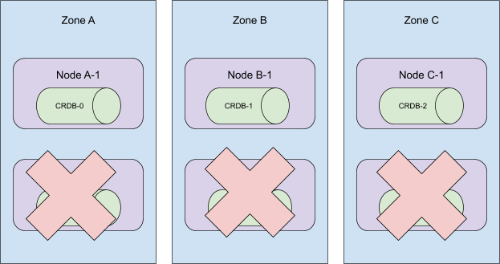
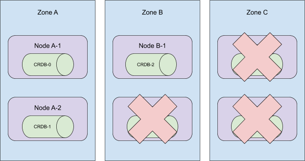

**Author**: Chris Seto (Cockroach Labs)

As long as you're willing to follow the rules, deploying on Kubernetes and air travel can be quite pleasant. More often than not, things will "just work". However, if one is interested in travelling with an alligator that must remain alive or scaling a database that must remain available, the situation is likely to become a bit more complicated. It may even be easier to build one's own plane or database for that matter. Travelling with reptiles aside, scaling a highly available stateful system is no trivial task.

Scaling any system has two main components:
1. Adding or removing infrastructure that the system will run on, and
2. Ensuring that the system knows how to handle additional instances of itself being added and removed.

Most stateless systems, web servers for example, are created without the need to be aware of peers. Stateful systems, which includes databases like CockroachDB, have to coordinate with their peer instances and shuffle around data. As luck would have it, CockroachDB handles data redistribution and replication. The tricky part is being able to tolerate failures during these operations by ensuring that data and instances are distributed across many failure domains (availability zones).

One of Kubernetes' responsibilities is to place "resources" (e.g, a disk or container) into the cluster and satisfy the constraints they request. For example: "I must be in availability zone _A_" (see [Running in multiple zones](/docs/setup/best-practices/multiple-zones/#nodes-are-labeled)), or "I can't be placed onto the same node as this other Pod" (see [Affinity and anti-affinity](/docs/concepts/scheduling-eviction/assign-pod-node/#affinity-and-anti-affinity)).

As an addition to those constraints, Kubernetes offers [Statefulsets](/docs/concepts/workloads/controllers/statefulset/) that provide identity to Pods as well as persistent storage that "follows" these identified pods. Identity in a StatefulSet is handled by an increasing integer at the end of a pod's name. It's important to note that this integer must always be contiguous: in a StatefulSet, if pods 1 and 3 exist then pod 2 must also exist.

Under the hood, CockroachCloud deploys each region of CockroachDB as a StatefulSet in its own Kubernetes cluster - see [Orchestrate CockroachDB in a Single Kubernetes Cluster](https://www.cockroachlabs.com/docs/stable/orchestrate-cockroachdb-with-kubernetes.html).
In this article, I'll be looking at an individual region, one StatefulSet and one Kubernetes cluster which is distributed across at least three availability zones.

A three-node CockroachCloud cluster would look something like this:

When adding additional resources to the cluster we also distribute them across zones. For the speediest user experience, we add all Kubernetes nodes at the same time and then scale up the StatefulSet.

Note that anti-affinities are satisfied no matter the order in which pods are assigned to Kubernetes nodes. In the example, pods 0, 1 and 2 were assigned to zones A, B, and C respectively, but pods 3 and 4 were assigned in a different order, to zones B and A respectively. The anti-affinity is still satisfied because the pods are still placed in different zones.

To remove resources from a cluster, we perform these operations in reverse order.

We first scale down the StatefulSet and then remove from the cluster any nodes lacking a CockroachDB pod.

Now, remember that pods in a StatefulSet of size _n_ must have ids in the range `[0,n)`. When scaling down a StatefulSet by _m_, Kubernetes removes _m_ pods, starting from the highest ordinals and moving towards the lowest, [the reverse in which they were added](/docs/concepts/workloads/controllers/statefulset/#deployment-and-scaling-guarantees).
Consider the cluster topology below:

As ordinals 5 through 3 are removed from this cluster, the statefulset continues to have a presence across all 3 availability zones.

However, Kubernetes' scheduler doesn't _guarantee_ the placement above as we expected at first.

Our combined knowledge of the following is what lead to this misconception.
* Kubernetes' ability to [automatically spread Pods across zone](/docs/setup/best-practices/multiple-zones/#pods-are-spread-across-zones)
* The behavior that a StatefulSet with _n_ replicas, when Pods are being deployed, they are created sequentially, in order from `{0..n-1}`. See [StatefulSet](https://kubernetes.io/docs/concepts/workloads/controllers/statefulset/#deployment-and-scaling-guarantees) for more details.

Consider the following topology:

These pods were created in order and they are spread across all availability zones in the cluster. When ordinals 5 through 3 are terminated, this cluster will lose its presence in zone C!

Worse yet, our automation, at the time, would remove Nodes A-2, B-2, and C-2. Leaving CRDB-1 in an unscheduled state as persistent volumes are only available in the zone they are initially created in.

To correct the latter issue, we now employ a "hunt and peck" approach to removing machines from a cluster. Rather than blindly removing Kubernetes nodes from the cluster, only nodes without a CockroachDB pod would be removed. The much more daunting task was to wrangle the Kubernetes scheduler.

## A session of brainstorming left us with 3 options:

### 1. Upgrade to kubernetes 1.18 and make use of Pod Topology Spread Constraints

While this seems like it could have been the perfect solution, at the time of writing Kubernetes 1.18 was unavailable on the two most common managed Kubernetes services in public cloud, EKS and GKE.
Furthermore, [pod topology spread constraints](/docs/concepts/scheduling-eviction/topology-spread-constraints/) were still a beta feature in 1.18 which meant that it [wasn't guaranteed to be available in managed clusters](https://cloud.google.com/kubernetes-engine/docs/concepts/types-of-clusters#kubernetes_feature_choices) even when v1.18 became available.
The entire endeavour was concerningly reminiscent of checking [caniuse.com](https://caniuse.com/) when Internet Explorer 8 was still around.

### 2. Deploy a statefulset _per zone_.

Rather than having one StatefulSet distributed across all availability zones, a single StatefulSet with node affinities per zone would allow manual control over our zonal topology.
Our team had considered this as an option in the past which made it particularly appealing.
Ultimately, we decided to forego this option as it would have required a massive overhaul to our codebase and performing the migration on existing customer clusters would have been an equally large undertaking.

### 3. Write a custom Kubernetes scheduler.

Thanks to an example from [Kelsey Hightower](https://github.com/kelseyhightower/scheduler) and a blog post from [Banzai Cloud](https://banzaicloud.com/blog/k8s-custom-scheduler/), we decided to dive in head first and write our own [custom Kubernetes scheduler](/docs/tasks/extend-kubernetes/configure-multiple-schedulers/).
Once our proof-of-concept was deployed and running, we quickly discovered that the Kubernetes' scheduler is also responsible for mapping persistent volumes to the Pods that it schedules.
The output of [`kubectl get events`](/docs/tasks/extend-kubernetes/configure-multiple-schedulers/#verifying-that-the-pods-were-scheduled-using-the-desired-schedulers) had led us to believe there was another system at play.
In our journey to find the component responsible for storage claim mapping, we discovered the [kube-scheduler plugin system](/docs/concepts/scheduling-eviction/scheduling-framework/). Our next POC was a `Filter` plugin that determined the appropriate availability zone by pod ordinal, and it worked flawlessly!

Our [custom scheduler plugin](https://github.com/cockroachlabs/crl-scheduler) is open source and runs in all of our CockroachCloud clusters.
Having control over how our StatefulSet pods are being scheduled has let us scale out with confidence.
We may look into retiring our plugin once pod topology spread constraints are available in GKE and EKS, but the maintenance overhead has been surprisingly low.
Better still: the plugin's implementation is orthogonal to our business logic. Deploying it, or retiring it for that matter, is as simple as changing the `schedulerName` field in our StatefulSet definitions.

---

_[Chris Seto](https://twitter.com/_ostriches) is a software engineer at Cockroach Labs and works on their Kubernetes automation for [CockroachCloud](https://cockroachlabs.cloud), CockroachDB._
