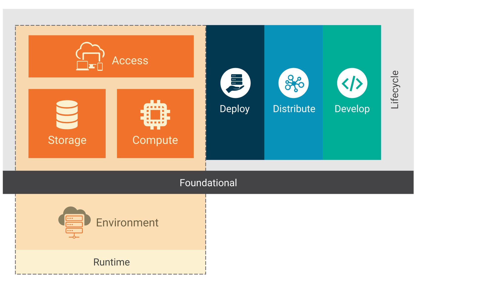

Over the last few years a small, security focused community has been working diligently to deepen our understanding of security, given the evolving cloud native infrastructure and corresponding iterative deployment practices. To enable sharing of this knowledge with the rest of the community, members of [CNCF SIG Security](https://github.com/cncf/sig-security) (a group which reports into [CNCF TOC](https://github.com/cncf/toc#sigs) and who are friends with [Kubernetes SIG Security](https://github.com/kubernetes/community/tree/master/sig-security)) led by Emily Fox, collaborated on a whitepaper outlining holistic cloud native security concerns and best practices. After over 1200 comments, changes, and discussions from 35 members across the world, we are proud to share [cloud native security whitepaper v1.0](https://www.cncf.io/blog/2020/11/18/announcing-the-cloud-native-security-white-paper) that serves as essential reading for security leadership in enterprises, financial and healthcare industries, academia, government, and non-profit organizations.

The paper attempts to _not_ focus on any specific [cloud native project](https://www.cncf.io/projects/). Instead, the intent is to model and inject security into four logical phases of cloud native application lifecycle: _Develop, Distribute, Deploy, and Runtime_.

## Kubernetes native security controls
When using Kubernetes as a workload orchestrator, some of the security controls this version of the whitepaper recommends are:
* [Pod Security Policies](/docs/concepts/security/pod-security-policy/): Implement a single source of truth for “least privilege” workloads across the entire cluster
* [Resource requests and limits](/docs/concepts/configuration/manage-resources-containers/#requests-and-limits): Apply requests (soft constraint) and limits (hard constraint) for shared resources such as memory and CPU
* [Audit log analysis](/docs/tasks/debug/debug-cluster/audit/): Enable Kubernetes API auditing and filtering for security relevant events
* [Control plane authentication and certificate root of trust](/docs/concepts/architecture/control-plane-node-communication/): Enable mutual TLS authentication with a trusted CA for communication within the cluster
* [Secrets management](/docs/concepts/configuration/secret/): Integrate with a built-in or external secrets store

## Cloud native complementary security controls

Kubernetes has direct involvement in the _deploy_ phase and to a lesser extent in the _runtime_ phase. Ensuring the artifacts are securely _developed_ and _distributed_ is necessary for, enabling workloads in Kubernetes to run “secure by default”. Throughout all phases of the Cloud native application life cycle, several complementary security controls exist for Kubernetes orchestrated workloads, which includes but are not limited to:
* Develop:
  - Image signing and verification
  - Image vulnerability scanners
* Distribute:
  - Pre-deployment checks for detecting excessive privileges
  - Enabling observability and logging
* Deploy:
  - Using a service mesh for workload authentication and authorization
  - Enforcing “default deny” network policies for inter-workload communication via [network plugins](/docs/concepts/extend-kubernetes/compute-storage-net/network-plugins/)
* Runtime:
  - Deploying security monitoring agents for workloads
  - Isolating applications that run on the same node using SELinux, AppArmor, etc.
  - Scanning configuration against recognized secure baselines for node, workload and orchestrator

## Understand first, secure next
The cloud native way, including containers, provides great security benefits for its users: immutability, modularity, faster upgrades and consistent state across the environment. Realizing this fundamental change in “the way things are done”, motivates us to look at security with a cloud native lens. One of the things that was evident for all the authors of the paper was the fact that it’s tough to make smarter decisions on how and what to secure in a cloud native ecosystem if you do not understand the tools, patterns, and frameworks at hand (in addition to knowing your own critical assets). Hence, for all the security practitioners out there who want to be partners rather than a gatekeeper for your friends in Operations, Product Development, and Compliance, let’s make an attempt to _learn more so we can secure better_.

We recommend following this **7 step R.U.N.T.I.M.E. path** to get started on cloud native security:
1. <b>R</b>ead the paper and any linked material in it
2. <b>U</b>nderstand challenges and constraints for your environment
3. <b>N</b>ote the content and controls that apply to your environment
4. <b>T</b>alk about your observations with your peers
5. <b>I</b>nvolve your leadership and ask for help
6. <b>M</b>ake a risk profile based on existing and missing security controls
7. <b>E</b>xpend time, money, and resources that improve security posture and reduce risk where appropriate.

## Acknowledgements
Huge shout out to _Emily Fox, Tim Bannister (The Scale Factory), Chase Pettet (Mirantis), and Wayne Haber (GitLab)_ for contributing with their wonderful suggestions for this blog post.
