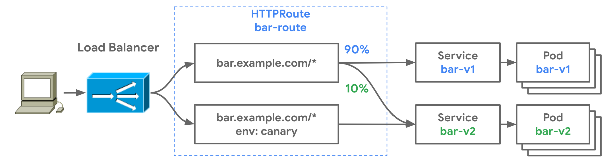
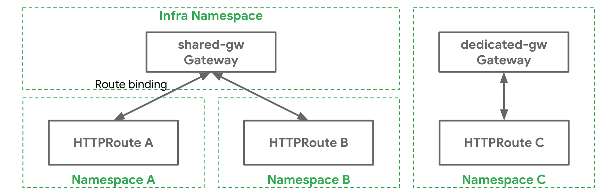

---
layout: blog
title: 'Evolving Kubernetes networking with the Gateway API'
date: 2021-04-22
slug: evolving-kubernetes-networking-with-the-gateway-api
---

**Authors:** Mark Church (Google), Harry Bagdi (Kong), Daneyon Hanson (Red Hat), Nick Young (VMware), Manuel Zapf (Traefik Labs)

The Ingress resource is one of the many Kubernetes success stories. It created a [diverse ecosystem of Ingress controllers](/docs/concepts/services-networking/ingress-controllers/) which were used across hundreds of thousands of clusters in a standardized and consistent way. This standardization helped users adopt Kubernetes. However, five years after the creation of Ingress, there are signs of fragmentation into different but [strikingly similar CRDs](https://dave.cheney.net/paste/ingress-is-dead-long-live-ingressroute.pdf) and [overloaded annotations](https://kubernetes.github.io/ingress-nginx/user-guide/nginx-configuration/annotations/). The same portability that made Ingress pervasive also limited its future.

It was at Kubecon 2019 San Diego when a passionate group of contributors gathered to discuss the [evolution of Ingress](https://static.sched.com/hosted_files/kccncna19/a5/Kubecon%20San%20Diego%202019%20-%20Evolving%20the%20Kubernetes%20Ingress%20APIs%20to%20GA%20and%20Beyond%20%5BPUBLIC%5D.pdf). The discussion overflowed to the hotel lobby across the street and what came out of it would later be known as the [Gateway API](https://gateway-api.sigs.k8s.io). This discussion was based on a few key assumptions:

1. The API standards underlying route matching, traffic management, and service exposure are commoditized and provide little value to their implementers and users as custom APIs
2. It’s possible to represent L4/L7 routing and traffic management through common core API resources
3. It’s possible to provide extensibility for more complex capabilities in a way that does not sacrifice the user experience of the core API


## Introducing the Gateway API

This led to design principles that allow the Gateway API to improve upon Ingress:

- **Expressiveness** - In addition to HTTP host/path matching and TLS, Gateway API can express capabilities like HTTP header manipulation, traffic weighting & mirroring, TCP/UDP routing, and other capabilities that were only possible in Ingress through custom annotations.
- **Role-oriented design** - The API resource model reflects the separation of responsibilities that is common in routing and Kubernetes service networking.
- **Extensibility** - The resources allow arbitrary configuration attachment at various layers within the API. This makes granular customization possible at the most appropriate places.
- **Flexible conformance** - The Gateway API defines varying conformance levels - core (mandatory support), extended (portable if supported), and custom (no portability guarantee), known together as [flexible conformance](https://gateway-api.sigs.k8s.io/concepts/guidelines/#conformance). This promotes a highly portable core API (like Ingress) that still gives flexibility for Gateway controller implementers.  

### What does the Gateway API look like?

The Gateway API introduces a few new resource types:

- **[GatewayClasses](https://gateway-api.sigs.k8s.io/references/spec/#networking.x-k8s.io/v1alpha1.GatewayClass)** are cluster-scoped resources that act as templates to explicitly define behavior for Gateways derived from them. This is similar in concept to StorageClasses, but for networking data-planes.
- **[Gateways](https://gateway-api.sigs.k8s.io/references/spec/#networking.x-k8s.io/v1alpha1.Gateway)** are the deployed instances of GatewayClasses. They are the logical representation of the data-plane which performs routing, which may be in-cluster proxies, hardware LBs, or cloud LBs.
- **Routes** are not a single resource, but represent many different protocol-specific Route resources. The [HTTPRoute](https://gateway-api.sigs.k8s.io/references/spec/#networking.x-k8s.io/v1alpha1.HTTPRoute) has matching, filtering, and routing rules that get applied to Gateways that can process HTTP and HTTPS traffic. Similarly, there are [TCPRoutes](https://gateway-api.sigs.k8s.io/references/spec/#networking.x-k8s.io/v1alpha1.TCPRoute), [UDPRoutes](https://gateway-api.sigs.k8s.io/references/spec/#networking.x-k8s.io/v1alpha1.UDPRoute), and [TLSRoutes](https://gateway-api.sigs.k8s.io/references/spec/#networking.x-k8s.io/v1alpha1.TLSRoute) which also have protocol-specific semantics. This model also allows the Gateway API to incrementally expand its protocol support in the future.


### Gateway Controller Implementations

The good news is that although Gateway is in [Alpha](https://github.com/kubernetes-sigs/gateway-api/releases), there are already several [Gateway controller implementations](https://gateway-api.sigs.k8s.io/references/implementations/) that you can run. Since it’s a standardized spec, the following example could be run on any of them and should function the exact same way. Check out [getting started](https://gateway-api.sigs.k8s.io/guides/getting-started/) to see how to install and use one of these Gateway controllers.

## Getting Hands-on with the Gateway API

In the following example, we’ll demonstrate the relationships between the different API Resources and walk you through a common use case:

*   Team foo has their app deployed in the foo Namespace. They need to control the routing logic for the different pages of their app.
*   Team bar is running in the bar Namespace. They want to be able to do blue-green rollouts of their application to reduce risk.
*   The platform team is responsible for managing the load balancer and network security of all the apps in the Kubernetes cluster.

The following foo-route does path matching to various Services in the foo Namespace and also has a default route to a 404 server. This exposes foo-auth and foo-home Services via `foo.example.com/login` and `foo.example.com/home` respectively.:


```yaml
kind: HTTPRoute
apiVersion: networking.x-k8s.io/v1alpha1
metadata:
  name: foo-route
  namespace: foo
  labels:
    gateway: external-https-prod
spec:
  hostnames:
  - "foo.example.com"
  rules:
  - matches:
    - path:
        type: Prefix
        value: /login
    forwardTo:
    - serviceName: foo-auth
      port: 8080
  - matches:
    - path:
        type: Prefix
        value: /home
    forwardTo:
    - serviceName: foo-home
      port: 8080
  - matches:
    - path:
        type: Prefix
        value: /
    forwardTo:
    - serviceName: foo-404
      port: 8080
```


The bar team, operating in the bar Namespace of the same Kubernetes cluster, also wishes to expose their application to the internet, but they also want to control their own canary and blue-green rollouts. The following HTTPRoute is configured for the following behavior:

*   For traffic to `bar.example.com`:
    *   Send 90% of the traffic to bar-v1
    *   Send 10% of the traffic to bar-v2
*   For traffic to `bar.example.com` with the HTTP header `env: canary`:
    
    *   Send all the traffic to bar-v2
    



```yaml
kind: HTTPRoute
apiVersion: networking.x-k8s.io/v1alpha1
metadata:
  name: bar-route
  namespace: bar
  labels:
    gateway: external-https-prod
spec:
  hostnames:
  - "bar.example.com"
  rules:
  - forwardTo:
    - serviceName: bar-v1
      port: 8080
      weight: 90
    - serviceName: bar-v2
      port: 8080
      weight: 10
  - matches:
    - headers:
        values:
          env: canary
    forwardTo:
    - serviceName: bar-v2
      port: 8080
```


### Route and Gateway Binding

So we have two HTTPRoutes matching and routing traffic to different Services. You might be wondering, where are these Services accessible? Through which networks or IPs are they exposed? 

How Routes are exposed to clients is governed by [Route binding](https://gateway-api.sigs.k8s.io/concepts/api-overview/#route-binding), which describes how Routes and Gateways create a bidirectional relationship between each other. When Routes are bound to a Gateway it means their collective routing rules are configured on the underlying load balancers or proxies and the Routes are accessible through the Gateway. Thus, a Gateway is a logical representation of a networking data plane that can be configured through Routes.




### Administrative Delegation

The split between Gateway and Route resources allows the cluster administrator to delegate some of the routing configuration to individual teams while still retaining centralized control. The following Gateway resource exposes HTTPS on port 443 and terminates all traffic on the port with a certificate controlled by the cluster administrator.


```yaml
kind: Gateway
apiVersion: networking.x-k8s.io/v1alpha1
metadata:
  name: prod-web
spec:
  gatewayClassName: acme-lb
  listeners:  
  - protocol: HTTPS
    port: 443
    routes:
      kind: HTTPRoute
      selector:
        matchLabels:
          gateway: external-https-prod
      namespaces:
        from: All
    tls:
      certificateRef:
        name: admin-controlled-cert
```


The following HTTPRoute shows how the Route can ensure it matches the Gateway's selector via it’s `kind` (HTTPRoute) and resource labels (`gateway=external-https-prod`). 


```yaml
# Matches the required kind selector on the Gateway
kind: HTTPRoute
apiVersion: networking.x-k8s.io/v1alpha1
metadata:
  name: foo-route
  namespace: foo-ns
  labels:

    # Matches the required label selector on the Gateway
    gateway: external-https-prod
...
```

### Role Oriented Design

When you put it all together, you have a single load balancing infrastructure that can be safely shared by multiple teams. The Gateway API not only a more expressive API for advanced routing, but is also a role-oriented API, designed for multi-tenant infrastructure. Its extensibility ensures that it will evolve for future use-cases while preserving portability. Ultimately these characteristics will allow Gateway API to adapt to different organizational models and implementations well into the future.

### Try it out and get involved

There are many resources to check out to learn more. 

*   Check out the [user guides](https://gateway-api.sigs.k8s.io/guides/getting-started/) to see what use-cases can be addressed. 
*   Try out one of the [existing Gateway controllers ](https://gateway-api.sigs.k8s.io/references/implementations/)
*   Or [get involved](https://gateway-api.sigs.k8s.io/contributing/community/) and help design and influence the future of Kubernetes service networking!