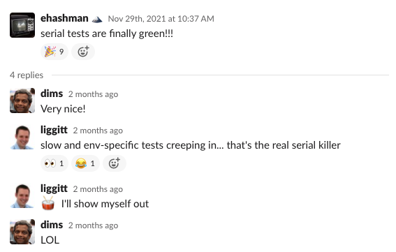
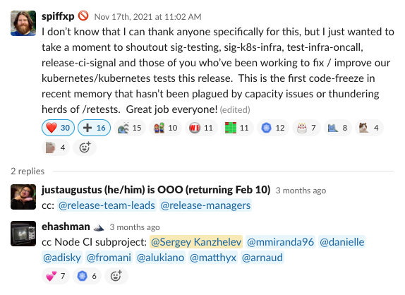

Ensuring the reliability of SIG Node upstream code is a continuous effort
that takes a lot of behind-the-scenes effort from many contributors.
There are frequent releases of Kubernetes, base operating systems,
container runtimes, and test infrastructure that result in a complex matrix that
requires attention and steady investment to "keep the lights on."
In May 2020, the Kubernetes node special interest group ("SIG Node") organized a new
subproject for continuous integration (CI) for node-related code and tests. Since its
inauguration, the SIG Node CI subproject has run a weekly meeting, and even the full hour
is often not enough to complete triage of all bugs, test-related PRs and issues, and discuss all
related ongoing work within the subgroup.

Over the past two years, we've fixed merge-blocking and release-blocking tests, reducing time to merge Kubernetes contributors' pull requests thanks to reduced test flakes. When we started, Node test jobs only passed 42% of the time, and through our efforts, we now ensure a consistent >90% job pass rate. We've closed 144 test failure issues and merged 176 pull requests just in kubernetes/kubernetes. And we've helped subproject participants ascend the Kubernetes contributor ladder, with 3 new org members, 6 new reviewers, and 2 new approvers.

The Node CI subproject is an approachable first stop to help new contributors
get started with SIG Node. There is a low barrier to entry for new contributors
to address high-impact bugs and test fixes, although there is a long
road before contributors can climb the entire contributor ladder:
it took over a year to establish two new approvers for the group.
The complexity of all the different components that power Kubernetes nodes
and its test infrastructure requires a sustained investment over a long period
for developers to deeply understand the entire system,
both at high and low levels of detail.

We have several regular contributors at our meetings, however; our reviewers
and approvers pool is still small. It is our goal to continue to grow
contributors to ensure a sustainable distribution of work
that does not just fall to a few key approvers.

It's not always obvious how subprojects within SIGs are formed, operate,
and work. Each is unique to its sponsoring SIG and tailored to the projects
that the group is intended to support. As a group that has welcomed many
first-time SIG Node contributors, we'd like to share some of the details and
accomplishments over the past two years,
helping to demystify our inner workings and celebrate the hard work
of all our dedicated contributors!

## Timeline

***May 2020.*** SIG Node CI group was formed on May 11, 2020, with more than
[30 volunteers](https://docs.google.com/document/d/1fb-ugvgdSVIkkuJ388_nhp2pBTy_4HEVg5848Xy7n5U/edit#bookmark=id.vsb8pqnf4gib)
signed up, to improve SIG Node CI signal and overall observability.
Victor Pickard focused on getting
[testgrid jobs](https://testgrid.k8s.io/sig-node) passing
when Ning Liao suggested forming a group around this effort and came up with
the [original group charter document](https://docs.google.com/document/d/1yS-XoUl6GjZdjrwxInEZVHhxxLXlTIX2CeWOARmD8tY/edit#heading=h.te6sgum6s8uf).
The SIG Node chairs sponsored group creation with Victor as a subproject lead.
Sergey Kanzhelev joined Victor shortly after as a co-lead.

At the kick-off meeting, we discussed which tests to concentrate on fixing first
and discussed merge-blocking and release-blocking tests, many of which were failing due
to infrastructure issues or buggy test code.

The subproject launched weekly hour-long meetings to discuss ongoing work
discussion and triage.

***June 2020.*** Morgan Bauer, Karan Goel, and Jorge Alarcon Ochoa were
recognized as reviewers for the SIG Node CI group for their contributions,
helping significantly with the early stages of the subproject.
David Porter and Roy Yang also joined the SIG test failures GitHub team.

***August 2020.*** All merge-blocking and release-blocking tests were passing,
with some flakes. However, only 42% of all SIG Node test jobs were green, as there
were many flakes and failing tests.

***October 2020.*** Amim Knabben becomes a Kubernetes org member for his
contributions to the subproject.

***January 2021.*** With healthy presubmit and critical periodic jobs passing,
the subproject discussed its goal for cleaning up the rest of periodic tests
and ensuring they passed without flakes.

Elana Hashman joined the subproject, stepping up to help lead it after
Victor's departure.

***February 2021.*** Artyom Lukianov becomes a Kubernetes org member for his
contributions to the subproject.

***August 2021.*** After SIG Node successfully ran a [bug scrub](https://groups.google.com/g/kubernetes-dev/c/w2ghO4ihje0/m/VeEql1LJBAAJ)
to clean up its bug backlog, the scope of the meeting was extended to
include bug triage to increase overall reliability, anticipating issues
before they affect the CI signal.

Subproject leads Elana Hashman and Sergey Kanzhelev are both recognized as
approvers on all node test code, supported by SIG Node and SIG Testing.

***September 2021.*** After significant deflaking progress with serial tests in
the 1.22 release spearheaded by Francesco Romani, the subproject set a goal
for getting the serial job fully passing by the 1.23 release date.

Mike Miranda becomes a Kubernetes org member for his contributions
to the subproject.

***November 2021.*** Throughout 2021, SIG Node had no merge or
release-blocking test failures. Many flaky tests from past releases are removed
from release-blocking dashboards as they had been fully cleaned up.

Danielle Lancashire was recognized as a reviewer for SIG Node's subgroup, test code.

The final node serial tests were completely fixed. The serial tests consist of
many disruptive and slow tests which tend to be flakey and are hard
to troubleshoot. By the 1.23 release freeze, the last serial tests were
fixed and the job was passing without flakes.

The 1.23 release got a special shout out for the tests quality and CI signal.
The SIG Node CI subproject was proud to have helped contribute to such
a high-quality release, in part due to our efforts in identifying
and fixing flakes in Node and beyond.

***December 2021.*** An estimated 90% of test jobs were passing at the time of
the 1.23 release (up from 42% in August 2020).

Dockershim code was removed from Kubernetes. This affected nearly half of SIG Node's
test jobs and the SIG Node CI subproject reacted quickly and retargeted all the
tests. SIG Node was the first SIG to complete test migrations off dockershim,
providing examples for other affected SIGs. The vast majority of new jobs passed
at the time of introduction without further fixes required. The [effort of
removing dockershim](https://k8s.io/dockershim)) from Kubernetes is ongoing.
There are still some wrinkles from the dockershim removal as we uncover more
dependencies on dockershim, but we plan to stabilize all test jobs
by the 1.24 release.

## Statistics

Our regular meeting attendees and subproject participants for the past few months:

- Aditi Sharma
- Artyom Lukianov
- Arnaud Meukam
- Danielle Lancashire
- David Porter
- Davanum Srinivas
- Elana Hashman
- Francesco Romani
- Matthias Bertschy
- Mike Miranda
- Paco Xu
- Peter Hunt
- Ruiwen Zhao
- Ryan Phillips
- Sergey Kanzhelev
- Skyler Clark
- Swati Sehgal
- Wenjun Wu

The [kubernetes/test-infra](https://github.com/kubernetes/test-infra/) source code repository contains test definitions. The number of
Node PRs just in that repository:
- 2020 PRs (since May): [183](https://github.com/kubernetes/test-infra/pulls?q=is%3Apr+is%3Aclosed+label%3Asig%2Fnode+created%3A2020-05-01..2020-12-31+-author%3Ak8s-infra-ci-robot+)
- 2021 PRs: [264](https://github.com/kubernetes/test-infra/pulls?q=is%3Apr+is%3Aclosed+label%3Asig%2Fnode+created%3A2021-01-01..2021-12-31+-author%3Ak8s-infra-ci-robot+)

Triaged issues and PRs on CI board (including triaging away from the subgroup scope):

- 2020 (since May): [132](https://github.com/issues?q=project%3Akubernetes%2F43+created%3A2020-05-01..2020-12-31)
- 2021: [532](https://github.com/issues?q=project%3Akubernetes%2F43+created%3A2021-01-01..2021-12-31+)

## Future

Just "keeping the lights on" is a bold task and we are committed to improving this experience.
We are working to simplify the triage and review processes for SIG Node.

Specifically, we are working on better test organization, naming,
and tracking:

- https://github.com/kubernetes/enhancements/pull/3042
- https://github.com/kubernetes/test-infra/issues/24641
- [Kubernetes SIG-Node CI Testgrid Tracker](https://docs.google.com/spreadsheets/d/1IwONkeXSc2SG_EQMYGRSkfiSWNk8yWLpVhPm-LOTbGM/edit#gid=0)

We are also constantly making progress on improved tests debuggability and de-flaking.

If any of this interests you, we'd love for you to join us!
There's plenty to learn in debugging test failures, and it will help you gain
familiarity with the code that SIG Node maintains.

You can always find information about the group on the
[SIG Node](https://github.com/kubernetes/community/tree/master/sig-node) page.
We give group updates at our maintainer track sessions, such as
[KubeCon + CloudNativeCon Europe 2021](https://kccnceu2021.sched.com/event/iE8E/kubernetes-sig-node-intro-and-deep-dive-elana-hashman-red-hat-sergey-kanzhelev-google) and
[KubeCon + CloudNative North America 2021](https://kccncna2021.sched.com/event/lV9D/kubenetes-sig-node-intro-and-deep-dive-elana-hashman-derek-carr-red-hat-sergey-kanzhelev-dawn-chen-google?iframe=no&w=100%&sidebar=yes&bg=no).
Join us in our mission to keep the kubelet and other SIG Node components reliable and ensure smooth and uneventful releases!
