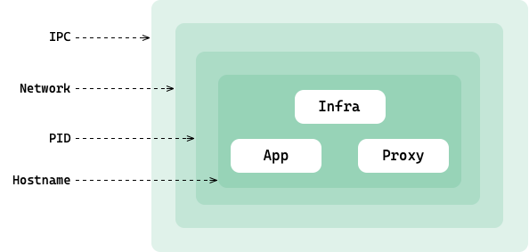
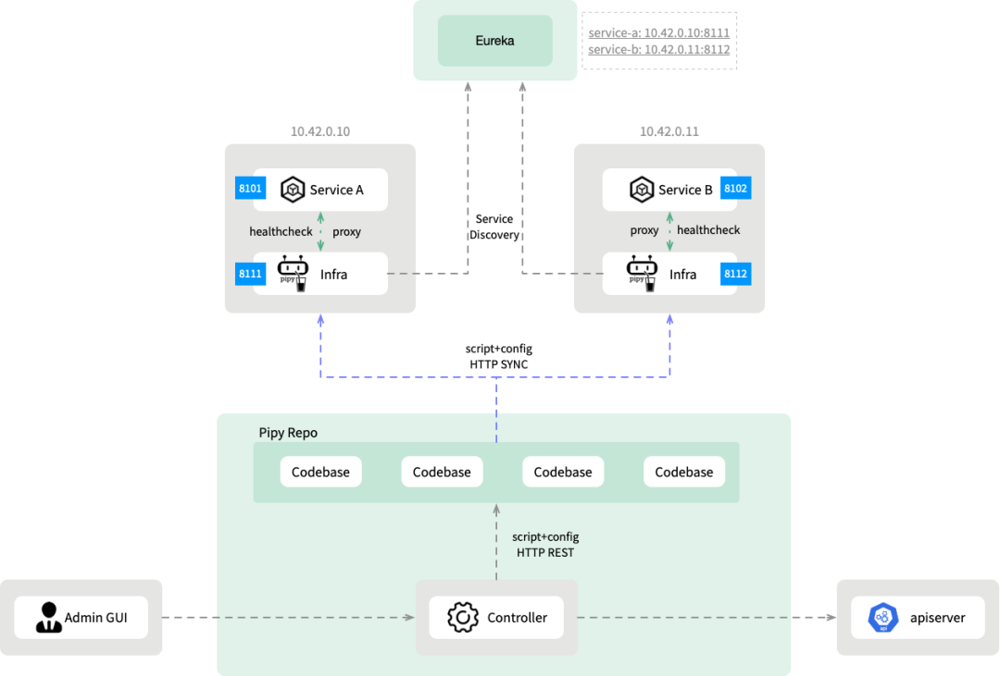

**Author:** Zhang Xiaohui (Addo), Ali Naqvi

The infrastructure or “pause” container exists in every Pod in Kubernetes. When Pod is scheduled to a node, kubelet on the node creates an operating environment for it, including namespace, network and IPC, before creating a container. This environment is called the Pod Sandbox, and the infra container is an important component and carrier of the Sandbox. It serves as the parent container for all containers in pod and serves as the basis of shared namespace, ipc, network, shared volume etc.

Kubelet first creates the infra container, and then other containers in Pod are added to the infra container's network namespace in the form of join namespace to achieve network communication between containers. Below is a depiction of a Pod in a service mesh environment:



Kubernetes maintains a multi-architecture image that includes support for Windows. For Kubernetes v1.23 the recommended pause image is `k8s.gcr.io/pause:3.6`, which is very small and goes into a pause state once started.

## Pipy as Infrastructure container

With above information and details, we can see that in fact, infrastructure containers are invisible **sidecar**. Our exploration on `Pipy as Infra` series is two fold, one is to implement more infrastructure related functionality on this ubiquitous sidecar to make it a real infrastructure container, another one is to reduce the complexity and resource consumption associated with multiple sidecar containers.

Infrastructure container to use can be configured via kubelet option. First let's use Pipy image as the replacement for k8s `pause` container.

> Pipy is an open source, high-performance programmable proxy for cloud, edge, and IoT. Written in C++, Pipy is very lightweight and fast, making it an ideal service mesh proxy. Pipy has a built-in JavaScript engine that enables it to execute scripts with JavaScript syntax, which we call `PipyJS`. PipyJS makes Pipy highly customizable. `Pipy Repo` is Pipy built in functionality for code base management, supporting inheritance, grouping, and versioning management, making it easy to implement hierarchical distribution of configuration, supporting pipy clustering without requiring additional components and/or resources. Pipy worker integrates well with Pipy Repo to fetch and synchronize PipyJS scripts and configurations stored in Pipy Repo, supports dynamic loading and reloading. Pipy compiled binary is around 10MB in size, has zero external dependency, and have a memory footprint of 1 MB when runny empty.

For more details, documentations, tutorials, and learnings please refer to Pipy official [Website](https://flomesh.io)

## Example scenario - Service Registration

Kubernetes default infrastructure container (aka pause container) functionality is to serve as the parent container for sharing and reaping zombie processes. However, the programmable nature of Pipy allows us to do many more things when we replace kubernetes pause containers with Pipy containers.

Current Kubernetes extension mechanism provide management capabilities from a **outside Pod** perspective, like webhooks, which perform specific management logic throughout the lifecycle of a container. PipyPipyJSJS actually provides the ability to operate *in Pod* when Pipy is used as an infra container. When we want to perform an operation inside the Pod, we use `nsenter` manually, or `attach` to the container using the shell command line. Pipy provides a new mechanism:  as an infra container, Pipy can be started quickly and listen to signals. But once started, Pipy can dynamically pull PipyJS scripts from the `Pipy Repo` and then execute these scripts so that we can dynamically perform functions *in Pod*.

In this part of series we will discuss and demonstrate the first scenario: **Service Registration**. Service registration is one of the most popular solutions in the micro services, whether it is `Spring Eureka`, the pioneer of micro services, `Consu`l, or a variety of third-party registries, such as `Nacos`, `Zookeeper`, or `etcd-based` service registration for Kubernetes. The diversity of services registration, on the one hand, is *native* to various development frameworks, and on the other hand, service registries themselves have many differentiated, fine-grained requirements that lead to different registries.

Today we will demonstrate our own implementation of the service registry client, **registering non-Spring Cloud services into the Eureka registry**. The combination of `Spring + Eureka` was chosen partly because it is the most used microservice combination around and partly because of the simplicity of Eureka's interface.

> For readers interested in other registry implementations, after learning this demo, can try to implement other service registries like `Nacos` etc.

For demonstration purposes we will be running demo on local cluster setup via lightweight kubernetes distribution [k3s](https://k3s.io/). Demo source code is available on github and can be downloaded from [pipy infra demo](https://github.com/flomesh-io/pipy-demos/tree/main/pipy-infra-demo) repository.


## `k3s` Setup
Apr 5, 2022
You can setup k3s cluster in two different ways, installing `k3s` directly on host or via light weight k3s wrapper [k3d](https://k3d.io/). Both approaches will be shown below.

### Host installation

The two-step installation starts with the installation of the `k3s` binaries and tools and disable starting k3s service.

```sh
curl -sfL https://get.k3s.io | INSTALL_K3S_SKIP_START=true INSTALL_K3S_SKIP_ENABLE=true sh -
```

The next step is to start `k3s` cluster and replace the infrastructure image. K3s by default uses the `containerd` as runtime which is not developement and debugging friendly, as it makes it difficult to view the logs of `infra contrainer`, even when using its command line tool [nerdctl](https://github.com/containerd/nerdctl).

In development mode, you can append the `--docker` parameter to use the Docker as a container runtime. The latest Pipy Infra image tag is `0.4.0-362`:

```sh
k3s server --pause-image="flomesh/pipy-node:0.4.0-362" --docker
```

Changes access privileges of `/etc/rancher/k3s/k3s.yaml`, for it to be used as `kubectl` configuration file.

```sh
sudo chmod 644 /etc/rancher/k3s/k3s.yaml
```

### Running K3S inside container

`k3d` makes it very easy to run a `k3s` cluster, but we can not change k3s container runtime to docker.

```sh
k3d cluster create infra-test --k3s-arg "--pause-image=flomesh/pipy-node:0.4.0-362"@
```

### Test

After the cluster is setup, you can run the following command to check the cluster running images status:

```sh
kubectl get pods -A
```

Check whether the image is successfully replaced.

```sh
docker ps | grep pipy-node | wc -l
5
```

if running `containerd` runtime, then run following command

```sh
nerdctl --address /run/k3s/containerd/containerd.sock --namespace k8s.io ps | grep pipy-node | wc -l
5
```

## Scenario : Service Registration

For those of you who are familiar with `Consul`, we have borrowed Consul Agent's design to register non-Java services with `SpringCloud Eureka`. Of course, other registries such as Nacos, Consul can also be supported.

### Architecture overview



1. The base code base in *Pipy Repo* stores various functional scripts available to infra containers.
2. The *Controller* will monitor the Pod creation and derive the Pod new code base from the base code base.
3. The Infra container synchronizes scripts and configurations from the Pod's corresponding code base and dynamically enables the specified functionality based on the Pod's label. Such as service registration, Pod label `infra.flomesh.io/registry: 'true'` asks infra container to enable the service registry function. In the future, when you extend more functions, simply add corresponding labels, such as `infra.flomesh.io/stats: 'true'`.
4. The Infra container executes scripts to complete health checks, service registration, heartbeat reporting, etc.


## Configuration

### Install Pipy repo controller

First install `certificate manager`:

```sh
kubectl apply -f kubernetes/artifacts/cert-manager-v1.5.3.yaml
```

Ensure pods are up and running.

```sh
kubectl get pod -n cert-manager
NAME                                       READY   STATUS    RESTARTS   AGE
cert-manager-cainjector-57c4d88795-k5nxm   1/1     Running   0          1m
cert-manager-5cf47d87cd-scgt9              1/1     Running   0          1m
cert-manager-webhook-5fdc55c65b-5qxhs      1/1     Running   0          1m
```

install `repo controller`:

```sh
kubectl apply -f kubernetes/artifacts/pipy-infra.yaml
```

ensure pods are up and running.

```sh
kubectl get pod -n pipy-infra
NAME                                       READY   STATUS    RESTARTS   AGE
controller-manager-pifr-7787f9fc84-lhmb5   2/2     Running   0          1m
```

### SpringCloud components

1. Install Eureka server via invoking ```kubectl apply -f kubernetes/discovery.yaml``` and ensure its up and running.
2. Install config server via invoking ```kubectl apply -f kubernetes/config.yaml```. **Note:** Only the SpringBoot application in this demo depends on the Config Service.
3. Skip to the [test section](#testing) and follow the steps to find that config-service was successfully registered.


### Running Demo App

Since Pipy in the Infra container needs to know which service name the application is registered with, it is identified by injecting environment variables. This can also be done by adding a label to the Pod.

For application health checks, the Infra container uses the `httpGet` portion of the Container's Readiness Probe as the application health check endpoint.

#### SpringBoot application

Run `kubectl apply -f kubernetes/springboot/deployment.yaml`

#### Non-Java application

We use a static server implemented by Pipy as a non-Java application. You can also use implementations in other languages, such as Python, Nodejs, Golang, and others.

Run `kubectl apply -f kubernetes/http-static-server/deployment.yaml`

### testing

Enter the pod in the registry and check the application's registration status in the registry:

```sh
kubectl exec -it samples-discovery-server-6d67944757-4nrvv -- sh
apk add curl jq
curl -s localhost:8761/eureka/apps -H accept:application/json | jq -r .applications.application[].name
```

You will see the following three services:

```
CONFIG-SERVICE
BOOKINFO-RATINGS
PIPY-HTTP-STATIC-SERVER
```

## Discussion for other scenarios

As an infra container, Pipy offers new possibilities and scenarios for executing specific logic inside containers. At present, we at Flomesh are verifying and implementing the following functions:

*  Proactive health checkups. Perform access to business container-specific interfaces in Pipy to detect service availability and health. For example, when the service process is SpringBoot, access the `/healthz` interface and report the result to the monitoring system.
*  Resource monitoring. Imitating the Node-Exporter function, you can maintain a close partnership by collecting cpu/mem information about processes in the container and reporting the information to the monitoring system.
*  Pipy acts as an infra container and sidecar proxy to "ideling" business processes according to monitored traffic.
*  Policy engine. Implement security checks that are separate from business logic and based on dynamically updatable policies, such as permission verification. Emulates functionality similar to that of open Policy Agent, but uses PipyJS that implements the same functionality as the others, without learning its unique policy language, Rego.

Readers interested are encouraged and welcome to initiate discussions on other scenarios and/or uses cases. Refer to [Pipy website](https://flomesh.io) for links to discussion forums, slack, twitter etc.

Pipy acts as an infra container, much like a systemd inside a Pod. This "root process" can be used to trigger and perform various management functions, operation and maintenance functions, test functions... Form an open and extensible mechanism to form "microoperations" inside the container.

## Conclusion

With the rapid and widespread adoption of the Kubernetes, more and more functions are crammed into pods by means of sidecars, some of which are "huge". "Pods are getting crowded," and the relationships and dependencies and conflicts between different Sidecars introduce new topics, adding complexity and difficulty to manage.

When using Pipy as an infra container, Pipy's small size, high performance, scalability, built-in configuration delivery, built-in clustering and other capabilities make it more flexible, efficient, and agile to build and manage sidecar.
