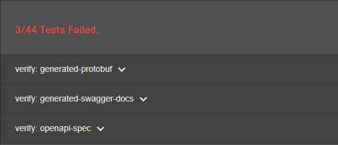
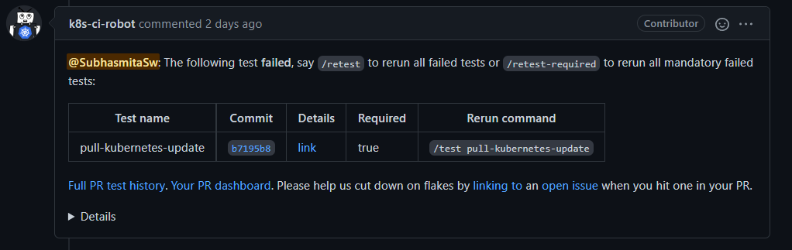
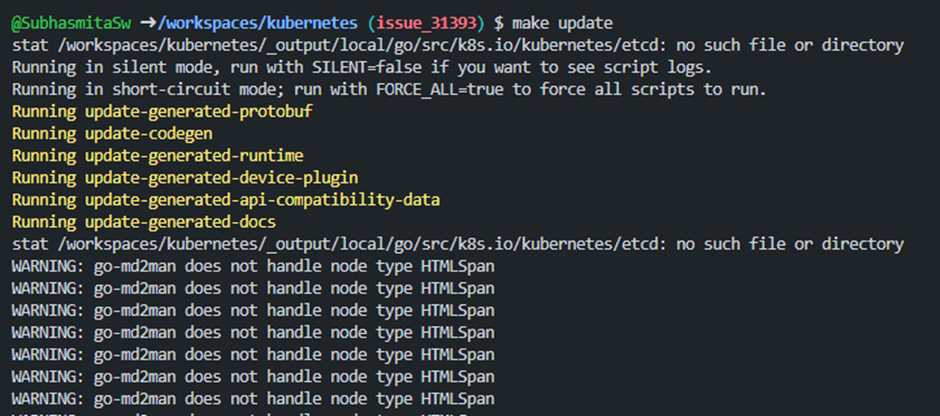
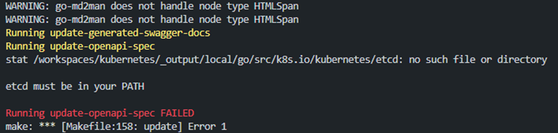
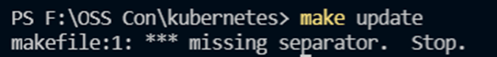
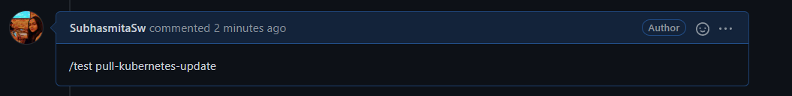
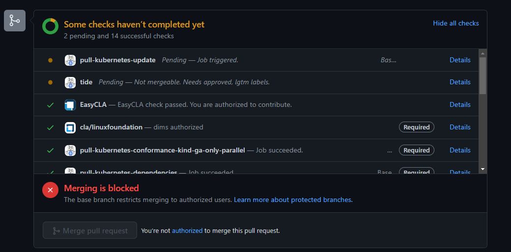
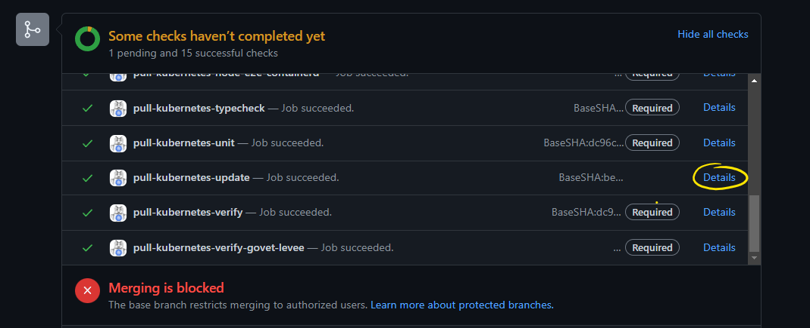
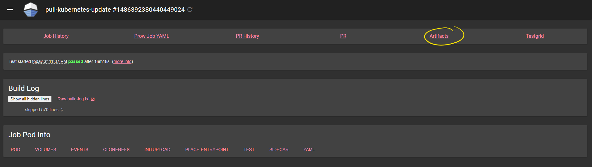
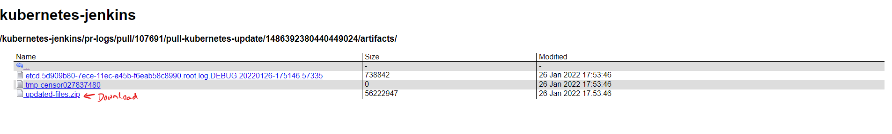

**Authors:** [Subhasmita Swain](https://github.com/SubhasmitaSw), [Davanum Srinivas](https://github.com/dims) 

---


If you are contributing to the Kubernetes project and are developing on a Windows PC, it is conceivable that you will encounter certain issues that will cause your pull request to get held up by test failures. This article describes a workaround for a similar issue I encountered when attempting to have my modifications approved and merged into the master branch.

## Why is this needed?
 
While contributing to [kubernetes/kubernetes](https://github.com/kubernetes/kubernetes) for some minor documentation changes, the pushed changes needed to be updated with other verified contents of the entire documentation. So, in order for the change to take effect, a single command must be performed to ensure that all tests on the CI pipeline pass. The single command `make update` runs all presubmission verification tests. For some reason on the "Windows Subsystem for Linux" environment the tests, specifically the [update-openapi-spec.sh](https://github.com/kubernetes/kubernetes/blob/master/hack/update-openapi-spec.sh) script, failed (in my case, take a look at the conversation [here](https://github.com/kubernetes/kubernetes/pull/107691)), eventually failing the `pull-kubernetes-verify` tests.


You might encounter the following on your PR


The tests failing the particular issue:



Consecutively, 



Additionally one can check the failed test via the `link` provided under details in the above image.

### Potential Workaround

Run the failing `.sh` scripts individually known from the CI job output, to generate the expected files to fix up the failures. The `.sh` scripts can be found residing under the `hack/` directory at the root of the `kubernetes/kubernetes` code base. 

`kubernetes/kubernetes` &rarr; `hack/*.sh`


In this particular case, these files were to be run:

* [hack/update-generated-protobuf.sh](https://github.com/kubernetes/kubernetes/blob/master/hack/update-generated-protobuf.sh) 
* [hack/update-generated-swagger-docs.sh](https://github.com/kubernetes/kubernetes/blob/master/hack/update-generated-swagger-docs.sh)
* [hack/update-openapi-spec.sh](https://github.com/kubernetes/kubernetes/blob/master/hack/update-openapi-spec.sh)

After you run these, you might see either of the below issues:

---
Using Codespaces:




---

Using Visual Studio Code:



### Possible solutions to counter the above errors

1. Remove the Makefile and Makefile.generated_files files:

```
    rm Makefile Makefile.generated_files
```

2. Create the symlinks:

```
    ln -s build/root/Makefile Makefile
```

```
    ln -s build/root/Makefile.generated_files Makefile.generated_files
```  

> PS: takes adequate time to generate the scripts on windows.

## The current situation

Many contributors do not have access to powerful environments in which to run `make update` or `make verify`. They can utilise *vscode/wsl/codespaces* and other tools to recommend modifications, but they might get tripped up by `make verify` scripts because in many cases, we end up with files that needs to be re-generated. It's a tall order for them to scan the build log from `make verify` to determine which specific scripts in `hack/` directory they need to run.

### Solutions

According to [@dims](https://github.com/dims), a [long term solution](https://github.com/kubernetes/kubernetes/issues/109374#issuecomment-1092155063) for this problem would be to add a new Prow bot command that generates an additional commit on their PR.

In the meantime, the short term workaround is to add a CI job that folks can trigger when they need it, that runs `make update` and provides a zip archive that they can be told to download. The archive includes all the files that changed as a result of running `make update`.

### Implementing the Short Term Workaround

The problem was that for some of the verify scripts to work well, the scripts needed both Linux
and plenty of local resources (CPU, memory). Once we realized this issue, we decided to add a new CI job. This CI job is named `pull-kubernetes-update`.  

You can trigger this CI job by commenting `/test pull-kubernetes-update` as a Prow bot command in any Kubernetes PR. This CI job runs `make update` and then generates a zip archive named `updated-files.zip` in the artifacts directory for that job.  

You can then download the archive which has the changes made when `make update` was run;
once the download is finished, you can update your PR with the newly updated code.

#### Using the short-term solution

Here's what you can do as a contributor to get automated help updating your pull request with generated files.

Make sure to rebase your working branch against the latest base branch (usually this is `master`), so that your PR includes the most recent upstream commits. Remember to push or force-push your changes.

On your PR, write a new comment that contains only the text: 

```
    /test pull-kubernetes-update
```



You will see the automated check lists and details.



Once the checks are complete, click the `Details` link on `pull-kubernetes-update` job to go to the artifacts directory and  download the `updated-files.zip` file.







Now, update the PR by adding the extracted files you downloaded. 

## Conclusion

For the time being, several fantastic people are working on a bot command that will produce an additional commit with the generated files for the failed tests. In the long term, it will make things simpler. If anything becomes confusing at any point, we urge any and all inquiries to be directed on slack, regardless of experience level or complexity! We hope this shortens your debugging time and alleviates some of your concerns!
