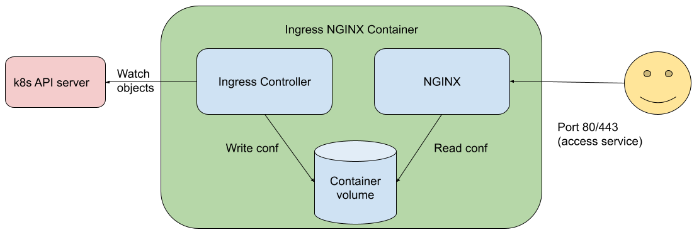
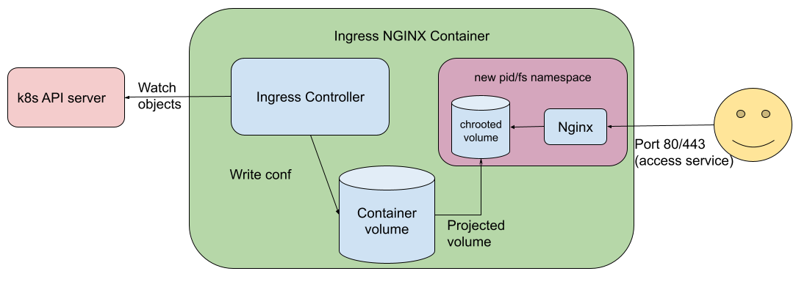

**Authors:** Ricardo Katz (VMware), James Strong (Chainguard)

The [Ingress](/docs/concepts/services-networking/ingress/) may be one of the most targeted components
of Kubernetes. An Ingress typically defines an HTTP reverse proxy, exposed to the Internet, containing
multiple websites, and with some privileged access to Kubernetes API (such as to read Secrets relating to
TLS certificates and their private keys).

While it is a risky component in your architecture, it is still the most popular way to properly expose your services.

Ingress-NGINX has been part of security assessments that figured out we have a big problem: we don't
do all proper sanitization before turning the configuration into an `nginx.conf` file, which may lead to information
disclosure risks.

While we understand this risk and the real need to fix this, it's not an easy process to do, so we took another approach to reduce (but not remove!) this risk in the current (v1.2.0) release.

## Meet Ingress NGINX v1.2.0 and the chrooted NGINX process

One of the main challenges is that Ingress-NGINX runs the web proxy server (NGINX) alongside the Ingress
controller (the component that has access to Kubernetes API that and that creates the `nginx.conf` file).

So, NGINX does have the same access to the filesystem of the controller (and Kubernetes service account token, and other configurations from the container). While splitting those components is our end goal, the project needed a fast response; that lead us to the idea of using `chroot()`.

Let's take a look into what an Ingress-NGINX container looked like before this change:



As we can see, the same container (not the Pod, the container!) that provides HTTP Proxy is the one that watches Ingress objects and writes the Container Volume

Now, meet the new architecture:



What does all of this mean? A basic summary is: that we are isolating the NGINX service as a container inside the
controller container.

While this is not strictly true, to understand what was done here, it's good to understand how
Linux containers (and underlying mechanisms such as kernel namespaces) work.
You can read about cgroups in the Kubernetes glossary: [`cgroup`](https://kubernetes.io/docs/reference/glossary/?fundamental=true#term-cgroup) and learn more about cgroups interact with namespaces in the NGINX project article
[What Are Namespaces and cgroups, and How Do They Work?](https://www.nginx.com/blog/what-are-namespaces-cgroups-how-do-they-work/).
(As you read that, bear in mind that Linux kernel namespaces are a different thing from
[Kubernetes namespaces](/docs/concepts/overview/working-with-objects/namespaces/)).

## Skip the talk, what do I need to use this new approach?

While this increases the security, we made this feature an opt-in in this release so you can have
time to make the right adjustments in your environment(s). This new feature is only available from
release v1.2.0 of the Ingress-NGINX controller.

There are two required changes in your deployments to use this feature:
* Append the suffix "-chroot" to the container image name. For example: `gcr.io/k8s-staging-ingress-nginx/controller-chroot:v1.2.0`
* In your Pod template for the Ingress controller, find where you add the capability `NET_BIND_SERVICE` and add the capability `SYS_CHROOT`. After you edit the manifest, you'll see a snippet like:

```yaml
capabilities:
  drop:
  - ALL
  add:
  - NET_BIND_SERVICE
  - SYS_CHROOT
```

If you deploy the controller using the official Helm chart then change the following setting in
`values.yaml`:

```yaml
controller:
  image:
    chroot: true
```

Ingress controllers are normally set up cluster-wide (the IngressClass API is cluster scoped). If you manage the
Ingress-NGINX controller but you're not the overall cluster operator, then check with your cluster admin about
whether you can use the `SYS_CHROOT` capability, **before** you enable it in your deployment.

## OK, but how does this increase the security of my Ingress controller?

Take the following configuration snippet and imagine, for some reason it was added to your `nginx.conf`:
```
location /randomthing/ {
      alias /;
      autoindex on;
}
```

If you deploy this configuration, someone can call `http://website.example/randomthing` and get some listing (and access) to the whole filesystem of the Ingress controller.

Now, can you spot the difference between chrooted and non chrooted Nginx on the listings below?

| Without extra `chroot()`             | With extra `chroot()` |
|----------------------------|--------|
| `bin`                      | `bin`  |
| `dev`                      | `dev`  |
| `etc`                      | `etc`  |
| `home`                     |        |
| `lib`                      | `lib`  |
| `media`                    |        |
| `mnt`                      |        |
| `opt`                      | `opt`  |
| `proc`                     | `proc` |
| `root`                     |        |
| `run`                      | `run`  |
| `sbin`                     |        |
| `srv`                      |        |
| `sys`                      |        |
| `tmp`                      | `tmp`  |
| `usr`                      | `usr`  |
| `var`                      | `var`  |
| `dbg`                      |        |
| `nginx-ingress-controller` |        |
| `wait-shutdown`            |        |

The one in left side is not chrooted. So NGINX has full access to the filesystem. The one in right side is chrooted, so a new filesystem with only the required files to make NGINX work is created.

## What about other security improvements in this release?

We know that the new `chroot()` mechanism helps address some portion of the risk, but still, someone
can try to inject commands to read, for example, the `nginx.conf` file and extract sensitive information.

So, another change in this release (this is opt-out!) is the _deep inspector_.
We know that some directives or regular expressions may be dangerous to NGINX, so the deep inspector
checks all fields from an Ingress object (during its reconciliation, and also with a
[validating admission webhook](/docs/reference/access-authn-authz/admission-controllers/#validatingadmissionwebhook))
to verify if any fields contains these dangerous directives.

The ingress controller already does this for annotations, and our goal is to move this existing validation to happen inside
deep inspection as part of a future release.

You can take a look into the existing rules in [https://github.com/kubernetes/ingress-nginx/blob/main/internal/ingress/inspector/rules.go](https://github.com/kubernetes/ingress-nginx/blob/main/internal/ingress/inspector/rules.go).

Due to the nature of inspecting and matching all strings within relevant Ingress objects, this new feature may consume a bit more CPU. You can disable it by running the ingress controller with the command line argument `--deep-inspect=false`.

## What's next?

This is not our final goal. Our final goal is to split the control plane and the data plane processes.
In fact, doing so will help us also achieve a [Gateway](https://gateway-api.sigs.k8s.io/) API implementation,
as we may have a different controller as soon as it "knows" what to provide to the data plane
(we need some help here!!)

Some other projects in Kubernetes already take this approach
(like [KPNG](​​https://github.com/kubernetes-sigs/kpng), the proposed replacement for `kube-proxy`),
and we plan to align with them and get the same experience for Ingress-NGINX.

## Further reading

If you want to take a look into how chrooting was done in Ingress NGINX, take a look 
into [https://github.com/kubernetes/ingress-nginx/pull/8337](https://github.com/kubernetes/ingress-nginx/pull/8337)
The release v1.2.0 containing all the changes can be found at 
[https://github.com/kubernetes/ingress-nginx/releases/tag/controller-v1.2.0](https://github.com/kubernetes/ingress-nginx/releases/tag/controller-v1.2.0)
