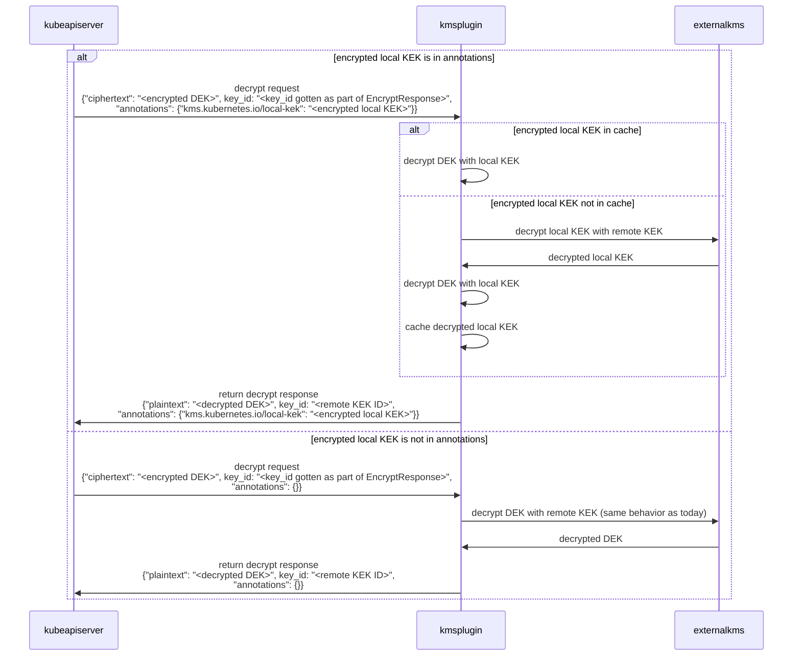

# Kubernetes 1.25: KMS v2 Improvements

**Authors:** Anish Ramasekar, Rita Zhang, Mo Khan, and Xander Grzywinski (Microsoft)

With Kubernetes 1.25, we are introducing a new `v2alpha1` version of the Key Management Service (KMS) API. There are a lot of improvements in the works, and we're excited to be able to launch the alpha version with Kubernetes 1.25!

## What is KMS?
One of the first things to consider when securing a Kubernetes cluster is encrypting etcd data at rest. KMS provides an interface for a provider to utilize a key stored in an external key service to perform this encryption.

KMS v1 has been a feature of Kubernetes since version 1.10, and is currently in beta as of version 1.12.

## What’s new in `v2alpha1`?
While the original v1 implementation has been successful in helping Kubernetes users encrypt etcd data, it did fall short in a few key ways:

1. **Performance:** When starting a cluster, all resources are serially fetched and decrypted to fill the `kube-apiserver` cache. When using a KMS plugin, this can cause slow startup times due to the large number of requests made to the remote vault. In addition, there is the potential to hit API rate limits on external key services depending on how many encrypted resources exist in the cluster.
1. **Rotation:** Currently, rotation of a KMS key is a manual and error-prone process. It can be difficult to determine what encryption keys are in-use on a cluster.
1. **Health Check & Status:** Today the `kube-apiserver` uses encrypt and decrypt calls as a proxy to determine if the KMS plugin is healthy. These operations cost money with cloud services, and do not provide a holistic view of the service's health.
1. **Observability:** Without some kind of trace ID, it's currently difficult to correlate events found in the various logs across `kube-apiserver`, KMS, and KMS plugins.

The KMS v2 enhancement attempts to address all of these shortcomings (not all planned features are implemented in the initial alpha release in Kubernetes 1.25):

1. Support KMS plugins that use a key hierarchy to reduce network requests made to the remote vault. To learn more, check out the [details for how a KMS plugin can leverage key hierarchy](https://github.com/kubernetes/enhancements/tree/master/keps/sig-auth/3299-kms-v2-improvements#key-hierachy).
1. Extra metadata is now tracked to allow a KMS plugin to communicate what key it is currently using with the `kube-apiserver`, allowing for rotation without API server restart. Data stored in etcd follows a more standard proto format to allow external tools to observe its state. To learn more, check out the [details for metadata](https://github.com/kubernetes/enhancements/tree/master/keps/sig-auth/3299-kms-v2-improvements#metadata).
1. A dedicated status API is used to communicate the health of the KMS plugin with the API server. To learn more, check out the [details for status API](https://github.com/kubernetes/enhancements/tree/master/keps/sig-auth/3299-kms-v2-improvements#status-api).

### Sequence Diagram

#### Encrypt Request

#### Decrypt Request

## What’s next?
For Kubernetes 1.26, we plan to ship another alpha version. As of right now, the alpha API will be ready to be used by KMS plugin authors. We plan to include a reference plugin implementation with the next release, and you'll be able to try out the feature at that time.

You can learn more about KMS v2 by reading the [kubernetes documentation](https://kubernetes.io/docs/tasks/administer-cluster/kms-provider/). You can also follow along on the [KEP](https://github.com/kubernetes/enhancements/blob/master/keps/sig-auth/3299-kms-v2-improvements/README.md) to track progress across the coming Kubernetes releases.

## How to get involved
If you are interested in getting involved in the development of this feature, share feedback, or participate in any other ongoing SIG Auth projects, please reach out on the [#sig-auth](https://kubernetes.slack.com/archives/C0EN96KUY) channel on Kubernetes Slack.

You are also welcome to join the bi-weekly [SIG Auth meetings](https://github.com/kubernetes/community/blob/master/sig-auth/README.md#meetings), held every-other Wednesday.

## Acknowledgements
This feature has been an effort driven by contributors from several different companies. We would like to extend a huge thank you to everyone that contributed their time and effort to help make this possible.