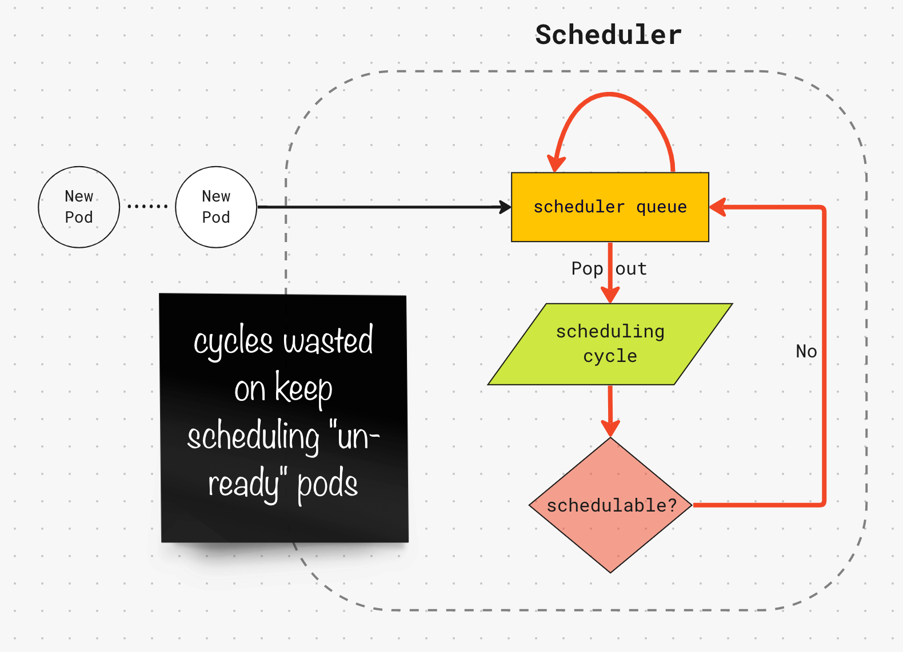
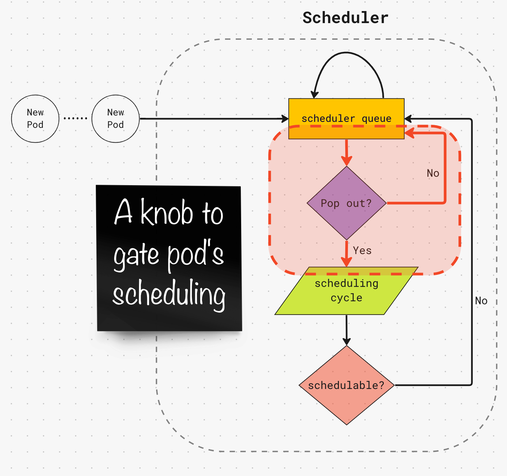

**Author:** Wei Huang (Apple), Abdullah Gharaibeh (Google)

Kubernetes 1.26 introduced a new Pod feature named SchedulingGates. SchedulingGates are keys that
tell the scheduler when a Pod is ready to be considered for scheduling.

## What problem does it solve?

When a Pod is created, the scheduler will continuously attempt to find a node that fits it. This
infinite loop continues until the scheduler either finds a node for the Pod, or the Pod gets deleted.

Pods that remain unschedulable for long periods of time (e.g., one that is blocked on some external event) 
waste scheduling cycles. A scheduling cycle may take ~20ms or more depending on the complexity of
the Pod's scheduling constraints. Therefore, at scale, those wasted cycles significantly impact the scheduler's performance. See the cycle in red arrows below.



SchedulingGates helps address this problem. It allows declaring that newly created Pods are not
ready for scheduling. When SchedulingGates are present on a Pod, the scheduler ignores the Pod
and therefore saves unnecessary scheduling attempts. Clearing the gates is the responsibility of
external controllers with knowledge of when the Pod should be considered for scheduling (e.g., 
a resource provisioner).



## How does it work?

SchedulingGates in general works very similar to Finalzers. Pods with non-empty 
`spec.schedulingGates` field will carry the status `SchedulingGated` and will be blocked from
scheduling. Note that more than one gate can be added, but they all should be added upon Pod
creation (e.g., you can add them as part of the spec of via a mutating webhook).

```
NAME       READY   STATUS            RESTARTS   AGE
test-pod   0/1     SchedulingGated   0          10s
```

To clear the gates, you update the Pod by removing the `schedulingGates` string literals.
The gates do not need to be removed all at once, but only when all the gates are removed the
scheduler will start to consider the Pod for scheduling.

Under the hood, SchedulingGates is implemented as a PreEnqueue scheduler plugin, a new scheduler
framework extension point that is invoked at the beginning of each scheduling cycle.

## Use Cases

An important use case this feature enables is dynamic quota management. Kubernetes supports
ResourceQuota, however quotas are enforced by the api-server on Pod creation. For example, if a
new Pod exceeds the cpu quota, it gets rejected. The api-server doesn't queue the Pod; therefore,
whoever created the Pod needs to continuously attempt to recreate it again!

SchedulingGates allows an external quota manager to address the above limitation of ResourceQuota.
Specifically, the manager could add a "quotaCheck" scheduling gate to all Pods created in the
cluster (using a mutating webhook). The manager would then remove the gate when there is quota to
start the Pod.

## Whats next?

To use this feature, the `PodSchedulingReadiness` feature gate must be enabled in the API Server
and Scheduler. You're more than welcome to test it out and tell us (sig-scheduling) what you think!

## Additional resources

- [Official PodSchedulingReadiness docs](https://kubernetes.io/docs/concepts/scheduling-eviction/pod-scheduling-readiness/)
- [Official Kubernetes Enhancement Proposal](https://github.com/kubernetes/enhancements/blob/master/keps/sig-scheduling/3521-pod-scheduling-readiness/README.md)
