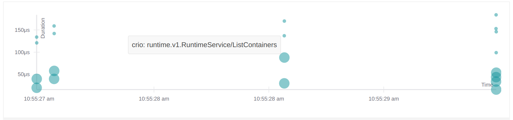
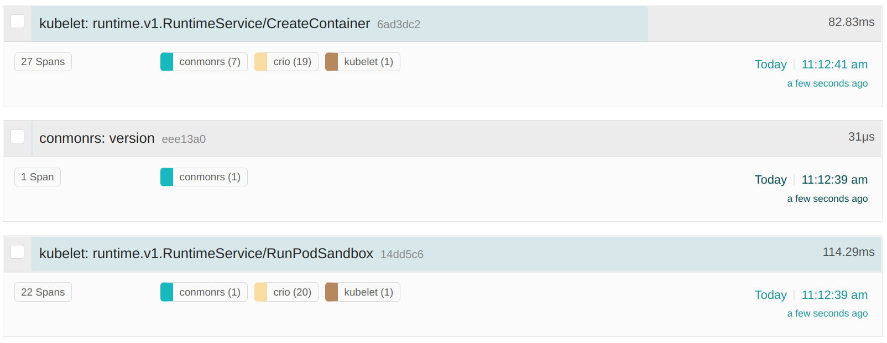
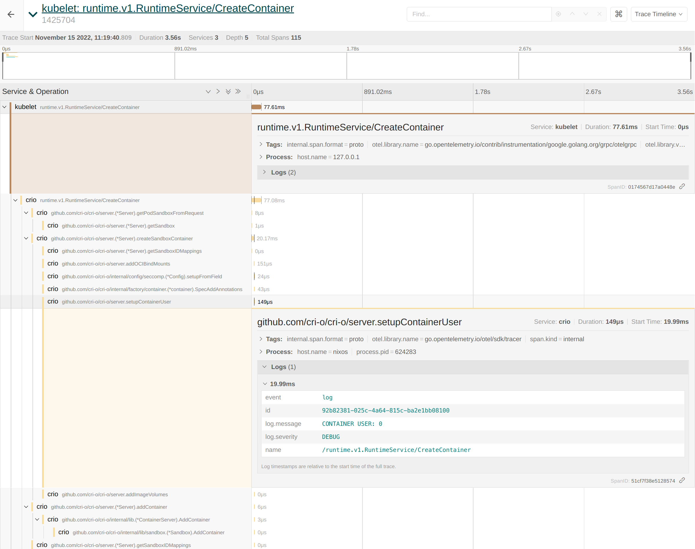
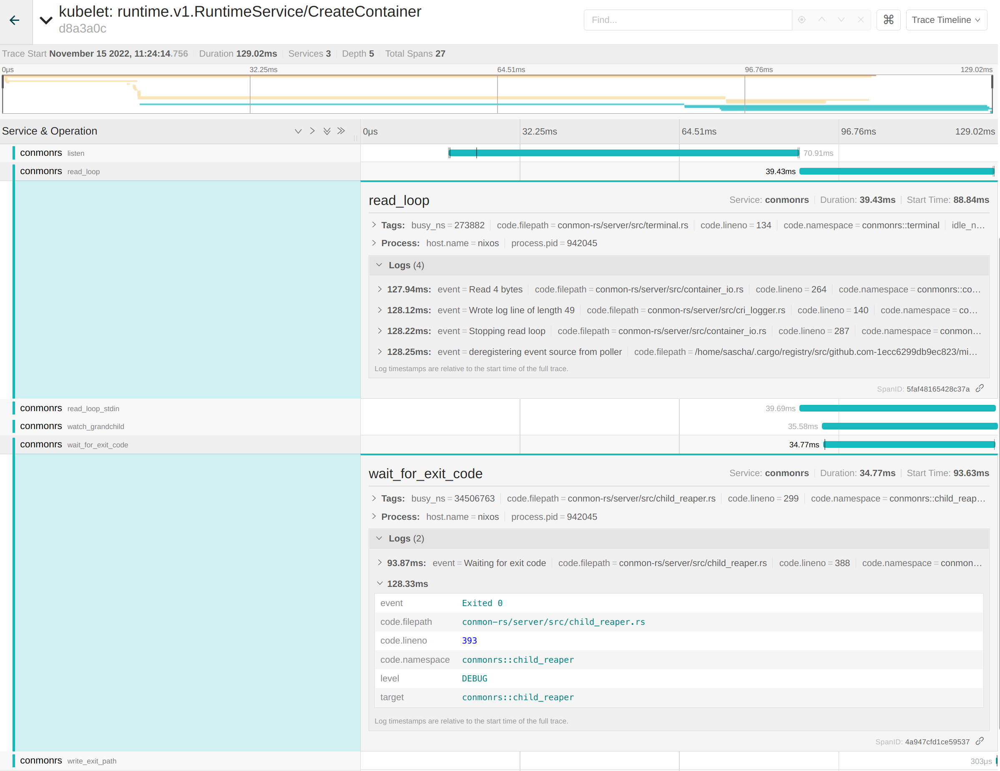

When speaking about observability in the cloud native space, then probably
everyone will mention [OpenTelemetry (OTEL)][otel] at some point in the
conversation. That's great, because the community needs standards to rely on
for developing all cluster components into the same direction. OpenTelemetry
enables us to combine logs, metrics, traces and other contextual information
(called baggage) into a single resource. Cluster administrators or software
engineers can use this resource to get a viewport about what is going on in the
cluster over a defined period of time. But how can Kubernetes itself make use of
this technology stack?

[otel]: https://opentelemetry.io

Kubernetes consists of multiple components where some are independent and others
are stacked together. Looking at the architecture from a container runtime
perspective, then there are from the top to the bottom:

- **kube-apiserver**: Validates and configures data for the API objects
- **kubelet**: Agent running on each node
- **CRI runtime**: Container Runtime Interface (CRI) compatible container runtime
  like [CRI-O][crio] or [containerd][containerd]
- **OCI runtime**: Lower level [Open Container Initiative (OCI)][oci] runtime
  like [runc][runc] or [crun][crun]
- **Linux kernel** or **Microsoft Windows**: Underlying operating system

[crio]: https://cri-o.io
[containerd]: https://containerd.io
[oci]: https://opencontainers.org
[runc]: https://github.com/opencontainers/runc
[crun]: https://github.com/containers/crun

That means if we encounter a problem with running containers in Kubernetes, then
we start looking at one of those components. Finding the root cause for problems
is one of the most time consuming actions we face with the increased
architectural complexity from today's cluster setups. Even if we know the
component which seems to cause the issue, we still have to take the others into
account to maintain a mental timeline of events which are going on. How do we
achieve that? Well, most folks will probably stick to scraping logs, filtering
them and assembling them together over the components borders. We also have
metrics, right? Correct, but bringing metrics values in correlation with plain
logs makes it even harder to track what is going on. Some metrics are also not
made for debugging purposes. They have been defined based on the end user
perspective of the cluster for linking usable alerts and not for developers
debugging a cluster setup.

OpenTelemetry to the rescue: the project aims to combine signals such as
[traces][traces], [metrics][metrics] and [logs][logs] together to maintain the
right viewport on the cluster state.

[traces]: https://opentelemetry.io/docs/concepts/signals/traces
[metrics]: https://opentelemetry.io/docs/concepts/signals/metrics
[logs]: https://opentelemetry.io/docs/concepts/signals/logs

What is the current state of OpenTelemetry tracing in Kubernetes? From an API
server perspective, we have alpha support for tracing since Kubernetes v1.22,
which will graduate to beta in one of the upcoming releases. Unfortunately the
beta graduation has missed the v1.26 Kubernetes release. The design proposal can
be found in the [_API Server Tracing_ Kubernetes Enhancement Proposal
(KEP)][kep-647] which provides more information about it.

[kep-647]: https://github.com/kubernetes/enhancements/issues/647

The kubelet tracing part is tracked [in another KEP][kep-2831], which was
implemented in an alpha state in Kubernetes v1.25. A beta graduation is not
planned as time of writing, but more may come in the v1.27 release cycle.
There are other side-efforts going on beside both KEPs, for example [klog is
considering OTEL support][klog-otel], which would boost the observability by
linking log messages to existing traces. Within SIG Instrumentation and SIG Node,
we're also discussing [how to link the
kubelet traces together][issue-113414], because right now they're focused on the
[gRPC][grpc] calls between the kubelet and the CRI container runtime.

[kep-647]: https://github.com/kubernetes/enhancements/issues/647
[kep-2831]: https://github.com/kubernetes/enhancements/issues/2831
[klog-otel]: https://github.com/kubernetes/klog/issues/356
[issue-113414]: https://github.com/kubernetes/kubernetes/issues/113414
[grpc]: https://grpc.io

CRI-O features OpenTelemetry tracing support [since v1.23.0][pr-4883] and is
working on continuously improving them, for example by [attaching the logs to the
traces][pr-6294] or extending the [spans to logical parts of the
application][pr-6343]. This helps users of the traces to gain the same
information like parsing the logs, but with enhanced capabilities of scoping and
filtering to other OTEL signals. The CRI-O maintainers are also working on a
container monitoring replacement for [conmon][conmon], which is called
[conmon-rs][conmon-rs] and is purely written in [Rust][rust]. One benefit of
having a Rust implementation is to be able to add features like OpenTelemetry
support, because the crates (libraries) for those already exist. This allows a
tight integration with CRI-O and lets consumers see the most low level tracing
data from their containers.

[pr-4883]: https://github.com/cri-o/cri-o/pull/4883
[pr-6294]: https://github.com/cri-o/cri-o/pull/6294
[pr-6343]: https://github.com/cri-o/cri-o/pull/6343
[conmon]: https://github.com/containers/conmon
[conmon-rs]: https://github.com/containers/conmon-rs
[rust]: https://www.rust-lang.org

The [containerd][containerd] folks added tracing support since v1.6.0, which is
available [by using a plugin][containerd-docs]. Lower level OCI runtimes like
[runc][runc] or [crun][crun] feature no support for OTEL at all and it does not
seem to exist a plan for that. We always have to consider that there is a
performance overhead when collecting the traces as well as exporting them to a
data sink. I still think it would be worth an evaluation on how extended
telemetry collection could look like in OCI runtimes. Let's see if the Rust OCI
runtime [youki][youki-1348] is considering something like that in the future.

[containerd-docs]: https://github.com/containerd/containerd/blob/7def13d/docs/tracing.md
[youki-1348]: https://github.com/containers/youki/issues/1348

I'll show you how to give it a try. For my demo I'll stick to a stack with a single local node
that has runc, conmon-rs, CRI-O, and a kubelet. To enable tracing in the kubelet, I need to
apply the following `KubeletConfiguration`:

```yaml
apiVersion: kubelet.config.k8s.io/v1beta1
kind: KubeletConfiguration
featureGates:
  KubeletTracing: true
tracing:
  samplingRatePerMillion: 1000000
```

A `samplingRatePerMillion` equally to one million will internally translate to
sampling everything. A similar configuration has to be applied to CRI-O; I can
either start the `crio` binary with `--enable-tracing` and
`--tracing-sampling-rate-per-million 1000000` or we use a drop-in configuration
like this:

```shell
cat /etc/crio/crio.conf.d/99-tracing.conf
```

```toml
[crio.tracing]
enable_tracing = true
tracing_sampling_rate_per_million = 1000000
```

To configure CRI-O to use conmon-rs, you require at least the latest CRI-O
v1.25.x and conmon-rs v0.4.0. Then a configuration drop-in like this can be used
to make CRI-O use conmon-rs:

```shell
cat /etc/crio/crio.conf.d/99-runtimes.conf
```

```toml
[crio.runtime]
default_runtime = "runc"

[crio.runtime.runtimes.runc]
runtime_type = "pod"
monitor_path = "/path/to/conmonrs" # or will be looked up in $PATH
```

That's it, the default configuration will point to an [OpenTelemetry
collector][collector] [gRPC][grpc] endpoint of `localhost:4317`, which has to be up and
running as well. There are multiple ways to run OTLP as [described in the
docs][collector], but it's also possible to `kubectl proxy` into an existing
instance running within Kubernetes.

[collector]: https://opentelemetry.io/docs/collector/getting-started

If everything is set up, then the collector should log that there are incoming
traces:

```
ScopeSpans #0
ScopeSpans SchemaURL:
InstrumentationScope go.opentelemetry.io/otel/sdk/tracer
Span #0
    Trace ID       : 71896e69f7d337730dfedb6356e74f01
    Parent ID      : a2a7714534c017e6
    ID             : 1d27dbaf38b9da8b
    Name           : github.com/cri-o/cri-o/server.(*Server).filterSandboxList
    Kind           : SPAN_KIND_INTERNAL
    Start time     : 2022-11-15 09:50:20.060325562 +0000 UTC
    End time       : 2022-11-15 09:50:20.060326291 +0000 UTC
    Status code    : STATUS_CODE_UNSET
    Status message :
Span #1
    Trace ID       : 71896e69f7d337730dfedb6356e74f01
    Parent ID      : a837a005d4389579
    ID             : a2a7714534c017e6
    Name           : github.com/cri-o/cri-o/server.(*Server).ListPodSandbox
    Kind           : SPAN_KIND_INTERNAL
    Start time     : 2022-11-15 09:50:20.060321973 +0000 UTC
    End time       : 2022-11-15 09:50:20.060330602 +0000 UTC
    Status code    : STATUS_CODE_UNSET
    Status message :
Span #2
    Trace ID       : fae6742709d51a9b6606b6cb9f381b96
    Parent ID      : 3755d12b32610516
    ID             : 0492afd26519b4b0
    Name           : github.com/cri-o/cri-o/server.(*Server).filterContainerList
    Kind           : SPAN_KIND_INTERNAL
    Start time     : 2022-11-15 09:50:20.0607746 +0000 UTC
    End time       : 2022-11-15 09:50:20.060795505 +0000 UTC
    Status code    : STATUS_CODE_UNSET
    Status message :
Events:
SpanEvent #0
     -> Name: log
     -> Timestamp: 2022-11-15 09:50:20.060778668 +0000 UTC
     -> DroppedAttributesCount: 0
     -> Attributes::
          -> id: Str(adf791e5-2eb8-4425-b092-f217923fef93)
          -> log.message: Str(No filters were applied, returning full container list)
          -> log.severity: Str(DEBUG)
          -> name: Str(/runtime.v1.RuntimeService/ListContainers)
```

I can see that the spans have a trace ID and typically have a parent attached.
Events such as logs are part of the output as well. In the above case, the kubelet is
periodically triggering a `ListPodSandbox` RPC to CRI-O caused by the Pod
Lifecycle Event Generator (PLEG). Displaying those traces can be done via,
for example, [Jaeger][jaeger]. When running the tracing stack locally, then a Jaeger
instance should be exposed on `http://localhost:16686` per default.

[jaeger]: https://www.jaegertracing.io/

The `ListPodSandbox` requests are directly visible within the Jaeger UI:



That's not too exciting, so I'll run a workload directly via `kubectl`:

```shell
kubectl run -it --rm --restart=Never --image=alpine alpine -- echo hi
```

```
hi
pod "alpine" deleted
```

Looking now at Jaeger, we can see that we have traces for `conmonrs`, `crio` as
well as the `kubelet` for the `RunPodSandbox` and `CreateContainer` CRI RPCs:



The kubelet and CRI-O spans are connected to each other to make investigation
easier. If we now take a closer look at the spans, then we can see that CRI-O's
logs are correctly accosted with the corresponding functionality. For example we
can extract the container user from the traces like this:



The lower level spans of conmon-rs are also part of this trace. For example
conmon-rs maintains an internal `read_loop` for handling IO between the
container and the end user. The logs for reading and writing bytes are part of
the span. The same applies to the `wait_for_exit_code` span, which tells us that
the container exited successfully with code `0`:



Having all that information at hand side by side to the filtering capabilities
of Jaeger makes the whole stack a great solution for debugging container issues!
Mentioning the "whole stack" also shows the biggest downside of the overall
approach: Compared to parsing logs it adds a noticeable overhead on top of the
cluster setup. Users have to maintain a sink like [Elasticsearch][elastic] to
persist the data, expose the Jaeger UI and possibly take the performance
drawback into account. Anyways, it's still one of the best ways to increase the
observability aspect of Kubernetes.

[elastic]: https://www.elastic.co

Thank you for reading this blog post, I'm pretty sure we're looking into a
bright future for OpenTelemetry support in Kubernetes to make troubleshooting
simpler.
