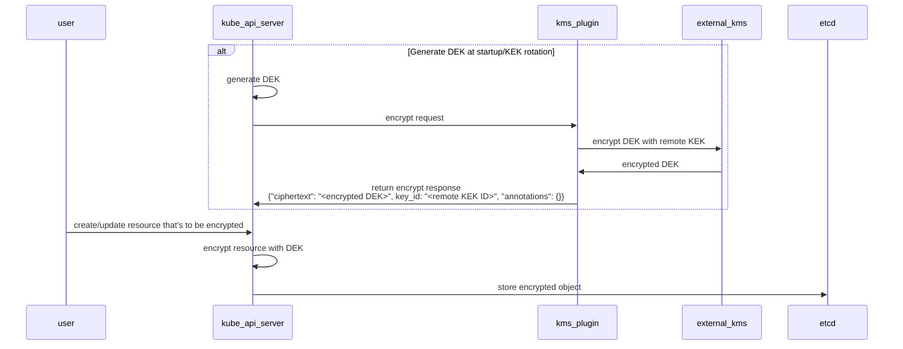
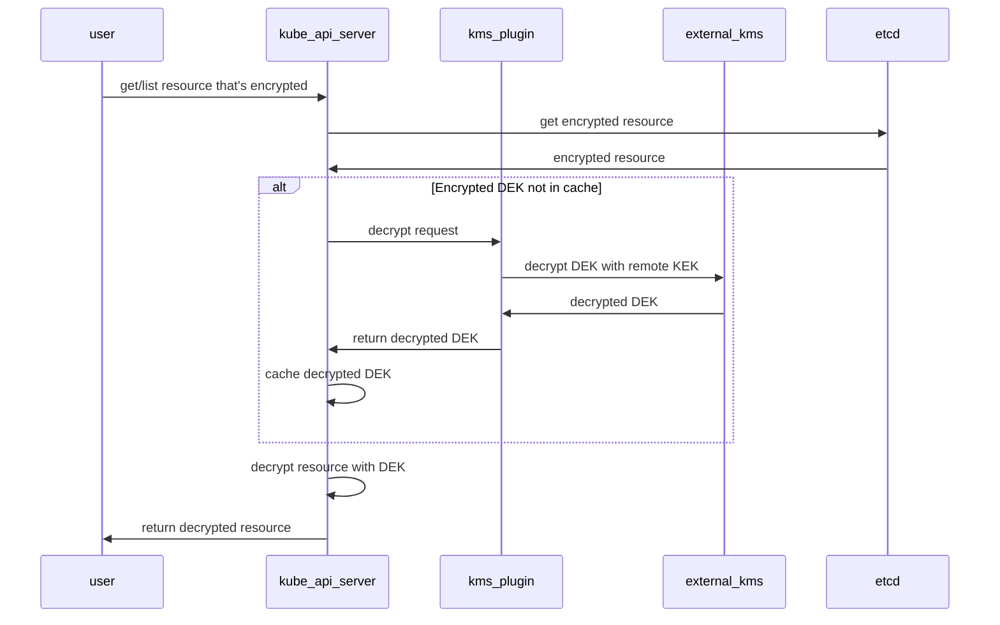
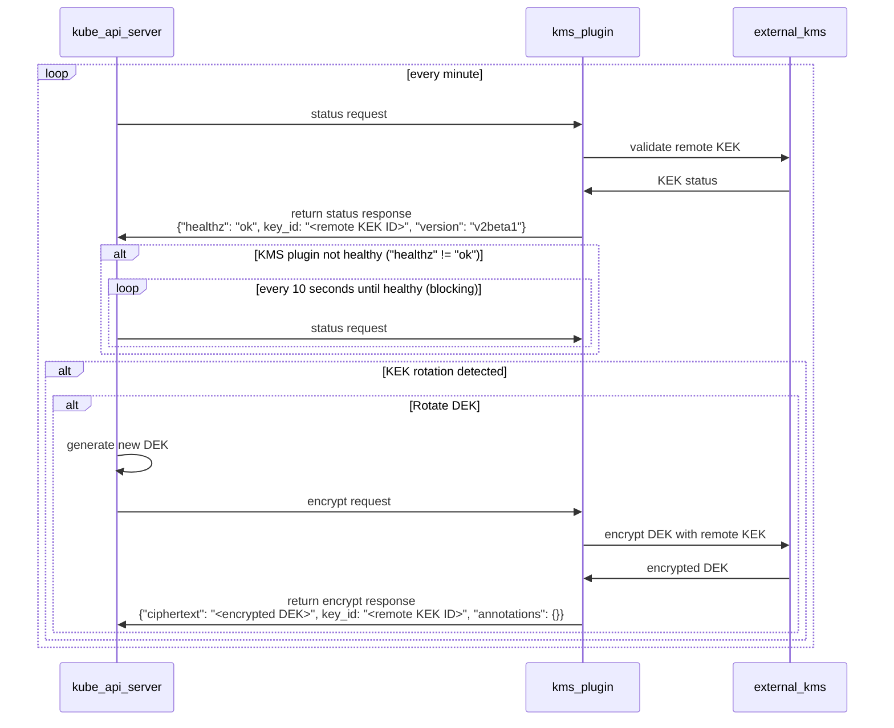

**Authors:** TBD

With Kubernetes 1.27, we are moving Key Management Service (KMS) v2 API to beta.

## What is KMS?
One of the first things to consider when securing a Kubernetes cluster is encrypting etcd data at rest. KMS provides an interface for a provider to utilize a key stored in an external key service to perform this encryption.

KMS v1 has been a feature of Kubernetes since version 1.10, and is currently in beta as of version v1.12. KMS v2 was introduced as alpha in v1.25.

 The design in [the previous blog post](https://kubernetes.io/blog/2022/09/09/kms-v2-improvements/) is not compatible with the design in this blog post. The KMS v2 API and implementation changed in incompatible ways in-between the alpha release in v1.25 and the beta release in v1.27. Attempting to upgrade from old versions with the alpha feature enabled will result in data loss. 

## What’s new in `v2beta1`?
The KMS encryption provider uses an envelope encryption scheme to encrypt data in etcd. The data is encrypted using a data encryption key (DEK). The DEKs are encrypted with a key encryption key (KEK) that is stored and managed in a remote KMS. With KMS v1, a new DEK is generated for each encryption. With KMS v2, a new DEK is generated on server startup and when the KMS plugin informs the API server that a KEK rotation has occurred.

 If you are running virtual machine (VM) based nodes that leverage VM state store with this feature, you must not use KMS v2.

With KMS v2, the API server uses AES-GCM with a 12 byte nonce (8 byte atomic counter and 4 bytes random data) for encryption. The following issues could occur if the VM is saved and restored:

The counter value may be lost or corrupted if the VM is saved in an inconsistent state or restored improperly. This can lead to a situation where the same counter value is used twice, resulting in the same nonce being used for two different messages.
If the VM is restored to a previous state, the counter value may be set back to its previous value, resulting in the same nonce being used again.
Although both of these cases are partially mitigated by the 4 byte random nonce, this can compromise the security of the encryption. 

### Sequence Diagram

#### Encrypt Request

#### Decrypt Request

#### Status Request

## What’s next?

## How to get involved
If you are interested in getting involved in the development of this feature, share feedback, or participate in any other ongoing SIG Auth projects, please reach out on the [#sig-auth](https://kubernetes.slack.com/archives/C0EN96KUY) channel on Kubernetes Slack.

You are also welcome to join the bi-weekly [SIG Auth meetings](https://github.com/kubernetes/community/blob/master/sig-auth/README.md#meetings), held every-other Wednesday.

## Acknowledgements
This feature has been an effort driven by contributors from several different companies. We would like to extend a huge thank you to everyone that contributed their time and effort to help make this possible.
