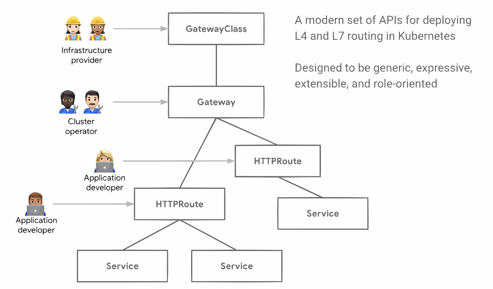

***Authors:*** Lior Lieberman (Google), Kobi Levi (independent)

In the ever-evolving world of Kubernetes, networking plays a pivotal role. As more applications are deployed in Kubernetes clusters, effective exposure of these services to clients outside the cluster becomes a critical concern. If you've been working with Kubernetes, you're likely familiar with the [Ingress API], which has been the go-to solution for managing external access to services.

[Ingress API]:/docs/concepts/services-networking/ingress/

The Ingress API provides a way to route external traffic to your applications within the cluster, making it an indispensable tool for many Kubernetes users. Ingress has its limitations however, and as applications become more complex and the demands on your Kubernetes clusters increase, these limitations can become bottlenecks.

Some of the limitations are;

- **Insufficient common denominator** - by attempting to establish a common denominator for various HTTP proxies, Ingress can only accommodate basic HTTP routing, forcing more features of contemporary proxies like traffic splitting and header matching into provider-specific, non-transferable annotations.
- **Inadequate permission model** - Ingress spec configures both infrastructure and application configuration in one object. With Ingress, the cluster operator and application developer operate on the same Ingress object without being aware of each other’s roles. This creates an insufficient role-based access control and has high potential for setup errors. 
- **Lack of protocol diversity** - Ingress primarily focuses on HTTP(S) routing and does not provide native support for other protocols, such as TCP, UDP and gRPC. This limitation makes it less suitable for handling non-HTTP workloads.

To overcome this, Gateway API is designed to provide a more flexible, extensible, and powerful way to manage external traffic to your services.

## Introducing Gateway API
Gateway API is just weeks away from a GA release. It provides a standard Kubernetes API for ingress traffic control. It offers extended functionality, improved customization, and greater flexibility. By focusing on modular and expressive API resources, Gateway API makes it possible to describe a wider array of routing configurations and models.

The transition from Ingress API to Gateway API in Kubernetes is driven by advantages and advanced functionalities that the Gateway API offers, with its foundation built on four core principles: a role-oriented approach, portability, expressiveness and extensibility.

### A Role-Oriented Approach

Gateway API employs a role-oriented approach that aligns with the conventional roles within organizations involved in configuring Kubernetes service networking. This approach enables infrastructure engineers, cluster operators, and application developers to collectively address different aspects of the Gateway API.

For instance, infrastructure engineers play a pivotal role in deploying GatewayClasses, cluster-scoped resources that act as templates to explicitly define behavior for Gateways derived from them, laying the groundwork for robust service networking.

Subsequently, cluster operators utilize these GatewayClasses to deploy gateways.
A Gateway in Kubernetes' Gateway API defines how external traffic can be directed to Services within the cluster, essentially bridging non-Kubernetes sources to Kubernetes-aware destinations.
It represents a request for a load balancer configuration aligned with a GatewayClass’ specification.
The Gateway spec may not be exhaustive as some details can be supplied by the GatewayClass controller, ensuring portability.
Additionally, a Gateway can be linked to multiple Route references to channel specific traffic subsets to designated services.

Lastly, application developers configure route resources (such as HTTPRoutes), to manage configuration (e.g. timeouts, request matching/filter) and Service composition (e.g. path routing to backends)
Route resources define protocol-specific rules for mapping requests from a Gateway to Kubernetes Services.
HTTPRoute is for multiplexing HTTP or terminated HTTPS connections.
It's intended for use in cases where you want to inspect the HTTP stream and use HTTP request data for either routing or modification, for example using HTTP Headers for routing, or modifying them in-flight.



### Portability
Gateway API is designed to be more portable across different implementations, clusters and environments. It helps reduce Ingress' reliance on non-portable, provider-specific annotations, making your configurations more consistent and easier to manage across multiple clusters.

### Expressiveness
The Gateway API provides standard, Kubernetes-backed support for a wide range of features, such as header-based matching, traffic splitting, weight-based routing, request mirroring and more. With Ingress, these features need custom provider-specific annotations.

### Extensibility
Gateway API is designed with extensibility as a core feature. Rather than enforcing a one-size-fits-all model, it offers the flexibility to link custom resources at multiple layers within the API's framework. This layered approach to customization ensures that users can tailor configurations to their specific needs without overwhelming the main structure. By doing so, the Gateway API facilitates more granular and context-sensitive adjustments, allowing for a fine-tuned balance between standardization and adaptability. This becomes particularly valuable in complex cloud-native environments where specific use cases require nuanced configurations.

## Getting Started

### Gateway API Quick Start

The first thing you will need is a Kubernetes cluster. You can set up a new cluster using [KinD](https://kind.sigs.k8s.io/) with the following command:
```bash
kind create cluster --name introducing-i2gw
```
When you create a Service of `type: LoadBalancer` in a Kubernetes cluster, then typically cloud providers (like AWS, Azure or GCP) automatically provision a cloud load balancer and allocate a public IP address for it. However, since KinD runs locally, there's no cloud provider available to automatically provision an external IP address for such Services.

This is where MetalLB can come in. MetalLB provides a network load-balancer implementation for Kubernetes clusters that do not have external load-balancers available; this could be KinD or it could be your bare-metal production cluster.
You'll need to [install](https://metallb.universe.tf/installation/) it in order to continue with this guide.

Now you should have a working environment to start experimenting with Gateway
API. There are many great guides you can follow starting from [Getting started with Gateway API](https://gateway-api.sigs.k8s.io/guides/#getting-started-with-gateway-api).

### Migrating from Ingress to Gateway API using Ingress2Gateway
Migrating from Ingress to the Gateway API may seem intimidating, but luckily Kubernetes SIG-Network provides a tool to simplify the process. Ingress2Gateway assists in the migration by converting your existing Ingress resources into Gateway API resources. To get started with ingress2gateway, you need to first install the tool.

```
go install github.com/kubernetes-sigs/ingress2gateway@latest
```
Provided you have a Go development environment installed, that command installs `ingress2gateway` to `$(go env GOPATH)/bin/ingress2gateway`.

Alternatively, you can build it from source using https://github.com/kubernetes-sigs/ingress2gateway#build-from-source.

Once the tool is installed, you can use it to convert the ingress resources in your cluster to GatewayAPI resources.

```
ingress2gateway print
```

This above command will:

1. Read your Kube config file to extract the cluster credentials and the current active namespace.
1. Search for ingresses and provider-specific resources in that namespace.
1. Convert them to Gateway-API resources (Currently only Gateways and HTTPRoutes).
For other options refer run the tool with `-h` or refer to https://github.com/kubernetes-sigs/ingress2gateway#options

Review the converted Gateway API resources, validate them, and then apply them to your cluster.

## Wrapping up
Achieving reliable, scalable and extensible networking has always been a challenging objective.
The Gateway API is designed to improve the current Kubernetes networking standards like ingress and/or implementation specific annotations and CRDs.
By focusing on modular and expressive API resources, and a role-oriented approach, the Gateway API makes it possible to describe a wider array of routing configurations and models while improving security and ensuring smooth collaboration across different teams (infrastructure and application teams).

It is a Kubernetes standard API, consistent across different platforms and implementations and most importantly it is future proof. The Gateway API is considered the Ingress’ successor, it has a sub team under SIG-Network that actively work on it and manage the ecosystem and it is likely to receive more updates and community support.

Ingress2gateway helps to ease the migration process for you, converting your existing Ingress resources to Gateway API resources. To make migrations _even easier_ Ingress2gateway has recently added extensions to enable converting from provider-specific solutions, enabling it to translate implementations specific CRDs or Ingress annotations to the relevant Gateway API configurations. 


### Try it out and get involved
There are many resources to check out to learn more:
- Ingress2Gateway readme - https://github.com/kubernetes-sigs/ingress2gateway#ingress-to-gateway
- Gateway API Getting Started - https://gateway-api.sigs.k8s.io/guides/
- Gateway API Implementations - https://gateway-api.sigs.k8s.io/implementations/#gateways
