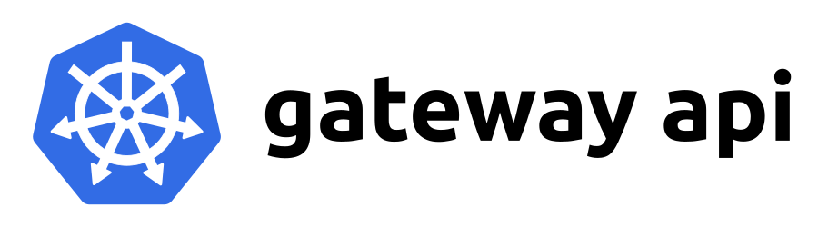

On behalf of Kubernetes SIG Network, we are pleased to announce the v1.0 release of [Gateway
API](https://gateway-api.sigs.k8s.io/)! This release marks a huge milestone for
this project. Several key APIs are graduating to GA (generally available), while
other significant features have been added to the Experimental channel.

## What's new

### Graduation to v1
This release includes the graduation of
[Gateway](https://gateway-api.sigs.k8s.io/api-types/gateway/),
[GatewayClass](https://gateway-api.sigs.k8s.io/api-types/gatewayclass/), and
[HTTPRoute](https://gateway-api.sigs.k8s.io/api-types/httproute/) to v1, which
means they are now generally available (GA). This API version denotes a high
level of confidence in the API surface and provides guarantees of backwards
compatibility. Note that although, the version of these APIs included in the
Standard channel are now considered stable, that does not mean that they are
complete. These APIs will continue to receive new features via the Experimental
channel as they meet graduation criteria. For more information on how all of
this works, refer to the [Gateway API Versioning
Policy](https://gateway-api.sigs.k8s.io/concepts/versioning/).

### Logo
Gateway API now has a logo! This logo was designed through a collaborative
process, and is intended to represent the idea that this is a set of Kubernetes
APIs for routing traffic both north-south and east-west:

### CEL Validation
Historically, Gateway API has bundled a validating webhook as part of installing
the API. Starting in v1.0, webhook installation is optional and only recommended
for Kubernetes 1.24. Gateway API now includes
[CEL](/docs/reference/using-api/cel/) validation rules as
part of the
[CRDs](/docs/concepts/extend-kubernetes/api-extension/custom-resources/).
This new form of validation is supported in Kubernetes 1.25+, and thus the
validating webhook is no longer required in most installations.

### Standard channel
This release was primarily focused on ensuring that the existing beta APIs were
well defined and sufficiently stable to graduate to GA. That led to a variety of
spec clarifications, as well as some improvements to status to improve the
overall UX when interacting with Gateway API.

### Experimental channel
Most of the changes included in this release were limited to the experimental
channel. These include HTTPRoute timeouts, TLS config from Gateways to backends,
WebSocket support, Gateway infrastructure labels, and more. Stay tuned for a
follow up blog post that will cover each of these new features in detail.

### Everything else
For a full list of the changes included in this release, please refer to the
[v1.0.0 release
notes](https://github.com/kubernetes-sigs/gateway-api/releases/tag/v1.0.0).

## How we got here

The idea of Gateway API was initially [proposed](https://youtu.be/Ne9UJL6irXY?si=wgtC9w8PMB5ZHil2)
4 years ago at KubeCon San Diego as the next generation
of Ingress API. Since then, an incredible community has formed to develop what
has likely become the most collaborative API in Kubernetes history. Over 170
people have contributed to this API so far, and that number continues to grow.

A special thank you to the 20+ [community members who agreed to take on an
official role in the
project](https://github.com/kubernetes-sigs/gateway-api/blob/main/OWNERS_ALIASES),
providing some time for reviews and sharing the load of maintaining the project!

We especially want to highlight the emeritus maintainers that played a pivotal
role in the early development of this project:

* [Bowei Du](https://github.com/bowei)
* [Daneyon Hansen](https://github.com/danehans)
* [Harry Bagdi](https://github.com/hbagdi)

## Try it out

Unlike other Kubernetes APIs, you don't need to upgrade to the latest version of
Kubernetes to get the latest version of Gateway API. As long as you're running
one of the 5 most recent minor versions of Kubernetes (1.24+), you'll be able to
get up and running with the latest version of Gateway API.

To try out the API, follow our [Getting Started
guide](https://gateway-api.sigs.k8s.io/guides/).

## What's next

This release is just the beginning of a much larger journey for Gateway API, and
there are still plenty of new features and new ideas in flight for future
releases of the API.

One of our key goals going forward is to work to stabilize and graduate other
experimental features of the API. These include [support for service
mesh](https://gateway-api.sigs.k8s.io/concepts/gamma/), additional route types
([GRPCRoute](https://gateway-api.sigs.k8s.io/references/spec/#gateway.networking.k8s.io/v1alpha2.GRPCRoute),
[TCPRoute](https://gateway-api.sigs.k8s.io/references/spec/#gateway.networking.k8s.io/v1alpha2.TCPRoute),
[TLSRoute](https://gateway-api.sigs.k8s.io/references/spec/#gateway.networking.k8s.io/v1alpha2.TLSRoute),
[UDPRoute](https://gateway-api.sigs.k8s.io/references/spec/#gateway.networking.k8s.io/v1alpha2.UDPRoute)),
and a variety of experimental features.

We've also been working towards moving
[ReferenceGrant](https://gateway-api.sigs.k8s.io/api-types/referencegrant/) into
a built-in Kubernetes API that can be used for more than just Gateway API.
Within Gateway API, we've used this resource to safely enable cross-namespace
references, and that concept is now being adopted by other SIGs. The new version
of this API will be owned by SIG Auth and will likely include at least some
modifications as it migrates to a built-in Kubernetes API.

### Gateway API at KubeCon + CloudNativeCon

At [KubeCon North America
(Chicago)](https://events.linuxfoundation.org/kubecon-cloudnativecon-north-america/)
and the adjacent [Contributor
Summit](https://www.kubernetes.dev/events/2023/kcsna/) there are several talks
related to Gateway API that will go into more detail on these topics. If you're
attending either of these events this year, considering adding these to your
schedule.

**Contributor Summit:**

- [Lessons Learned Building a GA API with CRDs](https://sched.co/1Sp9u)
- [Conformance Profiles: Building a generic conformance test reporting framework](https://sched.co/1Sp9l)
- [Gateway API: Beyond GA](https://sched.co/1SpA9)

**KubeCon Main Event:**

- [Gateway API: The Most Collaborative API in Kubernetes History Is GA](https://sched.co/1R2qM)

**KubeCon Office Hours:**

Gateway API maintainers will be holding office hours sessions at KubeCon if
you'd like to discuss or brainstorm any related topics. To get the latest
updates on these sessions, join the `#sig-network-gateway-api` channel on
[Kubernetes Slack](https://slack.kubernetes.io/).

## Get involved

We've only barely scratched the surface of what's in flight with Gateway API.
There are lots of opportunities to get involved and help define the future of
Kubernetes routing APIs for both Ingress and Mesh.

If this is interesting to you, please [join us in the
community](https://gateway-api.sigs.k8s.io/contributing/) and help us build the
future of Gateway API together!
