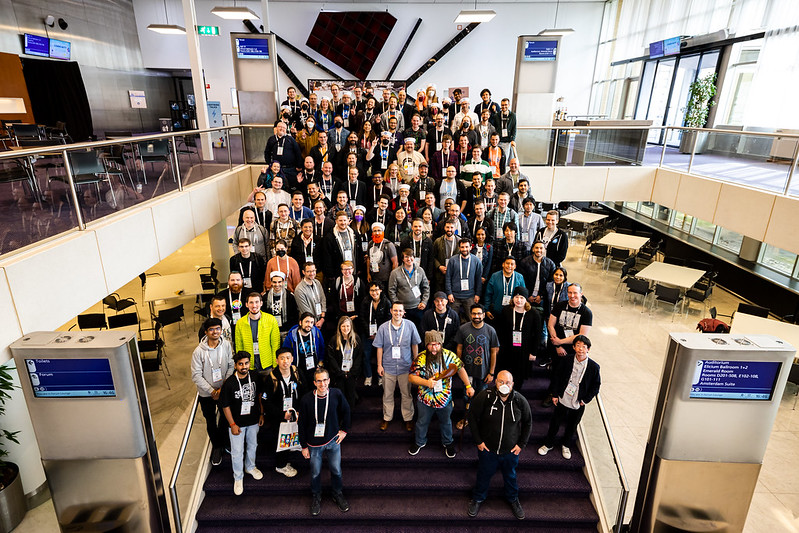

Every year, just before the official start of KubeCon+CloudNativeCon, there's a special event that
has a very special place in the hearts of those organizing and participating in it: the Kubernetes
Contributor Summit. To find out why, and to provide a behind-the-scenes perspective, we interview
Noah Abrahams, whom amongst other roles was the co-lead for the Kubernetes Contributor Summit in
2023.

**Frederico Muñoz (FSM)**: Hello Noah, and welcome. Could you start by introducing yourself and
telling us how you got involved in Kubernetes?

**Noah Abrahams (NA)**: I’ve been in this space for quite a while.  I got started in IT in the mid
90's, and I’ve been working in the "Cloud" space for about 15 years.  It was, frankly, through a
combination of sheer luck (being in the right place at the right time) and having good mentors to
pull me into those places (thanks, Tim!), that I ended up at a startup called Apprenda in 2016.
While I was there, they pivoted into Kubernetes, and it was the best thing that could have happened
to my career.  It was around v1.2 and someone asked me if I could give a presentation on Kubernetes
concepts at "my local meetup" in Las Vegas.  The meetup didn’t exist yet, so I created it, and got
involved in the wider community.  One thing led to another, and soon I was involved in ContribEx,
joined the release team, was doing booth duty for the CNCF, became an ambassador, and here we are
today.

## The Contributor Summit

**FM**: Before leading the organisation of the KCSEU 2023, how many other Contributor Summits were
you a part of?

**NA**: I was involved in four or five before taking the lead.  If I'm recalling correctly, I
attended the summit in Copenhagen, then sometime in 2018 I joined the wrong meeting, because the
summit staff meeting was listed on the ContribEx calendar.  Instead of dropping out of the call, I
listened a bit, then volunteered to take on some work that didn't look like it had anybody yet
dedicated to it.  I ended up running Ops in Seattle and helping run the New Contributor Workshop in
Shanghai, that year.  Since then, I’ve been involved in all but two, since I missed both Barcelona
and Valencia.

**FM**: Have you noticed any major changes in terms of how the conference is organized throughout
the years? Namely in terms of number of participants, venues, speakers, themes...

**NA**: The summit changes over the years with the ebb and flow of the desires of the contributors
that attend.  While we can typically expect about the same number of attendees, depending on the
region that the event is held in, we adapt the style and content greatly based on the feedback that
we receive at the end of each event.  Some years, contributors ask for more free-style or
unconference type sessions, and we plan on having more of those, but some years, people ask for more
planned sessions or workshops, so that's what we facilitate.  We also have to continually adapt to
the venue that we have, the number of rooms we're allotted, how we're going to share the space with
other events and so forth.  That all goes into the planning ahead of time, from how many talk tracks
we’ll have, to what types of tables and how many microphones we want in a room.

There has been one very significant change over the years, though, and that is that we no longer run
the New Contributor Workshop.  While the content was valuable, running the session during the summit
never led to any people who weren’t already contributing to the project becoming dedicated
contributors to the project, so we removed it from the schedule.  We'll deliver that content another
way, while we’ll keep the summit focused on existing contributors.

## What makes it special

**FM**: Going back to the introduction I made, I’ve heard several participants saying that KubeCon
is great, but that the Contributor Summit is for them the main event. In your opinion, why do you
think that makes it so?

**NA**: I think part of it ties into what I mentioned a moment ago, the flexibility in our content
types.  For many contributors, I think the summit is basically "How Kubecon used to be", back when
it was primarily a gathering of the contributors to talk about the health of the project and the
work that needed to be done.  So, in that context, if the contributors want to discuss, say, a new
Working Group, then they have dedicated space to do so in the summit.  They also have the space to
sit down and hack on a tough problem, discuss architectural philosophy, bring potential problems to
more people’s attention, refine our methods, and so forth.  Plus, the unconference aspect allows for
some malleability on the day-of, for whatever is most important right then and there.  Whatever
folks want to get out of this environment is what we’ll provide, and having a space and time
specifically to address your particular needs is always going to be well received.

Let's not forget the social aspect, too.  Despite the fact that we're a global community and work
together remotely and asynchronously, it's still easier to work together when you have a personal
connection, and can put a face to a Github handle.  Zoom meetings are a good start, but even a
single instance of in-person time makes a big difference in how people work together.  So, getting
folks together a couple times a year makes the project run more smoothly.

## Organizing the Summit

**FM**: In terms of the organization team itself, could you share with us a general overview of the
staffing process? Who are the people that make it happen? How many different teams are involved?

**NA**: There's a bit of the "usual suspects" involved in making this happen, many of whom you'll
find in the ContribEx meetings, but really it comes down to whoever is going to step up and do the
work.  We start with a general call out for volunteers from the org.  There's a Github issue where
we'll track the staffing and that will get shouted out to all the usual comms channels: slack,
k-dev, etc.

From there, there's a handful of different teams, overseeing content/program committee,
registration, communications, day-of operations, the awards the SIGs present to their members, the
after-summit social event, and so on.  The leads for each team/role are generally picked from folks
who have stepped up and worked the event before, either as a shadow, or a previous lead, so we know
we can rely on them, which is a recurring theme.  The leads pick their shadows from whoever pipes up
on the issue, and the teams move forward, operating according to their role books, which we try to
update at the end of each summit, with what we've learned over the past few months.  It's expected
that a shadow will be in line to lead that role at some point in a future summit, so we always have
a good bench of folks available to make this event happen.  A couple of the roles also have some
non-shadow volunteers where people can step in to help a bit, like as an on-site room monitor, and
get a feel for how things are put together without having to give a serious up-front commitment, but
most of the folks working the event are dedicated to both making the summit successful, and coming
back to do so in the future.  Of course, the roster can change over time, or even suddenly, as
people gain or lose travel budget, get new jobs, only attend Europe or North America or Asia, etc.
It's a constant dance, relying 100% on the people who want to make this project successful.

Last, but not least, is the Summit lead.  They have to keep the entire process moving forward, be
willing to step in to keep bike-shedding from derailing our deadlines, make sure the right people
are talking to one another, lead all our meetings to make sure everyone gets a voice, etc.  In some
cases, the lead has to even be willing to take over an entirely separate role, in case someone gets
sick or has any other extenuating circumstances, to make sure absolutely nothing falls through the
cracks.  The lead is only allowed to volunteer after they’ve been through this a few times and know
what the event entails.  Event planning is not for the faint of heart.

**FM**: The participation of volunteers is essential, but there's also the topic of CNCF support:
how does this dynamic play out in practice?

**NA**: This event would not happen in its current form without our CNCF liaison.  They provide us
with space, make sure we are fed and caffeinated and cared for, bring us outside spaces to evaluate,
so we have somewhere to hold the social gathering, get us the budget so we have t-shirts and patches
and the like, and generally make it possible for us to put this event together.  They're even
responsible for the signage and arrows, so the attendees know where to go.  They're the ones sitting
at the front desk, keeping an eye on everything and answering people's questions.  At the same time,
they're along to facilitate, and try to avoid influencing our planning.

There's a ton of work that goes into making the summit happen that is easy to overlook, as an
attendee, because people tend to expect things to just work.  It is not exaggerating to say this
event would not have happened like it has over the years, without the help from our liaisons, like
Brienne and Deb.  They are an integral part of the team.

## A look ahead

**FM**: Currently, we’re preparing the NA 2023 summit, how is it going? Any changes in format
compared with previous ones?

**NA**: I would say it's going great, though I'm sort of emeritus lead for this event, mostly
picking up the things that I see need to be done and don't have someone assigned to it.  We're
always learning from our past experiences and making small changes to continually be better, from
how many people need to be on a particular rotation to how far in advance we open and close the CFP.
There's no major changes right now, just continually providing the content that the contributors
want.

**FM**: For our readers that might be interested in joining in the Kubernetes Contributor Summit, is
there anything they should know?

**NA**: First of all, the summit is an event by and for Org members.  If you're not already an org
member, you should be getting involved before trying to attend the summit, as the content is curated
specifically towards the contributors and maintainers of the project.  That applies to the staff, as
well, as all the decisions should be made with the interests and health of kubernetes contributors
being the end goal.  We get a lot of people who show interest in helping out, but then aren't ready
to make any sort of commitment, and that just makes more work for us.  If you're not already a
proven and committed member of this community, it’s difficult for us to place you in a position that
requires reliability.  We have made some rare exceptions when we need someone local to help us out,
but those are few and far between.

If you are, however, already a member, we'd love to have you.  The more people that are involved,
the better the event becomes.  That applies to both dedicated staff, and those in attendance
bringing CFPs, unconference topics, and just contributing to the discussions.  If you're part of
this community and you're going to be at KubeCon, I would highly urge you to attend, and if you're
not yet an org member, let's make that happen!

**FM**: Indeed! Any final comments you would like to share?

**NA**: Just that the Contributor Summit is, for me, the ultimate manifestation of the Hallway
Track.  By being here, you're part of the conversations that move this project forward.  It's good
for you, and it's good for Kubernetes.  I hope to see you all in Chicago!
