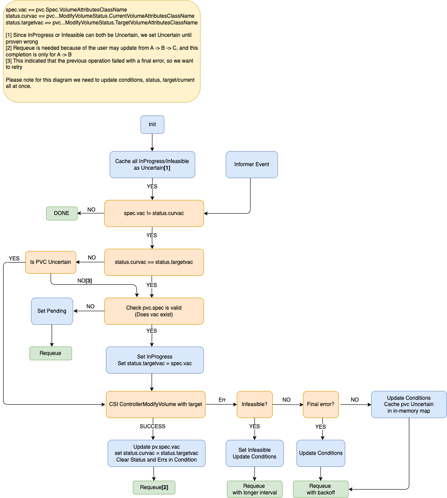

# Kubernetes v1.29: VolumeAttributesClass for Volume Modification

**Authors**: Sunny Song(Google)

The v1.29 release of Kubernetes introduced an alpha feature to support modify volume by changing VolumeAttributesClass that was assigned to a PersistentVolumeClaim (PVC). With the feature enabled, Kubernetes can handle updates of volume attributes other than capacity. Allowing volume attributes to be changed without managing it through different provider's APIs directly simplifies the current flow.

You can read VolumeAttributesClass in the Kubernetes documentation for more details about how to use that, or you can read on to learn about why the Kubernetes project is supporting this feature.


## VolumeAttributesClass

The new resource.k8s.io/v1alpha1 API group provides two new types:

**VolumeAttributesClass**

Represents a specification of mutable volume attributes defined by the CSI driver. The class can be specified during dynamic provisioning of PersistentVolumeClaims, and changed in the PersistentVolumeClaim spec after provisioning.

**ModifyVolumeStatus**

Represents the status object of ControllerModifyVolume operation.

With this alpha feature enabled, the spec of PersistentVolumeClaim defines VolumeAttributesClassName that are used in the PVC. At volume provisioning, CreateVolume operation will apply the parameters in the VolumeAttributesClass along with the parameters in the StorageClass.

When there is a change of volumeAttributesClassName in the PVC spec, the external-resizer sidecar will get an informer event. Based on the current state of the configuration, the resizer will trigger a CSI ControllerModifyVolume. The diagram below shows the flow:



## How to use it

If you want to test the feature whilst it's alpha, you need to enable the relevant feature gate in the kube-controller-manager and the kube-apiserver. Use the --feature-gates command line argument:


```
--feature-gates="...,VolumeAttributesClass=true"
```


It also requires the CSI driver has implemented the ModifyVolume API.


### User Flow

If you would like to see the feature in action and verify it works fine in your cluster here's what you can try:


1. Define a StorageClass and VolumeAttributesClass

```
apiVersion: storage.k8s.io/v1
kind: StorageClass
metadata:
  name: csi-sc-example
provisioner: pd.csi.storage.gke.io
parameters:
  disk-type: "hyperdisk-balanced"
volumeBindingMode: WaitForFirstConsumer
```


```
apiVersion: storage.k8s.io/v1alpha1
kind: VolumeAttributesClass
metadata:
  name: silver
driverName: pd.csi.storage.gke.io
parameters:
  provisioned-iops: "3000"
  provisioned-throughput: "50"
```


2. Define and create the PersistentVolumeClaim

    ```
apiVersion: v1
kind: PersistentVolumeClaim
metadata:
  name: test-pv-claim
spec:
  storageClassName: csi-sc-example
  volumeAttributesClassName: silver
  accessModes:
    - ReadWriteOnce
  resources:
    requests:
      storage: 64Gi
```


3. Verify that PersistentVolumeClaims is now provisioned correctly with:

    ```
kubectl get pvc
```


4. Create a new VolumeAttributesClass gold:

```
apiVersion: storage.k8s.io/v1alpha1
kind: VolumeAttributesClass
metadata:
  name: gold
driverName: pd.csi.storage.gke.io
parameters:
  iops: "4000"
  throughput: "60"
```


5. Update the PVC with the new VolumeAttributesClass and apply:

```
apiVersion: v1
kind: PersistentVolumeClaim
metadata:
  name: test-pv-claim
spec:
  storageClassName: csi-sc-example
  volumeAttributesClassName: gold
  accessModes:
    - ReadWriteOnce
  resources:
    requests:
      storage: 64Gi

```


6. Verify that PersistentVolumeClaims has the updated VolumeAttributesClass parameters with:

```
kubectl describe pvc {PVC_NAME}
```

## Next steps

*   See the [VolumeAttributesClass KEP](https://github.com/kubernetes/enhancements/tree/master/keps/sig-storage/3751-volume-attributes-class) for more information on the design
*   You can view or comment on the [project board](https://github.com/orgs/kubernetes-csi/projects/72) for VolumeAttributesClass
*   In order to move this feature towards beta, we need feedback from the community, so here's a call to action: add support to the CSI drivers, try out this feature, consider how it can help with problems that your users are having…


## Getting involved

We always welcome new contributors so if you would like to get involved you can join our [Kubernetes Storage Special-Interest-Group](https://github.com/kubernetes/community/tree/master/sig-storage) (SIG).

If you would like to share feedback, you can do so on our [public Slack channel](https://app.slack.com/client/T09NY5SBT/C09QZFCE5).

Special thanks to all the contributors that provided great reviews, shared valuable insight and helped implement this feature (alphabetical order):

*   Baofa Fan (calory)
*   Ben Swartzlander (bswartz)
*   Connor Catlett (ConnorJC3)
*   Hemant Kumar (gnufied)
*   Jan Šafránek (jsafrane)
*   Joe Betz (jpbetz)
*   Jordan Liggitt (liggitt)
*   Matthew Cary (mattcary)
*   Michelle Au (msau42)
*   Xing Yang (xing-yang)