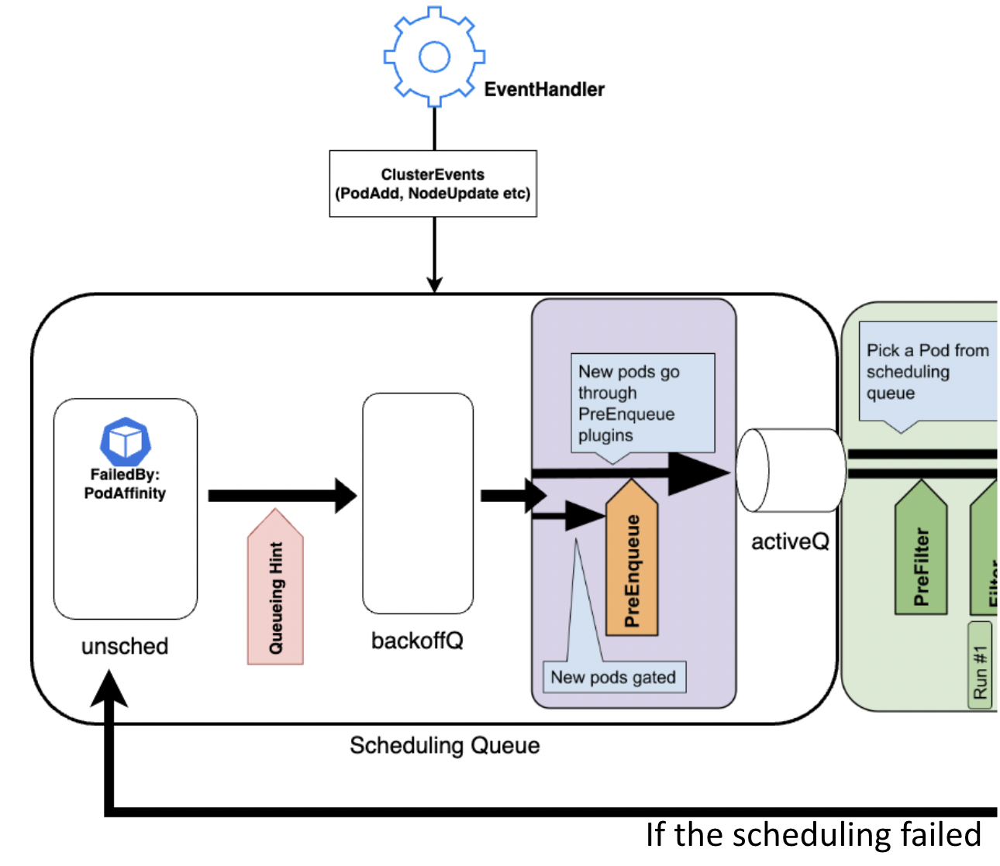
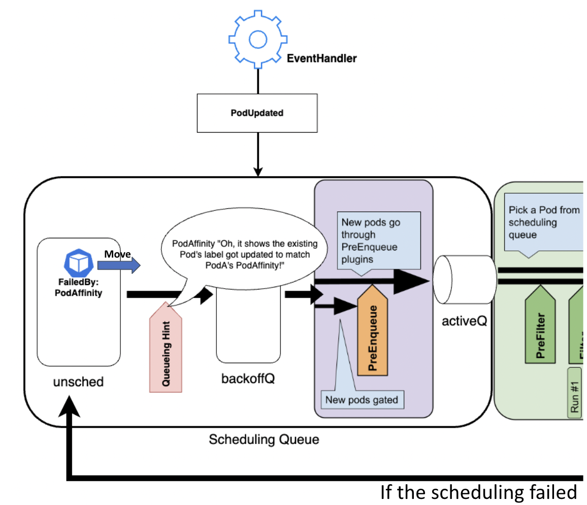

**Author:** [Kensei Nakada](https://github.com/sanposhiho) (Mercari)

The scheduler is the core component that decides which Node Pods run on.
Basically, it schedules Pods **one by one**, 
and thus the larger your cluster is, the more crucial the throughput of the scheduler is.

The throughput of the scheduler is our eternal challenge, 
over the years, SIG-Scheduling have been putting effort to improve the scheduling throughput by many enhancements.

In this blog post, I'll introduce a recent major improvement in the scheduler, named QueueingHint.

We'll go through the explanation of the basic background knowledge of the scheduler,
and how QueueingHint improves our scheduling throughput.

## Scheduling Queue

The scheduler has Scheduling Queue which has all unscheduled Pods.

Scheduling Queue is composed of three places in it - ActiveQ, BackoffQ and Unschedulable Pod Pool.
- ActiveQ: Pods which are ready to get scheduling.
- BackoffQ: Pods which are waiting for the backoff, and will be put into ActiveQ after that.
- Unschedulable Pod Pool: Pods which should not be scheduled for now.

## Scheduling Framework and Plugins

[Scheduling Framework](/docs/concepts/scheduling-eviction/scheduling-framework/)

The scheduler is implemented with Scheduling Framework. 
And, each scheduling requirements/preferences is implemented as a plugin.
(e.g., PodAffinity is implemented in the PodAffinity plugin.)

The first phase, called Scheduling Cycle, takes Pods from activeQ **one by one**, gather all plugins' idea,
and lastly decides a Node to run the Pod, or concludes that the Pod cannot go to anywhere for now.

If the scheduling is successful, the second phase, called Binding Cycle, binds the Pod with the Node.
But, if it turns out that the Pod cannot go to anywhere in Scheduling Cycle, 
Binding Cycle isn't executed, instead the Pod is moved back to Scheduling Queue.
There are some exception cases though, such unscheduled Pod is basically put into Unschedulable Pod Pool.

Pods in Unschedulable Pod Pool are moved to ActiveQ/BackoffQ 
only when Scheduling Queue thinks they might be schedulable if we retry the scheduling.

That is a crucial step because Scheduling Cycle is performed for Pods one by one -
if we didn't have Unschedulable Pod Pool and kept retrying the scheduling of any Pods, 
Scheduling Cycle is wasted for Pods with no hope to be scheduled.

Then, how do they decide when to move? How do they notice that Pods might be schedulable now?
There we go, QueueingHint comes in.

## QueueingHint

QueueingHint is callback functions per plugin to notice an object addition/update/deletion in the cluster (we call them cluster events)
that may make Pods schedulable.

Let's say PodA has a required PodAffinity, and got rejected in scheduling cycle by PodAffinity plugin 
because no Node has any Pod matching with PodA's PodAffinity.

When an unscheduled Pod is put into Unschedulable Pod Pool, Scheduling Queue remembers which plugins caused the scheduling failure of the Pod.
In this example, Scheduling Queue notes that PodA was rejected by PodAffinity.

PodA will never be schedulable until PodAffinity failure is resolved somehow.
Scheduling Queue uses QueueingHint from failure plugins, which is PodAffinity in the example.

QueueingHint subscribes a perticular cluster event and make a decision whether an incoming event could make the Pod schedulable.
Thinking about when PodAffinity failure could be resolved,
one possible scenario is that an existing Pod gets a new label which matches with PodA's PodAffinity.

PodAffinity QueueingHint checks all Pod updates happening in the cluster, 
and when it catches such update, the scheduling queue moves PodA to activeQ/backoffQ.

## What's new in v1.28

We have been working on the development of QueueingHint since v1.27.
In v1.27, only one alpha plugin (DRA) supported QueueingHint,
and in v1.28, some stable plugins start to work with QueueingHint.

QueueingHint is not something user-facing, but we have a feature gate () as a safety net 
because QueueingHint changes a critical path of the scheduler a lot.

## Getting involved

These features are managed by Kubernetes [SIG Scheduling](https://github.com/kubernetes/community/tree/master/sig-scheduling).

Please join us and share your feedback. 

## How can I learn more?

- [KEP-4247: Per-plugin callback functions for efficient requeueing in the scheduling queue](https://github.com/kubernetes/enhancements/blob/master/keps/sig-scheduling/4247-queueinghint/README.md)