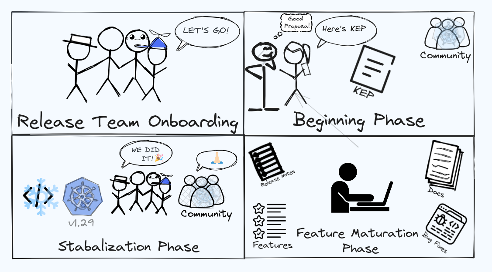
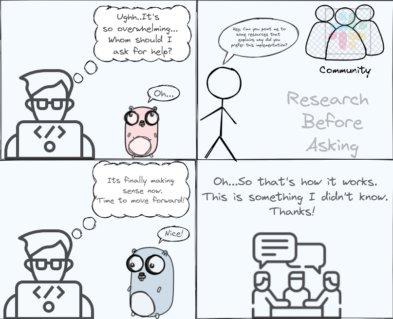

The Release Special Interest Group (SIG Release), where Kubernetes sharpens its blade 
with cutting-edge features and bug fixes every 4 months. Have you ever considered how such a big 
project like Kubernetes manages its timeline so efficiently to release its new version, or how 
the internal workings of the Release Team look like? If you're curious about these questions or
want to know more and get involved with the work SIG Release does, read on!

SIG Release plays a crucial role in the development and evolution of Kubernetes. 
Its primary responsibility is to manage the release process of new versions of Kubernetes. 
It operates on a regular release cycle, [typically every three to four months](https://www.kubernetes.dev/resources/release/). 
During this cycle, the Kubernetes Release Team works closely with other SIGs and contributors 
to ensure a smooth and well-coordinated release. This includes planning the release schedule, setting deadlines for code freeze and testing
phases, as well as creating release artefacts like binaries, documentation, and release notes.

Before you read further, it is important to note that there are two subprojects under SIG 
Release - _Release Engineering_ and _Release Team_.

In this blog post, [Nitish Kumar](https://twitter.com/nitishfy) interviews Verónica
López (PlanetScale), Technical Lead of SIG Release, with the spotlight on the Release Team
subproject, how the release process looks like, and ways to get involved. 

 1. **What is the typical release process for a      new version of Kubernetes, from initial planning
    to the final release? Are there any specific methodologies and tools that you use to ensure a smooth release?**

    The release process for a new Kubernetes version is a well-structured and community-driven
    effort. There are no specific methodologies or
    tools as such that we follow, except a calendar with a series of steps to keep things organised.
    The complete release process looks like this:

   - **Release Team Onboarding:** We start with the formation of a Release Team, which includes
     volunteers from the Kubernetes community who will be responsible for managing different
     components of the new release. This is typically done before the previous release is about to
     wrap up. Once the team is formed, new members are onboarded while the Release Team Lead and
     the Branch Manager propose a calendar for the usual deliverables. As an example, you can take a look
     at [the v1.29 team formation issue](https://github.com/kubernetes/sig-release/issues/2307) created at the SIG Release
     repository. For a contributor to be the part of Release Team, they typically go through the
     Release Shadow program, but that's not the only way to get involved with SIG Release.

   - **Beginning Phase:** In the initial weeks of each release cycle, SIG Release diligently
     tracks the progress of new features and enhancements outlined in Kubernetes Enhancement
     Proposals (KEPs). While not all of these features are entirely new, they often commence
     their journey in the alpha phase, subsequently advancing to the beta stage, and ultimately
     attaining the status of stability.

   - **Feature Maturation Phase:** We usually cut a couple of Alpha releases, containing new
     features in an experimental state, to gather feedback from the community, followed by a
     couple of Beta releases, where features are more stable and the focus is on fixing bugs. Feedback
     from users is critical at this stage, to the point where sometimes we need to cut an
     additional Beta release to address bugs or other concerns that may arise during this phase. Once
     this is cleared, we cut a _release candidate_ (RC) before the actual release. Throughout
     the cycle, efforts are made to update and improve documentation, including release notes
     and user guides, a process that, in my opinion, deserves its own post.

   - **Stabilisation Phase:** A few weeks before the new release, we implement a _code freeze_, and
     no new features are allowed after this point: this allows the focus to shift towards testing
     and stabilisation. In parallel to the main release, we keep cutting monthly patches of old,
     officially supported versions of Kubernetes, so you could say that the lifecycle of a Kubernetes
     version extends for several months afterwards. Throughout the complete release cycle, efforts
     are made to update and improve documentation, including release notes and user guides, a
     process that, in our opinion, deserves its own post.
   
     

2.  **How do you handle the balance between   stability and introducing new features in each 
  release? What criteria are used to determine which features make it into a release?**

    It’s a neverending mission, however, we think 
    that the key is in respecting our process and guidelines. Our guidelines are the result of 
    hours of discussions and feedback from dozens of members of the community who bring a wealth of knowledge and experience to the project. If we 
    didn’t have strict guidelines, we would keep having the same discussions over and over again, 
    instead of using our time for more productive topics that needs our attention. All the 
    critical exceptions require consensus from most of the team members, so we can ensure quality.

    The process of deciding what makes it into a release starts way before the Release Teams 
    takes over the workflows. Each individual SIG along with the most experienced contributors 
    gets to decide whether they’d like to include a feature or change, so the planning and ultimate 
    approval usually belongs to them. Then, the Release Team makes sure those contributions meet 
    the requirements of documentation, testing, backwards compatibility, among others, before 
    officially allowing them in. A similar process happens with cherry-picks for the monthly patch 
    releases, where we have strict policies about not accepting PRs that would require a full KEP, 
    or fixes that don’t include all the affected branches.

3. **What are some of the most significant challenges you’ve encountered while developing 
and releasing Kubernetes? How have you overcome these challenges?**

    Every cycle of release brings its own array of 
    challenges. It might involve tackling last-minute concerns like newly discovered Common Vulnerabilities and Exposures (CVEs), 
    resolving bugs within our internal tools, or addressing unexpected regressions caused by 
    features from previous releases. Another obstacle we often face is that, although our 
    team is substantial, most of us contribute on a volunteer basis. Sometimes it can feel like 
    we’re a bit understaffed, however we always manage to get organised and make it work.

4. **As a new contributor, what should be my ideal path to get involved with SIG Release? In 
a community where everyone is busy with their own tasks, how can I find the right set of tasks to contribute effectively to it?**

    Everyone's way of getting involved within the Open Source community is different. SIG Release 
    is a self-serving team, meaning that we write our own tools to be able to ship releases. We 
    collaborate a lot with other SIGs, such as [SIG K8s Infra](https://github.com/kubernetes/community/blob/master/sig-k8s-infra/README.md), but all the tools that we used needs to be 
    tailor-made for our massive technical needs, while reducing costs. This means that we are 
    constantly looking for volunteers who’d like to help with different types of projects, beyond “just” cutting a release.

    Our current project requires a mix of skills like [Go](https://go.dev/) programming, 
    understanding Kubernetes internals, Linux packaging, supply chain security, technical 
    writing, and general open-source project maintenance. This skill set is always evolving as our project grows.

    For an ideal path, this is what we suggest:

    - Get yourself familiar with the code, including how features are managed, the release calendar, and the overall structure of the Release Team.
    - Join the Kubernetes community communication channels, such as [Slack](https://communityinviter.com/apps/kubernetes/community) (#sig-release), where we are particularly active. 
    - Join the [SIG Release weekly meetings](https://github.com/kubernetes/community/tree/master/sig-release#meetings)
    which are open to all in the community. Participating in these meetings is a great way to learn about ongoing and future projects that 
    you might find relevant for your skillset and interests.

    Remember, every experienced contributor was once in your shoes, and the community is often more than willing to guide and support newcomers. 
    Don't hesitate to ask questions, engage in discussions, and take small steps to contribute.
    

5. **What is the Release Shadow Program and how is it different from other shadow programs included in various other SIGs?**

    The Release Shadow Program offers a chance for interested individuals to shadow experienced 
    members of the Release Team throughout a Kubernetes release cycle. This is a unique chance to see all the hard work that a 
    Kubernetes release requires across sub-teams. A lot of people think that all we do is cut a release every three months, but that’s just the 
    top of the iceberg.

    Our program typically aligns with a specific Kubernetes release cycle, which has a 
    predictable timeline of approximately three months. While this program doesn’t involve writing new Kubernetes features, it still 
    requires a high sense of responsibility since the Release Team is the last step between a new release and thousands of contributors, so it’s a 
    great opportunity to learn a lot about modern software development cycles at an accelerated pace.

6. **What are the qualifications that you generally look for in a person to volunteer as a release shadow/release lead for the next Kubernetes release?**

    While all the roles require some degree of technical ability, some require more hands-on 
    experience with Go and familiarity with the Kubernetes API while others require people who 
    are good at communicating technical content in a clear and concise way. It’s important to mention that we value enthusiasm and commitment over 
    technical expertise from day 1. If you have the right attitude and show us that you enjoy working with Kubernetes and or/release 
    engineering, even if it’s only through a personal project that you put together in your spare time, the team will make sure to guide 
    you. Being a self-starter and not being afraid to ask questions can take you a long way in our team.

7. **What will you suggest to someone who has got rejected from being a part of the Release Shadow Program several times?**

    Keep applying.

    With every release cycle we have had an exponential growth in the number of applicants, 
    so it gets harder to be selected, which can be discouraging, but please know that getting rejected doesn’t mean you’re not talented. It’s 
    just practically impossible to accept every applicant, however here's an alternative that we suggest:

    *Start attending our weekly Kubernetes SIG Release meetings to introduce yourself and get familiar with the team and the projects we are working on.*

    The Release Team is one of the way to join SIG Release, but we are always looking for more hands to help. Again, in addition to certain 
    technical ability, the most sought after trait that we look for is people we can trust, and that requires time.
    

8. **Can you discuss any ongoing initiatives or upcoming features that the release team is particularly excited about for Kubernetes v1.28? How do these advancements align with the long-term vision of Kubernetes?**

    We are excited about finally publishing Kubernetes packages on community infrastructure. It has been something that we have been wanting to do for a few years now, but it’s a project 
    with many technical implications that must be in place before doing the transition. Once that’s done, we’ll be able to increase our productivity and take control of the entire workflows.

## Final thoughts

Well, this conversation ends here but not the learning. I hope this interview has given you some idea about what SIG Release does and how to 
get started in helping out. It is important to mention again that this article covers the first subproject under SIG Release, the Release Team. 
In the next Spotlight blog on SIG Release, we will provide a spotlight on the Release Engineering subproject, what it does and how to 
get involved. Finally, you can go through the [SIG Release charter](https://github.com/kubernetes/community/tree/master/sig-release) to get a more in-depth understanding of how SIG Release operates.