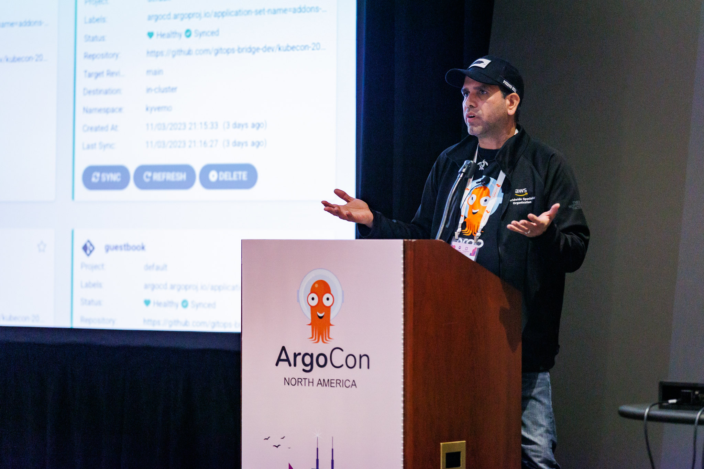

------
layout: blog
title: "A look into the Kubernetes Book Club"
slug: k8s-book-club
date: 2024-02-22
canonicalUrl: https://www.k8s.dev/blog/2024/02/22/k8s-book-club/
author: >
  Frederico Muñoz (SAS Institute)
---

Learning Kubernetes and the entire ecosystem of technologies around it is not without its
challenges. In this interview, we will talk with [Carlos Santana
(AWS)](https://www.linkedin.com/in/csantanapr/) to learn a bit more about how he created the
[Kubernetes Book Club](https://community.cncf.io/kubernetes-virtual-book-club/), how it works, and
how anyone can join in to take advantage of a community-based learning experience.

**Frederico Muñoz (FSM)**: Hello Carlos, thank you so much for your availability. To start with,
could you tell us a bit about yourself?

**Carlos Santana (CS)**: Of course. My experience in deploying Kubernetes in production six
years ago opened the door for me to join [Knative](https://knative.dev/) and then contribute to
Kubernetes through the Release Team. Working on upstream Kubernetes has been one of the best
experiences I've had in open-source. Over the past two years, in my role as a Senior Specialist
Solutions Architect at AWS, I have been assisting large enterprises build their internal developer
platforms (IDP) on top of Kubernetes. Going forward, my open source contributions are directed
towards [CNOE](https://cnoe.io/) and CNCF projects like [Argo](https://github.com/argoproj),
[Crossplane](https://www.crossplane.io/), and [Backstage](https://www.cncf.io/projects/backstage/).

## Creating the Book Club

**FSM**: So your path led you to Kubernetes, and at that point what was the motivating factor for
starting the Book Club?

**CS**: The idea for the Kubernetes Book Club sprang from a casual suggestion during a
[TGIK](https://github.com/vmware-archive/tgik) livestream. For me, it was more than just about
reading a book; it was about creating a learning community. This platform has not only been a source
of knowledge but also a support system, especially during the challenging times of the
pandemic. It's gratifying to see how this initiative has helped members cope and grow. The first
book [Production
Kubernetes](https://www.oreilly.com/library/view/production-kubernetes/9781492092292/) took 36
weeks, when we started on March 5th 2021. Currently don't take that long to cover a book, one or two
chapters per week.

**FSM**: Could you describe the way the Kubernetes Book Club works? How do you select the books and how
do you go through them?

**CS**: We collectively choose books based on the interests and needs of the group. This practical
approach helps members, especially beginners, grasp complex concepts more easily. We have two weekly
series, one for the EMEA timezone, and I organize the US one. Each organizer works with their co-host
and picks a book on Slack, then sets up a lineup of hosts for a couple of weeks to discuss each
chapter.

**FSM**: If I’m not mistaken, the Kubernetes Book Club is in its 17th book, which is significant: is
there any secret recipe for keeping things active?

**CS**: The secret to keeping the club active and engaging lies in a couple of key factors.

Firstly, consistency has been crucial. We strive to maintain a regular schedule, only cancelling
meetups for major events like holidays or KubeCon. This regularity helps members stay engaged and
builds a reliable community.

Secondly, making the sessions interesting and interactive has been vital. For instance, I often
introduce pop-up quizzes during the meetups, which not only tests members' understanding but also
adds an element of fun. This approach keeps the content relatable and helps members understand how
theoretical concepts are applied in real-world scenarios.

## Topics covered in the Book Club

**FSM**: The main topics of the books have been Kubernetes, GitOps, Security, SRE, and
Observability: is this a reflection of the cloud native landscape, especially in terms of
popularity?

**CS**: Our journey began with 'Production Kubernetes', setting the tone for our focus on practical,
production-ready solutions. Since then, we've delved into various aspects of the CNCF landscape,
aligning our books with a different theme.  Each theme, whether it be Security, Observability, or
Service Mesh, is chosen based on its relevance and demand within the community. For instance, in our
recent themes on Kubernetes Certifications, we brought the book authors into our fold as active
hosts, enriching our discussions with their expertise.

**FSM**: I know that the project had recent changes, namely being integrated into the CNCF as a
[Cloud Native Community Group](https://community.cncf.io/). Could you talk a bit about this change?

**CS**: The CNCF graciously accepted the book club as a Cloud Native Community Group. This is a
significant development that has streamlined our operations and expanded our reach. This alignment
has been instrumental in enhancing our administrative capabilities, similar to those used by
Kubernetes Community Days (KCD) meetups. Now, we have a more robust structure for memberships, event
scheduling, mailing lists, hosting web conferences, and recording sessions.

**FSM**: How has your involvement with the CNCF impacted the growth and engagement of the Kubernetes
Book Club over the past six months?

**CS**: Since becoming part of the CNCF community six months ago, we've witnessed significant
quantitative changes within the Kubernetes Book Club. Our membership has surged to over 600 members,
and we've successfully organized and conducted more than 40 events during this period. What's even
more promising is the consistent turnout, with an average of 30 attendees per event. This growth and
engagement are clear indicators of the positive influence of our CNCF affiliation on the Kubernetes
Book Club's reach and impact in the community.

## Joining the Book Club

**FSM**: For anyone wanting to join, what should they do?

**CS**: There are three steps to join:

- First, join the [Kubernetes Book Club
  Community](https://community.cncf.io/kubernetes-virtual-book-club/)
- Then RSVP to the
  [events](https://community.cncf.io/kubernetes-virtual-book-club/)
  on the community page
- Lastly, join the CNCF Slack channel
  [#kubernetes-book-club](https://cloud-native.slack.com/archives/C05EYA14P37).

**FSM**: Excellent, thank you! Any final comments you would like to share?

**CS**: The Kubernetes Book Club is more than just a group of professionals discussing books; it's a
vibrant community and amazing volunteers that help organize and host [Neependra
Khare](https://www.linkedin.com/in/neependra/), [Eric
Smalling](https://www.linkedin.com/in/ericsmalling/), [Sevi
Karakulak](https://www.linkedin.com/in/sevikarakulak/), [Chad
M. Crowell](https://www.linkedin.com/in/chadmcrowell/), and [Walid (CNJ)
Shaari](https://www.linkedin.com/in/walidshaari/). Look us up at KubeCon and get your Kubernetes
Book Club sticker!
