**Author:** Songlu Cai (KubeBlocks)

The wave of database containerization is on the rise, as clearly shown in Fig.1. Databases and analytics are now a major part of the tech scene. Yet, a common dilemma persists: Does containerization impact database performance? If yes, what factors come into play? How can we tackle performance and stability issues brought about by containerization?

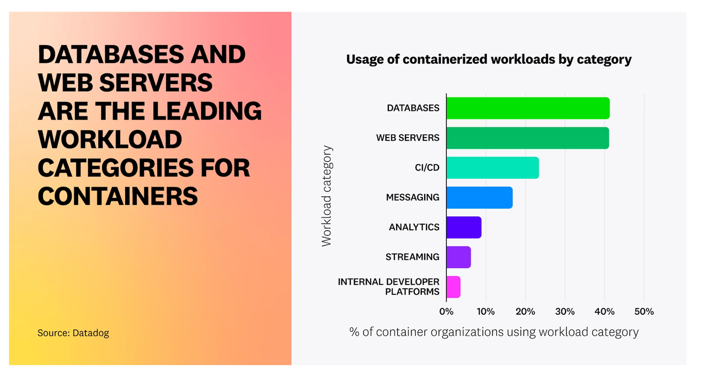

## Advantages and technical principles of containerization

Containerization is a smart way to bundle an app and all its necessary parts into a self-contained, portable and immutable runtime environment. Think of it as a tech wizardry that simplifies the process of packaging, deploying, and managing applications. This magic is made possible by container runtime engines such as Docker or Containerd. These engines are responsible for creating, deploying, and supervising containers.

Kubernetes (K8s), is a game-changer in the world of container orchestration. This open-source platform functions as a central hub for managing containers, offering a scalable infrastructure that automates a wide range of operations. As a dominant container orchestration tool, it handles everything from seamless deployment to efficient scaling, comprehensive management, and smart scheduling.

### Advantages of containerization

1. Flexibility and portability.
  
   The deployment and migration of databases are simpler and more reliable. With containerization, the runtime environment and version of databases can be claimed through declarative API in the form of IaC (Infrastructure as Code).

2. Resource isolation and scalability.

   By leveraging container runtime engines, containerization ensures that each database instance operates in its own isolated environment with dedicated resources. This separation minimizes interference between workloads, allowing for more efficient use of computing power and enhancing both performance and reliability. 

3. More user-friendly scheduling strategies. 

   Containerization's fine-grained resource management paves the way for smarter scheduling strategies. It enables tailored deployment tactics for different scenarios, such as blending offline and online workloads to balance resource usage or combining various database workloads to boost overall efficiency. Additionally, increasing deployment density can lead to significant reductions in computational costs.

### Technical principles and categories of containerization

#### Virtualization

Speaking of containers, virtualization cannot be ignored. Virtualization is a technique that abstracts and isolates computing resources, allowing multiple virtual instances to run simultaneously on the same physical server. This is achieved by employing a software layer called Hypervisor between the hardware and the operating system. This layer partitions the physical server into multiple virtual machines, each with its own independent operating system and resources.

Containerization, on the other hand, is a more lightweight virtualization technique. It leverages operating system-level virtualization to create isolated pockets where applications and their required environments can run. Often, containerization is paired with virtualization to cater to various needs for isolation in different computing scenarios.

#### Breaking down virtualization+container technologies

According to resource isolation and virtualization methods, mainstream virtualization + container technologies can be categorized as follows:

1. Standard Containers, which adhere to the Open Container Initiative (OCI) standards, like Docker/Containerd, use runC as their runtime and are the go-to for K8s workloads today.
2. User-Space Kernel Containers, such as gVisor, also meet OCI standards and use runsc as their runtime, known for better isolation and security but at the cost of performance, making them ideal for less demanding workloads.
3. Microkernel Containers, which employ hypervisors like Firecracker and Kata-Container, comply with OCI specification too, and use either runC or runv as their runtime, striking a balance among security, isolation, and performance, sitting somewhere between standard containers and user-space kernel containers.
4. Virtual Machines, including KVM, Xen, VMWare, form the foundational virtualization layer for major cloud providers' servers, typically acting as Nodes in K8s, and operate at a more fundamental level than containers.

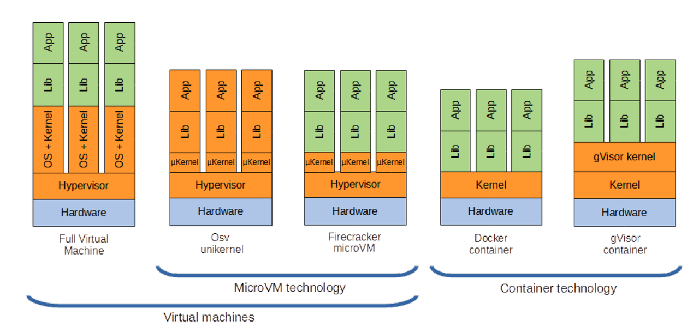

#### Exploring OCI-compliant containerization technologies

The following paragraphs analyze several mainstream containerization technologies that comply with the OCI specification.

1. RunC

   RunC is an OCI-compliant container runtime integral to the Docker/Containerd core container engine. It leverages Linux's Namespace and Cgroup functions to create a secure isolation for containers.

   During container operation, runC employs Namespaces to segregate a container's processes, networking, file system, and IPC (Inter-Process Communication). It also utilizes Cgroups to constrain the resource consumption of the container's processes. This isolation method ensures that applications within the container operate in a relatively self-contained environment, isolated from the host system and other containers.

   While runC's isolation approach does introduce some overhead, such overhead is confined to namespace mapping, constraints check, and certain accounting procedures, which is theoretically minimal. Furthermore, the accounting overhead can be ignored when syscalls involve lengthy operations. In general, the Namespace+Cgroup-based isolation approach has minimal impact on the CPU, memory, and I/O performance.

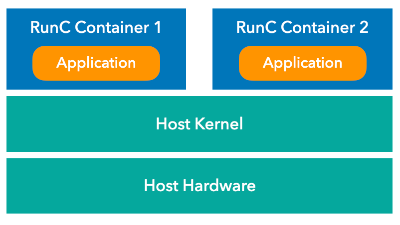

2. Kata Containers

   Imagine a secure bubble where each application operates in its own space, shielded from the outside world. That's what Kata Containers offers by harnessing the power of virtual machine technology. Building on Intel's Clear Containers innovation, Kata Containers merge the lightweight oversight of virtual machine monitors with the agility of container runtimes.

   Each container gets its own virtual machine, complete with a unique kernel and user space, ensuring that applications are kept in their own secure compartments. This approach ramps up isolation, making it tough for containerized apps to peek into the host's resources. But there's a trade-off: the extra steps of booting up and managing these virtual machines might slow down syscalls and I/O operations a bit when compared to the classic container runtimes.

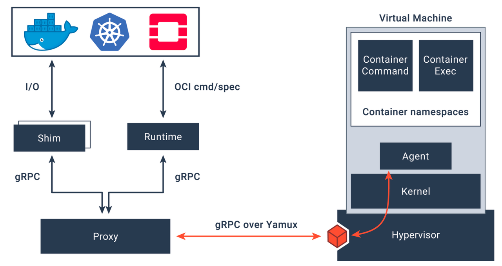

3. gVisor

   gVisor is a cutting-edge container runtime that leverages user-space virtualization to deliver enhanced security and isolation. At the heart of gVisor is a unique "Sandboxed Kernel" that operates within the container itself, simulating and managing the operating system's interfaces.

   This clever design ensures that containerized applications are kept separate from the Host Kernel, preventing them from directly meddling with or accessing the host's resources. Although this approach significantly boosts security, it's worth noting that it might also lead to an increase in syscalls and I/O performance overhead when compared to standard container runtimes.

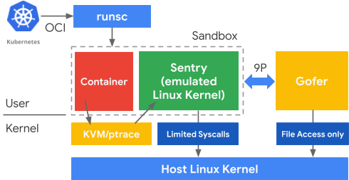

4. Firecracker

   Firecracker is a specialized virtualization solution tailored for serverless computing and light workloads. It leverages the concept of micro-VMs, treating each container as a standalone virtual machine.
   
   At its core, Firecracker uses KVM (Kernel-based Virtual Machine) for virtualization. Every container runs in its own VM, with its own kernel and root filesystem, and it interacts with the host system through separate virtual device emulators. This approach ensures a higher level of security and isolation. However, when compared to conventional container runtimes, Firecracker might result in a higher overhead for syscalls and I/O operations.

#### Comparing the fundamentals

Table. 1. Overview of implementations of virtualization and isolation in Containerization

|        | Containerd-RunC  | Kata-Container |gVisor  |FireCracker-Containerd  |
|:----------------|:---------| :---------| :---------| :---------|
| Isolation Mechanisms | Namespace + Cgroup| Guest Kernel| Sandboxed Kernel| microVM| 
| OCI Runtime| RunC| Clear Container + runv| runsc| RunC| 
| Virtualization| Namespace| QEMU/Cloud Hypervisor+KVM| Rule-Based Execution| rust-VMM + KVM| 
| vCPU| Cgroup| Cgroup| Cgroup| Cgroup| 
| Memory| Cgroup| Cgroup| Cgroup| Cgroup| 
| Syscall| Host| Guest + Host| Sentry| Guest + Host| 
| Disk I/O| Host| virtio| Gofer| virtio| 
| Network I/O| Host + veth| tc + veth| netstack| tap + virtio-net

Additionally, some have analyzed how container engines like Containerd and CRI-O differ in their approach[3][5]. These comparisons, however, are beyond the scope of this discussion and are left for curious readers to investigate further.

## How K8s and containerization impact databases

As stated before, containerization brings a host of benefits to databases. It streamlines the process of deploying and managing databases, offering a uniform and isolated runtime environment. This technology facilitates the effortless deployment and agile migration of databases across diverse and complex settings, while also providing a more standardized and user-friendly approach to version control. Furthermore, with the backing of K8s, the various roles and components within a database can be seamlessly and dynamically integrated.

### The challenges containerization presents databases

However, the combination of K8s and containerization brings forth numerous challenges for databases, stemming from the very nature of how databases operate. In contrast to the usual stateless applications, databases are characterized by:

1. Databases are intricate applications with multiple roles.

   A fully-fledged database consists of multiple roles, each with a specific function. For example, in a MySQL primary-secondary architechture, there are two MySQL containers, one serving as the primary and the other as the secondary. The primary offers the Read-Write ability while the secondary is Read-Only and serves as a hot standby. These roles are distinct and expressing their unequal relationship accurately is vital. Additionally, it's critical to manage these roles correctly during operations such as creation, restart, deletion, backup, and high availability. At the core of this is how to manage the data dependencies across containers, and both containers and K8s currently lack a well-abstracted and resolved solution for handling such interdependencies.

2. Databases demand robust data persistence and consistency.

   They have exacting storage requirements that cannot be met by containerization alone, necessitating additional components like the Container Storage Interface (CSI) and PersistentVolume for production-level workloads. The choice of storage medium also dictates the range of operations a database can perform. For instance, cloud disks provide high durability, snapshot backup capabilities, and the flexibility to attach or detach from various computing nodes, which are beneficial for database backup, restore, and ensuring high availability. In contrast, these features may be limited on local disks. For example, when it comes to a node failure, a local disk data replica could be permanently lost, bringing a significant challenge to maintaining high availability, and backup options are also restricted. Different storage solutions means varying degrees of persistence, different database feature set and architectures.

3. Databases are powerhouses that need to perform at top speed.

   Databases come with a variety of performance needs that can be sorted into categories like CPU, memory, network, and storage. For instance, when it comes to handling massive data analysis, products like ClickHouse and Greenplum are heavy on CPU and storage I/O. On the flip side, databases such as Redis and Memcached are more demanding on memory and network I/O. Then there are the classic workhorses like MySQL and PostgreSQL, which are traditional OLTP databases that also lean heavily on CPU and storage I/O. What's more, even within a single database, the thirst for resources can shift dramatically based on the type of query being run.

4. Databases come with their own set of security needs.

   The data stored in databases is often of high importance and confidentiality, which is why they demand stringent measures for environment isolation, data access control, and auditing.

To wrap it up, when it comes to running databases on the combined platform of containers and K8s, both the databases themselves and the container+K8s system face a slew of tough hurdles. Databases have to be flexible enough to handle the fleeting lifecycle of containers, floating IPs, constant upgrades to their underlying infrastructure, and the complexities of performance in various environments. Meanwhile, containerization and k8s must tackle issues like introducing roles, orchestrating containers with underlying needs for a global consistent data state, living up to high performance expectations, and staying in line with robust security measures.

In light of the previously mentioned aspects 1, 2, and 4, KubeBlocks has crafted a set of thorough solutions. For those curious, additional details can be found at http://kubeblocks.io. Now, back to the main focus of our discussion, the subsequent parts of this article will dive into a more detailed examination of how containerization affects database performance.

### How K8s and containerization affect database performance

As previously noted, database performance relies on key elements like CPU, memory, storage, and network. This section dives into how K8s and containerization might affect database performance with respect to these factors. It's worth mentioning that while K8s has certain scheduling and affinity strategies that could influence performance, these strategies are not inherently tied to containerization and are therefore beyond the scope of this discussion.

The upcoming sections will show how containerization affects the performance of applications, particularly databases, from the previously mentioned viewpoints. These sections gathered a wealth of industry research papers and recent test results to dissect and understand the underlying causes and discrepancies in the data. Extra tests are also carried out to fill in the gaps, focusing on specific areas that were previously overlooked, like how K8s' Container Network Interface (CNI) influences network efficiency.

#### CPU

Test server: Quad-Core Hyper Thread 4 Intel Core i5-7500, 8GB RAM, 1TB disk, Ubuntu 18.04 LTS.

Case: The experimental data and scenarios presented here draw from the study detailed in paper[1]. In Case 1, prime number computations are executed using sysbench with four concurrent threads. The performance is measured by the number of events processed each second. This test case is designed to simulate a purely computational workload, with the majority of operations occurring in user space, making syscalls negligible. Consequently, it is expected that performance across various container technologies would be similar in theory.

Result: The CPU performance across different containers shows negligible differences, with a modest performance dip of approximately 4% when compared to running on bare metal systems.

Analysis: The observed 4% drop in performance is likely due to the CPU restrictions imposed by Cgroup. When the number of concurrent processes in Sysbench matches the number of Hyper Threads, there's a significant chance of Cgroup throttling. In such cases, the process must wait for a CFS period(100ms by default) due to the throttle. Cgroup allocates resources based on jiffies rather than seconds, making it nearly impossible for a container with 4 vCPUs to achieve 400% utilization. Some performance loss is expected, and the frequency of this throttling can be tracked in the cpu.stat file within the Cgroup.

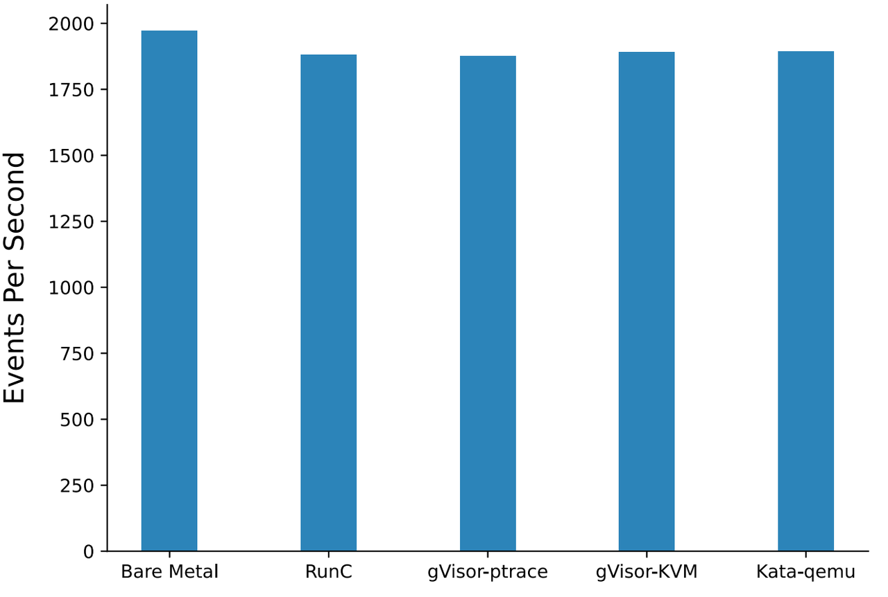

Case: Video decoding is performed using Davi1d, and the video files are several hundred megabytes in size. This test involves a considerable amount of syscalls because it's necessary to read data from the disk. These syscalls can affect the performance of the application to some extent.

Result: The performance of runC and Kata-QEMU shows a decline of around 4%, which aligns with the outcomes observed in the prime number tests. gVisor-ptrace exhibits a more significant performance drop of 13%, whereas gVisor-KVM delivers performance that matches that of a bare-metal setup.

Analysis: Video decoding involves sequential reading, and Linux has read-ahead optimization for sequential reads. Therefore, the majority of I/O operations directly read data from the page cache. RunC is primarily constrained by Cgroup limitations, while the other three solutions are more affected by how syscalls are executed. The paper does not further analyze the differences between gVisor-ptrace and gVisor-KVM. gVisor employs a component called gofer for file system operations, which comes with its unique caching approach. Further analysis may need to focus on gVisor's syscall processes and its caching mechanisms.

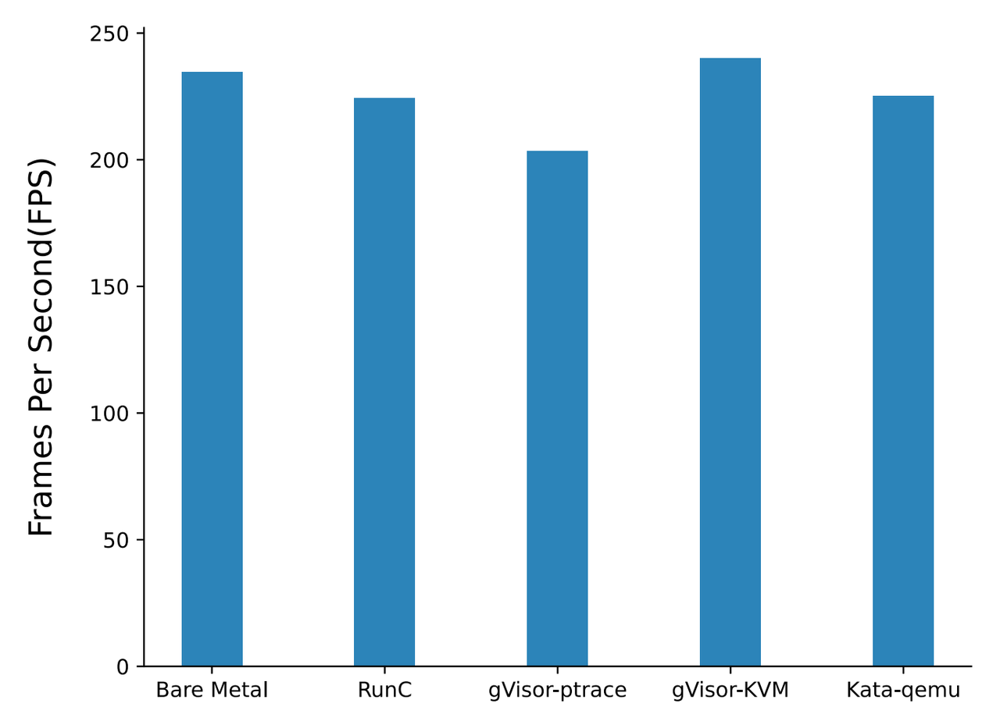

#### Memory

Case: RAMSpeed, with 4 sub-scenarios (Copy, Scale, Add, Triad). The specific details of the underlying principles are not elaborated here.

Result: The performance of various solutions is similar.

Analysis: Once memory is allocated and page fault is handled, in theory, containerization should not have a significant impact on memory access. The real factors that affect memory performance are syscalls such as mmap and brk. However, in this test, the proportion of such syscalls is minimal.

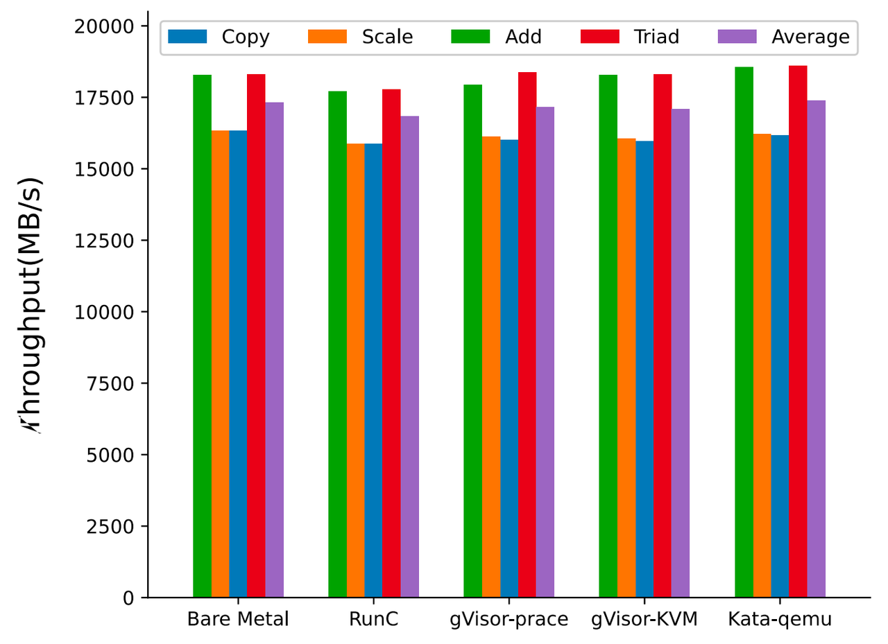

Case: Redis-Benchmark with sub-scenarios (GET, SET, LPUSH, LPOP, SADD).

Result: K8s+containerization has minimal impact on runC and Kata-QEMU, while gVisor experiences significant degradation. gVisor-ptrace sees a performance drop of approximately 95%, and gVisor-KVM experiences a reduction of about 56%.

Analysis: Redis operates a single-threaded application with heavy network I/O. All network I/O operations are performed through syscalls, which significantly hampers gVisor's performance. The original paper mistakenly attributed the performance loss mainly to memory allocation. However, Redis internally uses jemalloc, the user-space memory management tool. Jemalloc leverages mmap syscalls to request large blocks of memory from the operating system and then allocates smaller blocks locally. Due to jemalloc's mature memory allocation and caching mechanisms, the frequency of mmap syscalls is minimal. When Redis is under full load, CPU sys usage for network I/O is around 70%. Thus, the main reason for gVisor's performance issues in this context is the overhead from intercepting syscalls and its internal network stack, known as netstack. This evaluation also suggests that gVisor is not an ideal choice for environments with intensive network I/O demands.

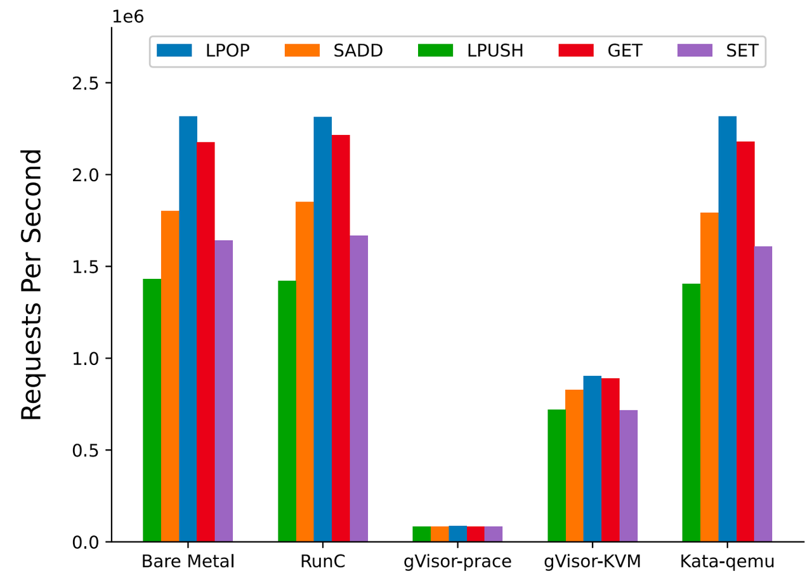

#### Disk I/O

Case: IOZone reads and writes a 16GB file.

Result: K8s + containerization shows negligible effects on sequential read and write performance. However, Kata-QEMU exhibits a notable performance drop, with degradation ranging between 12-16%.

Analysis: Reading and writing large blocks of data is, in essence, a sequential process. As previously discussed, sequential reading is enhanced by the operating system's ability to anticipate and prepare data in advance, with the bulk of sequential reading and writing tasks being handled by the page cache. The original study examined the effects on Kata-QEMU and identified the virtio-9p file system as the source of these impacts. The virtio-9p system was originally created for network applications and lacks tailored optimizations for use in virtual environments.

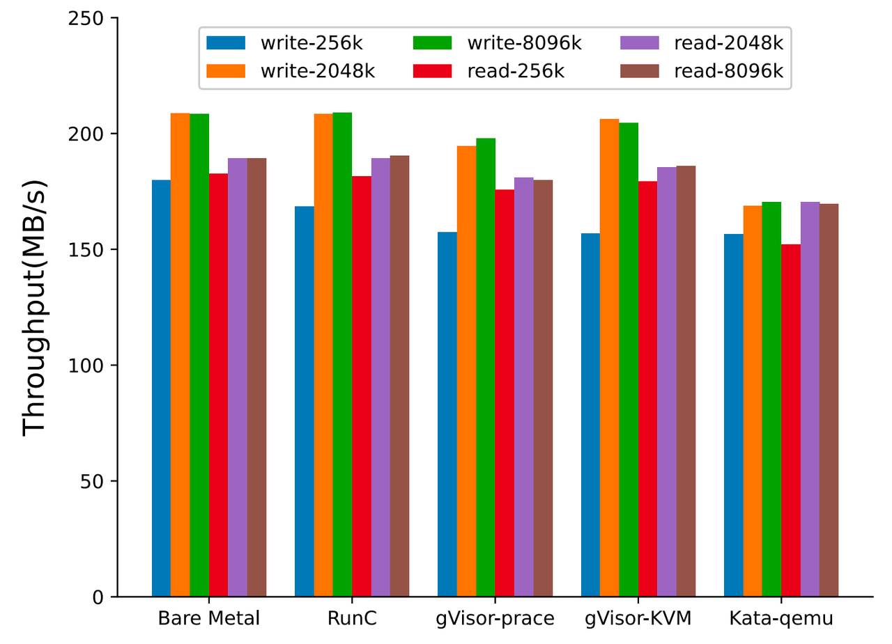

Case: Conducting tests on tmpfs (a temporary file storage in shared memory) to isolate and assess the effects of syscalls and memory copying on performance.

Result: Except for gVisor, the performance of other solutions is similar.

Analysis: gVisor incurs higher syscall overhead, resulting in similar performance degradation as observed in the redis-benchmark scenario.

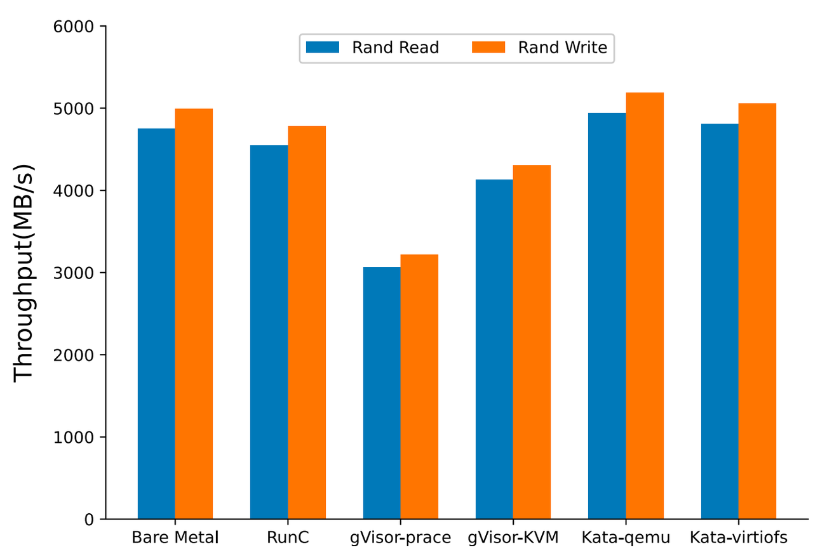

Case: A single-threaded SQLite data insertion benchmark, where shorter execution time is preferred.

Result: RunC performs similarly to bare metal, Kata has a 17% increase in execution time, and gVisor sees a 125% increase in execution time.

Analysis: Database workloads are complex and involve a combination of CPU, memory, network, and disk I/O. They also frequently make syscall calls. In such intricate environments, gVisor may not be the optimal choice.

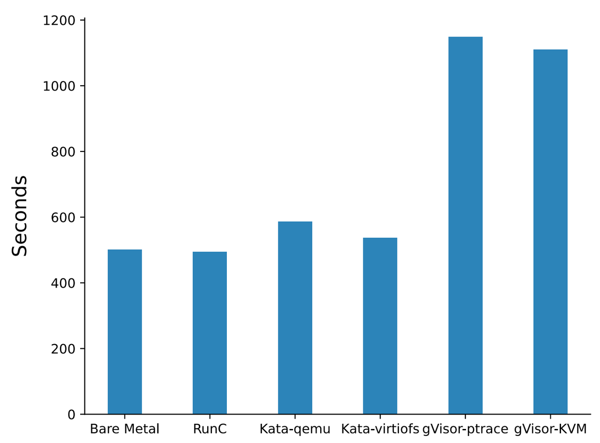

#### Network I/O

Case: TCP stream throughput test, higher throughput is preferred.

Result: gVisor exhibits poorer network performance, similar to what was observed in the redis-benchmark case. The impact on the other solutions is minimal.

Analysis: gVisor is limited by its syscall mechanism and netstack implementation, resulting in overall lower throughput.

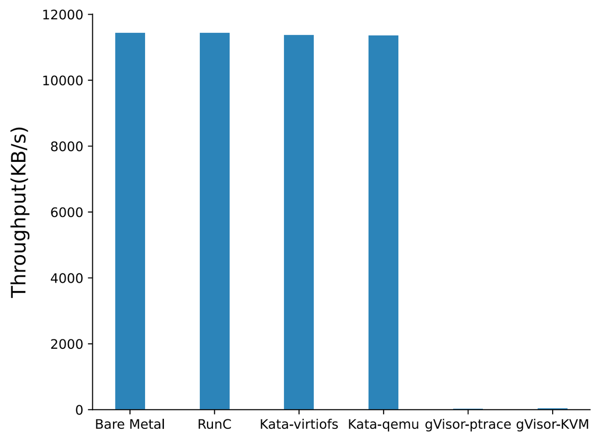

Case: This case evaluates TCP_RR, TCP_CRR, and UDP_RR. RR stands for request and response, where the TCP connection is established only once and reused for subsequent requests. CRR indicates creating a new TCP connection for each test. TCP_RR corresponds to a long connection scenario, while TCP_CRR corresponds to a short connection scenario.

Result: RunC performs similarly to bare metal; Kata experiences a small loss; gVisor still suffers from a substantial performance decline, the underlying principles of which are the same as mentioned before.

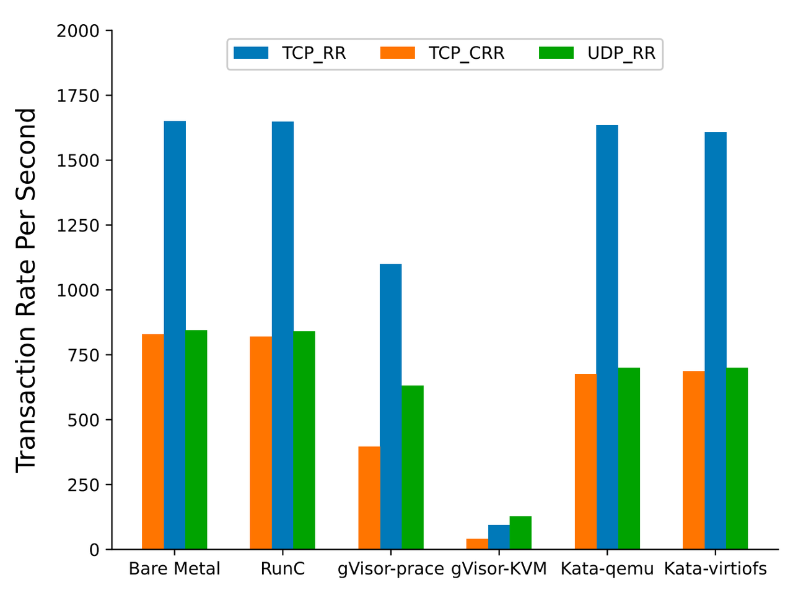

#### CNI network

Containers are commonly used with K8s, and container orchestration based on K8s has become the de facto standard. In a K8s environment, networking is typically implemented through a combination of CNI and container technologies. There's a variety of well-liked CNIs out there, such as Calico, Flannel, Cilium and etc. In the latest versions, both Calico and Cilium extensively utilize eBPF (extended Berkeley Packet Filter) technology. Although the specific implementations may differ, these two CNIs exhibit comparable performance in many testing scenarios. For the nitty-gritty on their performance, please refer to [CNI Benchmark: Understanding Cilium Network Performance](https://cilium.io/blog/2021/05/11/cni-benchmark/)[6].

The following tests compare the Cilium eBPF legacy host-routing mode and the Cilium eBPF mode to examine the specific impact of the CNI on database performance.

Legacy host-routing：

In the traditional host-routing mode of Cilium eBPF, iptables plays a crucial role in filtering and directing data packets. It remains an essential tool for setting up and controlling the rules that govern how network traffic is routed. Within this framework, Cilium steers the data flow towards its own proxy using iptables rules, after which the proxy takes over, processing and relaying the traffic accordingly.

In this mode, Cilium leverages the NAT (Network Address Translation) of iptables to modify the source and destination IP addresses for NAT and service load balancing.

eBPF-based host-routing：

In the new eBPF-based routing mode, Cilium no longer relies on iptables. Instead, it leverages the extended Berkeley Packet Filter (eBPF) of the Linux kernel for packet filtering and forwarding. eBPF host-routing allows bypassing all iptables and upper stack overhead within the host namespace, as well as reducing some context switch overhead during traversal of virtual network interfaces. Network packets are captured early from the network device facing network and directly delivered into the network namespace of the K8s Pod. For outgoing traffic, packets continue to pass through a veth pair, but are swiftly captured by eBPF and sent straight to the external network interface. eBPF directly consults the routing tables, ensuring that this enhancement is fully transparent and seamlessly integrates with any other routing services operating on the system.

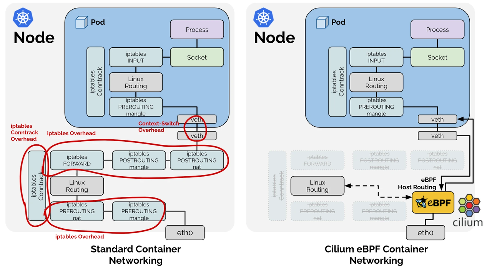

Test environment:

Kubernetes: v1.25.6 CNI: cilium:v1.12.14

Node CPU: Intel(R) Xeon(R) CPU E5-2680 v4 @ 2.40GHz RAM 128G

Redis: 7.0.6, 2 vCPU, Maxmemory: 2Gi

Case:

Table. 2. Overview of different service routing paths in K8s

|        | Network  | Source |Target  |
|:----------------|:---------| :---------| :---------| 
| NodeLocal2HostPod	  | Hostnetwork  | 	Node  | 	Local Pod  | 
| NodeLocal	  | Ethernet	  | Node  | 	Local Process  | 
| PodLocal2Pod|	Pod|	Pod	|Local Pod|
|Node2HostPod	|Hostnetwork|	Node	|Remote Pod|
|NodeLocal2NodePort	|NodePort	|Node	|Local| NodePort|
|Node2Node	|Ethernet|	Node|	Remote Process|
|NodeLocal2Pod|	Pod	|Node	|Local Pod|
|Pod2Pod	|Pod|	Pod	|Remote Pod|
|Node2NodePort|	NodePort	|Node|	Remote NodePort|
|Pod2NodePort	|Pod + NodePort	|Pod	|Remote NodePort|
|Node2Pod|	Pod|	Node	|Remote Pod|

Result:

Legacy host-routing with iptables:

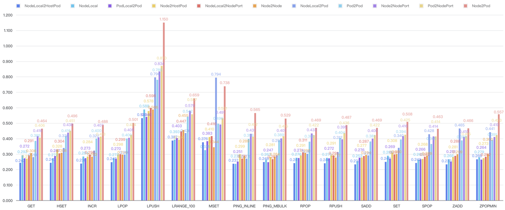

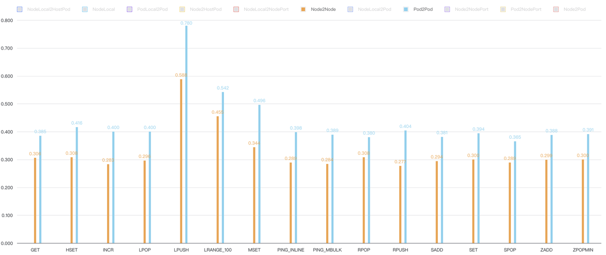

eBPF-based host-routing:

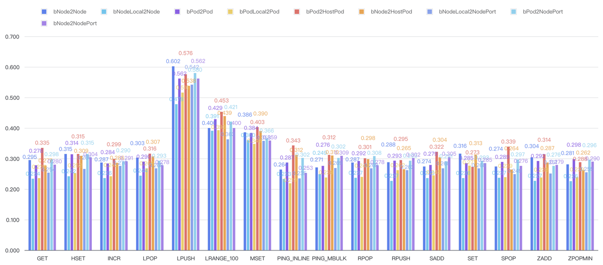

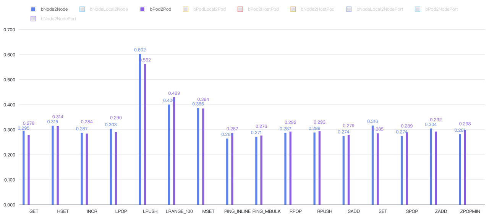

Analysis: Traditional host-routing methods can drag down network efficiency, creating a substantial 40% performance gap between Pod networks and host networks. However, using eBPF for host-routing can significantly level the playing field, bringing the response times of Pod and host networks much closer together. This improvement holds up no matter how complex the routing rules are, effectively closing the performance rift between the two types of networks. This advancement is a game-changer, especially for applications that rely heavily on network performance, such as Redis.

#### Summary

In terms of CPU, memory, and disk I/O, runC exhibits performance closest to bare metal. Kata Containers has slightly lower performance compared to runC but offers better security and isolation. gVisor, due to its syscall implementation, has the poorest performance. This could be attributed to gVisor's emphasis on security features. However, newer versions of gVisor are continuously improving its performance.

Networking requires particular attention, as it is influenced by the Kubernetes CNI (Container Network Interface). During tests that combined Cilium eBPF with runC, it was observed that container network performance could match that of the host network. Additionally, Cilium offers support for Kata-containers, but its compatibility with other container technologies is somewhat restricted.

In summary, runC offers performance that is on par with traditional bare metal setups in many respects, which is why it's the go-to option for running Kubernetes tasks. Kata Containers may lag a bit behind runC in terms of speed, but it compensates with enhanced isolation, striking a good balance between efficiency and security. gVisor, on the other hand, allows for more adaptable isolation but at the cost of reduced performance, making it a better fit for situations where security is more critical than speed. Firecracker is often used in scenarios similar to those of Kata Containers.

Therefore, for running database workloads, runC and Kata-containers are the recommended top choices.

### Common database performance issues

Database performance woes are a frequent headache for many. The article delves into the typical scenarios that lead to such issues, offering an analysis of the intricate workings of databases and their supporting infrastructure. It also highlights the areas where our team is striving to make improvements.

#### Disk I/O hang

Imagine a situation where MySQL is busy writing temporary files to the page cache, which involves frequent updates to the Ext4 file system's metadata. During such intense activity, both the CPU and I/O can become heavily engaged. The MySQL process might experience frequent CPU throttling, leading to an accumulation of dirty pages. Eventually, the system tries to clean up by flushing these pages, which can saturate the hardware channels with dirty I/O operations. If, by chance, the process is paused by the CPU while it holds the Ext4 Journal Lock, it can cause other processes using the same file system to freeze. If these suspensions are frequent and prolonged, they can lead to an IO hang. This issue is especially prevalent in environments where local disks are shared, like on bare metal systems or with hostpath CSI storage. A widely accepted solution is to regulate the flow of BufferedIO, a functionality now supported by Cgroup V2.

As shown, bottlenecks often arise not from a solitary issue but from a complex interplay of interconnected elements. When it comes to disk I/O hang-ups, several components are at play: the page cache interacts with memory and disk I/O; CPU Throttle is linked to how the CPU is scheduled; and the Ext4 Journal system is tied to locking mechanisms. It's this intricate web of factors, each affecting the other, that culminates in a full-blown IO hang.

It is worth mentioning that many database vendors recommend using XFS as the preferred file system to optimize I/O operations. For a deeper understanding of the profound impact of disk I/O on databases, you can refer to [A testing report for optimizing PG performance on Kubernetes](./../blog/a-testing-report-for-optimizing-PG-performance-on-kubeblocks.md)[7].

#### Out of memory (OOM)

Utilizing Cgroup for memory isolation alters the operating system's approach to memory management, which differs from the traditional bare metal methods. This change results in increased challenges and demands on the system when it comes to allocating and reclaiming memory.

Imagine a Pod that's designed to operate with a memory budget of 1 GB for both its request and limit. Within this 1GB of physical memory, all page allocation and reclaim must take place. Now, consider that databases are particularly memory-hungry; even just firing up a blank database can gobble up several hundred megabytes. This leaves a slim margin for any actual applications to use. Throw in some extra tasks like monitoring or log collection, often run alongside the main application as sidecars, and you're looking at a high risk of the database running out of memory in no time.

But the real horror isn't the Out of Memory (OOM) error itself; it's the agonizingly slow descent into failure that happens before the OOM even occurs. It is an endless nightmare for databases and other Pods residential on same Node. Before the system finally falls to OOM, the page reclaim mechanism desperately tries to reclaim enough memory, engaging in a lengthy and inefficient slow path. It tirelessly repeats this cycle, again and again, until it hits a set limit and gives up. Throughout this process, clients connected to the database might experience a frustrating number of transaction timeouts and abrupt disconnections.

The process known as "page reclaim slow path" doesn't just disrupt a single Cgroup Namespace; it has broader implications across the operating system. This is because the OS shares many data structures at the host level. Take a Pod's memory, for example: it may be part of a specific Cgroup Namespace in theory, but in reality, the Host Kernel manages it through a unified Buddy System that relies on a global lock. This means that if one Pod is under heavy memory strain and initiates the slow path for page reclaim, it can inadvertently slow down memory management subsystem for other Pods that are otherwise functioning well. In extreme cases, this can lead to a slowdown of databases across the entire Node, all because one Pod's memory limit is too restrictive. 

Solving this problem for good would require more sophisticated isolation strategies, such as those using microkernels or virtual machines, which would allocate separate memory management spaces for different Pods. Additionally, an alternative approach is to proactively monitor and assess various performance metrics within the database when OOM is unavoidable, therefore to ensure a "fail fast" approach.

#### Too many connections

OLTP databases typically feature a specially pre-allocated buffer pool, where the memory allocation is relatively stable. The components that tend to fluctuate in size include the connection structures, the working memory for intermediate calculations, page tables, page cache, etc.

For multi-process model databases like Postgresql and Oracle, each connection to the database is essentially a separate process. Now, imagine you have a large buffer pool, which is a storage area in memory for data. When you create a new process, the system needs to set up a map to keep track of all that data, and this map is not small. For every 4 KB of data in the buffer pool, the system needs 8 bytes for this entry. Therefore the ratio between page tables and the buffer pool is 8/4K = 1/512. So, if you have 512 connections, the memory needed for these entries is just as big as the buffer pool itself! This can really limit how much a database can grow, especially when you need to handle lots of users at the same time, leading to a hefty hidden cost in memory that many might not even notice.

Typically, there are two strategies to address this issue. The first strategy involves deploying a proxy layer in front of the database. The layer intercepts numerous incoming connections and maintains a much smaller number of connections to the actual database backend. For instance, if the proxy holds P connections to the backend database but can handle C connections from the application (C >> P), the connection reuse can significantly ease the load on the database. The second strategy employs Hugepages, which, if with a size of 2M, changes the page table to buffer pool ratio to 1/256k (from 8/2M). This adjustment nearly eliminates the page table overhead and allows a multi-process model to support a far greater number of connections. However, Hugepages come with their own set of complications and can add considerable strain to resource management. As a result, the proxy-based approach is often seen as the more favorable and user-friendly option.

There are two main approaches to multi-threading. The first approach assigns one thread per connection. While this avoids the issue of duplicating page tables as connections multiply, it can lead to problems like resource conflicts and too many context switches, which in turn can worsen performance. Nevertheless, these problems can be mitigated by introducing a proxy. The second approach uses a Thread Pool, where many connections (C) are handled by fewer threads (P) (C >> P). This method is used by systems like Percona MySQL. 

Both Proxies and Thread Pools aim to reuse connections, albeit through different implementations. Additionally, combining these strategies can enhance system capacity and reduce overall load.

Table. 3. Overview of different database process-connection models

<table>
  <tr>
    <th> </th>
    <th> </th>
    <th>Number of Connections: Number of Processes	</th>
    <th> Page Tables</th>
    <th> Notes</th>
  </tr>
  <tr>
    <td rowspan="2">Multi-Process</td>
    <td>Proxy</td>
    <td>C:P</td>
    <td>*P</td>
    <td>C >> P</td>
  </tr>
  <tr>
    <td>Direct Connection</td>
    <td>C:C</td>
    <td>*C</td>
    <td></td>
  </tr>
  <tr>
    <td rowspan="2">Multi-Thread</td>
    <td>Thread Pool</td>
    <td>C:P</td>
    <td>*1</td>
    <td>C >> P</td>
  </tr>
  <tr>
    <td>Per Thread</td>
    <td>C:C</td>
    <td>*1</td>
    <td></td>
  </tr>
</table>

#### TCP retran

Networking will affect databases in mainly two aspects.

One is latency. Network latency affects the duration of data transmission, which in turn impacts the overall response time of the client. As latency rises, more connections are needed to handle the same volume of requests in a given time, leading to increased memory usage, context switches, and resource contention, all of which degrade performance over time.

The other is about bandwidth. The quality of network transmission and the associated delays are heavily influenced by the available bandwidth of individual TCP connections, as well as the peak bandwidth capabilities of network devices and switch ports. Congestion in any of these areas can cause packet loss at the OS Kernel or hardware level, which leads to retransmissions and packet disorder, further increasing latency and sparking a cascade of performance issues.

Beyond performance, networking problems can also affect system availability and stability, such as triggering failover due to heartbeat timeouts from high latency or causing significant delays in data replication between primary and standby systems.

#### CPU schedule wait

In some VM-based containerization solutions, the processes running inside the container don't have a direct counterpart in the Host Kernel. To the Host Kernel, it only sees processes that are part of the VM's virtualization layer. If you spot a process in the "running" state within the VM, it doesn't necessarily mean that it's actively running on the Host. This is because the Host and the VM operate on two distinct CPU scheduling systems. A process in the VM actually starts running only when it's in the "running" state and the corresponding VM process on the Host is also active.

The interval from when a process is set to "running" until it's truly executed is known as the additional scheduling wait time. This latency can impact database performance, and in cases where performance is critical, strategies like reducing the Host's workload or configuring VM CPU affinity can help reduce this impact.

#### Lock & latch

In database technology, a Lock is designed to safeguard resources, while a Latch is meant to secure critical regions. Despite their different purposes, both rely on the same underlying mechanisms at the operating system level. In Linux, for example, futexes are often employed to create mutexes and condition variables that operate at a higher level. 

When resources like CPU, I/O, and memory are abundantly available, the scalability of databases is typically limited by their own transaction and locking systems. Take the TPC-C benchmark as an example: most standalone databases hit a scalability ceiling somewhere between 32 Cores (64 Hyper Threads) ~ 64 Cores (128 Hyper Threads). Beyond 32 Cores, the additional CPUs contribute less and less to the overall performance of the database.

The discussion of this issue isn't particularly relevant to containers, so it will not be elaborated upon in this article.

#### Various performance bottlenecks

Table. 4. Overview of different database performance bottlenecks

|       |  Storage Engine|Disk I/O |I/O Unit|Process Model|Performance Bottlenecks |
|:----------------|:---------| :---------| :---------|:---------|:---------|
|MySQL|InnoDB|DirectIO + BufferedIO|Page|Multi-Thread|I/O bandwidth + Lock + Connections|
|PostgreSQL|HeapTable|BufferedIO|Page|Multi-Process|I/O bandwidth + Lock + Connections|
|MongoDB|WiredTiger|BufferedIO/DirectIO|Page|Multi-Thread|I/O bandwidth + Lock + Connections|
|Redis|RDB + Aof|BufferedIO|Key-Value|Single-Thread*|CPU Sys（Network）|

- For MySQL, it's crucial to monitor the management of overflow temporary files. These files, managed through BufferedIO, can lead to a rapid accumulation of dirty pages within the operating system if not properly constrained by Cgroup. This can result in a bottleneck where the flushing of these dirty pages consumes nearly all the bandwidth of the storage device, leading to a slowdown or even a halt in processing regular requests—a classic case of disk I/O hang.
- PostgreSQL operates in a multi-process model, so it is important to monitor the number of connections and the size of the page table. While Hugepages can alleviate some of the page table's load, they come with their own set of drawbacks. Utilizing proxies like pgBouncer for connection pooling is a better solution. When enabling full-page writes, PostgreSQL has a strong demand for I/O bandwidth, making I/O bandwidth the bottleneck. When both I/O and the number of connections work well, PostgreSQL's internal lock mechanism can become the bottleneck under higher concurrency. For more details, you can refer to [A testing report for optimizing PG performance on Kubernetes](./../blog/a-testing-report-for-optimizing-PG-performance-on-kubeblocks.md)[7].
- MongoDB generally delivers consistent performance, but it tends to encounter issues with disk I/O and connection limits. The WiredTiger storage engine does an impressive job managing the flow between cache and I/O, which minimizes the chances of I/O hang-ups even when there's high demand for I/O resources. However, it's worth noting that the workload for an OLTP (Online Transaction Processing) database is more intricate than that of MongoDB, making it a tougher challenge to maintain equilibrium.
- Redis often hits a bottleneck with its network performance, so it's crucial to keep an eye on the latency between your application and the Redis server. The latency is dictated by the quality of your network connections. When Redis is running at full tilt, it's the network stack that gobbles up more than 70% of the CPU usage. To tackle this challenge and boost network performance, Redis 6.0 rolled out a new feature: network I/O multi-threading. Despite this upgrade, the core worker thread in Redis remains single-threaded, preserving the platform's hallmark simplicity while ramping up its overall efficiency.

## Summary

Based on a comprehensive review of industry research,  this article fills in the gaps by testing the combination of containers and network CNI, delving into how containerization affects CPU, memory, disk I/O, and Networking. It sheds light on the performance impact mechanisms of containerization and offers solutions. The analysis of test data reveals that runC + cilium eBPF provides a containerization approach with performance nearly matching that of bare metal systems. For those prioritizing enhanced security and isolation, Kata-containers emerges as a stellar alternative.

Furthermore, building upon containerization, the article provides a theoretical analysis of common performance bottlenecks in databases. It highlights the complex dependencies of heavy workload databases on the Host Kernel, drawing attention to often-overlooked factors such as page tables, Journal Lock, TCP Retran, and CPU schedule wait. Many of these issues are not specific to containerization, but are prevalent in general. Lastly, the article provides a qualitative analysis of several popular databases and summarizes common issues based on the team's years of operational experiences. It is hoped that these issues will receive ongoing attention and be addressed at the architectural level.

Database containerization has become a frequently discussed topic. To be one of them, or not? The question lingers in the minds of every decision-maker. From our perspective, the key challenges of database containerization, such as performance, stability, and stateful dependencies, are being addressed and solved one by one. Each challenge will have a perfect answer as long as there is a demand.

## References

[1] Wang, Xing et al. “Performance and isolation analysis of RunC, gVisor and Kata Containers runtimes.” Cluster Computing 25 (2022): 1497-1513.

[2] Goethals, Tom et al. “A Functional and Performance Benchmark of Lightweight Virtualization Platforms for Edge Computing.” 2022 IEEE International Conference on Edge Computing and Communications (EDGE) (2022): 60-68.

[3] Espe, Lennart et al. “Performance Evaluation of Container Runtimes.” International Conference on Cloud Computing and Services Science (2020).

[4] 10 insights on real-world container use: https://www.datadoghq.com/container-report/.

[5] Kube container Performance CRI-O vs containerD maybe alternatives: https://www.reddit.com/r/kubernetes/comments/x75sb4/kube_container_performance_crio_vs_containerd/.

[6] CNI Benchmark: Understanding Cilium Network Performance: https://cilium.io/blog/2021/05/11/cni-benchmark/.

[7] A testing report for optimizing PG performance on Kubernetes: https://kubeblocks.io/blog/A-testing-report-for-optimizing-PG-performance-on-Kubernetes.
