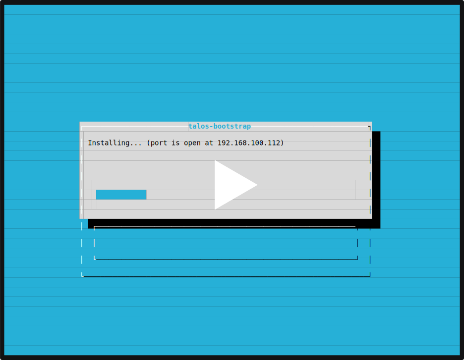

At Ænix, we have a deep affection for Kubernetes and dream that all modern technologies will soon
start utilizing its remarkable patterns.

Have you ever thought about building your own cloud? I bet you have. But is it possible to do this
using only modern technologies and approaches, without leaving the cozy Kubernetes ecosystem?
Our experience in developing Cozystack required us to delve deeply into it.

You might argue that Kubernetes is not intended for this purpose and why not simply use OpenStack
for bare metal servers and run Kubernetes inside it as intended. But by doing so, you would simply
  shift the responsibility from your hands to the hands of OpenStack administrators.
  This would add at least one more huge and complex system to your ecosystem.

Why complicate things? - after all, Kubernetes already has everything needed to run tenant
Kubernetes clusters at this point.

I want to share with you our experience in developing a cloud platform based on Kubernetes,
highlighting the open-source projects that we use ourselves and believe deserve your attention.

In this series of articles, I will tell you our story about how we prepare managed Kubernetes
from bare metal using only open-source technologies. Starting from the basic level of data
center preparation, running virtual machines, isolating networks, setting up fault-tolerant
storage to provisioning full-featured Kubernetes clusters with dynamic volume provisioning,
load balancers, and autoscaling.

With this article, I start a series consisting of several parts:

- **Part 1**: Preparing the groundwork for your cloud. Challenges faced during the preparation
and operation of Kubernetes on bare metal and a ready-made recipe for provisioning infrastructure.
- **Part 2**: Networking, storage, and virtualization. How to turn Kubernetes into a tool for
launching virtual machines and what is needed for this.
- **Part 3**: Cluster API and how to start provisioning Kubernetes clusters at the push of a
button. How autoscaling works, dynamic provisioning of volumes, and load balancers.

I will try to describe various technologies as independently as possible, but at the same time,
I will share our experience and why we came to one solution or another.

To begin with, let's understand the main advantage of Kubernetes and how it has changed the
approach to using cloud resources.

It is important to understand that the use of Kubernetes in the cloud and on bare metal differs.

## Kubernetes in the cloud

When you operate Kubernetes in the cloud, you don't worry about persistent volumes,
cloud load balancers, or the process of provisioning nodes. All of this is handled by your cloud
provider, who accepts your requests in the form of Kubernetes objects. In other words, the server
side is completely hidden from you, and you don't really want to know how exactly the cloud
provider implements as it's not in your area of responsibility.



Kubernetes offers convenient abstractions that work the same everywhere, allowing you to deploy
your application on any Kubernetes in any cloud.

In the cloud, you very commonly have several separate entities: the Kubernetes control plane,
virtual machines, persistent volumes, and load balancers as distinct entities. Using these entities, you can create highly dynamic environments.

Thanks to Kubernetes, virtual machines are now only seen as a utility entity for utilizing
cloud resources. You no longer store data inside virtual machines. You can delete all your virtual
machines at any moment and recreate them without breaking your application. The Kubernetes control
plane will continue to hold information about what should run in your cluster. The load balancer
will keep sending traffic to your workload, simply changing the endpoint to send traffic to a new
node. And your data will be safely stored in external persistent volumes provided by cloud.

This approach is fundamental when using Kubernetes in clouds. The reason for it is quite obvious:
the simpler the system, the more stable it is, and for this simplicity you go buying Kubernetes
in the cloud.

## Kubernetes on bare metal

Using Kubernetes in the clouds is really simple and convenient, which cannot be said about bare
metal installations. In the bare metal world, Kubernetes, on the contrary, becomes unbearably
complex. Firstly, because the entire network, backend storage, cloud balancers, etc. are usually
run not outside, but inside your cluster. As result such a system is much more difficult to
update and maintain.




Judge for yourself: in the cloud, to update a node, you typically delete the virtual machine
(or even use `kubectl delete node`) and you let your node management tooling create a new
one, based on an immutable image. The new node will join the cluster and ”just work” as a  node;
following a very simple and commonly used pattern in the Kubernetes world. 
Many clusters order new virtual machines every few minutes, simply because they can use
cheaper spot instances. However, when you have a physical server, you can't just delete and
recreate it, firstly because it often runs some cluster services, stores data, and its update process
is significantly more complicated.

There are different approaches to solving this problem, ranging from in-place updates, as done by
kubeadm, kubespray, and k3s, to full automation of provisioning physical nodes through Cluster API
and Metal3.

I like the hybrid approach offered by Talos Linux, where your entire system is described in a
single configuration file. Most parameters of this file can be applied without rebooting or
recreating the node, including the version of Kubernetes control-plane components. However, it
still keeps the maximum declarative nature of Kubernetes.
This approach minimizes unnecessary impact on cluster services when updating bare metal nodes.
In most cases, you won't need to migrate your virtual machines and rebuild the cluster filesystem
on minor updates.

## Preparing a base for your future cloud

So, suppose you've decided to build your own cloud. To start somewhere, you need a base layer.
You need to think not only about how you will install Kubernetes on your servers but also about how
you will update and maintain it. Consider the fact that you will have to think about things like
updating the kernel, installing necessary modules, as well packages and security patches.
Now you have to think much more that you don't have to worry about when using a ready-made
Kubernetes in the cloud.

Of course you can use standard distributions like Ubuntu or Debian, or you can consider specialized
ones like Flatcar Container Linux, Fedora Core, and Talos Linux. Each has its advantages and
disadvantages.

What about us? At Ænix, we use quite a few specific kernel modules like ZFS, DRBD, and OpenvSwitch,
so we decided to go the route of forming a system image with all the necessary modules in advance.
In this case, Talos Linux turned out to be the most convenient for us.
For example, such a config is enough to build a system image with all the necessary kernel modules:

```yaml
arch: amd64
platform: metal
secureboot: false
version: v1.6.4
input:
  kernel:
    path: /usr/install/amd64/vmlinuz
  initramfs:
    path: /usr/install/amd64/initramfs.xz
  baseInstaller:
    imageRef: ghcr.io/siderolabs/installer:v1.6.4
  systemExtensions:
    - imageRef: ghcr.io/siderolabs/amd-ucode:20240115
    - imageRef: ghcr.io/siderolabs/amdgpu-firmware:20240115
    - imageRef: ghcr.io/siderolabs/bnx2-bnx2x:20240115
    - imageRef: ghcr.io/siderolabs/i915-ucode:20240115
    - imageRef: ghcr.io/siderolabs/intel-ice-firmware:20240115
    - imageRef: ghcr.io/siderolabs/intel-ucode:20231114
    - imageRef: ghcr.io/siderolabs/qlogic-firmware:20240115
    - imageRef: ghcr.io/siderolabs/drbd:9.2.6-v1.6.4
    - imageRef: ghcr.io/siderolabs/zfs:2.1.14-v1.6.4
output:
  kind: installer
  outFormat: raw
```

Then we use the `docker` command line tool to build an OS image:

```
cat config.yaml | docker run --rm -i -v /dev:/dev --privileged "ghcr.io/siderolabs/imager:v1.6.4" - 
```

And as a result, we get a Docker container image with everything we need, which we can use to
install Talos Linux on our servers. You can do the same; this image will contain all the necessary
firmware and kernel modules.

But the question arises, how do you deliver the freshly formed image to your nodes?

I have been contemplating the idea of PXE booting for quite some time. For example, the
**Kubefarm** project that I wrote an
[article](/blog/2021/12/22/kubernetes-in-kubernetes-and-pxe-bootable-server-farm/) about
two years ago was entirely built using this approach. But unfortunately, it does help you to
deploy your very first parent cluster that will hold the others. So now you have prepared a
solution that will help you do this the same using PXE approach.

Essentially, all you need to do is [run temporary](https://cozystack.io/docs/get-started/)
**DHCP** and **PXE** servers inside containers. Then your nodes will boot from your
image, and you can use a simple Debian-flavored script to help you bootstrap your nodes.

[](https://asciinema.org/a/627123)

The [source](https://github.com/aenix-io/talos-bootstrap/) for that `talos-bootstrap` script is
available on GitHub.

This script allows you to deploy Kubernetes on bare metal in five minutes and obtain a kubeconfig
for accessing it. However, many unresolved issues still lie ahead.

## Delivering system components

At this stage, you already have a Kubernetes cluster capable of running various workloads. However,
it is not fully functional yet. In other words, you need to set up networking and storage, as well
as install necessary cluster extensions, like KubeVirt to run virtual machines, as well the
monitoring stack and other system-wide components.

Traditionally, this is solved by installing **Helm charts** into your cluster. You can do this by
running `helm install` commands locally, but this approach becomes inconvenient when you want to
track updates, and if you have multiple clusters and you want to keep them uniform. In fact, there
are plenty of ways to do this declaratively. To solve this, I recommend using best GitOps practices.
I mean tools like ArgoCD and FluxCD.

While ArgoCD is more convenient for dev purposes with its graphical interface and a central control
plane, FluxCD, on the other hand, is better suited for creating Kubernetes distributions. With FluxCD,
you can specify which charts with what parameters should be launched and describe dependencies. Then,
FluxCD will take care of everything for you.

It is suggested to perform a one-time installation of FluxCD in your newly created cluster and
provide it with the configuration. This will install everything necessary, bringing the cluster
to the expected state.

By carrying out a single installation of FluxCD in your newly minted cluster and configuring it
accordingly, you enable it to automatically deploy all the essentials. This will allow your cluster
to upgrade itself into the desired state. For example, after installing our platform you'll see the
next pre-configured Helm charts with system components:

```
NAMESPACE                        NAME                        AGE    READY   STATUS
cozy-cert-manager                cert-manager                4m1s   True    Release reconciliation succeeded
cozy-cert-manager                cert-manager-issuers        4m1s   True    Release reconciliation succeeded
cozy-cilium                      cilium                      4m1s   True    Release reconciliation succeeded
cozy-cluster-api                 capi-operator               4m1s   True    Release reconciliation succeeded
cozy-cluster-api                 capi-providers              4m1s   True    Release reconciliation succeeded
cozy-dashboard                   dashboard                   4m1s   True    Release reconciliation succeeded
cozy-fluxcd                      cozy-fluxcd                 4m1s   True    Release reconciliation succeeded
cozy-grafana-operator            grafana-operator            4m1s   True    Release reconciliation succeeded
cozy-kamaji                      kamaji                      4m1s   True    Release reconciliation succeeded
cozy-kubeovn                     kubeovn                     4m1s   True    Release reconciliation succeeded
cozy-kubevirt-cdi                kubevirt-cdi                4m1s   True    Release reconciliation succeeded
cozy-kubevirt-cdi                kubevirt-cdi-operator       4m1s   True    Release reconciliation succeeded
cozy-kubevirt                    kubevirt                    4m1s   True    Release reconciliation succeeded
cozy-kubevirt                    kubevirt-operator           4m1s   True    Release reconciliation succeeded
cozy-linstor                     linstor                     4m1s   True    Release reconciliation succeeded
cozy-linstor                     piraeus-operator            4m1s   True    Release reconciliation succeeded
cozy-mariadb-operator            mariadb-operator            4m1s   True    Release reconciliation succeeded
cozy-metallb                     metallb                     4m1s   True    Release reconciliation succeeded
cozy-monitoring                  monitoring                  4m1s   True    Release reconciliation succeeded
cozy-postgres-operator           postgres-operator           4m1s   True    Release reconciliation succeeded
cozy-rabbitmq-operator           rabbitmq-operator           4m1s   True    Release reconciliation succeeded
cozy-redis-operator              redis-operator              4m1s   True    Release reconciliation succeeded
cozy-telepresence                telepresence                4m1s   True    Release reconciliation succeeded
cozy-victoria-metrics-operator   victoria-metrics-operator   4m1s   True    Release reconciliation succeeded
```

## Conclusion

As a result, you achieve a highly repeatable environment that you can provide to anyone, knowing
that it operates exactly as intended.
This is actually what the [Cozystack](https://github.com/aenix-io/cozystack) project does, which
you can try out for yourself absolutely free.

In the following articles, I will discuss
[how to prepare Kubernetes for running virtual machines](/blog/2024/04/05/diy-create-your-own-cloud-with-kubernetes-part-2/)
and [how to run Kubernetes clusters with the click of a button](/blog/2024/04/05/diy-create-your-own-cloud-with-kubernetes-part-3/).
Stay tuned, it'll be fun!
