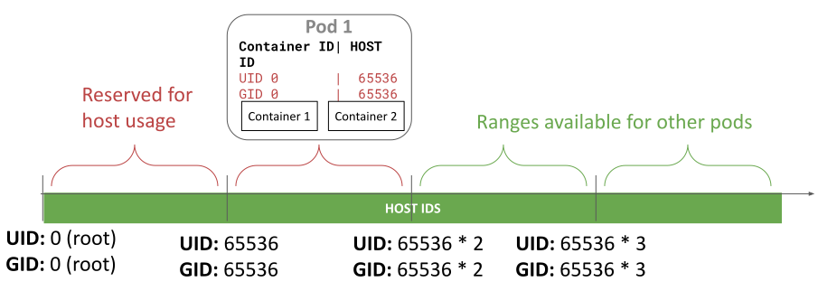

**Authors:** Rodrigo Campos Catelin (Microsoft), Giuseppe Scrivano (Red Hat), Sascha Grunert (Red Hat)

Linux provides different namespaces to isolate processes from each other. For
example, a typical Kubernetes pod runs within a network namespace to isolate the
network identity, a PID namespace to isolate the processes.

One Linux namespace that was left behind is the [user
namespace](https://man7.org/linux/man-pages/man7/user_namespaces.7.html). This
namespace allows us to isolate the user and group identifiers (UIDs and GIDs) we
use inside the container from the ones on the host.

This is a powerful abstraction that allows us to run containers as "root": we
are root inside the container and we can do everything root can inside the pod,
but our interactions with the host are limited to what a non-privileged user can
do. This is great to limit the impact of a container breakout.

A container breakout is when a process inside a container is able to break out
onto the host using some unpatched vulnerability in the container runtime or the
kernel and able to access / modify files on the host or other containers. If we
run our pods with user namespaces, the privileges the container has over the
rest of the host are reduced and the files outside the container it can access
are limited too.

In Kubernetes v1.25 we introduced support for user namespaces for only stateless
pods. Kubernetes 1.28 lifted that restriction and now, with Kubernetes 1.30, we
are moving to beta!

## What is a user namespace?

Note: Linux user namespaces are a different concept from [kubernetes
namespaces](https://kubernetes.io/docs/concepts/overview/working-with-objects/namespaces/).
The former is a Linux kernel feature, the latter is a kubernetes feature.

User namespaces is a Linux feature that isolates the UIDs and GIDs of the
containers from the ones on the host. The identifiers in the container can be
mapped to identifiers on the host in a way where the host UID/GIDs used for
different containers never overlap. Furthermore, the identifiers can be mapped
to unprivileged non-overlapping UIDs and GIDs on the host. This brings two key
benefits:

 * _Prevention of lateral movement_: As the UIDs and GIDs for different
containers are mapped to different UIDs and GIDs on the host, containers have a
harder time attacking each other even if they escape the container boundaries.
For example, if container A is running with different UIDs and GIDs on the host
than container B, the operations it can do on container B's files and processes
are limited: only read/write what a file allows to others, as it will never
have permission owner or group permission (the UIDs/GIDs on the host are
guaranteed to be different for different containers).

 * _Increased host isolation_: As the UIDs and GIDs are mapped to unprivileged
users on the host, if a container escapes the container boundaries, even if it
is running as root inside the container, it has no privileges on the host. This
greatly protects what host files it can read/write, which process it can send
signals to, etc. Furthermore, capabilities granted are only valid inside the
user namespace and not on the host, which also limits the impact a container
escape can have.

Without using a user namespace, a container running as root in the case of a
container breakout, has root privileges on the node. And if some capabilities
were granted to the container, the capabilities are valid on the host too. None
of this is true when using user namespaces (modulo bugs, of course 🙂).

## Changes in 1.30

In Kubernetes 1.30, besides moving user namespaces to beta, the contributors
working on this feature:

 * Introduced a way for the kubelet to use custom ranges for the UIDs/GIDs mapping 
 * Enforce the runtime supports all the features needed for user namespaces,
   otherwise the pod is not created and fails with a clear error. Before 1.30,
   if the container runtime doesn't support user namespaces, the pod could be
   created without a user namespace.
 * Added more tests, including [tests in the
   cri-tools](https://github.com/kubernetes-sigs/cri-tools/pull/1354)
   repository.

You can check the
[documentation](/docs/concepts/workloads/pods/user-namespaces/#set-up-a-node-to-support-user-namespaces)
on user namespaces for how to configure custom ranges to use for the mapping.

## Demo

A few months ago, [CVE-2024-21626][runc-cve] was disclosed. This **vulnerability
score is 8.6 (HIGH)** and allows an attacker to escape a container and
**read/write to any path on the node and other pods hosted on the same node**.

Rodrigo created a demo which exploits [CVE 2024-21626][runc-cve] and shows how
the exploit that works without user namespaces, **is mitigated when user
namespaces are in use.**



Please note that with user namespaces an attacker can do on the host file-system
what the permission bits for "others" allows. Therefore, the CVE is not
completely prevented, but the impact is greatly reduced.

[runc-cve]: https://github.com/opencontainers/runc/security/advisories/GHSA-xr7r-f8xq-vfvv

## Node system requirements

There are requirements on the Linux kernel version as well as the container
runtime to use this feature.

On Linux you need Linux 6.3 or greater. This is because the feature relies on a
kernel feature named idmap mounts, and support to use idmap mounts with tmpfs
was merged in Linux 6.3.

If you are using [CRI-O][crio] with crun, as always you can expect support for
Kubernetes 1.30 with CRI-O 1.30. Please note you also need [crun][crun] 1.9 or
greater. If you are using CRI-O with [runc][runc], this is still not supported.

Containerd support is currently targeted for [containerd][containerd] 2.0 and
the same crun version requirements apply. If you are using containerd with runc,
this is still not supported.

Please note that containerd 1.7 added _experimental_ support for user
namespaces as implemented in Kubernetes 1.25 and 1.26. We did a redesign in
Kubernetes 1.27, which requires changes in the container runtime. Those changes
are not present in containerd 1.7, so it only works in terms of user namespaces
support, with Kubernetes 1.25 and 1.26.

Another limitation present in containerd 1.7 is that it needs to change the
ownership of every file and directory inside the container image during Pod
startup. This means it has a storage overhead and can significantly impact the
container startup latency. Containerd 2.0 will probably include an implementation
that will eliminate the startup latency added and the storage overhead. Take
this into account if you plan to use containerd 1.7 with user namespaces in
production.

None of these containerd 1.7 limitations apply to CRI-O.

[crio]: https://cri-o.io/
[crun]: https://github.com/containers/crun
[runc]: https://github.com/opencontainers/runc/
[containerd]: https://containerd.io/

## How do I get involved?

You can reach SIG Node by several means:
- Slack: [#sig-node](https://kubernetes.slack.com/messages/sig-node)
- [Mailing list](https://groups.google.com/forum/#!forum/kubernetes-sig-node)
- [Open Community Issues/PRs](https://github.com/kubernetes/community/labels/sig%2Fnode)

You can also contact us directly:
- GitHub: @rata @giuseppe @saschagrunert
- Slack: @rata @giuseppe @sascha
