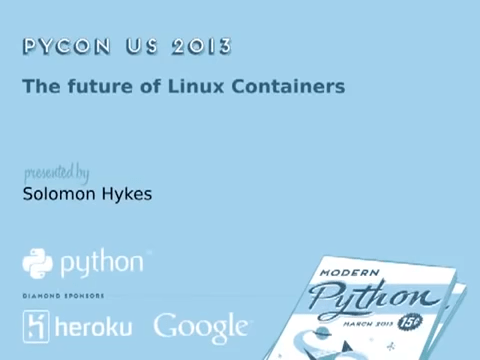

Ten (10) years ago, on June 6th, 2014, the
[first commit](https://github.com/kubernetes/kubernetes/commit/2c4b3a562ce34cddc3f8218a2c4d11c7310e6d56)
of Kubernetes was pushed to GitHub. That first commit with 250 files and 47,501 lines of go, bash
and markdown kicked off the project we have today. Who could have predicted that 10 years later,
Kubernetes would grow to become one of the largest Open Source projects to date with over
[88,000 contributors](https://k8s.devstats.cncf.io/d/24/overall-project-statistics?orgId=1) from
more than [8,000 companies](https://www.cncf.io/reports/kubernetes-project-journey-report/), across
44 countries.

This milestone isn't just for Kubernetes but for the Cloud Native ecosystem that blossomed from
it. There are close to [200 projects](https://all.devstats.cncf.io/d/18/overall-project-statistics-table?orgId=1)
within the CNCF itself, with contributions from
[240,000+ individual contributors](https://all.devstats.cncf.io/d/18/overall-project-statistics-table?orgId=1) and
thousands more in the greater ecosystem. Kubernetes would not be where it is today without them, the
[7M+ Developers](https://www.cncf.io/blog/2022/05/18/slashdata-cloud-native-continues-to-grow-with-more-than-7-million-developers-worldwide/),
and the even larger user community that have all helped shape the ecosystem that it is today.

## Kubernetes' beginnings - a converging of technologies

The ideas underlying Kubernetes started well before the first commit, or even the first prototype
([which came about in 2013](/blog/2018/07/20/the-history-of-kubernetes-the-community-behind-it/)).
In the early 2000s, Moore's Law was well in effect. Computing hardware was becoming more and more
powerful at an incredibly fast rate. Correspondingly, applications were growing more and more
complex. This combination of hardware commoditization and application complexity pointed to a need
to further abstract software from hardware, and solutions started to emerge.

Like many companies at the time, Google was scaling rapidly, and its engineers were interested in
the idea of creating a form of isolation in the Linux kernel. Google engineer Rohit Seth described
the concept in an [email in 2006](https://lwn.net/Articles/199643/):

> We use the term container to indicate a structure against which we track and charge utilization of
system resources like memory, tasks, etc. for a Workload.

In March of 2013, a 5-minute lightning talk called
["The future of Linux Containers," presented by Solomon Hykes at PyCon](https://youtu.be/wW9CAH9nSLs?si=VtK_VFQHymOT7BIB),
introduced an upcoming open source tool called "Docker" for creating and using Linux
Containers. Docker introduced a level of usability to Linux Containers that made them accessible to
more users than ever before, and the popularity of Docker, and thus of Linux Containers,
skyrocketed. With Docker making the abstraction of Linux Containers accessible to all, running
applications in much more portable and repeatable ways was suddenly possible, but the question of
scale remained.

Google's Borg system for managing application orchestration at scale had adopted Linux containers as
they were developed in the mid-2000s. Since then, the company had also started working on a new
version of the system called "Omega." Engineers at Google who were familiar with the Borg and Omega
systems saw the popularity of containerization driven by Docker. They recognized not only the need
for an open source container orchestration system but its "inevitability," as described by Brendan
Burns in
[this blog post](/blog/2018/07/20/the-history-of-kubernetes-the-community-behind-it/).
That realization in the fall of 2013 inspired a small team to start working on a project that would
later become **Kubernetes**. That team included Joe Beda, Brendan Burns, Craig McLuckie, Ville
Aikas, Tim Hockin, Dawn Chen, Brian Grant, and Daniel Smith.

## A decade of Kubernetes

Kubernetes' history begins with that historic commit on June 6th, 2014, and the subsequent
announcement of the project in a June 10th
[keynote by Google engineer Eric Brewer at DockerCon 2014](https://youtu.be/YrxnVKZeqK8?si=Q_wYBFn7dsS9H3k3)
(and its corresponding [Google blog](https://cloudplatform.googleblog.com/2014/06/an-update-on-container-support-on-google-cloud-platform.html)).

Over the next year, a small community of
[contributors, largely from Google and Red Hat](https://k8s.devstats.cncf.io/d/9/companies-table?orgId=1&var-period_name=Before%20joining%20CNCF&var-metric=contributors),
worked hard on the project, culminating in a [version 1.0 release on July 21st, 2015](https://cloudplatform.googleblog.com/2015/07/Kubernetes-V1-Released.html).
Alongside 1.0, Google announced that Kubernetes would be donated to a newly formed branch of the
Linux Foundation called the
[Cloud Native Computing Foundation (CNCF)](https://www.cncf.io/announcements/2015/06/21/new-cloud-native-computing-foundation-to-drive-alignment-among-container-technologies/).

Despite reaching 1.0, the Kubernetes project was still very challenging to use and
understand. Kubernetes contributor Kelsey Hightower took special note of the project's shortcomings
in ease of use and on July 7, 2016, he pushed the
[first commit of his famed "Kubernetes the Hard Way" guide](https://github.com/kelseyhightower/kubernetes-the-hard-way/commit/9d7ace8b186f6ebd2e93e08265f3530ec2fba81c).

The project has changed enormously since its original 1.0 release; experiencing a number of big wins
such as
[Custom Resource Definitions (CRD) going GA in 1.16](/blog/2019/09/18/kubernetes-1-16-release-announcement/)
or [full dual stack support launching in 1.23](/blog/2021/12/08/dual-stack-networking-ga/) and
community "lessons learned" from the [removal of widely used beta APIs in 1.22](/blog/2021/07/14/upcoming-changes-in-kubernetes-1-22/)
or the deprecation of [Dockershim](/blog/2020/12/02/dockershim-faq/).

Some notable updates, milestones and events since 1.0 include:

* December 2016 - [Kubernetes 1.5](/blog/2016/12/kubernetes-1-5-supporting-production-workloads/) introduces runtime pluggability with initial CRI support and alpha Windows node support. OpenAPI also appears for the first time, paving the way for clients to be able to discover extension APIs.
  * This release also introduced StatefulSets and PodDisruptionBudgets in Beta.
* April 2017 — [Introduction of Role-Based Access Controls or RBAC](/blog/2017/04/rbac-support-in-kubernetes/).
* June 2017 — In [Kubernetes 1.7](/blog/2017/06/kubernetes-1-7-security-hardening-stateful-application-extensibility-updates/), ThirdPartyResources or "TPRs" are replaced with CustomResourceDefinitions (CRDs).
* December 2017 — [Kubernetes 1.9](/blog/2017/12/kubernetes-19-workloads-expanded-ecosystem/) sees the Workloads API becoming GA (Generally Available). The release blog states: _"Deployment and ReplicaSet, two of the most commonly used objects in Kubernetes, are now stabilized after more than a year of real-world use and feedback."_
* December 2018 — In 1.13, the Container Storage Interface (CSI) reaches GA, kubeadm tool for bootstrapping minimum viable clusters reaches GA, and CoreDNS becomes the default DNS server.
* September 2019 — [Custom Resource Definitions go GA](/blog/2019/09/18/kubernetes-1-16-release-announcement/) in Kubernetes 1.16.
* August 2020 — [Kubernetes 1.19](/blog/2020/08/31/kubernetes-1-19-feature-one-year-support/) increases the support window for releases to 1 year.
* December 2020 — [Dockershim is deprecated](/blog/2020/12/18/kubernetes-1.20-pod-impersonation-short-lived-volumes-in-csi/)  in 1.20
* April 2021 — the [Kubernetes release cadence changes](/blog/2021/07/20/new-kubernetes-release-cadence/#:~:text=On%20April%2023%2C%202021%2C%20the,Kubernetes%20community's%20contributors%20and%20maintainers.) from 4 releases per year to 3 releases per year.
* July 2021 — Widely used beta APIs are [removed](/blog/2021/07/14/upcoming-changes-in-kubernetes-1-22/)  in Kubernetes 1.22.
* May 2022 — Kubernetes 1.24 sees  [beta APIs become disabled by default](/blog/2022/05/03/kubernetes-1-24-release-announcement/) to reduce upgrade conflicts and removal of [Dockershim](/dockershim), leading to [widespread user confusion](https://www.youtube.com/watch?v=a03Hh1kd6KE) (we've since [improved our communication!](https://github.com/kubernetes/community/tree/master/communication/contributor-comms))
* December 2022 — In 1.26, there was a significant batch and  [Job API overhaul](/blog/2022/12/29/scalable-job-tracking-ga/) that paved the way for better support for AI  /ML / batch workloads.

**PS:** Curious to see how far the project has come for yourself? Check out this [tutorial for spinning up a Kubernetes 1.0 cluster](https://github.com/spurin/kubernetes-v1.0-lab) created by community members Carlos Santana, Amim Moises Salum Knabben, and James Spurin.

---

Kubernetes offers more extension points than we can count. Originally designed to work with Docker
and only Docker, now you can plug in any container runtime that adheres to the CRI standard. There
are other similar interfaces: CSI for storage and CNI for networking. And that's far from all you
can do. In the last decade, whole new patterns have emerged, such as using

[Custom Resource Definitions](/docs/concepts/extend-kubernetes/api-extension/custom-resources/)
(CRDs) to support third-party controllers - now a huge part of the Kubernetes ecosystem.

The community building the project has also expanded immensely over the last decade. Using
[DevStats](https://k8s.devstats.cncf.io/d/24/overall-project-statistics?orgId=1), we can see the
incredible volume of contribution over the last decade that has made Kubernetes the
[second-largest open source project in the world](https://www.cncf.io/reports/kubernetes-project-journey-report/):

* **88,474** contributors
* **15,121** code committers
* **4,228,347** contributions
* **158,530** issues
* **311,787** pull requests

## Kubernetes today

Since its early days, the project has seen enormous growth in technical capability, usage, and
contribution. The project is still actively working to improve and better serve its users.

In the upcoming 1.31 release, the project will celebrate the culmination of an important long-term
project: the removal of in-tree cloud provider code. In this
[largest migration in Kubernetes history](/blog/2024/05/20/completing-cloud-provider-migration/),
roughly 1.5 million lines of code have been removed, reducing the binary sizes of core components
by approximately 40%. In the project's early days, it was clear that extensibility would be key to
success. However, it wasn't always clear how that extensibility should be achieved. This migration
removes a variety of vendor-specific capabilities from the core Kubernetes code
base. Vendor-specific capabilities can now be better served by other pluggable extensibility
features or patterns, such as
[Custom Resource Definitions (CRDs)](https://kubernetes.io/docs/concepts/extend-kubernetes/api-extension/custom-resources/)
or API standards like the [Gateway API](https://gateway-api.sigs.k8s.io/).
Kubernetes also faces new challenges in serving its vast user base, and the community is adapting
accordingly. One example of this is the migration of image hosting to the new, community-owned
registry.k8s.io. The egress bandwidth and costs of providing pre-compiled binary images for user
consumption have become immense. This new registry change enables the community to continue
providing these convenient images in more cost- and performance-efficient ways. Make sure you check
out the [blog post](/blog/2022/11/28/registry-k8s-io-faster-cheaper-ga/) and
update any automation you have to use registry.k8s.io!

## The future of Kubernetes

A decade in, the future of Kubernetes still looks bright. The community is prioritizing changes that
both improve the user experiences, and enhance the sustainability of the project. The world of
application development continues to evolve, and Kubernetes is poised to change along with it.

In 2024, the advent of AI changed a once-niche workload type into one of prominent
importance. Distributed computing and workload scheduling has always gone hand-in-hand with the
resource-intensive needs of Artificial Intelligence, Machine Learning, and High Performance
Computing workloads. Contributors are paying close attention to the needs of newly developed
workloads and how Kubernetes can best serve them. The new
[Serving Working Group](https://github.com/kubernetes/community/tree/master/wg-serving) is one
example of how the community is organizing to address these workloads' needs. It's likely that the
next few years will see improvements to Kubernetes' ability to manage various types of hardware, and
its ability to manage the scheduling of large batch-style workloads which are run across hardware in
chunks.

The ecosystem around Kubernetes will continue to grow and evolve. In the future, initiatives to
maintain the sustainability of the project, like the migration of in-tree vendor code and the
registry change, will be ever more important.

The next 10 years of Kubernetes will be guided by its users and the ecosystem, but most of all, by
the people who contribute to it. The community remains open to new contributors. You can find more
information about contributing in our New Contributor Course at
[https://k8s.dev/docs/onboarding](https://k8s.dev/docs/onboarding).

We look forward to building the future of Kubernetes with you!


