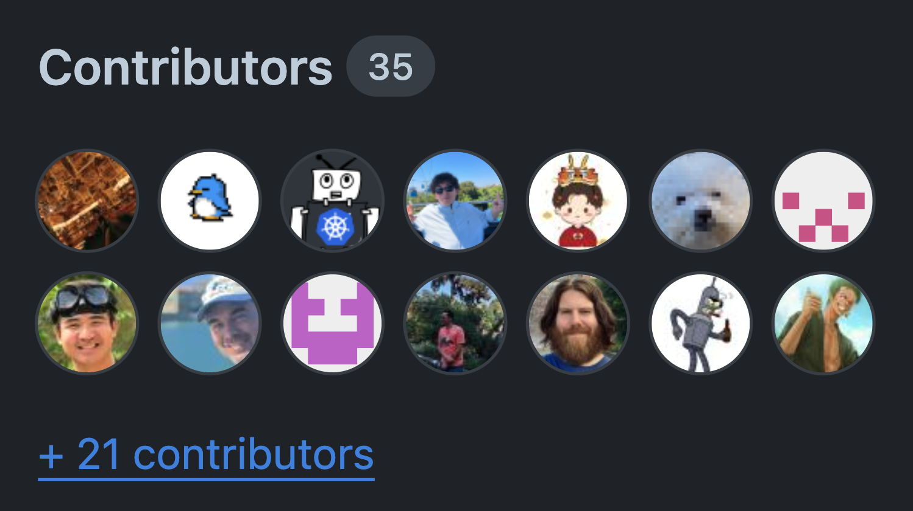

The Kubernetes Scheduler is a crucial control plane component that determines which Node a Pod will run on. 
Thus, anyone utilizing Kubernetes relies on the scheduler.

[Kube-scheduler-simulator](sigs.k8s.io/kube-scheduler-simulator) is a simulator for the Kubernetes scheduler, initially developed by Kensei Nakada as part of [Google Summer of Code 2021](https://summerofcode.withgoogle.com/). 
This tool allows users to examine the scheduler’s behavior and decisions closely, 
making it useful for both casual users who employ scheduling constraints (e.g., PodAffinity) 
and experts who extend the scheduler with custom plugins.

## Motivation

The scheduler often appears as a black box, 
composed of many plugins that each contribute to the scheduling decision-making process from their unique perspectives. 
Understanding its behavior can be challenging due to the multitude of factors it considers. 
Even if a Pod seems to be scheduled as expected in your simple test cluster, 
it’s maybe because of a different reason from what you imagine, 
and could result in unexpected scheduling results in a large production environment.

The scheduler simulator aims to reveal this black box, 
enabling users to test their scheduling constraints, scheduler configurations, 
and custom plugins while checking every detailed part of scheduling decisions.

## What’s Kube-scheduler-simulator? 

The simulator’s core feature is its ability to expose the internal decisions of the scheduler. 
The scheduler operates based on the [Scheduling Framework](/concepts/scheduling-eviction/scheduling-framework/), 
utilizing various plugins at different extension points; 
filter Nodes (Filter phase), score Nodes (Score phase), and ultimately determine the best Node for the Pod.

The simulator allows users to create Kubernetes resources and observe how each plugin influences the scheduling decisions for Pods.
This visibility helps users understand the scheduler’s workings and define appropriate scheduling constraints.



Inside the simulator, instead of the vanilla scheduler, 
it runs the debuggable scheduler, which outputs each scheduler plugin’s result from every extension point to Pod’s annotations. 
Inside the simulator, a debuggable scheduler runs instead of the vanilla scheduler. 
This debuggable scheduler outputs the results of each scheduler plugin at every extension point to the Pod’s annotations. 
Actually, the web frontend just shows the results reading from the annotations.

```yaml
kind: Pod
apiVersion: v1
metadata:
  annotations:
    scheduler-simulator/bind-result: '{"DefaultBinder":"success"}'
    scheduler-simulator/filter-result: >-
      {"node-jjfg5":{"NodeName":"passed","NodeResourcesFit":"passed","NodeUnschedulable":"passed","TaintToleration":"passed"},"node-mtb5x":{"NodeName":"passed","NodeResourcesFit":"passed","NodeUnschedulable":"passed","TaintToleration":"passed"}}
    scheduler-simulator/finalscore-result: >-
      {"node-jjfg5":{"ImageLocality":"0","NodeAffinity":"0","NodeResourcesBalancedAllocation":"52","NodeResourcesFit":"47","TaintToleration":"300","VolumeBinding":"0"},"node-mtb5x":{"ImageLocality":"0","NodeAffinity":"0","NodeResourcesBalancedAllocation":"76","NodeResourcesFit":"73","TaintToleration":"300","VolumeBinding":"0"}}
    scheduler-simulator/permit-result: '{}'
    scheduler-simulator/permit-result-timeout: '{}'
    scheduler-simulator/postfilter-result: '{}'
    scheduler-simulator/prebind-result: '{"VolumeBinding":"success"}'
    scheduler-simulator/prefilter-result: '{}'
    scheduler-simulator/prefilter-result-status: >-
      {"AzureDiskLimits":"","EBSLimits":"","GCEPDLimits":"","InterPodAffinity":"","NodeAffinity":"","NodePorts":"","NodeResourcesFit":"success","NodeVolumeLimits":"","PodTopologySpread":"","VolumeBinding":"","VolumeRestrictions":"","VolumeZone":""}
    scheduler-simulator/prescore-result: >-
      {"InterPodAffinity":"","NodeAffinity":"success","NodeResourcesBalancedAllocation":"success","NodeResourcesFit":"success","PodTopologySpread":"","TaintToleration":"success"}
    scheduler-simulator/reserve-result: '{"VolumeBinding":"success"}'
    scheduler-simulator/result-history: >-
      [{"scheduler-simulator/bind-result":"{\"DefaultBinder\":\"success\"}","scheduler-simulator/filter-result":"{\"node-jjfg5\":{\"NodeName\":\"passed\",\"NodeResourcesFit\":\"passed\",\"NodeUnschedulable\":\"passed\",\"TaintToleration\":\"passed\"},\"node-mtb5x\":{\"NodeName\":\"passed\",\"NodeResourcesFit\":\"passed\",\"NodeUnschedulable\":\"passed\",\"TaintToleration\":\"passed\"}}","scheduler-simulator/finalscore-result":"{\"node-jjfg5\":{\"ImageLocality\":\"0\",\"NodeAffinity\":\"0\",\"NodeResourcesBalancedAllocation\":\"52\",\"NodeResourcesFit\":\"47\",\"TaintToleration\":\"300\",\"VolumeBinding\":\"0\"},\"node-mtb5x\":{\"ImageLocality\":\"0\",\"NodeAffinity\":\"0\",\"NodeResourcesBalancedAllocation\":\"76\",\"NodeResourcesFit\":\"73\",\"TaintToleration\":\"300\",\"VolumeBinding\":\"0\"}}","scheduler-simulator/permit-result":"{}","scheduler-simulator/permit-result-timeout":"{}","scheduler-simulator/postfilter-result":"{}","scheduler-simulator/prebind-result":"{\"VolumeBinding\":\"success\"}","scheduler-simulator/prefilter-result":"{}","scheduler-simulator/prefilter-result-status":"{\"AzureDiskLimits\":\"\",\"EBSLimits\":\"\",\"GCEPDLimits\":\"\",\"InterPodAffinity\":\"\",\"NodeAffinity\":\"\",\"NodePorts\":\"\",\"NodeResourcesFit\":\"success\",\"NodeVolumeLimits\":\"\",\"PodTopologySpread\":\"\",\"VolumeBinding\":\"\",\"VolumeRestrictions\":\"\",\"VolumeZone\":\"\"}","scheduler-simulator/prescore-result":"{\"InterPodAffinity\":\"\",\"NodeAffinity\":\"success\",\"NodeResourcesBalancedAllocation\":\"success\",\"NodeResourcesFit\":\"success\",\"PodTopologySpread\":\"\",\"TaintToleration\":\"success\"}","scheduler-simulator/reserve-result":"{\"VolumeBinding\":\"success\"}","scheduler-simulator/score-result":"{\"node-jjfg5\":{\"ImageLocality\":\"0\",\"NodeAffinity\":\"0\",\"NodeResourcesBalancedAllocation\":\"52\",\"NodeResourcesFit\":\"47\",\"TaintToleration\":\"0\",\"VolumeBinding\":\"0\"},\"node-mtb5x\":{\"ImageLocality\":\"0\",\"NodeAffinity\":\"0\",\"NodeResourcesBalancedAllocation\":\"76\",\"NodeResourcesFit\":\"73\",\"TaintToleration\":\"0\",\"VolumeBinding\":\"0\"}}","scheduler-simulator/selected-node":"node-mtb5x"}]
    scheduler-simulator/score-result: >-
      {"node-jjfg5":{"ImageLocality":"0","NodeAffinity":"0","NodeResourcesBalancedAllocation":"52","NodeResourcesFit":"47","TaintToleration":"0","VolumeBinding":"0"},"node-mtb5x":{"ImageLocality":"0","NodeAffinity":"0","NodeResourcesBalancedAllocation":"76","NodeResourcesFit":"73","TaintToleration":"0","VolumeBinding":"0"}}
    scheduler-simulator/selected-node: node-mtb5x
```

Users can also integrate their custom plugins or extenders into the debuggable scheduler and visualize their results. 
Also, this debuggable scheduler can run standalone, e.g., on any Kubernetes cluster or in integration tests. 
Those would be useful to custom plugin developers to test their plugins or examine their custom scheduler in a real cluster with better debuggability.

## What are the use cases?

1. **Cluser users**: Examine if your scheduling constraints (e.g., PodAffinity, PodTopologySpread) work as intended.
2. **Cluster admins**: Assess how your cluster would behave with changes to the scheduler configuration.
3. **Scheduler plugin developers**: Test your custom scheduler plugins or extenders, or use the debuggable scheduler in integration tests or development clusters.

## Getting started

The simulator only requires Docker to be installed on your machine; a Kubernetes cluster is not necessary.

```
git clone git@github.com:kubernetes-sigs/kube-scheduler-simulator.git
cd kube-scheduler-simulator
make docker_up
```

You can then access the simulator's web UI at http://localhost:3000.

Visit [Kube-scheduler-simulator repository](sigs.k8s.io/kube-scheduler-simulator) for more details!

## Getting involved 

The Kube-scheduler-simulator is developed by Kubernetes SIG Scheduling. Your feedback and contributions are welcome!

Open issues or PRs at [Kube-scheduler-simulator repository](sigs.k8s.io/kube-scheduler-simulator)
Join the conversation on the #sig-scheduling slack channel.

## Acknowledgments

The simulator has been maintained by dedicated volunteer engineers, overcoming many challenges to reach its current form. 

A big shout out to all [the awesome contributors](https://github.com/kubernetes-sigs/kube-scheduler-simulator/graphs/contributors)!



