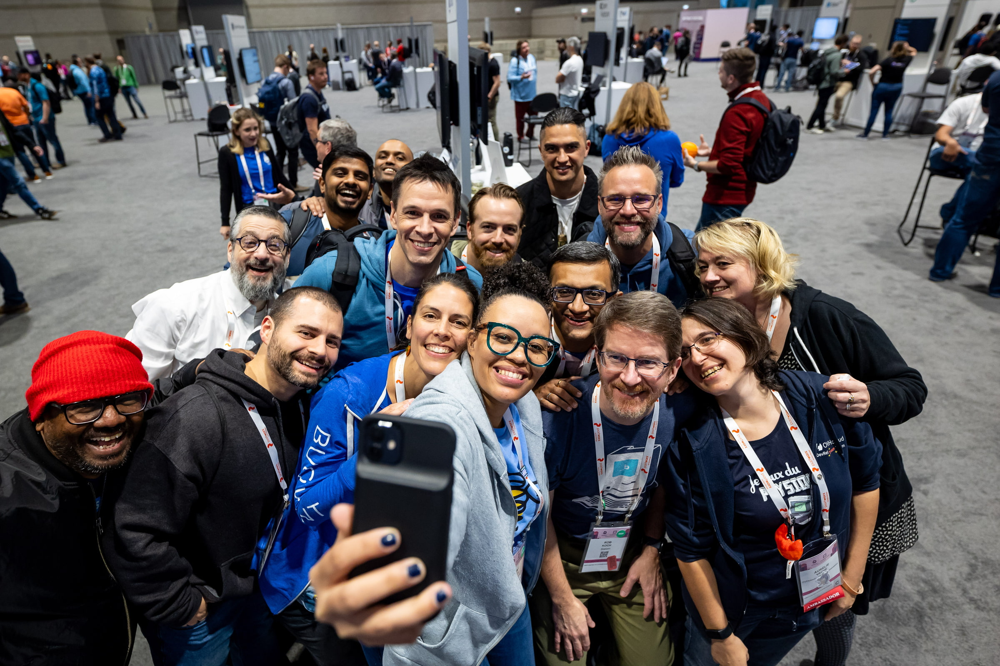
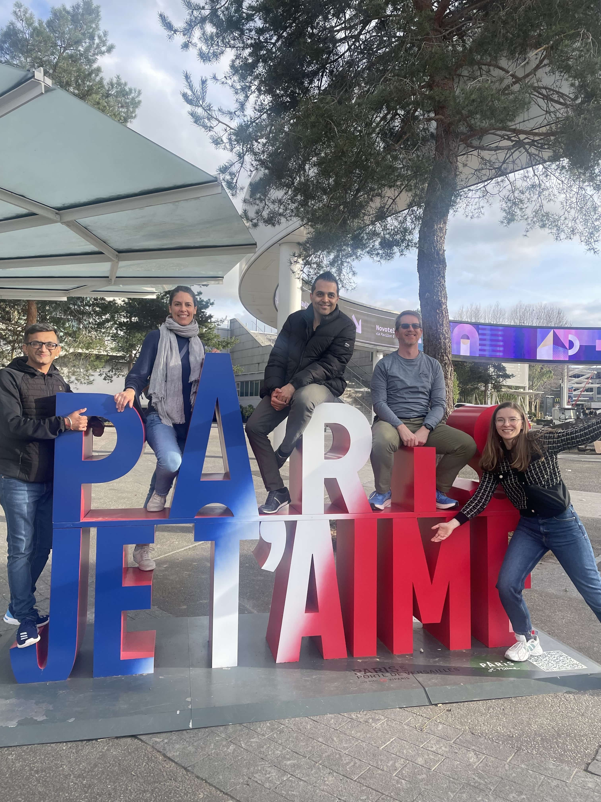

_In recognition of Deaf Awareness Month and the importance of inclusivity in the tech community, we are spotlighting [Catherine Paganini](https://www.linkedin.com/in/catherinepaganini/), facilitator and one of the founding members of [CNCF Deaf and Hard-of-Hearing Working Group](https://contribute.cncf.io/about/deaf-and-hard-of-hearing/) (DHHWG). In this interview, [Sandeep Kanabar](https://www.linkedin.com/in/sandeepkanabar/), a deaf member of the DHHWG and part of the Kubernetes [SIG ContribEx Communications team](https://github.com/kubernetes/community/blob/master/sig-contributor-experience/README.md#contributor-comms), sits down with Catherine to explore the impact of the DHHWG on cloud native projects like Kubernetes._

_Sandeep’s journey is a testament to the power of inclusion. Through his involvement in the DHHWG, he connected with members of the Kubernetes community who encouraged him to join [SIG ContribEx](https://github.com/kubernetes/community/blob/master/sig-contributor-experience/README.md) - the group responsible for sustaining the Kubernetes contributor experience. In an ecosystem where open-source projects are actively seeking contributors and maintainers, this story highlights how important it is to create pathways for underrepresented groups, including those with disabilities, to contribute their unique perspectives and skills._

_In this interview, we delve into Catherine’s journey, the challenges and triumphs of establishing the DHHWG, and the vision for a more inclusive future in cloud native. We invite Kubernetes contributors, maintainers, and community members to reflect on the **significance of empathy, advocacy, and community** in fostering a truly inclusive environment for all, and to think about how they can support efforts to increase diversity and accessibility within their own projects._

## Introduction
**Sandeep Kanabar (SK): Hello Catherine, could you please introduce yourself, share your professional background, and explain your connection to the Kubernetes ecosystem?**

**Catherine Paganini (CP)**: I'm the Head of Marketing at [Buoyant](https://buoyant.io/), the creator of [Linkerd](https://linkerd.io/), the CNCF-graduated service mesh, and 5th CNCF project. Four years ago, I started contributing to open source. The initial motivation was to make cloud native concepts more accessible to newbies and non-technical people. Without a technical background, it was hard for me to understand what Kubernetes, containers, service meshes, etc. mean. All content was targeted at engineers already familiar with foundational concepts. Clearly, I couldn't be the only one struggling with wrapping my head around cloud native. 

My first contribution was the [CNCF Landscape Guide](https://landscape.cncf.io/guide#introduction), which I co-authored with my former colleague Jason Morgan. Next, we started the [CNCF Glossary](https://glossary.cncf.io/), which explains cloud native concepts in simple terms. Today, the glossary has been (partially) localised into 14 languages! 

Currently, I'm the co-chair of the [TAG Contributor Strategy](https://contribute.cncf.io/about/) and the Facilitator of the Deaf and Hard of Hearing Working Group (DHHWG) and Blind and Visually Impaired WG (BVIWG), which is still in formation. I'm also working on a new Linux Foundation (LF) initiative called ABIDE (Accessibility and Belonging through Inclusion, Diversity, and Equity), so stay tuned to learn more about it! 

## Motivation and early milestones
**SK: That's inspiring! Building on your passion for accessibility, what motivated you to facilitate the creation of the DHHWG? Was there a speecifc moment or experience that sparked this initiative?**

**CP**: Last year at KubeCon Amsterdam, I learned about a great initiative by Jay Tihema that creates [pathways for Maori youth into cloud native](https://contribute.cncf.io/resources/videos/2023/from-maori-to-deaf-engineers/) and open source. While telling my CODA (children of deaf adults) high school friend about it, I thought it'd be great to create something similar for deaf folks. A few months later, I posted about it in a LinkedIn post that the CNCF shared. Deaf people started to reach out, wanting to participate. And the rest is history. 

**SK: Speaking of history, since its launch, how has the DHHWG evolved? Could you highlight some of the key milestones or achievements the group has reached recently?**

**CP**: Our WG is about a year old. It started with a few deaf engineers and me brainstorming how to make KubeCon more accessible. We published an initial draft of [Best practices for an inclusive conference](https://contribute.cncf.io/accessibility/deaf-and-hard-of-hearing/conference-best-practices/) and shared it with the LF events team. KubeCon Chicago was two months later, and we had a couple of deaf attendees. It was the **first**  KubeCon accessible to deaf signers. [Destiny](https://www.linkedin.com/in/destiny-o-connor-28b2a5255/), one of our co-chairs, even participated in a [keynote panel](https://youtu.be/3WJ_s4Jvbsk?si=iscthTiCyMxoMUqY&t=347). It was incredible how quickly everything happened!
 

*DHHWG members at KubeCon Chicago*

The team has grown since then, and we've been able to do much more. With a kiosk in the project pavilion, an open space discussion, a sign language crash course, and a few media interviews, KubeCon Paris had a stronger advocacy and outreach focus. [Check out this video of our team in Paris](https://www.youtube.com/watch?v=E8AcyqsgAyQ) to get a glimpse of all the different KubeCon activities — it was such a great event! The team also launched the first CNCF Community Group in sign language, [Deaf in Cloud Native](https://community.cncf.io/deaf-in-cloud-native/), a glossary team that creates sign language videos for each technical term to help standardize technical signs across the globe. It's crazy to think that it all happened within one year! 

## Overcoming challenges and addressing misconceptions
**SK: That's remarkable progress in just a year! Building such momentum must have come with its challenges. What barriers have you encountered in facilitating the DHHWG, and how did you and the group work to overcome them?**

**CP**: The support from the community, LF, and CNCF has been incredible. The fact that we achieved so much is proof of it. The challenges are more in helping some team members overcome their fear of contributing. Most are new to open source, and it can be intimidating to put your work out there for everyone to see. The fear of being criticized in public is real; however, as they will hopefully realize over time, our community is incredibly supportive. Instead of criticizing, people tend to help improve the work, leading to better outcomes.

**SK: Are there any misconceptions about the deaf and hard-of-hearing community in tech that you'd like to address?**

**CP**: Deaf and hard of hearing individuals are very diverse — there is no one-size-fits-all. Some deaf people are oral (speak), others sign, while some lip read or prefer captions. It generally depends on how people grew up. While some people come from deaf families and sign language is their native language, others were born into hearing families who may or may not have learned how to sign. Some deaf people grew up surrounded by hearing people, while others grew up deeply embedded in Deaf culture. Hard-of-hearing individuals, on the other hand, typically can communicate well with hearing peers one-on-one in quiet settings, but loud environments or conversations with multiple people can make it hard to follow the conversation. Most rely heavily on captions. Each background and experience will shape their communication style and preferences. In short, what works for one person, doesn't necessarily work for others. So **never assume** and **always ask** about accessibility needs and preferences.

## Impact and the role of allies
**SK: Can you share some key impacts/outcomes of the conference best practices document?**

**CP**: Here are the two most important ones: Captions should be on the monitor, not in an app. That's especially important during technical talks with live demos. Deaf and hard of hearing attendees will miss important information switching between captions on their phone and code on the screen. 

Interpreters are most valuable during networking, not in talks (with captions). Most people come to conferences for the hallway track. That is no different for deaf attendees. If they can't network, they are missing out on key professional connections, affecting their career prospects. 

**SK: In your view, how crucial is the role of allies within the DHHWG, and what contributions have they made to the group’s success?**

**CP**: Deaf and hard of hearing individuals are a minority and can only do so much. ***Allies are the key to any diversity and inclusion initiative***. As a majority, allies can help spread the word and educate their peers, playing a key role in scaling advocacy efforts. They also have the power to demand change. It's easy for companies to ignore minorities, but if the majority demands that their employers be accessible, environmentally conscious, and good citizens, they will ultimately be pushed to adapt to new societal values. 

## Expanding DEI efforts and future vision
**SK: The importance of allies in driving change is clear. Beyond the DHHWG, are you involved in any other DEI groups or initiatives within the tech community?**

**CP**: As mentioned above, I'm working on an initiative called ABIDE, which is still work in progress. I don't want to share too much about it yet, but what I can say is that the DHHWG will be part of it and that we just started a Blind and Visually Impaired WG (BVIWG). ABIDE will start by focusing on accessibility, so if anyone reading this has an idea for another WG, please reach out to me via the CNCF Slack @Catherine Paganini.

**SK: What does the future hold for the DHHWG? Can you share details about any ongoing or upcoming initiatives?**

**CP**: I think we've been very successful in terms of visibility and awareness so far. We can't stop, though. Awareness work is ongoing, and most people in our community haven't heard about us or met anyone on our team yet, so a lot of work still lies ahead. 

*DHHWG members at KubeCon Paris*

The next step is to refocus on advocacy. The same thing we did with the conference best practices but for other areas. The goal is to help educate the community about what real accessibility looks like, how projects can be more accessible, and why employers should seriously consider deaf candidates while providing them with the tools they need to conduct successful interviews and employee onboarding. We need to capture all that in documents, publish it, and then get the word out. That last part is certainly the most challenging, but it's also where everyone can get involved. 

## Call to action
**SK: Thank you for sharing your insights, Catherine. As we wrap up, do you have any final thoughts or a call to action for our readers?**

**CP**: As we build our [accessibility page](https://contribute.cncf.io/accessibility/deaf-and-hard-of-hearing/), check in regularly to see what's new. Share the docs with your team, employer, and network — anyone, really. The more people understand what accessibility really means and why it matters, the more people will recognize when something isn't accessible, and be able to call out marketing-BS, which, unfortunately, is more often the case than not. We need allies to help push for change. **No minority can do this on their own**. So please learn about accessibility, keep an eye out for it, and call it out when something isn't accessible. We need your help! 

## Wrapping up

Catherine and the DHHWG's work exemplify the power of community and advocacy. As we celebrate Deaf Awareness Month, let's reflect on her role as an ally and consider how we can all contribute to building a more inclusive tech community, particularly within open-source projects like Kubernetes.

*Together, we can break down barriers, challenge misconceptions, and ensure that everyone feels welcome and valued. By advocating for accessibility, supporting initiatives like the DHHWG, and fostering a culture of empathy, we can create a truly inclusive and welcoming space for all.*
