The Kubernetes [scheduler](/docs/concepts/scheduling-eviction/kube-scheduler/) is the core
component that decides which node any new Pods should run on.
Basically, it schedules Pods **one by one**, 
and thus the larger your cluster is, the more crucial the throughput of the scheduler is.

For the Kubernetes project, the throughput of the scheduler has been an eternal challenge
over the years, SIG Scheduling have been putting effort to improve the scheduling throughput by many enhancements.

In this blog post, I'll introduce a recent major improvement in the scheduler: a new
[scheduling context element](/docs/concepts/scheduling-eviction/scheduling-framework/#extension-points)
named _QueueingHint_.
We'll go through the explanation of the basic background knowledge of the scheduler,
and how QueueingHint improves our scheduling throughput.

## Scheduling queue

The scheduler stores all unscheduled Pods in an internal component that we - SIG Scheduling - 
call the _scheduling queue_.

The scheduling queue is composed of three data structures: _ActiveQ_, _BackoffQ_ and _Unschedulable Pod Pool_.
- ActiveQ: It holds newly created Pods or Pods which are ready to be retried for scheduling.
- BackoffQ: It holds Pods which are ready to be retried, but are waiting for a backoff period, which depends on the number of times the scheduled attempted to schedule the Pod.
- Unschedulable Pod Pool: It holds Pods which should not be scheduled for now, because they have a Scheduling Gate or because the scheduler attempted to schedule them and nothing has changed in the cluster that could make the Pod schedulable.

## Scheduling framework and plugins

The Kubernetes scheduler is implemented following the Kubernetes
[scheduling framework](/docs/concepts/scheduling-eviction/scheduling-framework/).

And, each scheduling requirements are implemented as a plugin.
(e.g., [Pod affinity](/docs/concepts/scheduling-eviction/assign-pod-node/#inter-pod-affinity-and-anti-affinity)
is implemented in the `PodAffinity` plugin.)

The first phase, called the _scheduling cycle_, takes Pods from activeQ **one by one**, runs all plugins' logic,
and lastly decides in which Node to run the Pod, or concludes that the Pod cannot go to anywhere for now.

If the scheduling is successful, the second phase, called the _binding cycle_, binds the Pod with
the Node by communicating the decision to the API server.
But, if it turns out that the Pod cannot go to anywhere during the scheduling cycle,
the binding cycle isn't executed; instead the Pod is moved back to the scheduling queue.
Although there are some exceptions, unscheduled Pods enter the _unschedulable pod pool_.

Pods in Unschedulable Pod Pool are moved to ActiveQ/BackoffQ 
only when Scheduling Queue identifies changes in the cluster that might be schedulable if we retry the scheduling.

That is a crucial step because scheduling cycle is performed for Pods one by one -
if we didn't have Unschedulable Pod Pool and kept retrying the scheduling of any Pods, 
multiple scheduling cycles would be wasted for Pods that have no chance to be scheduled.

Then, how do they decide when to move a Pod back into the ActiveQ? How do they notice that Pods might be schedulable now?
Here QueueingHints come into play.

## QueueingHint

QueueingHint is callback function per plugin to notice an object addition/update/deletion in the cluster (we call them cluster events)
that may make Pods schedulable.

Let's say the Pod `pod-a` has a required Pod affinity, and got rejected in scheduling cycle by the `PodAffinity` plugin
because no Node has any Pod matching the Pod affinity specification for `pod-a`.

When an unscheduled Pod is put into the unschedulable pod pool, the scheduling queue
records which plugins caused the scheduling failure of the Pod.
In this example, scheduling queue notes that `pod-a` was rejected by `PodAffinity`.

`pod-a` will never be schedulable until the PodAffinity failure is resolved somehow.
The scheduling queue uses the queueing hints from plugins that rejected the Pod, which is `PodAffinity` in the example.

A QueueingHint subscribes to a particular kind of cluster event and make a decision whether an incoming event could make the Pod schedulable.
Thinking about when PodAffinity failure could be resolved,
one possible scenario is that an existing Pod gets a new label which matches with `pod-a`'s PodAffinity.

The `PodAffinity` plugin's `QueueingHint` callback checks on all Pod updates happening in the cluster, 
and when it catches such update, the scheduling queue moves `pod-a` to either ActiveQ or BackoffQ.

We actually already had a similar functionality (called `preCheck`) inside the scheduling queue,
which filters out cluster events based on Kubernetes core scheduling constraints - 
for example, filtering out node related events when nodes aren't ready.

But, it's not ideal because this hard-coded `preCheck` refers to in-tree plugins logic,
and it causes issues for custom plugins (for example: [#110175](https://github.com/kubernetes/kubernetes/issues/110175)).

## QueueingHint's history and what's new in v1.32

Within SIG Scheduling, we have been working on the development of QueueingHint since
Kubernetes v1.28.

QueueingHint is not something user-facing, but we implemented a feature gate (`SchedulerQueueingHints`) as a safety net,
...which actually saved our life soon.

In v1.28, we implemented QueueingHints with a few in-tree plugins experimentally,
and made the feature gate enabled by default.

But, users reported the memory leak issue, and consequently we disabled the feature gate in the patch release of v1.28.

In v1.28 - v1.31, we kept working on the QueueingHint implementation within the rest of in-tree plugins,
and having bug fixes.

And, at v1.32, we will make this feature enabled by default again;
we finished implementing QueueingHints with all plugins,
and also identified the cause of the memory leak, finally!

## Getting involved

These features are managed by Kubernetes [SIG Scheduling](https://github.com/kubernetes/community/tree/master/sig-scheduling).

Please join us and share your feedback. 

## How can I learn more?

- [KEP-4247: Per-plugin callback functions for efficient requeueing in the scheduling queue](https://github.com/kubernetes/enhancements/blob/master/keps/sig-scheduling/4247-queueinghint/README.md)