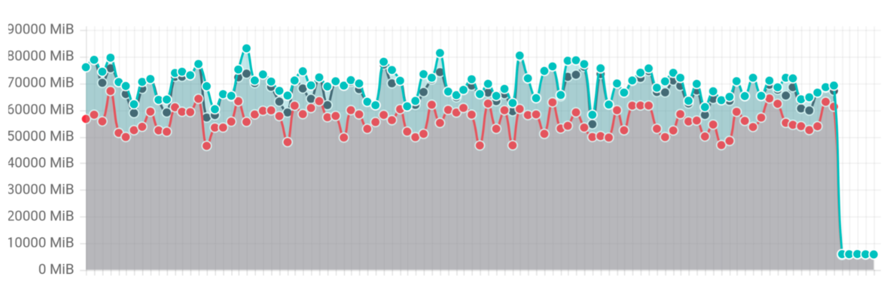

Managing Kubernetes cluster stability becomes increasingly critical as your infrastructure grows. One of the most challenging aspects of operating large-scale clusters has been handling List requests that fetch substantial datasets - a common operation that could unexpectedly impact your cluster's stability.

Today, the Kubernetes community is excited to announce a significant architectural improvement: streaming encoding for List responses.

## The problem: unnecessary memory consumption with large resources

Current API response encoders just serialize an entire response into a single contiguous memory and perform one [ResponseWriter.Write](https://pkg.go.dev/net/http#ResponseWriter.Write) call to transmit data to the client. Despite HTTP/2's capability to split responses into smaller frames for transmission, the underlying HTTP server continues to hold the complete response data as a single buffer. Even as individual frames are transmitted to the client, the memory associated with these frames cannot be freed incrementally.

When cluster size grows, the single response body can be substantial - like hundreds of megabytes in size. At large scale, the current approach becomes particularly inefficient, as it prevents incremental memory release during transmission. Imagining that when network congestion occurs, that large response body’s memory block stays active for tens of seconds or even minutes. This limitation leads to unnecessarily high and prolonged memory consumption in the kube-apiserver process. If multiple large List requests occur simultaneously, the cumulative memory consumption can escalate rapidly, potentially leading to an Out-of-Memory (OOM) situation that compromises cluster stability.

The encoding/json package uses sync.Pool to reuse memory buffers during serialization. While efficient for consistent workloads, this mechanism creates challenges with sporadic large List responses. When processing these large responses, memory pools expand significantly. But due to sync.Pool's design, these oversized buffers remain reserved after use. Subsequent small List requests continue utilizing these large memory allocations, preventing garbage collection and maintaining persistently high memory consumption in the kube-apiserver even after the initial large responses complete.

Additionally, [Protocol Buffers](https://github.com/protocolbuffers/protocolbuffers.github.io/blob/c14731f55296f8c6367faa4f2e55a3d3594544c6/content/programming-guides/techniques.md?plain=1#L39) are not designed to handle large datasets. But it’s great for handling **individual** messages within a large data set. This highlights the need for streaming-based approaches that can process and transmit large collections incrementally rather than as monolithic blocks.

> _As a general rule of thumb, if you are dealing in messages larger than a megabyte each, it may be time to consider an alternate strategy._
>
> _From https://protobuf.dev/programming-guides/techniques/_

## Streaming encoder for List responses

The streaming encoding mechanism is specifically designed for List responses, leveraging their common well-defined collection structures. The core idea focuses exclusively on the **Items** field within collection structures, which represents the bulk of memory consumption in large responses. Rather than encoding the entire **Items** array as one contiguous memory block, the new streaming encoder processes and transmits each item individually, allowing memory to be freed progressively as frame or chunk is transmitted. As a result, encoding items one by one significantly reduces the memory footprint required by the API server.

With Kubernetes objects typically limited to 1.5 MiB (from ETCD), streaming encoding keeps memory consumption predictable and manageable regardless of how many objects are in a List response. The result is significantly improved API server stability, reduced memory spikes, and better overall cluster performance - especially in environments where multiple large List operations might occur simultaneously.

To ensure perfect backward compatibility, the streaming encoder validates Go struct tags rigorously before activation, guaranteeing byte-for-byte consistency with the original encoder. Standard encoding mechanisms process all fields except **Items**, maintaining identical output formatting throughout. This approach seamlessly supports all Kubernetes List types—from built-in **\*List** objects to Custom Resource **UnstructuredList** objects - requiring zero client-side modifications or awareness that the underlying encoding method has changed.

## Performance gains you'll notice

*   **Reduced Memory Consumption:** Significantly lowers the memory footprint of the API server when handling large **list** requests,
    especially when dealing with **large resources**.
*   **Improved Scalability:** Enables the API server to handle more concurrent requests and larger datasets without running out of memory.
*   **Increased Stability:** Reduces the risk of OOM kills and service disruptions.
*   **Efficient Resource Utilization:** Optimizes memory usage and improves overall resource efficiency.

## Benchmark results

To validate results Kubernetes has introduced a new **list** benchmark which executes concurrently 10 **list** requests each returning 1GB of data.

The benchmark has showed 20x improvement, reducing memory usage from 70-80GB to 3GB.  



