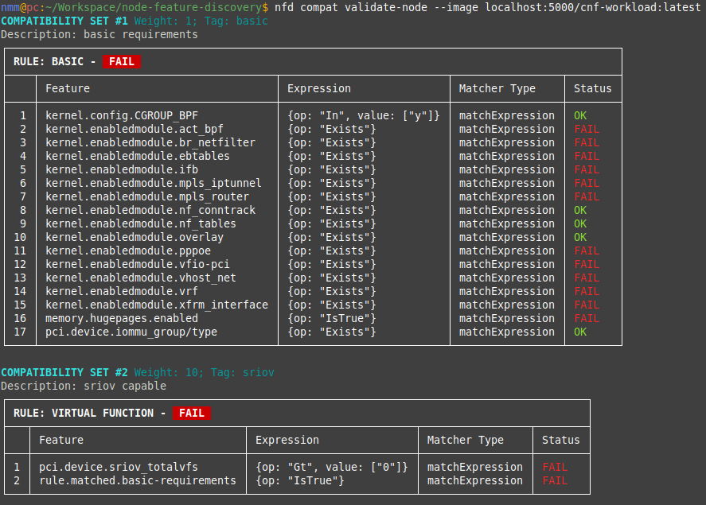

In industries where systems must run very reliably and meet strict performance criteria such as telecommunication, high-performance or AI computing, containerized applications often need specific operating system configuration or hardware presence.
It is common practice to require the use of specific versions of the kernel, its configuration, device drivers, or system components.
Despite the existence of the [Open Container Initiative (OCI)](https://opencontainers.org/), a governing community to define standards and specifications for container images, there has been a gap in expression of such compatibility requirements.
The need to address this issue has led to different proposals and, ultimately, an implementation in Kubernetes' [Node Feature Discovery (NFD)](https://kubernetes-sigs.github.io/node-feature-discovery/stable/get-started/index.html).

[NFD](https://kubernetes-sigs.github.io/node-feature-discovery/stable/get-started/index.html) is an open source Kubernetes project that automatically detects and reports [hardware and system features](https://kubernetes-sigs.github.io/node-feature-discovery/v0.17/usage/customization-guide.html#available-features) of cluster nodes. This information helps users to schedule workloads on nodes that meet specific system requirements, which is especially useful for applications with strict hardware or operating system dependencies.

## The need for image compatibility specification

### Dependencies between containers and host OS

A container image is built on a base image, which provides a minimal runtime environment, often a stripped-down Linux userland, completely empty or distroless. When an application requires certain features from the host OS, compatibility issues arise. These dependencies can manifest in several ways:

- **Drivers**:
  Host driver versions must match the supported range of a library version inside the container to avoid compatibility problems. Examples include GPUs and network drivers.
- **Libraries or Software**:
  The container must come with a specific version or range of versions for a library or software to run optimally in the environment. Examples from high performance computing are MPI, EFA, or Infiniband.
- **Kernel Modules or Features:**:
  Specific kernel features or modules must be present. Examples include having support of write protected huge page faults, or the presence of VFIO
- And more…

While containers in Kubernetes are the most likely unit of abstraction for these needs, the definition of compatibility can extend further to include other container technologies such as Singularity and other OCI artifacts such as binaries from a spack binary cache.

### Multi-cloud and hybrid cloud challenges

Containerized applications are deployed across various Kubernetes distributions and cloud providers, where different host operating systems introduce compatibility challenges.
Often those have to be pre-configured before workload deployment or are immutable.
For instance, different cloud providers will include different operating systems like:

- **RHCOS/RHEL**
- **Photon OS**
- **Amazon Linux 2**
- **Container-Optimized OS**
- **Azure Linux OS**
- And more...

Each OS comes with unique kernel versions, configurations, and drivers, making compatibility a non-trivial issue for applications requiring specific features.
It must be possible to quickly assess a container for its suitability to run on any specific environment.

### Image compatibility initiative

An effort was made within the [Open Containers Initiative Image Compatibility](https://github.com/opencontainers/wg-image-compatibility) working group to introduce a standard for image compatibility metadata.
A specification for compatibility would allow container authors to declare required host OS features, making compatibility requirements discoverable and programmable.
The specification implemented in Kubernetes Node Feature Discovery is one of the discussed proposals.
It aims to:

- **Define a structured way to express compatibility in OCI image manifests.**
- **Support a compatibility specification alongside container images in image registries.**
- **Allow automated validation of compatibility before scheduling containers.**

The concept has since been implemented in the Kubernetes Node Feature Discovery project.

### Implementation in Node Feature Discovery

The solution integrates compatibility metadata into Kubernetes via NFD features and the [NodeFeatureGroup](https://kubernetes-sigs.github.io/node-feature-discovery/v0.17/usage/custom-resources.html#nodefeaturegroup) API.
This interface enables the user to match containers to nodes based on exposing features of hardware and software, allowing for intelligent scheduling and workload optimization.

### Compatibility specification

The compatibility specification is a structured list of compatibility objects containing *[Node Feature Groups](https://kubernetes-sigs.github.io/node-feature-discovery/v0.17/usage/custom-resources.html#nodefeaturegroup)*.
These objects define image requirements and facilitate validation against host nodes.
The feature requirements are described by using [the list of available features](https://kubernetes-sigs.github.io/node-feature-discovery/v0.17/usage/customization-guide.html#available-features) from the NFD project.
The schema has the following structure:

- **version** (string) - Specifies the API version.
- **compatibilities** (array of objects) - List of compatibility sets.
  - **rules** (object) - Specifies [NodeFeatureGroup](https://kubernetes-sigs.github.io/node-feature-discovery/v0.17/usage/custom-resources.html#nodefeaturegroup) to define image requirements.
  - **weight** (int, optional) - Node affinity weight.
  - **tag** (string, optional) - Categorization tag.
  - **description** (string, optional) - Short description.

An example might look like the following:

```yaml
version: v1alpha1
compatibilities:
- description: "My image requirements"
  rules:
  - name: "kernel and cpu"
    matchFeatures:
    - feature: kernel.loadedmodule
      matchExpressions:
        vfio-pci: {op: Exists}
    - feature: cpu.model
      matchExpressions:
        vendor_id: {op: In, value: ["Intel", "AMD"]}
  - name: "one of available nics"
    matchAny:
    - matchFeatures:
      - feature: pci.device
        matchExpressions:
          vendor: {op: In, value: ["0eee"]}
          class: {op: In, value: ["0200"]}
    - matchFeatures:
      - feature: pci.device
        matchExpressions:
          vendor: {op: In, value: ["0fff"]}
          class: {op: In, value: ["0200"]}
```

### Client implementation for node validation

To streamline compatibility validation, we implemented a [client tool](https://kubernetes-sigs.github.io/node-feature-discovery/v0.17/reference/node-feature-client-reference.html) that allows for node validation based on an image's compatibility artifact.
In this workflow, the image author would generate a compatibility artifact that points to the image it describes in a registry via the referrers API.
When a need arises to assess the fit of an image to a host, the tool can discover the artifact and verify compatibility of an image to a node before deployment.
The client can validate nodes both inside and outside a Kubernetes cluster, extending the utility of the tool beyond the single Kubernetes use case.
In the future, image compatibility could play a crucial role in creating specific workload profiles based on image compatibility requirements, aiding in more efficient scheduling.
Additionally, it could potentially enable automatic node configuration to some extent, further optimizing resource allocation and ensuring seamless deployment of specialized workloads.

### Examples of usage

1. **Define image compatibility metadata**  
A [container image](/docs/concepts/containers/images) can have metadata that describes its requirements based on features discovered from nodes, like kernel modules or CPU models.
The previous compatibility specification example in this article exemplified this use case.

2. **Attach the artifact to the image**  
The image compatibility specification is stored as an OCI artifact.
You can attach this metadata to your container image using the [oras](https://oras.land/) tool.
The registry only needs to support OCI artifacts, support for arbitrary types is not required.
Keep in mind that the container image and the artifact must be stored in the same registry.
Use the following command to attach the artifact to the image:

```bash
oras attach \ 
--artifact-type application/vnd.nfd.image-compatibility.v1alpha1 <image-url> \ 
<path-to-spec>.yaml:application/vnd.nfd.image-compatibility.spec.v1alpha1+yaml
```

3. **Validate image compatibility**  
After attaching the compatibility specification, you can validate whether a node meets the image's requirements.
This validation can be done using the [nfd client](https://kubernetes-sigs.github.io/node-feature-discovery/v0.17/reference/node-feature-client-reference.html):

`nfd compat validate-node --image <image-url>`

4. **Read the output from the client**  
Finally you can read the report generated by the tool or use your own tools to act based on the generated JSON report.



## Conclusion

The addition of image compatibility to Kubernetes through Node Feature Discovery underscores the growing importance of addressing compatibility in cloud native environments.
It is only a start, as further work is needed to integrate compatibility into scheduling of workloads within and outside of Kubernetes.
However, by integrating this feature into Kubernetes, mission-critical workloads can now define and validate host OS requirements more efficiently.
Moving forward, the adoption of compatibility metadata within Kubernetes ecosystems will significantly enhance the reliability and performance of specialized containerized applications, ensuring they meet the stringent requirements of industries like telecommunications, high-performance computing or any environment that requires special hardware or host OS configuration.

## Get involved

Join the [Kubernetes Node Feature Discovery](https://kubernetes-sigs.github.io/node-feature-discovery/v0.17/contributing/) project if you're interested in getting involved with the design and development of Image Compatibility API and tools.
We always welcome new contributors.
