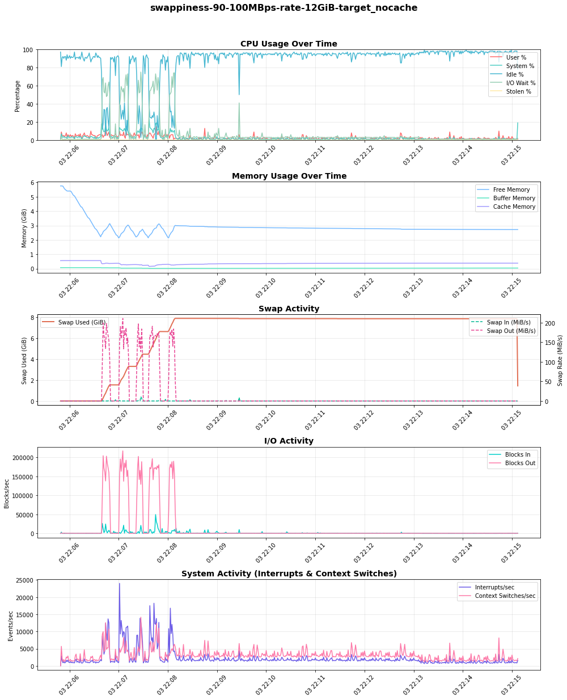
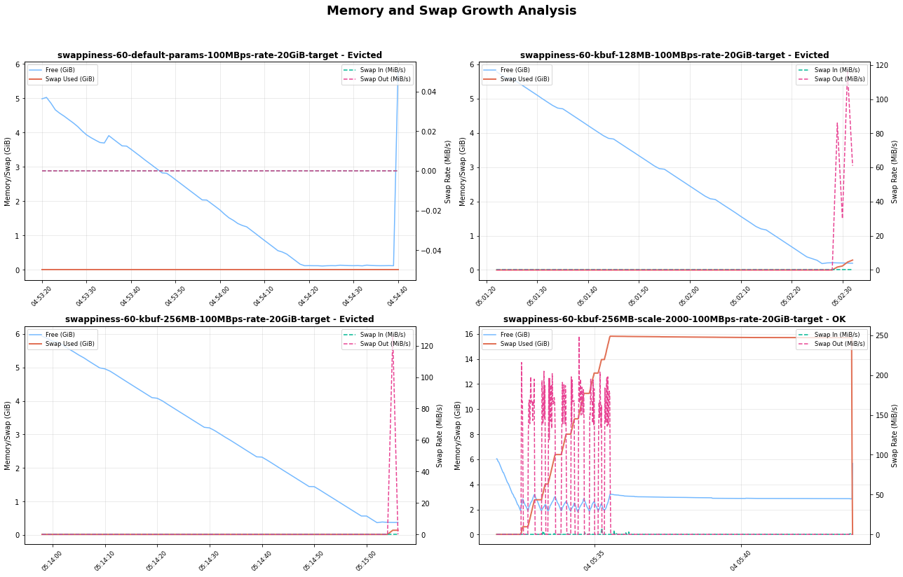
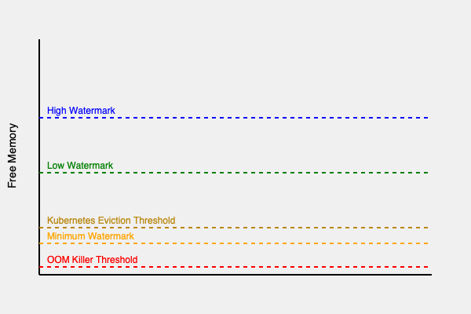

The Kubernetes [NodeSwap feature](/docs/concepts/cluster-administration/swap-memory-management/), likely to graduate to _stable_ in the upcoming Kubernetes v1.34 release,
allows swap usage:
a significant shift from the conventional practice of disabling swap for performance predictability.
This article focuses exclusively on tuning swap on Linux nodes, where this feature is available. By allowing Linux nodes to use secondary storage for additional virtual memory when physical RAM is exhausted, node swap support aims to improve resource utilization and reduce out-of-memory (OOM) kills.

However, enabling swap is not a "turn-key" solution. The performance and stability of your nodes under memory pressure are critically dependent on a set of Linux kernel parameters. Misconfiguration can lead to performance degradation and interfere with Kubelet's eviction logic.

In this blogpost, I'll dive into critical Linux kernel parameters that govern swap behavior. I will explore how these parameters influence Kubernetes workload performance, swap utilization, and crucial eviction mechanisms.
I will present various test results showcasing the impact of different configurations, and share my findings on achieving optimal settings for stable and high-performing Kubernetes clusters.

## Introduction to Linux swap

At a high level, the Linux kernel manages memory through pages, typically 4KiB in size. When physical memory becomes constrained, the kernel's page replacement algorithm decides which pages to move to swap space. While the exact logic is a sophisticated optimization, this decision-making process is influenced by certain key factors:

1. Page access patterns (how recently pages are accessed)
2. Page dirtyness (whether pages have been modified)
3. Memory pressure (how urgently the system needs free memory)

### Anonymous vs File-backed memory

It is important to understand that not all memory pages are the same. The kernel distinguishes between anonymous and file-backed memory.

**Anonymous memory**: This is memory that is not backed by a specific file on the disk, such as a program's heap and stack. From the application's perspective this is private memory, and when the kernel needs to reclaim these pages, it must write them to a dedicated swap device.

**File-backed memory**: This memory is backed by a file on a filesystem. This includes a program's executable code, shared libraries, and filesystem caches. When the kernel needs to reclaim these pages, it can simply discard them if they have not been modified ("clean"). If a page has been modified ("dirty"), the kernel must first write the changes back to the file before it can be discarded.

While a system without swap can still reclaim clean file-backed pages memory under pressure by dropping them, it has no way to offload anonymous memory. Enabling swap provides this capability, allowing the kernel to move less-frequently accessed memory pages to disk to conserve memory to avoid system OOM kills.

### Key kernel parameters for swap tuning

To effectively tune swap behavior, Linux provides several kernel parameters that can be managed via `sysctl`.

- `vm.swappiness`: This is the most well-known parameter. It is a value from 0 to 200 (100 in older kernels) that controls the kernel's preference for swapping anonymous memory pages versus reclaiming file-backed memory pages (page cache).
  - **High value (eg: 90+)**: The kernel will be aggressive in swapping out less-used anonymous memory to make room for file-cache.
  - **Low value (eg: < 10)**: The kernel will strongly prefer dropping file cache pages over swapping anonymous memory.
- `vm.min_free_kbytes`: This parameter tells the kernel to keep a minimum amount of memory free as a buffer. When the amount of free memory drops below the this safety buffer, the kernel starts more aggressively reclaiming pages (swapping, and eventually handling OOM kills).
  - **Function:** It acts as a safety lever to ensure the kernel has enough memory for critical allocation requests that cannot be deferred.
  - **Impact on swap**: Setting a higher `min_free_kbytes` effectively raises the floor for for free memory, causing the kernel to initiate swap earlier under memory pressure.
- `vm.watermark_scale_factor`: This setting controls the gap between different watermarks: `min`, `low` and `high`, which are calculated based on `min_free_kbytes`.
  - **Watermarks explained**:
    - `low`: When free memory is below this mark, the `kswapd` kernel process wakes up to reclaim pages in the background. This is when a swapping cycle begins.
    - `min`: When free memory hits this minimum level, then aggressive page reclamation will block process allocation. Failing to reclaim pages will cause OOM kills.
    - `high`: Memory reclamation stops once the free memory reaches this level.
  - **Impact**: A higher `watermark_scale_factor` careates a larger buffer between the `low` and `min` watermarks. This gives `kswapd` more time to reclaim memory gradually before the system hits a critical state.

In a typical server workload, you might have a long-running process with some memory that becomes 'cold'. A higher `swappiness` value can free up RAM by swapping out the cold memory, for other active processes that can benefit from keeping their file-cache.

Tuning the `min_free_kbytes` and `watermark_scale_factor` parameters to move the swapping window early will give more room for `kswapd` to offload memory to disk and prevent OOM kills during sudden memory spikes.

## Swap tests and results

To understand the real-impact of these parameters, I designed a series of stress tests.

### Test setup

- **Environment**: GKE on Google Cloud
- **Kubernetes version**: 1.33.2
- **Node configuration**: `n2-standard-2` (8GiB RAM, 50GB swap on a `pd-balanced` disk, without encryption), Ubuntu 22.04
- **Workload**: A custom Go application designed to allocate memory at a configurable rate, generate file-cache pressure, and simulate different memory access patterns (random vs sequential).
- **Monitoring**: A sidecar container capturing system metrics every second.
- **Protection**: Critical system components (kubelet, container runtime, sshd) were prevented from swapping by setting `memory.swap.max=0` in their respective cgroups.

### Test methodology

I ran a stress-test pod on nodes with different swappiness settings (0, 60, and 90) and varied the `min_free_kbytes` and `watermark_scale_factor` parameters to observe the outcomes under heavy memory allocation and I/O pressure.

#### Visualizing swap in action

The graph below, from a 100MBps stress test, shows swap in action. As free memory (in the "Memory Usage" plot) decreases, swap usage (`Swap Used (GiB)`) and swap-out activity (`Swap Out (MiB/s)`) increase. Critically, as the system relies more on swap, the I/O activity and corresponding wait time (`IO Wait %` in the "CPU Usage" plot) also rises, indicating CPU stress.

### Findings

My initial tests with default kernel parameters (`swappiness=60`, `min_free_kbytes=68MB`, `watermark_scale_factor=10`) quickly led to OOM kills and even unexpected node restarts under high memory pressure. With selecting appropriate kernel parameters a good balance in node stability and performance can be achieved.

#### The impact of `swappiness`

The swappiness parameter directly influences the kernel's choice between reclaiming anonymous memory (swapping) and dropping page cache. To observe this, I ran a test where one pod generated and held file-cache pressure, followed by a second pod allocating anonymous memory at 100MB/s, to observe the kernel preference on reclaim:

My findings reveal a clear trade-off:

- `swappiness=90`: The kernel proactively swapped out the inactive anonymous memory to keep the file cache. This resulted in high and sustained swap usage and significant I/O activity ("Blocks Out"), which in turn caused spikes in I/O wait on the CPU.
- `swappiness=0`: The kernel favored dropping file-cache pages delaying swap consumption. However, it's critical to understand that this **does not disable swapping**. When memory pressure was high, the kernel still swapped anonymous memory to disk.

The choice is workload-dependent. For workloads sensitive to I/O latency, a lower swappiness is preferable. For workloads that rely on a large and frequently accessed file cache, a higher swappiness may be beneficial, provided the underlying disk is fast enough to handle the load.

#### Tuning watermarks to prevent eviction and OOM kills

The most critical challenge I encountered was the interaction between rapid memory allocation and Kubelet's eviction mechanism. When my test pod, which was deliberately configured to overcommit memory, allocated it at a high rate (e.g., 300-500 MBps), the system quickly ran out of free memory.

With default watermarks, the buffer for reclamation was too small. Before `kswapd` could free up enough memory by swapping, the node would hit a critical state, leading to two potential outcomes:

1. **Kubelet eviction** If kubelet's eviction manager detected `memory.available` was below its threshold, it would evict the pod.
2. **OOM killer** In some high-rate scenarios, the OOM Killer would activate before eviction could complete, sometimes killing higher priority pods that were not the source of the pressure.

To mitigate this I tuned the watermarks:

1. Increased `min_free_kbytes` to 512MiB: This forces the kernel to start reclaiming memory much earlier, providing a larger safety buffer.
2. Increased `watermark_scale_factor` to 2000: This widened the gap between the `low` and `high` watermarks (from ≈337MB to ≈591MB in my test node's `/proc/zoneinfo`), effectively increasing the swapping window.

This combination gave `kswapd` a larger operational zone and more time to swap pages to disk during memory spikes, successfully preventing both premature evictions and OOM kills in my test runs.

Table compares watermark levels from `/proc/zoneinfo` (Non-NUMA node):

| `min_free_kbytes=67584KiB` and `watermark_scale_factor=10`                                                                                                                                                                   | `min_free_kbytes=524288KiB` and `watermark_scale_factor=2000`                                                                                                                                            |
| ---------------------------------------------------------------------------------------------------------------------------------------------------------------------------------------------------------------------------- | -------------------------------------------------------------------------------------------------------------------------------------------------------------------------------------------------------- |
| Node 0, zone Normal   &nbsp; pages free 583273   &nbsp; boost 0   &nbsp; min 10504   &nbsp; low 13130   &nbsp; high 15756   &nbsp; spanned 1310720   &nbsp; present 1310720   &nbsp; managed 1265603 | Node 0, zone Normal   &nbsp; pages free 470539   &nbsp; min 82109   &nbsp; low 337017   &nbsp; high 591925  &nbsp; spanned 1310720  &nbsp; present 1310720   &nbsp; managed 1274542 |

The graph below reveals that the kernel buffer size and scaling factor play a crucial role in determining how the system responds to memory load. With the right combination of these parameters, the system can effectively use swap space to avoid eviction and maintain stability.

### Risks and recommendations

Enabling swap in Kubernetes is a powerful tool, but it comes with risks that must be managed through careful tuning.

- **Risk of performance degradation** Swapping is orders of magnitude slower than accessing RAM. If an application's active working set is swapped out, its performance will suffer dramatically due to high I/O wait times (thrashing). Swap could preferably be provisioned with a SSD backed storage to improve performance.

- **Risk of masking memory leaks** Swap can hide memory leaks in applications, which might otherwise lead to a quick OOM kill. With swap, a leaky application might slowly degrade node performance over time, making the root cause harder to diagnose.

- **Risk of disabling evictions** Kubelet proactively monitors the node for memory-pressure and terminates pods to reclaim the resources. Improper tuning can lead to OOM kills before kubelet has a chance to evict pods gracefully. A properly configured `min_free_kbytes` is essential to ensure kubelet's eviction mechanism remains effective.

### Kubernetes context

Together, the kernel watermarks and kubelet eviction threshold create a series of memory pressure zones on a node. The eviction-threshold parameters need to be adjusted to configure Kubernetes managed evictions occur before the OOM kills.

As the diagram shows, an ideal configuration will be to create a large enough 'swapping zone' (between `high` and `min` watermarks) so that the kernel can handle memory pressure by swapping before available memory drops into the Eviction/Direct Reclaim zone.

### Recommended starting point

Based on these findings, I recommend the following as a starting point for Linux nodes with swap enabled. You should benchmark this with your own workloads.

- `vm.swappiness=60`: Linux default is a good starting point for general-purpose workloads. However, the ideal value is workload-dependent, and swap-sensitive applications may need more careful tuning.
- `vm.min_free_kbytes=500000` (500MB): Set this to a reasonably high value (e.g., 2-3% of total node memory) to give the node a reasonable safety buffer.
- `vm.watermark_scale_factor=2000`: Create a larger window for `kswapd` to work with, preventing OOM kills during sudden memory allocation spikes.

I encourage running benchmark tests with your own workloads in test-environments, when setting up swap for the first time in your Kubernetes cluster. Swap performance can be sensitive to different environment differences such as CPU load, disk type (SSD vs HDD) and I/O patterns.
