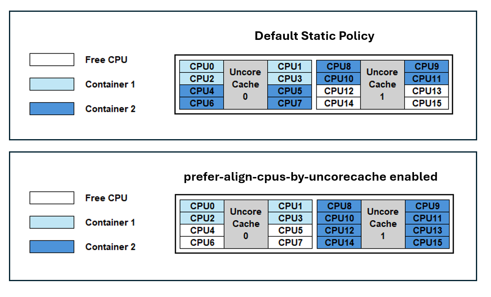

A new CPU Manager Static Policy Option called `prefer-align-cpus-by-uncorecache` was introduced in Kubernetes v1.32 as an alpha feature, and has graduated to **beta** in Kubernetes v1.34.
This CPU Manager Policy Option is designed to optimize performance for specific workloads running on processors with a _split uncore cache_ architecture.
In this article, I'll explain what that means and why it's useful.

## Understanding the feature

### What is uncore cache?
Until relatively recently, nearly all mainstream computer processors had a
monolithic last-level-cache cache that was shared across every core in a multiple
CPU package.
This monolithic cache is also referred to as _uncore cache_
(because it is not linked to a specific core), or as Level 3 cache.
As well as the Level 3 cache, there is other cache, commonly called Level 1 and Level 2 cache,
that **is** associated with a specific CPU core.

In order to reduce access latency between the CPU cores and their cache, recent AMD64 and ARM
architecture based processors have introduced a _split uncore cache_ architecture,
where the last-level-cache is divided into multiple physical caches,
that are aligned to specific CPU groupings within the physical package.
The shorter distances within the CPU package help to reduce latency.


Kubernetes is able to place workloads in a way that accounts for the cache
topology within the CPU package(s).

### Cache-aware workload placement
The matrix below shows the [CPU-to-CPU latency](https://github.com/nviennot/core-to-core-latency) measured in nanoseconds (lower is better) when
passing a packet between CPUs, via its cache coherence protocol on a processor that
uses split uncore cache.
In this example, the processor package consists of 2 uncore caches.
Each uncore cache serves 8 CPU cores.

Blue entries in the matrix represent latency between CPUs sharing the same uncore cache, while grey entries indicate latency between CPUs corresponding to different uncore caches. Latency between CPUs that correspond to different caches are higher than the latency between CPUs that belong to the same cache.

With `prefer-align-cpus-by-uncorecache` enabled, the
[static CPU Manager](/docs/concepts/policy/node-resource-managers/#static-policy) attempts to allocates CPU resources for a container, such that all CPUs assigned to a container share the same uncore cache.
This policy operates on a best-effort basis, aiming to minimize the distribution of a container's CPU resources across uncore caches, based on the
container's requirements, and accounting for allocatable resources on the node.

By running a workload, where it can, on a set of CPUS that use the smallest feasible number of uncore caches, applications benefit from reduced cache latency (as seen in the matrix above),
and from reduced contention against other workloads, which can result in overall higher throughput.
The benefit only shows up if your nodes use a split uncore cache topology for their processors.

The following diagram below illustrates uncore cache alignment when the feature is enabled.



By default, Kubernetes does not account for uncore cache topology; containers are assigned CPU resources using a packed methodology.
As a result, Container 1 and Container 2 can experience a noisy neighbor impact due to
cache access contention on Uncore Cache 0. Additionally, Container 2 will have CPUs distributed across both caches which can introduce a cross-cache latency.

With `prefer-align-cpus-by-uncorecache` enabled, each container is isolated on an individual cache. This resolves the cache contention between the containers and minimizes the cache latency for the CPUs being utilized.

## Use cases
Common use cases can include telco applications like vRAN, Mobile Packet Core, and Firewalls. It's important to note that the optimization provided by `prefer-align-cpus-by-uncorecache` can be dependent on the workload. For example, applications that are memory bandwidth bound may not benefit from uncore cache alignment, as utilizing more uncore caches can increase memory bandwidth access.  

## Enabling the feature
To enable this feature, set the CPU Manager Policy to `static` and enable the CPU Manager Policy Options with `prefer-align-cpus-by-uncorecache`.

For Kubernetes 1.34, the feature is in the beta stage and requires the `CPUManagerPolicyBetaOptions` 
[feature gate](/docs/reference/command-line-tools-reference/feature-gates/) to also be enabled.

Append the following to the kubelet configuration file:
```yaml
kind: KubeletConfiguration
apiVersion: kubelet.config.k8s.io/v1beta1
featureGates:
  ...
  CPUManagerPolicyBetaOptions: true
cpuManagerPolicy: "static"
cpuManagerPolicyOptions:
  prefer-align-cpus-by-uncorecache: "true"
reservedSystemCPUs: "0"
...
```

If you're making this change to an existing node, remove the `cpu_manager_state` file and then restart kubelet.

`prefer-align-cpus-by-uncorecache` can be enabled on nodes with a monolithic uncore cache processor. The feature will mimic a best-effort socket alignment effect and will pack CPU resources on the socket similar to the default static CPU Manager policy.

## Further reading
See [Node Resource Managers](/docs/concepts/policy/node-resource-managers/) to learn more about the CPU Manager and the available policies. 

Reference the documentation for `prefer-align-cpus-by-uncorecache` [here](/docs/concepts/policy/node-resource-managers/#prefer-align-cpus-by-uncorecache).

Please see the [Kubernetes Enhancement Proposal](https://github.com/kubernetes/enhancements/tree/master/keps/sig-node/4800-cpumanager-split-uncorecache) for more information on how `prefer-align-cpus-by-uncorecache` is implemented.

## Getting involved
This feature is driven by [SIG Node](https://github.com/Kubernetes/community/blob/master/sig-node/README.md). If you are interested in helping develop this feature, sharing feedback, or participating in any other ongoing SIG Node projects, please attend the SIG Node meeting for more details.
