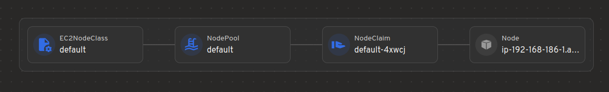
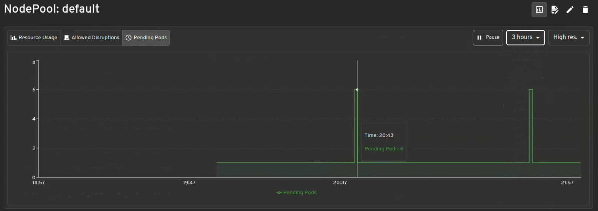
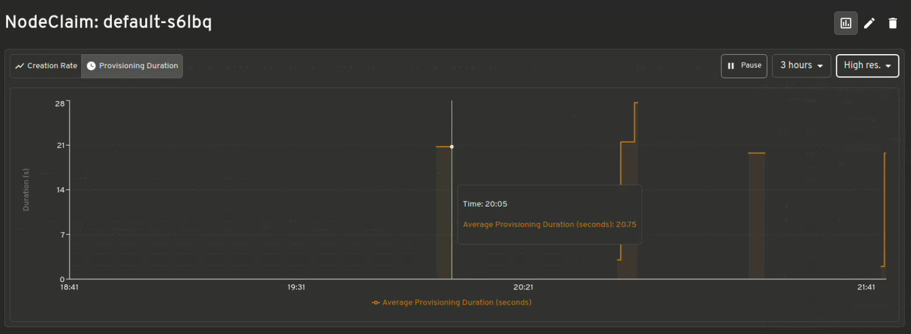
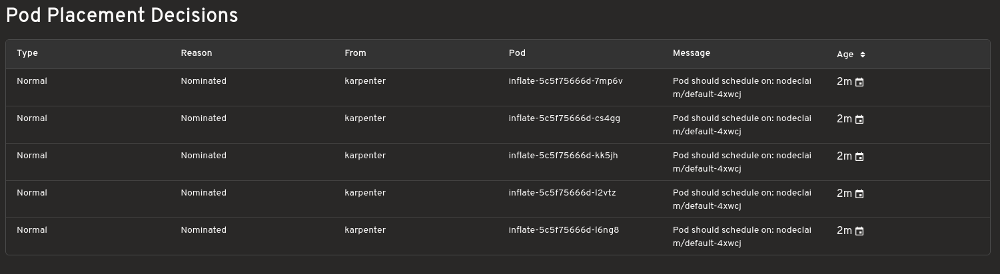
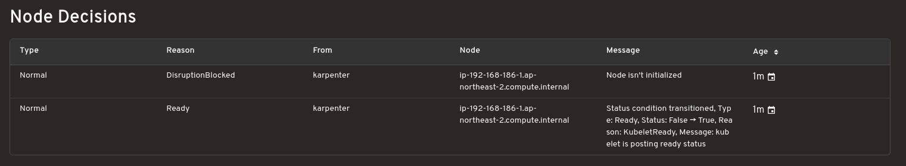
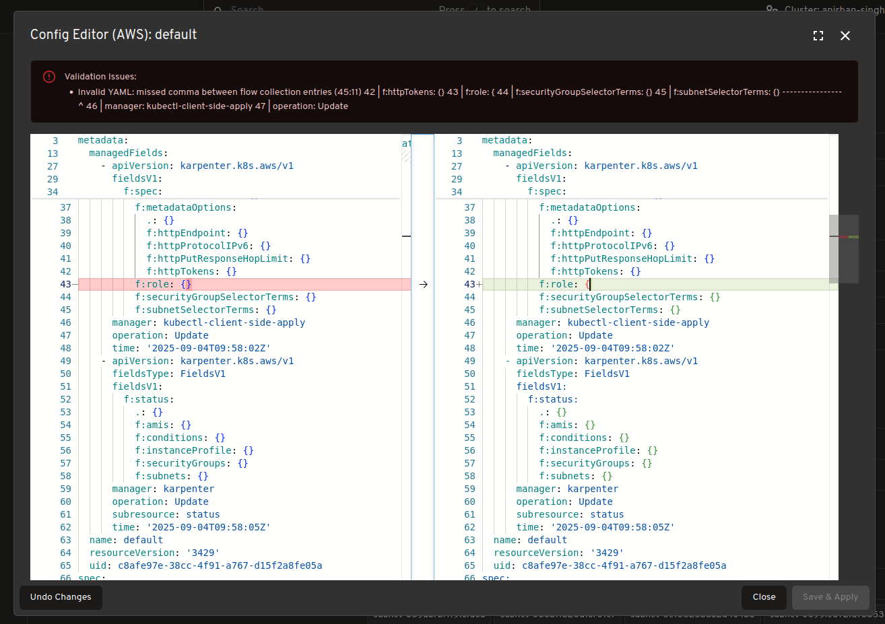
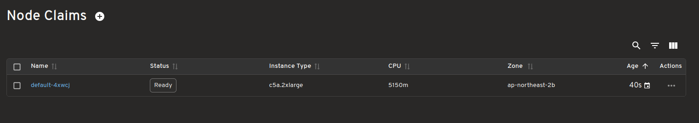
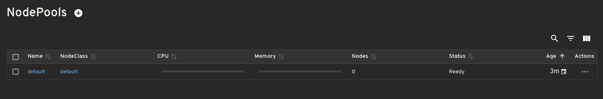
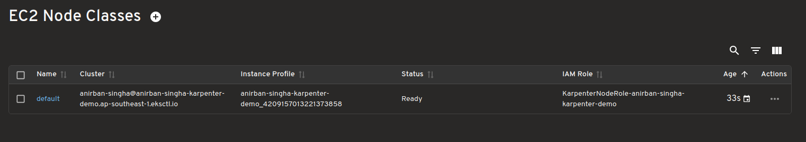
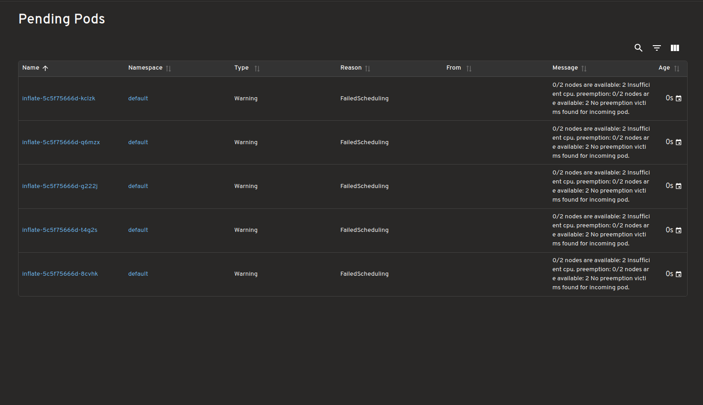

Headlamp is an open‑source, extensible Kubernetes SIG UI project designed to let you explore, manage, and debug cluster resources.

Karpenter is a Kubernetes Autoscaling SIG node provisioning project that helps clusters scale quickly and efficiently. It launches new nodes in seconds, selects appropriate instance types for workloads, and manages the full node lifecycle, including scale-down.

The new Headlamp Karpenter Plugin adds real-time visibility into Karpenter’s activity directly from the Headlamp UI. It shows how Karpenter resources relate to Kubernetes objects, displays live metrics, and surfaces scaling events as they happen. You can inspect pending pods during provisioning, review scaling decisions, and edit Karpenter-managed resources with built-in validation. The Karpenter plugin was made as part of a LFX mentor project.

The Karpenter plugin for Headlamp aims to make it easier for Kubernetes users and operators to understand, debug, and fine-tune autoscaling behavior in their clusters. Now we will give a brief tour of the Headlamp plugin.

## Map view of Karpenter Resources and how they relate to Kubernetes resources

Easily see how Karpenter Resources like NodeClasses, NodePool and NodeClaims connect with core Kubernetes resources like Pods, Nodes etc.

##  Visualization of Karpenter Metrics

Get instant insights of Resource Usage v/s Limits, Allowed disruptions, Pending Pods, Provisioning Latency and many more .

## Scaling decisions

Shows which instances are being provisioned for your workloads and understand the reason behind why Karpenter made those choices. Helpful while debugging.

## Config editor with validation support

Make live edits to Karpenter configurations. The editor includes diff previews and resource validation for safer adjustments.  

## Real time view of Karpenter resources

View and track Karpenter specific resources in real time such as “NodeClaims” as your  cluster scales up and down.

## Dashboard for Pending Pods

View all pending pods with unmet scheduling requirements/Failed Scheduling highlighting why they couldn't be scheduled.

### **Karpenter Providers**

This plugin should work with most Karpenter providers, but has only so far been tested on the ones listed in the table. Additionally, each provider gives some extra information, and the ones in the table below are displayed by the plugin.

| Provider Name | Tested | Extra provider specific info supported |
| ----- | ----- | ----- |
| [AWS](https://github.com/aws/karpenter-provider-aws) | ✅ | ✅ |
| [Azure](https://github.com/Azure/karpenter-provider-azure) | ✅ | ✅ |
| [AlibabaCloud](https://github.com/cloudpilot-ai/karpenter-provider-alibabacloud) | ❌ | ❌ |
| [Bizfly Cloud](https://github.com/bizflycloud/karpenter-provider-bizflycloud) | ❌ | ❌ |
| [Cluster API](https://github.com/kubernetes-sigs/karpenter-provider-cluster-api) | ❌ | ❌ |
| [GCP](https://github.com/cloudpilot-ai/karpenter-provider-gcp) | ❌ | ❌ |
| [Proxmox](https://github.com/sergelogvinov/karpenter-provider-proxmox) | ❌ | ❌ |
| [Oracle Cloud Infrastructure (OCI)](https://github.com/zoom/karpenter-oci) | ❌ | ❌ |

Please [submit an issue](https://github.com/headlamp-k8s/plugins/issues) if you test one of the untested providers or if you want support for this provider (PRs also gladly accepted).

## How to use

Please see the [plugins/karpenter/README.md](https://github.com/headlamp-k8s/plugins/tree/main/karpenter) for instructions on how to use.

## Feedback and Questions

Please [submit an issue](https://github.com/headlamp-k8s/plugins/issues) if you use Karpenter and have any other ideas or feedback. Or come to the [Kubernetes slack headlamp channel](https://kubernetes.slack.com/?redir=%2Fmessages%2Fheadlamp) for a chat.
