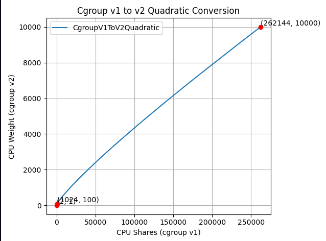

I'm excited to announce the implementation of an improved conversion formula 
from cgroup v1 CPU shares to cgroup v2 CPU weight. This enhancement addresses 
critical issues with CPU priority allocation for Kubernetes workloads when 
running on systems with cgroup v2.

## Background

Kubernetes was originally designed with cgroup v1 in mind, where CPU shares 
were defined simply by assigning the container's CPU requests in millicpu 
form. 

For example, a container requesting 1 CPU (1024m) would get \(cpu.shares = 1024\).

After a while, cgroup v1 was stared being replaced by its successor, 
cgroup v2. In cgroup v2, the concept of CPU shares (which ranges from 2 to 
262144, or from \(2^1\) to \(2^18\)) was replaced with CPU weight (which ranges from 
\([1, 10000]\), or \(10^0\) to \(10^4\).

With the transition to cgroup v2, 
[KEP-2254](https://github.com/kubernetes/enhancements/tree/master/keps/sig-node/2254-cgroup-v2) 
introduced a conversion formula to map cgroup v1 CPU shares to cgroup v2 CPU 
weight. The conversion formula was defined as:

```math
cpu.weight = (1 + ((cpu.shares - 2) * 9999) / 262142)
```

This formula linearly maps between \([2^1 - 2^18]\) to \([10^0 - 10^4]\).


While this approach is simple, the linear mapping imposes a few significant 
problems and impacts both performance and configuration granularity.

## Problems with Previous Conversion Formula

The current conversion formula creates two major issues:

### 1. Reduced Priority Against Non-Kubernetes Workloads

In cgroup v1, the default CPU shares is `1024`, meaning a container 
requesting 1 CPU has equal priority with system processes that live outside 
of Kubernetes' scope.
However, in cgroup v2, the default CPU weight is `100`, but the current 
formula converts 1 CPU (1024m) to only `~39` weight - less than 40% of the 
default.

**Example:**
- Container requesting 1 CPU (1024m)
- cgroup v1: `cpu.shares = 1024` (equal to default)
- cgroup v2 (current): `cpu.weight = 39` (much lower than default 100)

This means that after moving to cgroup v2, Kubernetes (or, OCI) workloads would 
de-factor reduce their CPU priority against non-Kubernetes processes. The 
problem can be severe for setups with many system daemons that run 
outside of Kubernetes' scope and expect Kubernetes workloads to have 
priority, especially in situations of resource starvation.

### 2. Unmanageable Granularity

The current formula produces very low values for small CPU requests, 
limiting the ability to create sub-cgroups within containers for 
fine-grained resource distribution (which will possibly be much easier moving
forward, see [KEP #5474](https://github.com/kubernetes/enhancements/issues/5474) for more info).

**Example:**
- Container requesting 100m CPU
- cgroup v1: `cpu.shares = 102`
- cgroup v2 (current): `cpu.weight = 4` (too low for sub-cgroup 
  configuration)

With cgroup v1, requesting 1 CPU which led to 102 CPU shares was manageable 
in the sense that sub-cgroups could have been created inside the main 
container, assigning fine-grained CPU priorities for different groups of 
processes. With cgroup v2 however, having 4 shares is very hard to 
distribute between sub-cgroups since it's not granular enough.

With plans to allow [writable cgroups for unprivileged containers](https://github.com/kubernetes/enhancements/issues/5474),
this becomes even 
more relevant.

## New Conversion Formula

### Description
The new formula is more complicated, but does a much better job mapping 
between cgroup v1 CPU shares and cgroup v2 CPU weight:

```math
cpu.weight = \lceil 10^{(L^2/612 + 125L/612 - 7/34)} \rceil, where: L = log₂(cpu.shares)
```

The idea is that this is a quadratic function to cross the following values:
- (2, 1): The minimum values for both ranges.
- (1024, 100): The default values for both ranges.
- (262144, 10000): The maximum values for both ranges.

Visually, the new function looks as follows:


And if we zoom in to the important part:


The new formula is "close to linear", yet it is sophistically designed to 
map the ranges in a clever way so the three important points above would 
cross.

### How It Solves the Problems

1. **Better Priority Alignment:**
- Container requesting 1 CPU (1024m) will now get a `cpu.weight = 102`. This 
  value is close to cgroup v2's default 100.
- This restores the intended priority relationship between Kubernetes 
  workloads and system processes.

2. **Improved Granularity:**
- Container requesting 100m CPU will get `cpu.weight = 17`, (see 
  [here](https://go.dev/play/p/sLlAfCg54Eg)).
- Enables better fine-grained resource distribution within containers.

## Adoption and integration

This change was implemented as an OCI-level implementation.
In other words, this is not implemented Kubernetes itself, therefore the 
adoption of the new conversion formula depends solely on the OCI runtime 
adoption.

For example:
* runc: The new formula is enabled from version [1.3.2](https://github.com/opencontainers/runc/releases/tag/v1.3.2).
* crun: The new formula is enabled from version [1.23](https://github.com/containers/crun/releases/tag/1.23).

### Impact on Existing Deployments

**Important:** Some consumers may be affected if they assume the older linear conversion formula.
Applications or monitoring tools that directly calculate expected CPU weight values based on the
previous formula may need updates to account for the new quadratic conversion.
This is particularly relevant for:

- Custom resource management tools that predict CPU weight values.
- Monitoring systems that validate or expect specific weight values.
- Applications that programmatically set or verify CPU weight values.

We recommend testing the new conversion formula in non-production environments before
upgrading OCI runtimes to ensure compatibility with existing tooling.

## Where Can I Learn More?

For those interested in this enhancement:

- [Kubernetes GitHub Issue #131216](https://github.com/kubernetes/kubernetes/issues/131216) - Detailed technical 
analysis and examples, including discussions and reasoning for choosing the 
above formula.
- [KEP-2254: cgroup v2](https://github.com/kubernetes/enhancements/tree/master/keps/sig-node/2254-cgroup-v2) - 
Original cgroup v2 implementation in Kubernetes.
- [Kubernetes cgroup documentation](https://kubernetes.io/docs/concepts/configuration/manage-resources-containers/) - 
Current resource management guidance.

## How Do I Get Involved?

For those interested in getting involved with Kubernetes node-level 
features, join the [Kubernetes Node Special Interest Group](https://github.com/kubernetes/community/tree/master/sig-node).
We always welcome new contributors and diverse perspectives on resource management 
challenges.