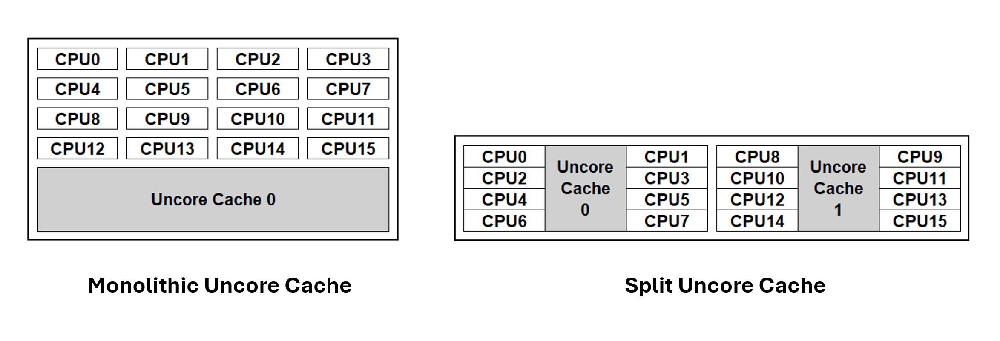
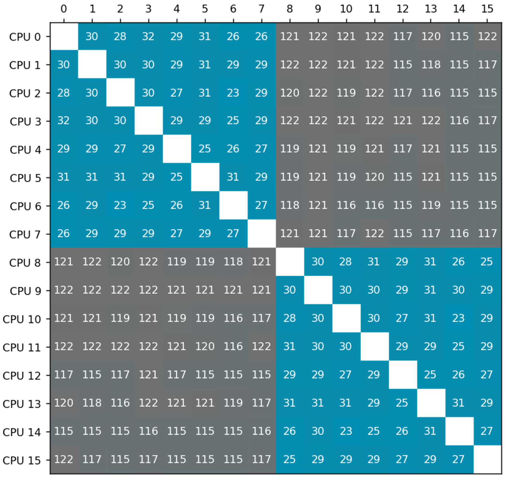
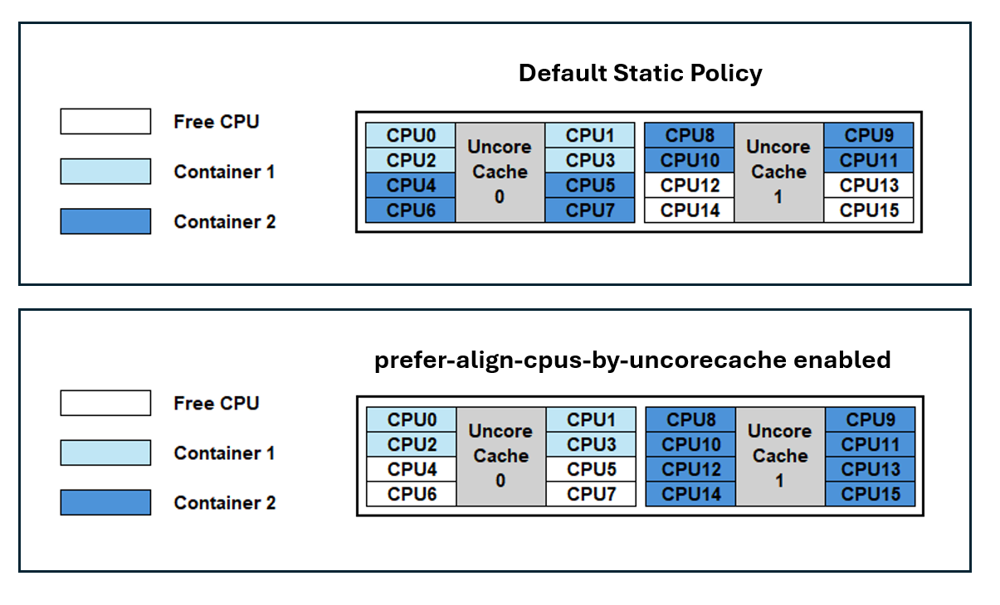

A new CPU Manager Static Policy Option called `prefer-align-cpus-by-uncorecache` was introduced in Kubernetes v1.32 as an alpha feature and has graduated to beta in Kubernetes v1.34. This new CPU Manager Policy Option is designed to optimize performance for specific workloads running on processors with a split uncore cache architecture.

## Understanding the feature

### What is Uncore Cache
Traditional CPU processors have a single monolithic uncore cache, also referred to as last-level-cache or Level 3 cache, that is shared among all cores on the processors. In order to reduce the distance and latency between the CPU cores and the uncore cache, x86 and ARM based processors have introduced a split uncore cache architecture where the last-level-cache is divided into multiple physical caches that are aligned to specific CPU groupings. 


### Benefit of the feature
The matrix below shows the [cpu-to-cpu latency](https://github.com/nviennot/core-to-core-latency) measured in nanoseconds (lower is better) when passing a packet between CPUs via its cache coherence protocol on a split uncore cache processor. In this example, the processor consists of 2 uncore caches. Each uncore cache consists of 8 CPUs.

Blue entries in the matrix represent latency between CPUs sharing the same uncore cache, while grey entries indicate latency between CPUs corresponding to different uncore caches. Latency between CPUs that correspond to different caches are higher than the latency between CPUs that belong to the same cache.

With `prefer-align-cpus-by-uncorecache` enabled, the static CPU Manager will allocate CPU resources for a container such that all CPUs assigned to a container share the same uncore cache. This policy operates on a best-effort basis, aiming to minimize the distribution of a container's CPU resources across uncore caches, based on the container's requirements and allocatable resources on the node.

By concentrating CPU resources within a single or minimal number of uncore cahes, applications running on processors with split uncore caches can benefit from reduced cache latency (as seen in the matrix above) and reduced contention against other workloads, resulting in higher throughput.

The following diagram below illustrates uncore cache alignment when the feature is enabled.



In the Default Static Policy case, containers are assigned CPU resources in a packed methodology. As a result, Container 1 and Container 2 can experience a noisy neighbor impact due to cache access contention on Uncore Cache 0. Additionally, Container 2 will have CPUs distributed across both caches which can introduce a cross-cache latency.

With `prefer-align-cpus-by-uncorecache` enabled, each container is isolated on an individual cache. This resolves the cache contention between the containers and minimizes the cache latency for the CPUs being utilized.

## Use cases
Common use cases can include telco applications like vRAN, Mobile Packet Core, and Firewalls. It's important to note that the optimization provided by `prefer-align-cpus-by-uncorecache` can be dependent on the workload. For example, applications that are memory bandwidth bound may not benefit from uncore cache alignment, as utilizing more uncore caches can increase memory bandwidth access.  

## Enabling the feature
To enable this feature, set the CPU Manager Policy to `static` and enable the CPU Manager Policy Options with `prefer-align-cpus-by-uncorecache`.

For version 1.34, the feature is in the beta stage and will require `CPUManagerPolicyBetaOptions` to also be enabled.

Append the following to the kubelet configuration file:
```yaml
kind: KubeletConfiguration
apiVersion: kubelet.config.k8s.io/v1beta1
featureGates:
  ...
  CPUManagerPolicyBetaOptions: true
cpuManagerPolicy: "static"
cpuManagerPolicyOptions:
  prefer-align-cpus-by-uncorecache: "true"
reservedSystemCPUs: "0"
...
```
Remove the `cpu_manager_state` file and restart kubelet.

`prefer-align-cpus-by-uncorecache` can be enabled on nodes with a monolithic uncore cache processor. The feature will mimic a best-effort socket alignment effect and will pack CPU resources on the socket similar to the default static CPU Manager policy.

## Further reading
Please see [Node Resource Managers](/content/en/docs/concepts/policy/node-resource-managers.md) to learn more about the CPU Manager and the available Policy Options.

Please see the [Kubernetes Enhancement Proposal](https://github.com/kubernetes/enhancements/tree/master/keps/sig-node/4800-cpumanager-split-uncorecache) for more information on how `prefer-align-cpus-by-uncorecache` is implemented.

## Getting involved
This feature is driven by [SIG Node](https://github.com/Kubernetes/community/blob/master/sig-node/README.md). If you are interested in helping develop this feature, sharing feedback, or participating in any other ongoing SIG Node projects, please attend the SIG Node meeting for more details.