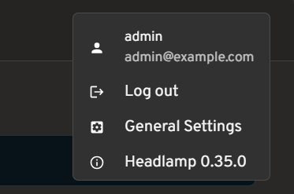
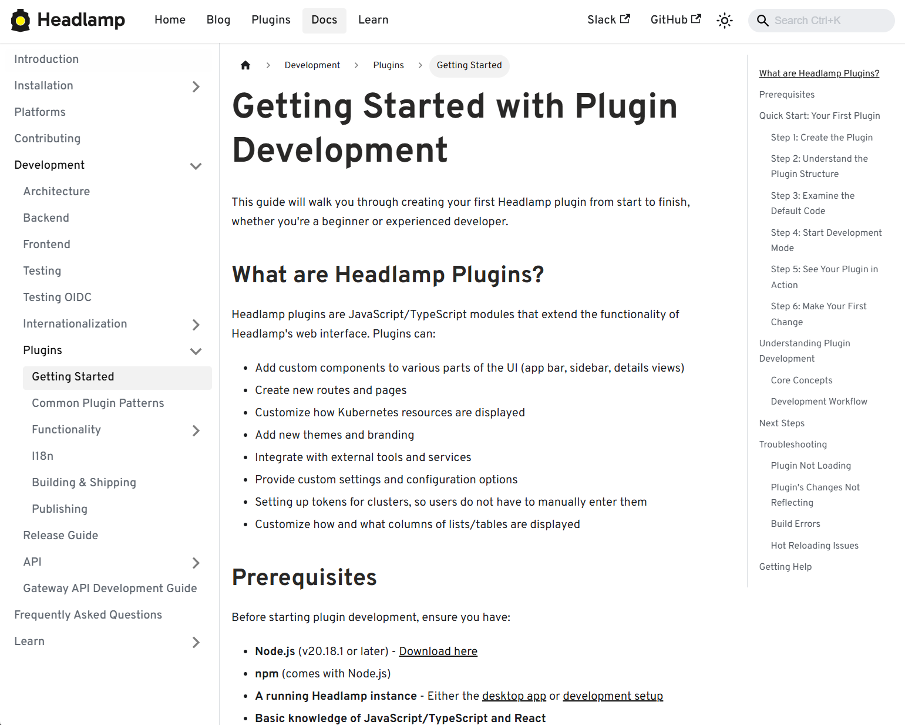

_This announcement is a recap from a post originally [published](https://headlamp.dev/blog/2025/11/13/headlamp-in-2025) on the Headlamp blog._

[Headlamp](https://headlamp.dev/) has come a long way in 2025. The project has continued to grow – reaching more teams across platforms, powering new workflows and integrations through plugins, and seeing increased collaboration from the broader community.

We wanted to take a moment to share a few updates and highlight how Headlamp has evolved over the past year.

## Updates

### Joining Kubernetes SIG UI

This year marked a big milestone for the project: Headlamp is now officially part of Kubernetes [SIG UI](https://github.com/kubernetes/community/blob/master/sig-ui/README.md). This move brings roadmap and design discussions even closer to the core Kubernetes community and reinforces Headlamp’s role as a modern, extensible UI for the project.



As part of that, we’ve also been sharing more about making Kubernetes approachable for a wider audience, including an [appearance on Enlightening with Whitney Lee](https://www.youtube.com/watch?v=VFOSyKVOPxs) and a [talk at KCD New York 2025](https://www.youtube.com/watch?v=Q7cbT2UBfE0).

### Linux Foundation mentorship

This year, we were excited to work with several students through the Linux Foundation’s Mentorship program, and our mentees have already left a visible mark on Headlamp:

- [**Adwait Godbole**](https://github.com/adwait-godbole) built the KEDA plugin, adding a UI in Headlamp to view and manage KEDA resources like ScaledObjects and ScaledJobs.
- [**Dhairya Majmudar**](https://github.com/DhairyaMajmudar) set up an OpenTelemetry-based observability stack for Headlamp, wiring up metrics, logs, and traces so the project is easier to monitor and debug.
- [**Aishwarya Ghatole**](https://www.linkedin.com/in/aishwarya-ghatole-506745231/) led a UX audit of Headlamp plugins, identifying usability issues and proposing design improvements and personas for plugin users.
- [**Anirban Singha**](https://github.com/SinghaAnirban005) developed the Karpenter plugin, giving Headlamp a focused view into Karpenter autoscaling resources and decisions.
- [**Aditya Chaudhary**](https://github.com/useradityaa) improved Gateway API support, so you can see networking relationships on the resource map, as well as improved support for many of the new Gateway API resources.
- [**Faakhir Zahid**](https://github.com/Faakhir30) completed a way to easily [manage plugin installation](https://headlamp.dev/docs/latest/installation/in-cluster/#plugin-management) with Headlamp deployed in clusters.
- [**Saurav Upadhyay**](https://github.com/upsaurav12) worked on backend caching for Kubernetes API calls, reducing load on the API server and improving performance in Headlamp.

## New changes

### Multi-cluster view

Managing multiple clusters is challenging: teams often switch between tools and lose context when trying to see what runs where. Headlamp solves this by giving you a single view to compare clusters side-by-side. This makes it easier to understand workloads across environments and reduces the time spent hunting for resources.

<em style="display: block; margin-bottom: 1em;">View of multi-cluster workloads</em>

### Projects

Kubernetes apps often span multiple namespaces and resource types, which makes troubleshooting feel like piecing together a puzzle. We’ve added **Projects** to give you an application-centric view that groups related resources across multiple namespaces – and even clusters. This allows you to reduce sprawl, troubleshoot faster, and collaborate without digging through YAML or cluster-wide lists.

<em style="display: block; margin-bottom: 1em;">View of the new Projects feature</em>

Changes:
- New “Projects” feature for grouping namespaces into app- or team-centric projects
- Extensible Projects details view that plugins can customize with their own tabs and actions

### Navigation and Activities

Day-to-day ops in Kubernetes often means juggling logs, terminals, YAML, and dashboards across clusters. We redesigned Headlamp’s navigation to treat these as first-class “activities” you can keep open and come back to, instead of one-off views you lose as soon as you click away.

<em style="display: block; margin-bottom: 1em;">View of the new task bar</em>

Changes:
- A new task bar/activities model lets you pin logs, exec sessions, and details as ongoing activities
- An activity overview with a “Close all” action and cluster information
- Multi-select and global filters in tables

Thanks to [Jan Jansen](https://github.com/farodin91) and [Aditya Chaudhary](https://github.com/useradityaa).

### Search and map

When something breaks in production, the first two questions are usually “where is it?” and “what is it connected to?” We’ve upgraded both search and the map view so you can get from a high-level symptom to the right set of objects much faster.

<em style="display: block; margin-bottom: 1em;">View of the new Advanced Search feature</em>

Changes:
- An Advanced search view that supports rich, expression-based queries over Kubernetes objects
- Improved global search that understands labels and multiple search items, and can even update your current namespace based on what you find
- EndpointSlice support in the Network section
- A richer map view that now includes Custom Resources and Gateway API objects

Thanks to [Fabian](https://github.com/faebr), [Alexander North](https://github.com/alexandernorth), and [Victor Marcolino](https://github.com/victormarcolino) from Swisscom, and also to [Aditya Chaudhary](https://github.com/useradityaa).

### OIDC and authentication

We’ve put real work into making OIDC setup clearer and more resilient, especially for in-cluster deployments.

<em style="display: block; margin-bottom: 1em;">View of user information for OIDC clusters</em>

Changes:
- User information displayed in the top bar for OIDC-authenticated users
- PKCE support for more secure authentication flows, as well as hardened token refresh handling
- Documentation for using the access token using `-oidc-use-access-token=true`
- Improved support for public OIDC clients like AKS and EKS
- New guide for setting up Headlamp [on AKS with Azure Entra-ID using OAuth2Proxy](https://headlamp.dev/docs/latest/installation/in-cluster/aks-cluster-oauth/)

Thanks to [David Dobmeier](https://github.com/daviddob) and [Harsh Srivastava](https://github.com/HarshSrivastava275).

### App Catalog and Helm

We’ve broadened how you deploy and source apps via Headlamp, specifically supporting vanilla Helm repos.

Changes:
- A more capable Helm chart with optional backend TLS termination, PodDisruptionBudgets, custom pod labels, and more
- Improved formatting and added missing access token arg in the Helm chart
- New in-cluster Helm support with an `--enable-helm` flag and a service proxy

Thanks to [Vrushali Shah](https://github.com/shahvrushali22) and [Murali Annamneni](https://github.com/muraliinformal) from Oracle, and also to [Pat Riehecky](https://github.com/jcpunk), [Joshua Akers](https://github.com/jda258), [Rostislav Stříbrný](https://github.com/rstribrn), [Rick L](https://github.com/rickliujh),and [Victor](https://github.com/vnea).

### Performance, accessibility, and UX

Finally, we’ve spent a lot of time on the things you notice every day but don’t always make headlines: startup time, list views, log viewers, accessibility, and small network UX details. A continuous accessibility self-audit has also helped us identify key issues and make Headlamp easier for everyone to use.

<em style="display: block; margin-bottom: 1em;">View of the Learn section in docs</em>

Changes:
- Significant desktop improvements, with up to 60% faster app loads and much quicker dev-mode reloads for contributors
- Numerous table and log viewer refinements: persistent sort order, consistent row actions, copy-name buttons, better tooltips, and more forgiving log inputs
- Accessibility and localization improvements, including fixes for zoom-related layout issues, better color contrast, improved screen reader support, and expanded language coverage
- More control over resources, with live pod CPU/memory metrics, richer pod details, and inline editing for secrets and CRD fields
- A refreshed documentation and plugin onboarding experience, including a “Learn” section and plugin showcase
- A more complete NetworkPolicy UI and network-related polish
- Nightly builds available for early testing

Thanks to [Jaehan Byun](https://github.com/jaehanbyun) and [Jan Jansen](https://github.com/farodin91). 

## Plugins and extensibility

Discovering plugins is simpler now – no more hopping between Artifact Hub and assorted GitHub repos. Browse our dedicated [Plugins page](https://headlamp.dev/plugins) for a curated catalog of Headlamp-endorsed plugins, along with a showcase of featured plugins. 

<em style="display: block; margin-bottom: 1em;">View of the Plugins showcase</em>

### Headlamp AI Assistant

Managing Kubernetes often means memorizing commands and juggling tools. Headlamp’s new AI Assistant changes this by adding a natural-language interface built into the UI. Now, instead of typing `kubectl` or digging through YAML you can ask, “Is my app healthy?” or “Show logs for this deployment,” and get answers in context, speeding up troubleshooting and smoothing onboarding for new users. Learn more about it [here](https://headlamp.dev/blog/2025/08/07/introducing-the-headlamp-ai-assistant/).



### New plugins additions

Alongside the new AI Assistant, we’ve been growing Headlamp’s plugin ecosystem so you can bring more of your workflows into a single UI, with integrations like Minikube, Karpenter, and more.

Highlights from the latest plugin releases:
- Minikube plugin, providing a locally stored single node Minikube cluster
- Karpenter plugin, with support for Azure Node Auto-Provisioning (NAP)
- KEDA plugin, which you can learn more about [here](https://headlamp.dev/blog/2025/07/25/enabling-event-driven-autoscaling-with-the-new-keda-plugin-for-headlamp/)
- Community-maintained plugins for [Gatekeeper](https://github.com/sozercan/gatekeeper-headlamp-plugin) and [KAITO](https://github.com/kaito-project/headlamp-kaito)

Thanks to [Vrushali Shah](https://github.com/shahvrushali22) and [Murali Annamneni](https://github.com/muraliinformal) from Oracle, and also to [Anirban Singha](https://github.com/SinghaAnirban005), [Adwait Godbole](https://github.com/adwait-godbole), [Sertaç Özercan](https://github.com/sozercan), [Ernest Wong](https://github.com/chewong), and [Chloe Lim](https://github.com/chloe608).

### Other plugins updates

Alongside new additions, we’ve also spent time refining plugins that many of you already use, focusing on smoother workflows and better integration with the core UI.

<em style="display: block; margin-bottom: 1em;">View of the Backstage plugin</em>

Changes:
- **Flux plugin**: Updated for Flux v2.7, with support for newer CRDs, navigation fixes so it works smoothly on recent clusters
- **App Catalog**: Now supports Helm repos in addition to Artifact Hub, can run in-cluster via /serviceproxy, and shows both current and latest app versions
- **Plugin Catalog**: Improved card layout and accessibility, plus dependency and Storybook test updates
- **Backstage plugin**: Dependency and build updates, more info [here](https://headlamp.dev/blog/2025/11/05/strengthening-backstage-and-headlamp-integration/)

### Plugin development

We’ve focused on making it faster and clearer to build, test, and ship Headlamp plugins, backed by improved documentation and lighter tooling.

<em style="display: block; margin-bottom: 1em;">View of the Plugin Development guide</em>

Changes:
- New and expanded guides for [plugin architecture](https://headlamp.dev/docs/latest/development/architecture#plugins) and [development](https://headlamp.dev/docs/latest/development/plugins/getting-started), including how to publish and ship plugins
- Added [i18n support documentation](https://headlamp.dev/docs/latest/development/plugins/i18n) so plugins can be translated and localized
- Added example plugins: [ui-panels](https://github.com/kubernetes-sigs/headlamp/tree/main/plugins/examples/ui-panels), [resource-charts](https://github.com/kubernetes-sigs/headlamp/tree/main/plugins/examples/resource-charts), [custom-theme](https://github.com/kubernetes-sigs/headlamp/tree/main/plugins/examples/custom-theme), and [projects](https://github.com/kubernetes-sigs/headlamp/tree/main/plugins/examples/projects)
- Improved type checking for Headlamp APIs, restored Storybook support for component testing, and reduced dependencies for faster installs and fewer updates
- Documented plugin install locations, UI signifiers in Plugin Settings, and labels that differentiated shipped, UI-installed, and dev-mode plugins

## Security upgrades

We've also been investing in keeping Headlamp secure – both by tightening how authentication works and by staying on top of upstream vulnerabilities and tooling.

Updates:
- We've been keeping up with security updates, regularly updating dependencies and addressing upstream security issues.
- We tightened the Helm chart's default security context and fixed a regression that broke the plugin manager.
- We've improved OIDC security with PKCE support, helping unblock more secure and standards-compliant OIDC setups when deploying Headlamp in-cluster.

## Conclusion

Thank you to everyone who has contributed to Headlamp this year – whether through pull requests, plugins, or simply sharing how you're using the project. Seeing the different ways teams are adopting and extending the project is a big part of what keeps us moving forward. If your organization uses Headlamp, consider adding it to our [adopters list](https://github.com/kubernetes-sigs/headlamp/blob/main/ADOPTERS.md).

If you haven't tried Headlamp recently, all these updates are available today. Check out the latest Headlamp release, explore the new views, plugins, and docs, and share your feedback with us on Slack or GitHub – your feedback helps shape where Headlamp goes next.
