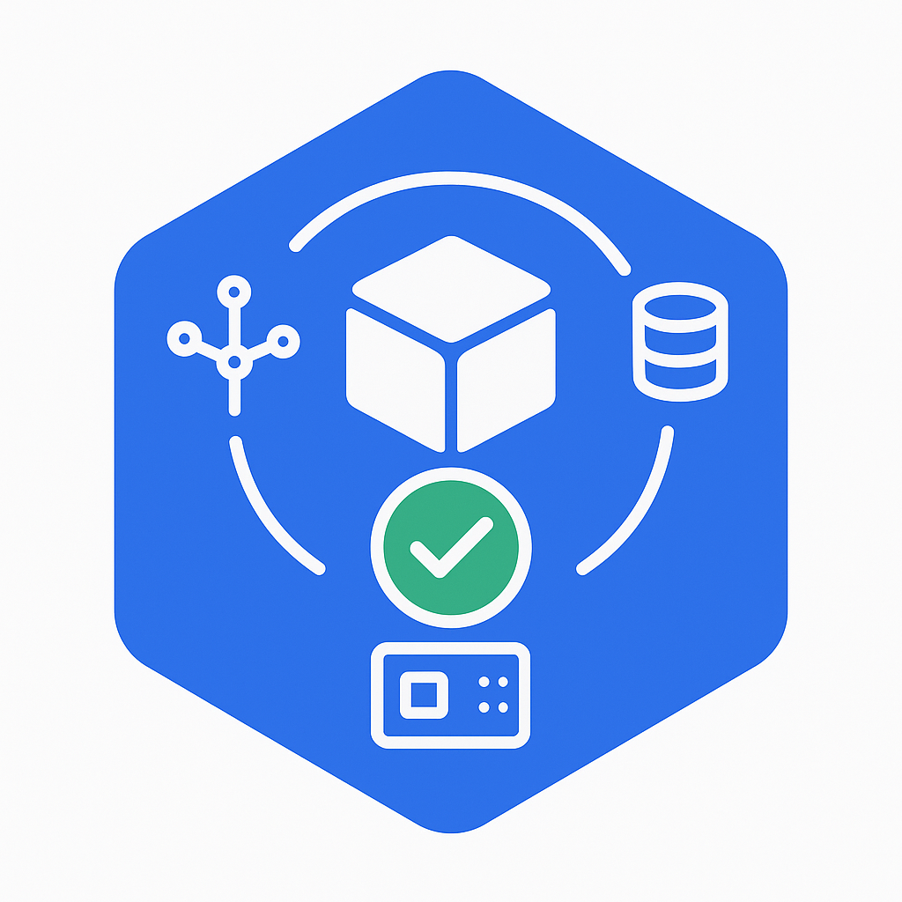

In the standard Kubernetes model, a node’s suitability for workloads hinges on a single binary "Ready" condition. However, in modern Kubernetes environments, nodes require complex infrastructure dependencies—such as network agents, storage drivers, GPU firmware, or custom health checks—to be fully operational before they can reliably host pods.

Today, on behalf of the Kubernetes project, I am announcing the [Node Readiness Controller](https://node-readiness-controller.sigs.k8s.io/).
This project introduces a declarative system for managing node taints, extending the readiness guardrails during node bootstrapping beyond standard conditions.
By dynamically managing taints based on custom health signals, the controller ensures that workloads are only placed on nodes that met all infrastructure-specific requirements.

## Why the Node Readiness Controller?

Core Kubernetes Node "Ready" status is often insufficient for clusters with sophisticated bootstrapping requirements. Operators frequently struggle to ensure that specific DaemonSets or local services are healthy before a node enters the scheduling pool.

The Node Readiness Controller fills this gap by allowing operators to define custom scheduling gates tailored to specific node groups. This enables you to enforce
distinct readiness requirements across heterogeneous clusters, ensuring for example, that GPU equipped nodes only accept pods once specialized drivers are verified,
while general purpose nodes follow a standard path.

It provides three primary advantages:

- **Custom Readiness Definitions**: Define what _ready_ means for your specific platform.
- **Automated Taint Management**: The controller automatically applies or removes node taints based on condition status, preventing pods from landing on unready infrastructure.
- **Declarative Node Bootstrapping**: Manage multi-step node initialization reliably, with a clear observability into the bootstrapping process.

## Core concepts and features

The controller centers around the NodeReadinessRule (NRR) API, which allows you to define declarative _gates_ for your nodes.

### Flexible enforcement modes

The controller supports two distinct operational modes:

Continuous enforcement
: Actively maintains the readiness guarantee throughout the node’s entire lifecycle. If a critical dependency (like a device driver) fails later, the node is immediately tainted to prevent new scheduling.

Bootstrap-only enforcement
: Specifically for one-time initialization steps, such as pre-pulling heavy images or hardware provisioning. Once conditions are met, the controller marks the bootstrap as complete and stops monitoring that specific rule for the node.

### Condition reporting

The controller reacts to Node Conditions rather than performing health checks itself. This decoupled design allows it to integrate seamlessly with other tools existing in the ecosystem as well as custom solutions:

- **[Node Problem Detector](https://github.com/kubernetes/node-problem-detector) (NPD)**: Use existing NPD setups and custom scripts to report node health.
- **Readiness Condition Reporter**: A lightweight agent provided by the project that can be deployed to periodically check local HTTP endpoints and patch node conditions accordingly.

### Operational safety with dry run

Deploying new readiness rules across a fleet carries inherent risk. To mitigate this, _dry run_ mode allows operators to first simulate impact on the cluster.
In this mode, the controller logs intended actions and updates the rule's status to show affected nodes without applying actual taints, enabling safe validation before enforcement.

## Example: CNI bootstrapping

The following NodeReadinessRule ensures a node remains unschedulable until its CNI agent is functional. The controller monitors a custom `cniplugin.example.net/NetworkReady` condition and only removes the `readiness.k8s.io/acme.com/network-unavailable` taint once the status is True.

```yaml
apiVersion: readiness.node.x-k8s.io/v1alpha1
kind: NodeReadinessRule
metadata:
  name: network-readiness-rule
spec:
  conditions:
    - type: "cniplugin.example.net/NetworkReady"
      requiredStatus: "True"
  taint:
    key: "readiness.k8s.io/acme.com/network-unavailable"
    effect: "NoSchedule"
    value: "pending"
  enforcementMode: "bootstrap-only"
  nodeSelector:
    matchLabels:
      node-role.kubernetes.io/worker: ""
```
**Demo**:



## Getting involved

The Node Readiness Controller is just getting started, with our [initial releases](https://github.com/kubernetes-sigs/node-readiness-controller/releases/tag/v0.1.1) out, and we are seeking community feedback to refine the roadmap. Following our productive Unconference discussions at KubeCon NA 2025, we are excited to continue the conversation in person.

Join us at KubeCon + CloudNativeCon Europe 2026 for our maintainer track session: *[Addressing Non-Deterministic Scheduling: Introducing the Node Readiness Controller](https://sched.co/2EF6E)*.

In the meantime, you can contribute or track our progress here:

- GitHub: https://sigs.k8s.io/node-readiness-controller
- Slack: Join the conversation in [#sig-node-readiness-controller](https://kubernetes.slack.com/messages/sig-node-readiness-controller) 
- Documentation: [Getting Started](https://node-readiness-controller.sigs.k8s.io/)