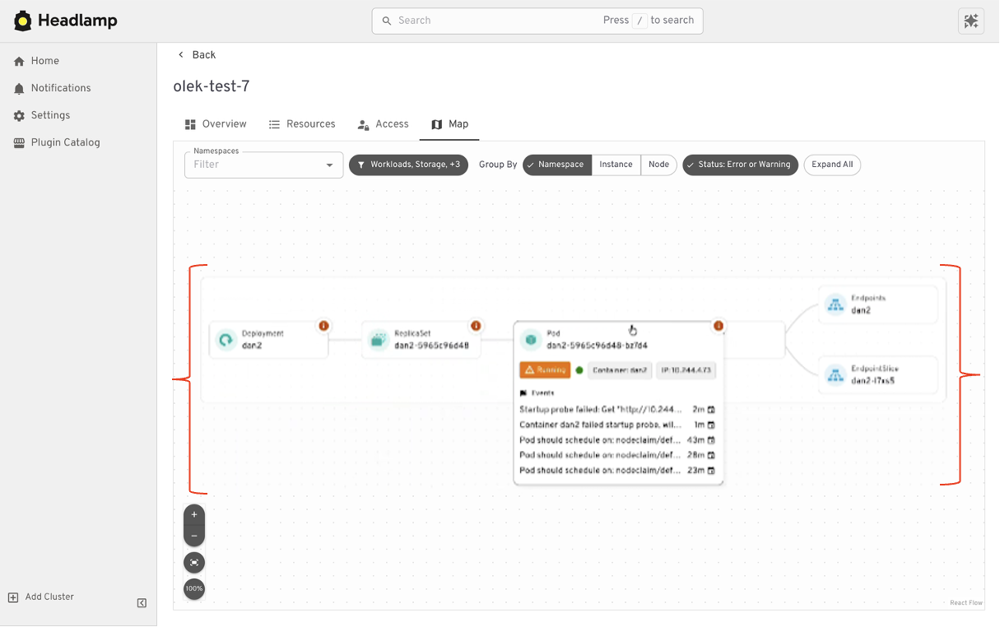
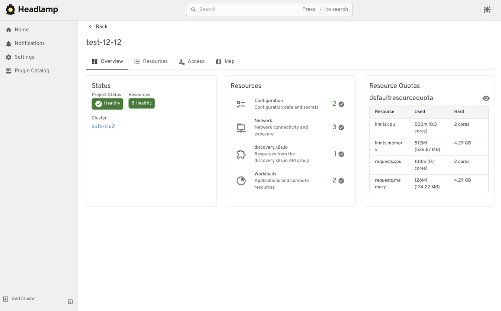

## Introduction

For many people, Kubernetes Dashboard was their first window into Kubernetes. It offered a simple visual way to see what was running in a cluster, inspect resources, and build confidence without relying on the command line. For years, it helped developers, students, and operators make sense of Kubernetes, and it served as an important onramp into the ecosystem.

The Kubernetes Dashboard project has now been archived. We deeply respect the work the team did and the role Dashboard played in making Kubernetes more approachable for so many users.

Headlamp builds on that foundation and carries it forward. It keeps the clarity of a visual interface while adding capabilities that match how Kubernetes is used today. This includes multi cluster visibility, application centric views, extensibility through plugins, and flexible deployment options that work both in cluster and on the desktop.

This guide is meant to help you navigate that transition with confidence. Before diving into the mechanics of migration, we start with familiar ground by looking at how common Kubernetes Dashboard workflows map to Headlamp. We also cover what stays the same and what improves after the switch. The goal is not just to replace a tool, but to honor a user centered legacy and help you land in a UI that can grow with you as your Kubernetes usage evolves.

## Mapping Kubernetes Dashboard Workloads to Headlamp

If you have used Kubernetes Dashboard before, many workflows in Headlamp will feel familiar. Headlamp does not introduce a new way of thinking. Instead, it builds on workloads users already know and extends them in practical ways. The focus is continuity. What worked before still works, with more room to grow.

### Viewing workloads and resources

In Kubernetes Dashboard, most users started by browsing workloads like pods, deployments, services, and namespaces. Headlamp keeps this same starting point. Workloads are easy to find and inspect, and moving between namespaces and clusters is simpler. Resources are still organized in familiar ways, and navigation feels smoother, especially when you work across multiple environments.

### Editing and interacting with resources

Like Kubernetes Dashboard, Headlamp lets you view and edit manifests directly in the UI based on your permissions. You can delete resources, scale workloads, or update configurations from the interface. All actions follow standard Kubernetes RBAC. If you could perform an action in Dashboard, you will find the same capability in Headlamp, with the same respect for access controls.

### Understanding relationships

Where Headlamp begins to expand the experience is in how it presents relationships between resources. In addition to list views, Headlamp offers visual ways to see how workloads, services, and configurations connect. This helps provide context without changing the underlying workloads users already rely on.

At a high level, the tasks you performed in Kubernetes Dashboard are still there. Headlamp keeps familiar workflows while making it easier to scale as clusters, teams, and applications grow.

## Where Headlamp Goes Beyond Kubernetes Dashboard

### Expanding from single cluster to multi cluster workflows

Kubernetes Dashboard was designed to work with one cluster at a time. That model worked well for simple setups, but it became limiting as teams adopted multiple environments. Headlamp expands this view by letting you work with multiple clusters from a single interface without switching tools or losing context. This makes it easier to manage development, staging, and production environments side by side.

For teams running Kubernetes in more than one place, this shift reduces friction. You can stay oriented and move between clusters with confidence.

### From resource lists to application context with Projects

Projects give you an application centered way to view Kubernetes. Instead of jumping between lists, you can group related workloads, services, and supporting resources in one place. This makes applications easier to understand. You can see what belongs together, track changes in context, and troubleshoot without scanning the cluster piece by piece.

Projects are built on native Kubernetes concepts. Namespaces, labels, and RBAC continue to work the same way they always have. Headlamp adds a visual layer that brings related resources together.

Projects are optional. You can still work at the individual resource level when that fits your task. When you need more context, Projects help you step back and see the bigger picture.

### Add or build Plugins and Extend the UI

Headlamp can be extended through plugins that bring common workflows directly into the UI. Instead of switching tools, you work in one place with the same context.

For example, the Flux plugin brings GitOps workflows into Headlamp. It allows teams to view application state alongside the Kubernetes resources that Flux manages, making it easier to understand how changes in Git relate to what is running in the cluster.

The AI Assistant follows a similar pattern. It adds a conversational layer to the UI that helps users understand what they are seeing, troubleshoot issues, or take action. All of this happens in the same screen where the problem appears.

### Building your own plugins

Plugins are optional and not limited to community built extensions. Platform and project teams can also create their own plugins. This allows organizations to add custom integrations that match their specific workflows and internal tooling, while keeping the user experience consistent.

## Choosing How and Where Headlamp Runs

Headlamp gives teams flexibility in how they use a Kubernetes UI. You can run it directly in a cluster, use it as a desktop application, or combine both approaches based on your needs.

Running Headlamp in cluster works well for shared environments. It provides a centrally managed UI with controlled access and fits naturally into Kubernetes setups, following the same authentication and RBAC rules as other in cluster components.

The desktop application is often a better fit for local development and onboarding. It also works well when you need to manage multiple clusters from one place. Users can connect using their existing kubeconfig without deploying anything into the cluster.

These options are not mutually exclusive. Many teams use the desktop app for day to day work, while relying on an in cluster deployment for shared or production environments.

## Preparing for the Migration

Before moving from Kubernetes Dashboard to Headlamp, it can be helpful to pause and take stock of how you use the Dashboard today. A little reflection up front can go a long way toward making the transition feel smooth and familiar.

Start by noting which clusters and namespaces you access and how authentication works. Headlamp relies on standard Kubernetes authentication and RBAC. In most cases, existing access models carry over without change. If users already connect using kubeconfig files or service accounts, they will be able to access the same resources in Headlamp.

It is also useful to think about the workflows that matter most to your team. Some users rely on Dashboard for quick inspection or troubleshooting, while others use it for lightweight edits or validation. Headlamp supports these same workflows and adds optional capabilities on top. Knowing what you rely on today helps the transition feel predictable and confidence building.

If you would like to explore Headlamp or try it out before migrating, you can learn more at https://headlamp.dev.

This blog focused on understanding the transition and what to expect. A step by step migration guide is coming soon and will walk through installation and migration in detail.
