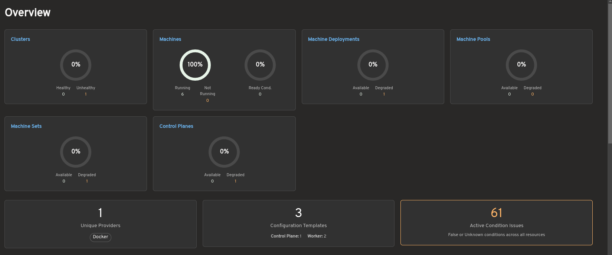
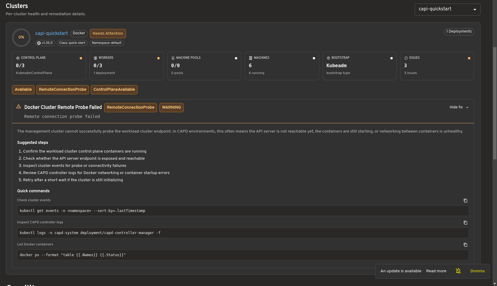
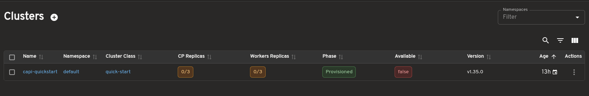
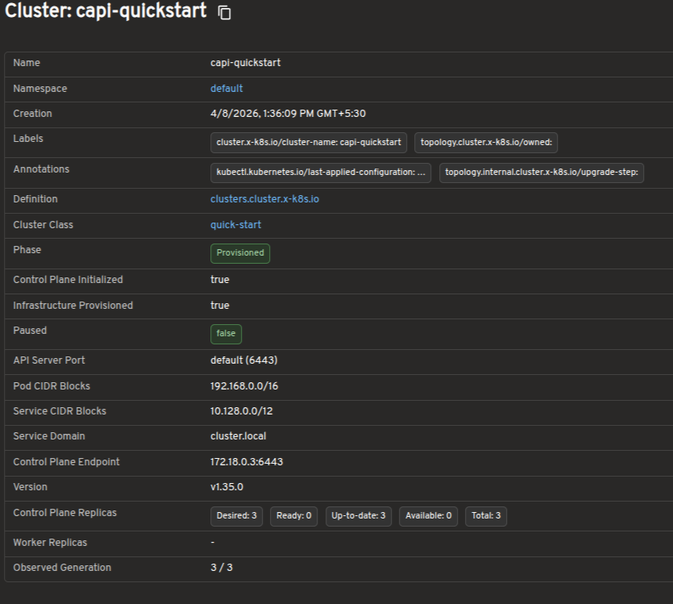
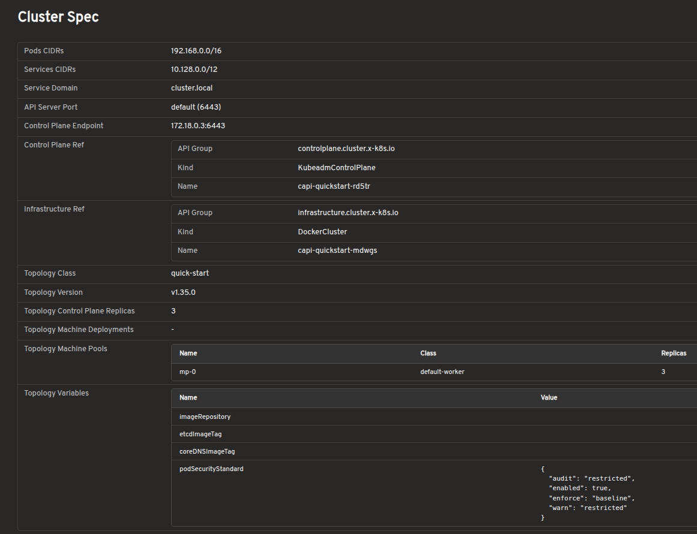
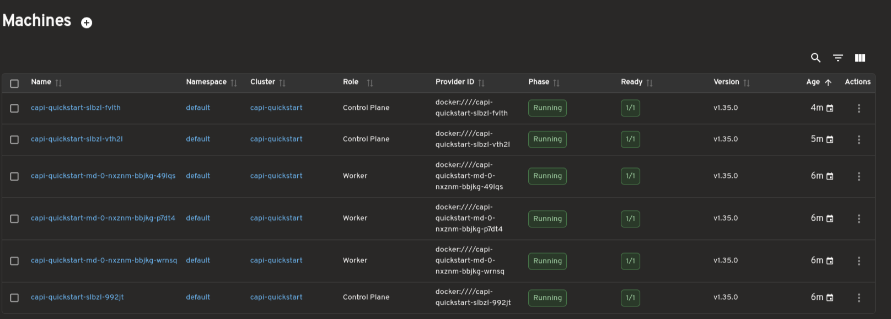
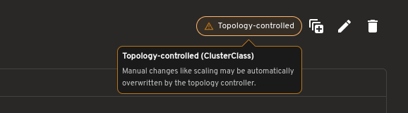
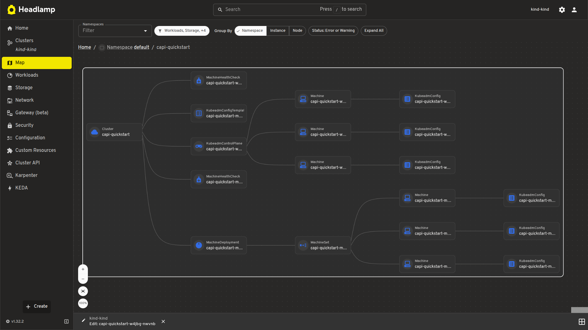
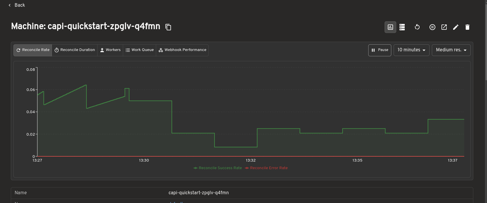

[Headlamp](https://headlamp.dev/) is an open-source, extensible Kubernetes SIG UI
project designed to let you explore, manage, and debug cluster resources directly
from a browser.

[Cluster API (CAPI)](https://cluster-api.sigs.k8s.io) is a Kubernetes sub-project
that brings declarative, Kubernetes-style APIs to cluster lifecycle management. It
lets platform teams provision, upgrade, and manage the lifecycle of Kubernetes
clusters using standard Kubernetes objects stored and reconciled in a management
cluster.

Managing Cluster API resources has historically required raw `kubectl` commands and
deep familiarity with ownership hierarchies. The Headlamp Cluster API plugin brings
visual clarity, faster debugging, and simplified operations for platform teams,
directly inside Headlamp.

## What this plugin provides

The Cluster API plugin adds a dedicated Cluster API section to Headlamp and brings
full visibility into core CAPI resources through consistent list and detail views.

| Feature | Description |
|---|---|
| **Cluster overview** | View clusters with live control plane and worker replica status. |
| **Machine visibility** | Inspect MachineDeployments, MachineSets, Machines, and MachinePools with status and conditions. |
| **Cluster API dashboard** | Get a centralized view of Cluster API resource health, active condition issues, provider information, and remediation guidance. |
| **Control plane monitoring** | Track KubeadmControlPlane replicas, versions, and associated Machines. |
| **Scale from the UI** | Scale MachineDeployments and MachineSets directly from Headlamp. |
| **Owned resource hierarchy** | Trace relationships between clusters, deployments, sets, and machines. |
| **KubeadmConfig inspection** | View bootstrap configs, files, kubelet args, and join/init settings. |
| **Topology awareness** | Automatically detect and label ClusterClass-managed resources. |
| **Map view** | Visualize Cluster, Control Plane, and Worker relationships. |
| **Dynamic API versioning** | Supports both v1beta1 and v1beta2 Cluster API versions. |
| **Prometheus metrics** | View live metrics from the [Headlamp Prometheus plugin](https://github.com/headlamp-k8s/plugins/tree/main/prometheus) inline on Cluster API resource detail pages. |

## A tour of the plugin

The Headlamp Cluster API plugin brings core Cluster API resources into a consistent,
visual interface inside Headlamp. Here are some of the key views included in the
first release.

### Cluster API dashboard

The dashboard provides a centralized view of Cluster API resources and their
health across a management cluster.

The overview summarizes the status of clusters, Machines, MachineDeployments,
MachinePools, MachineSets, and control planes. It also highlights active
condition issues, provider information, and configuration template counts to
help operators quickly identify degraded or unhealthy resources.

Selecting a cluster opens a detailed health view showing control plane and
worker status, machine information, infrastructure details, and resource
conditions. When issues are detected, the dashboard provides remediation
guidance and diagnostic commands to assist with troubleshooting.

### Bring full Cluster API visibility into Headlamp

The cluster list view shows all Cluster resources in the management cluster,
including control plane and worker replica status. This gives you an at-a-glance
understanding of overall cluster health.

The cluster detail view provides resource status, conditions, infrastructure
references, control plane references, and related Machines on a single page.

### Explore Cluster API resources in a visual interface

Dedicated views are available for MachineDeployments, MachineSets, Machines, and
MachinePools. These pages surface replica counts, ownership relationships, provider
IDs, versions, and conditions to support day-to-day operations and debugging.

### Scale workloads directly from Headlamp

MachineDeployments and MachineSets include a built-in Scale action, allowing you to
adjust replica counts directly from Headlamp without using terminal commands.

For topology-managed clusters, the plugin also indicates when scaling should be
performed at the Cluster level.

### Inspect bootstrap configuration without raw YAML

Bootstrap configurations can be viewed in a structured format, including inline
files, kubelet arguments, extra volumes, and join or init settings. This removes
the need to inspect raw YAML or secrets manually.

### Visualize cluster relationships with map view

A visual map view displays the relationships between Cluster, control plane, and
worker resources. It offers a faster way to understand ownership hierarchies and
overall cluster structure.

### Prometheus metrics integration

The Cluster API plugin integrates with the
[Headlamp Prometheus plugin](https://github.com/headlamp-k8s/plugins/tree/main/prometheus)
to surface metrics directly inside Cluster API resource detail pages.

When the Prometheus plugin is installed and configured, metrics are embedded inline
on the detail pages for Clusters, MachineDeployments, MachineSets, and Machines.
You can view resource health and performance data alongside status conditions and
ownership relationships, without switching to a separate dashboard.

This makes it easier to correlate infrastructure state with live metrics during
debugging or day-to-day cluster operations, all from within Headlamp.

## How to use

See the
[`plugins/cluster-api/README.md`](https://github.com/headlamp-k8s/plugins/blob/main/cluster-api/README.md)
for installation and usage instructions.

## Developed during LFX Mentorship

This plugin was developed as part of the CNCF LFX Mentorship program under the
Headlamp project. The mentorship provided an opportunity to work closely with the
Headlamp community while building features to improve the Cluster API management
experience.

The focus was not only on implementing features but also on understanding real-world
usability challenges around Cluster API operations. Discussions with mentors and
community members helped shape the plugin's direction, improve the user experience,
and prioritize features most useful to platform teams.

The mentorship also provided valuable experience contributing to large open-source
projects: collaborating with maintainers, participating in design discussions,
handling release feedback, and iterating on features based on community input.

Work on the plugin is ongoing, with additional improvements and features planned
beyond the initial Alpha release.

## Feedback and questions

This is an Alpha release, and community feedback directly shapes what comes next.

- **Bug reports:** [Open an issue](https://github.com/kubernetes-sigs/headlamp/issues)
- **Feature requests:** [Start a discussion](https://github.com/kubernetes-sigs/headlamp/discussions)
- **Contributing:** [PRs are welcome](https://github.com/kubernetes-sigs/headlamp/pulls)
- **Kubernetes Slack:** [Join the #headlamp channel](https://slack.k8s.io/) for questions and discussion