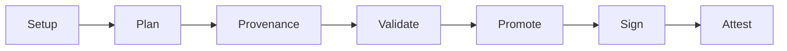

Every container image you pull from `registry.k8s.io` got there through
[`kpromo`](https://github.com/kubernetes-sigs/promo-tools), the Kubernetes image
promoter. It copies images from staging registries to
production, signs them with [cosign](https://sigstore.dev), replicates
signatures across more than 20 regional mirrors, and generates
[SLSA](https://slsa.dev) provenance attestations. If this tool breaks, no
Kubernetes release ships. Over the past few weeks, we rewrote its core from
scratch, deleted 20% of the codebase, made it dramatically faster, and
nobody noticed. That was the whole point.

## A bit of history

The image promoter started in late 2018 as an internal Google project by
[Linus Arver](https://github.com/listx). The goal was simple: replace the
manual, Googler-gated process of copying container images into `k8s.gcr.io` with
a community-owned, GitOps-based workflow. Push to a staging registry, open a PR
with a YAML manifest, get it reviewed and merged, and automation handles the
rest. [KEP-1734](https://github.com/kubernetes/enhancements/blob/master/keps/sig-release/1734-k8s-image-promoter/README.md)
formalized this proposal.

In early 2019, the code moved to `kubernetes-sigs/k8s-container-image-promoter`
and grew quickly. Over the next few years,
[Stephen Augustus](https://github.com/justaugustus) consolidated multiple tools
(`cip`, `gh2gcs`, `krel promote-images`, `promobot-files`) into a single CLI
called `kpromo`. The repository was renamed to
[`promo-tools`](https://github.com/kubernetes-sigs/promo-tools).
[Adolfo Garcia Veytia (Puerco)](https://github.com/puerco) added cosign signing
and SBOM support. [Tyler Ferrara](https://github.com/tylerferrara) built
vulnerability scanning. [Carlos Panato](https://github.com/cpanato) kept the project in a healthy and
releasable state. 42 contributors made about 3,500 commits across more than 60 releases.

It worked. But by 2025 the codebase carried the weight of seven years of
incremental additions from multiple SIGs and subprojects. The README
[said it plainly](https://github.com/kubernetes-sigs/promo-tools/blob/7b6d515b78aadd617c8060a223786f8e57aa061f/README.md#disclaimer):
you will see duplicated code, multiple techniques for accomplishing the same
thing, and several TODOs.

## The problems we needed to solve

Production promotion jobs for Kubernetes core images regularly took over 30
minutes and frequently failed with rate limit errors. The core promotion logic
had grown into a monolith that was
[hard to extend](https://github.com/kubernetes-sigs/promo-tools/issues/1177)
and difficult to test, making new features like provenance or vulnerability
scanning painful to add.

On the [SIG Release roadmap](https://github.com/kubernetes/sig-release/blob/master/roadmap.md),
two work items had been sitting for a while: "Rewrite artifact promoter" and
"Make artifact validation more robust". We had discussed these at SIG Release
meetings and KubeCons, and the open research spikes on
[project board #171](https://github.com/orgs/kubernetes/projects/171) captured
eight questions that needed answers before we could move forward.

## One issue to answer them all

In February 2026, we opened [issue #1701](https://github.com/kubernetes-sigs/promo-tools/issues/1701)
("Rewrite artifact promoter pipeline") and answered all eight spikes in a single
tracking issue. The rewrite was deliberately phased so that each step could be
reviewed, merged, and validated independently. Here is what we did:

**Phase 1: Rate Limiting** ([#1702](https://github.com/kubernetes-sigs/promo-tools/pull/1702)).
Rewrote rate limiting to properly throttle all registry operations with adaptive
backoff.

**Phase 2: Interfaces** ([#1704](https://github.com/kubernetes-sigs/promo-tools/pull/1704)).
Put registry and auth operations behind clean interfaces so they can be swapped
out and tested independently.

**Phase 3: Pipeline Engine** ([#1705](https://github.com/kubernetes-sigs/promo-tools/pull/1705)).
Built a pipeline engine that runs promotion as a sequence of distinct phases
instead of one large function.

**Phase 4: Provenance** ([#1706](https://github.com/kubernetes-sigs/promo-tools/pull/1706)).
Added SLSA provenance verification for staging images.

**Phase 5: Scanner and SBOMs** ([#1709](https://github.com/kubernetes-sigs/promo-tools/pull/1709)).
Added vulnerability scanning and SBOM support. Flipped the default to the new
pipeline engine. At this point we cut
[v4.2.0](https://github.com/kubernetes-sigs/promo-tools/releases/tag/v4.2.0) and let it
soak in production before continuing.

**Phase 6: Split Signing from Replication** ([#1713](https://github.com/kubernetes-sigs/promo-tools/pull/1713)).
Separated image signing from signature replication into their own pipeline
phases, eliminating the rate limit contention that caused most production
failures.

**Phase 7: Remove Legacy Pipeline** ([#1712](https://github.com/kubernetes-sigs/promo-tools/pull/1712)).
Deleted the old code path entirely.

**Phase 8: Remove Legacy Dependencies** ([#1716](https://github.com/kubernetes-sigs/promo-tools/pull/1716)).
Deleted the audit subsystem, deprecated tools, and e2e test infrastructure.

**Phase 9: Delete the Monolith** ([#1718](https://github.com/kubernetes-sigs/promo-tools/pull/1718)).
Removed the old monolithic core and its supporting packages. Thousands of lines
deleted across phases 7 through 9.

Each phase shipped independently.
[v4.3.0](https://github.com/kubernetes-sigs/promo-tools/releases/tag/v4.3.0) followed
the next day with the legacy code fully removed.

With the new architecture in place, a series of follow-up improvements landed:
parallelized registry reads
([#1736](https://github.com/kubernetes-sigs/promo-tools/pull/1736)),
retry logic for all network operations
([#1742](https://github.com/kubernetes-sigs/promo-tools/pull/1742)),
per-request timeouts to prevent pipeline hangs
([#1763](https://github.com/kubernetes-sigs/promo-tools/pull/1763)),
HTTP connection reuse
([#1759](https://github.com/kubernetes-sigs/promo-tools/pull/1759)),
local registry integration tests
([#1746](https://github.com/kubernetes-sigs/promo-tools/pull/1746)),
the removal of deprecated credential file support
([#1758](https://github.com/kubernetes-sigs/promo-tools/pull/1758)),
a rework of attestation handling to use cosign's OCI APIs and the removal of
deprecated SBOM support
([#1764](https://github.com/kubernetes-sigs/promo-tools/pull/1764)),
and a dedicated promotion record predicate type registered with the
[in-toto attestation framework](https://github.com/in-toto/attestation)
([#1767](https://github.com/kubernetes-sigs/promo-tools/pull/1767)).
These would have been much harder to land without the clean separation the
rewrite provided.
[v4.4.0](https://github.com/kubernetes-sigs/promo-tools/releases/tag/v4.4.0)
shipped all of these improvements and enabled provenance generation and
verification by default.

## The new pipeline

The promotion pipeline now has seven clearly separated phases:

| Phase | What it does |
|-------|-------------|
| **Setup** | Validate options, prewarm TUF cache. |
| **Plan** | Parse manifests, read registries, compute which images need promotion. |
| **Provenance** | Verify SLSA attestations on staging images. |
| **Validate** | Check cosign signatures, exit here for dry runs. |
| **Promote** | Copy images server-side, preserving digests. |
| **Sign** | Sign promoted images with keyless cosign. |
| **Attest** | Generate promotion provenance attestations using a dedicated [in-toto](https://in-toto.io) predicate type. |

Phases run sequentially, so each one gets exclusive access to the full rate
limit budget. No more contention. Signature replication to mirror registries is
no longer part of this pipeline and runs as a
[dedicated periodic Prow job](https://prow.k8s.io/?job=ci-k8sio-image-signature-replication)
instead.

## Making it fast

With the architecture in place, we turned to performance.

**Parallel registry reads** ([#1736](https://github.com/kubernetes-sigs/promo-tools/pull/1736)):
The plan phase reads 1,350 registries. We parallelized this and the plan phase
dropped from about 20 minutes to about 2 minutes.

**Two-phase tag listing** ([#1761](https://github.com/kubernetes-sigs/promo-tools/pull/1761)):
Instead of checking all 46,000 image groups across more than 20 mirrors, we first check
only the source repositories. About 57% of images have no signatures at all
because they were promoted before signing was enabled. We skip those entirely,
cutting API calls roughly in half.

**Source check before replication** ([#1727](https://github.com/kubernetes-sigs/promo-tools/pull/1727)):
Before iterating all mirrors for a given image, we check if the signature
exists on the primary registry first. In steady state where most signatures are
already replicated, this reduced the work from about 17 hours to about 15
minutes.

**Per-request timeouts** ([#1763](https://github.com/kubernetes-sigs/promo-tools/pull/1763)):
We observed intermittent hangs where a stalled connection blocked the pipeline
for over 9 hours. Every network operation now has its own timeout and transient
failures are retried automatically.

**Connection reuse** ([#1759](https://github.com/kubernetes-sigs/promo-tools/pull/1759)):
We started reusing HTTP connections and auth state across operations, eliminating
redundant token negotiations. This closed a
[long-standing request](https://github.com/kubernetes-sigs/promo-tools/issues/842)
from 2023.

## By the numbers

Here is what the rewrite looks like in aggregate.

- Over 40 PRs merged, 3 releases shipped ([v4.2.0](https://github.com/kubernetes-sigs/promo-tools/releases/tag/v4.2.0), [v4.3.0](https://github.com/kubernetes-sigs/promo-tools/releases/tag/v4.3.0), [v4.4.0](https://github.com/kubernetes-sigs/promo-tools/releases/tag/v4.4.0))
- Over 10,000 lines added and over 16,000 lines deleted, a net reduction
  of about 5,000 lines (20% smaller codebase)
- Performance drastically improved across the board
- Robustness improved with retry logic, per-request timeouts, and adaptive rate limiting
- 19 long-standing issues closed

The codebase shrank by a fifth while gaining provenance attestations, a pipeline
engine, vulnerability scanning integration, parallelized operations, retry
logic, integration tests against local registries, and a standalone signature
replication mode.

## No user-facing changes

This was a hard requirement. The `kpromo cip` command accepts the same flags and
reads the same YAML manifests. The
[`post-k8sio-image-promo`](https://prow.k8s.io/?job=post-k8sio-image-promo)
Prow job continued working throughout. The promotion manifests in
[kubernetes/k8s.io](https://github.com/kubernetes/k8s.io) did not change. Nobody
had to update their workflows or configuration.

We caught two regressions early in production. One ([#1731](https://github.com/kubernetes-sigs/promo-tools/pull/1731))
caused a registry key mismatch that made every image appear as "lost" so that
nothing was promoted. Another ([#1733](https://github.com/kubernetes-sigs/promo-tools/pull/1733))
set the default thread count to zero, blocking all goroutines. Both were fixed
within hours. The phased release strategy ([v4.2.0](https://github.com/kubernetes-sigs/promo-tools/releases/tag/v4.2.0) with the new engine, [v4.3.0](https://github.com/kubernetes-sigs/promo-tools/releases/tag/v4.3.0)
with legacy code removed) gave us a clear rollback path that we fortunately
never needed.

## What comes next

Signature replication across all mirror registries remains the most expensive
part of the promotion cycle. [Issue #1762](https://github.com/kubernetes-sigs/promo-tools/issues/1762)
proposes eliminating it entirely by having
[archeio](https://github.com/kubernetes/registry.k8s.io) (the `registry.k8s.io`
redirect service) route signature tag requests to a single canonical upstream
instead of per-region backends. Another option would be to move signing closer
to the registry infrastructure itself. Both approaches need further discussion
with the SIG Release and infrastructure teams, but either one would remove
thousands of API calls per promotion cycle and simplify the codebase even
further.

## Thank you

This project has been a community effort spanning seven years. Thank you to
[Linus](https://github.com/listx),
[Stephen](https://github.com/justaugustus),
[Adolfo](https://github.com/puerco),
[Carlos](https://github.com/cpanato),
[Ben](https://github.com/BenTheElder),
[Marko](https://github.com/xmudrii),
[Lauri](https://github.com/lasomethingsomething),
[Tyler](https://github.com/tylerferrara),
[Arnaud](https://github.com/ameukam), and many others who contributed
code, reviews, and planning over the years. The SIG Release and Release
Engineering communities provided the context, the discussions, and the patience
for a rewrite of infrastructure that every Kubernetes release depends on.

If you want to get involved, join us in
[`#release-management`](https://kubernetes.slack.com/archives/C2C40FMNF) on the
Kubernetes Slack or check out the
[repository](https://github.com/kubernetes-sigs/promo-tools).
