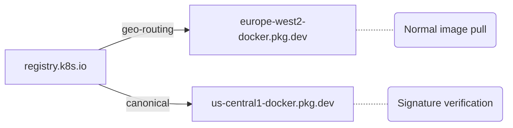

The [image promoter rewrite](/blog/2026/03/17/image-promoter-rewrite/) laid the
groundwork for simplifying how Kubernetes delivers container image signatures.
One of the rewrite phases (Phase 6) separated image signing from signature
replication into distinct pipeline stages. This follow-up covers the next step:
eliminating signature replication entirely.

## The problem

After promoting container images to `registry.k8s.io`, the promoter signs them
using [cosign](https://github.com/sigstore/cosign) with keyless (OIDC)
signatures. These signatures are stored as OCI artifacts alongside the images,
tagged with the convention `sha256-<digest>.sig` and `sha256-<digest>.att`.

The `registry.k8s.io` domain is backed by [archeio](https://github.com/kubernetes/registry.k8s.io),
a thin redirector that routes container image requests to the nearest regional
[Google Artifact Registry](https://cloud.google.com/artifact-registry) backend.
When a user in Europe pulls an image, archeio redirects them to
`europe-west2-docker.pkg.dev`; a user in Asia gets redirected to
`asia-east1-docker.pkg.dev`, and so on across 22 regional backends.

This geo-routing is great for image layers, where download locality matters for
performance. But it created a problem for signatures: if the promoter only wrote
a signature to one region, `cosign verify` would fail for users redirected to
any other region. The solution was a dedicated replication pipeline that copied
every `.sig` and `.att` tag to all 22 regional backends. This pipeline ran as a
periodic Prow job (`ci-k8sio-image-signature-replication`)
every 2 hours on weekdays, performing thousands of API calls per run: listing
tags across all repositories, diffing what existed where, and copying the
missing signatures.

## The insight

Signatures and attestations are small metadata artifacts, typically a few
kilobytes each. Unlike image layers where geo-locality provides meaningful
download performance improvements, fetching a signature from a non-local region
adds negligible latency. The entire replication pipeline existed to optimize for
a latency difference that users would never notice.

## The solution

Instead of replicating signatures everywhere, we taught archeio to route
signature requests to a single canonical upstream. The change is
straightforward: when archeio receives a manifest request for a tag matching
`sha256-*.sig` or `sha256-*.att`, it redirects to
`us-central1-docker.pkg.dev` (the canonical region) instead of the
caller's nearest regional backend. All other requests continue to use
geo-routing as before.



This is configured through a new `SIGNATURE_UPSTREAM_ENDPOINT` environment
variable on each Cloud Run instance that runs archeio.

On the promoter side, the signing target was updated to explicitly use
`us-central1-docker.pkg.dev` as the canonical registry, instead of relying on
alphabetical sorting of registry names (which would have picked
`asia-east1-docker.pkg.dev`). The `replicate-signatures` subcommand was then
removed along with all supporting code.

## What changed

The rollout was sequenced to ensure signature verification kept working at
every step:

1. [kubernetes/registry.k8s.io#321](https://github.com/kubernetes/registry.k8s.io/pull/321):
   Added `SIGNATURE_UPSTREAM_ENDPOINT` support to archeio
2. [kubernetes/k8s.io#9413](https://github.com/kubernetes/k8s.io/pull/9413):
   Deployed the new environment variable to all Cloud Run instances and updated
   the archeio image digest
3. Verified that `cosign verify` works against `registry.k8s.io` and that
   `.sig`/`.att` requests redirect to `us-central1-docker.pkg.dev`
4. [kubernetes-sigs/promo-tools#1829](https://github.com/kubernetes-sigs/promo-tools/pull/1829):
   Removed the replication pipeline and updated the signing target, released
   as [kpromo v4.5.0](https://github.com/kubernetes-sigs/promo-tools/releases/tag/v4.5.0)
5. [kubernetes/test-infra#36909](https://github.com/kubernetes/test-infra/pull/36909):
   Removed the periodic Prow replication job

## Impact

Removing signature replication:

- **Eliminates thousands of API calls** that were spent listing tags and
  copying signatures across 22 regions every 2 hours
- **Removes a source of transient failures**, since the replication job was
  susceptible to Artifact Registry rate limits
- **Simplifies the promoter codebase** by deleting the two-phase tag listing,
  multi-registry grouping logic, and concurrent copy orchestration (over 1,200
  lines removed)
- **Removes a periodic Prow job** that ran on weekdays

End users see no change. `cosign verify` against `registry.k8s.io` continues to
work exactly as before:

```shell
cosign verify registry.k8s.io/kube-apiserver:v1.36.0 \
  --certificate-identity krel-trust@k8s-releng-prod.iam.gserviceaccount.com \
  --certificate-oidc-issuer https://accounts.google.com
```

## Trade-offs

Routing all signature requests to a single region means that if
`us-central1` is unavailable, `cosign verify` for images served through
`registry.k8s.io` would fail until the region recovers. This is the main
trade-off of the approach.

A few mitigating factors make this acceptable in practice:

- Artifact Registry is a managed Google Cloud service with high regional
  availability. An outage of `us-central1` would likely affect far more
  than just signature serving.
- Signatures are small metadata (a few KB). Even during normal operation,
  `cosign` already depends on registry availability for verification, whether
  the manifest comes from a regional or central backend.
- Image pulls themselves are unaffected. Geo-routing for image layers
  continues to work independently of signature availability.

## What's next

The broader Kubernetes ecosystem is moving toward
[OCI 1.1 referrers](https://github.com/opencontainers/distribution-spec/blob/main/spec.md#listing-referrers)
for signature discovery, replacing the tag-based convention that cosign has used
historically. Cosign v3 defaults to storing signatures as OCI referrers. As this
migration progresses, the tag-matching logic in archeio can eventually be
replaced with referrer-aware routing.

## Getting involved

This work is tracked in
[kubernetes-sigs/promo-tools#1762](https://github.com/kubernetes-sigs/promo-tools/issues/1762).
If you are interested in contributing to
[SIG Release](https://github.com/kubernetes/community/tree/master/sig-release),
join our [weekly meeting](http://bit.ly/k8s-sig-release-meeting) or reach out on
the [#sig-release](https://kubernetes.slack.com/messages/sig-release) Slack
channel.
