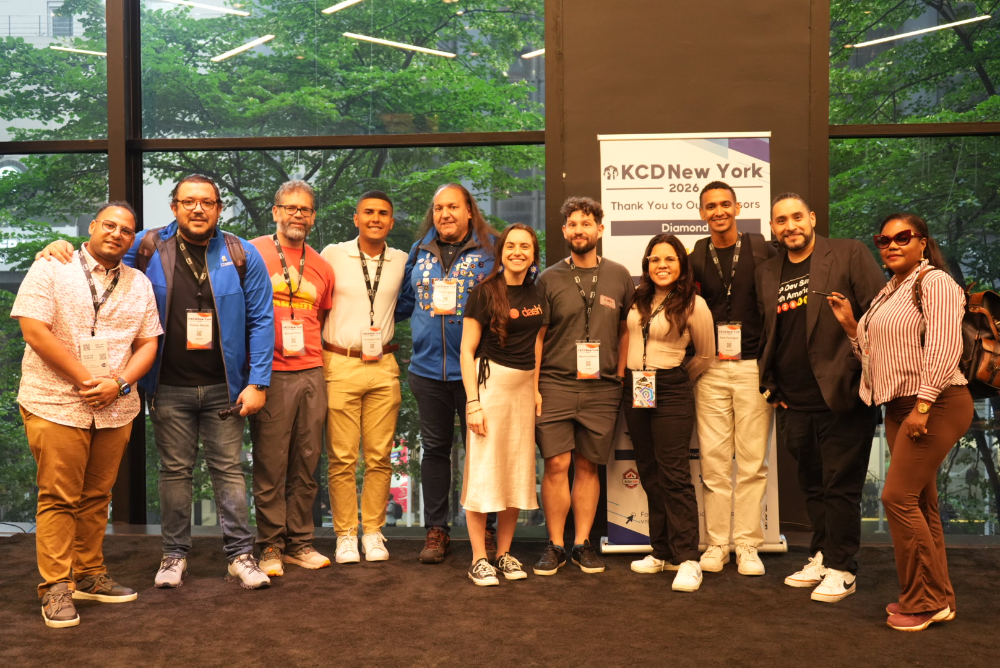

Welcome to KCD Around the World, a new series where we explore [Kubernetes Community Days](https://www.cncf.io/kcds/) from every corner of the globe. When most people think of KCD, they think about talks and technical sessions, but behind every event is a community of volunteers, contributors, organizers and attendees who make it all happen. Through conversations with the people behind each KCD, we'll share what makes it unique.

Our first stop: New York City. To learn what made this year's event special, we interview Christopher Tineo, one of the organizers for KCD NY 2026.

## Meet the community

**Kashish Verma (KV):** Hello Christopher, and welcome. Could you start by introducing yourself and telling us how you got involved with Kubernetes and the cloud native community?

**Christopher Tineo (CT):** I'm Christopher Tineo. This year I organized KCD NY 2026, where my main focus was building out the event agenda and our [event website](https://kcdnewyork.com).

Going back a bit, I first got involved through a meetup organized in Santo Domingo by Victor Recio around Feb 2024, right after I got my [CKAD certification](https://kubernetes.io/training/). I had the chance to connect with a few engineers who eventually became organizers for our [CNCF chapter](https://www.linkedin.com/company/cloudnativesdq), Ayesha Yege and Enmanuel Medina.

As I dived deeper into the CNCF community, I knew I wanted to be a part of it. After watching Julia Morgado's inspiring talk at [Kubecon 2023](https://www.youtube.com/watch?v=rqtENN7iveQ&t=32s&pp=ygUgZnJvbSBub24tdGVjaCB0byBjbmNmIGFtYmFzc2Fkb3I%3D), I was driven to take action. Despite living in the Dominican Republic, I booked a flight to KCD NY 2024 and applied to volunteer. Luckily, I got a spot on the team, and it turned out to be an incredible firsthand experience with the community.

**KV:** What motivated you to volunteer or organize KCD New York?

**CT:** NYC has been the start of all the great things that came after that first KCD NY in 2024, so I wanted to be that person that could motivate more engineers from my country to improve their careers and learn more from the Cloud Native community, which wasn't as developed back then.

Attending as a volunteer in 2024 is what motivated me to come back as a speaker last year. This year I had the privilege of being an organizer.

**KV:** Every KCD has its own personality. What makes the New York community unique?

**CT:** What I love about KCD New York is its unique ability to bring together engineers from all over the world. That rich multiculturalism gives it the distinct energy of a mini-KubeCon.

**KV:** What was the atmosphere like on event day?

**CT:** Organizing my first KCD this year was an entirely new experience. I underestimated the effort required to pull off an event of this scale, but by the end of the day, seeing both speakers and attendees thanking us for the conference and having the chance to meet some of our speakers was incredibly rewarding.

**KV:** Was there a moment that made you stop and think, "This is why we do this"?

**CT:** The closing remarks were really emotional for me. Seeing my mentor take the stage as a speaker, alongside my friends and co-organizers from Cloud Native Santo Domingo, was surreal. Just a few years ago, this was a dream for me, and watching it become a reality made me feel proud of how far we've come. Seeing them thrive in their careers is far more rewarding to me than any personal achievement from the event.

## Beyond the talks

**KV:** What conversations were happening in the hallways between sessions?

**CT:** I really had the chance to catch up with some old friends from the community like Chad Crowell and Diana Todea. I also finally got to meet Mauricio Salatino in person, after following his work for a long time.

**KV:** Did you meet anyone with an interesting story?

**CT:** Someone I really enjoyed talking with was [Daniel Giszpenc](https://github.com/Daniel-Giszpenc). Despite being early in his career, he's already a maintainer for SIG Security on the Kubernetes project which I found really impressive. I can't wait to see him excel in the years ahead.

**KV:** What topics generated the most excitement this year?

**CT:** AI Agents in production, Platform Engineering and Runtime Security. And if you missed any of the sessions, we've got the recordings up on our [YouTube channel](https://www.youtube.com/@KCDNewYork), so you can still go back and watch.

## Looking ahead

**KV:** For someone considering their first KCD, what would you tell them?

**CT:** Please check out the upcoming [KCDs on the CNCF website](https://www.cncf.io/kcds/). If there isn't an edition near you and it's within your means, I highly recommend traveling to one. Traveling has been one of the most transformative experiences for me. It hasn't just let me experience new cultures; more importantly, it's completely shifted my perspective on our industry. It helped me build a global network that I never could have created within my home country.

**KV:** What's next for the New York Kubernetes community?

**CT:** Please join [#cloud-native-new-york](https://cloud-native.slack.com/archives/C0902SX19T6) on CNCF Slack, our [ocgroups.dev chapter](https://ocgroups.dev/cncf/group/5pcu8cb) and follow us on [LinkedIn](https://www.linkedin.com/company/cloud-native-nyc/) where we would be publishing our upcoming meetups.

For newcomers, I encourage you to join our meetups and reach out to us for opportunities to make our meetups better, whether by helping promote them on social media, connecting us with speakers, or helping find venues to host them!

## Next stop...

KCD Around the World continues as we visit another community and learn about the people helping Kubernetes grow around the globe.