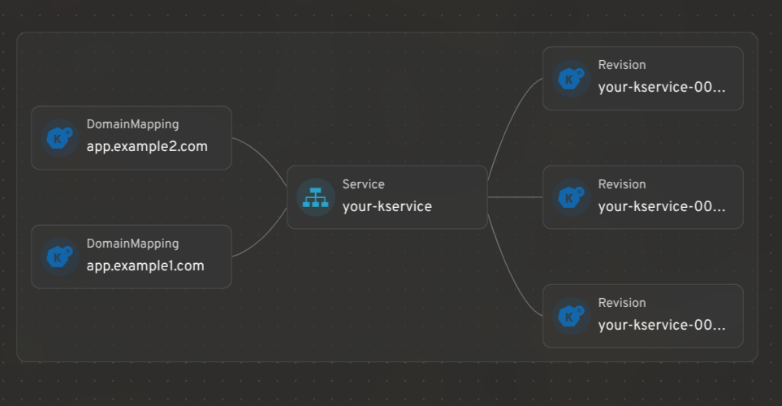
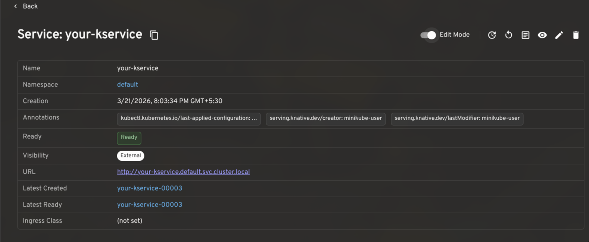
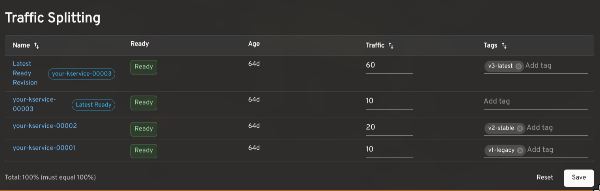
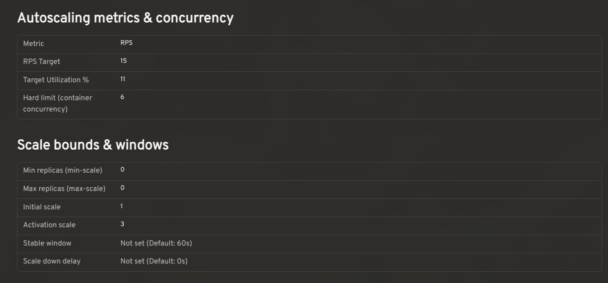
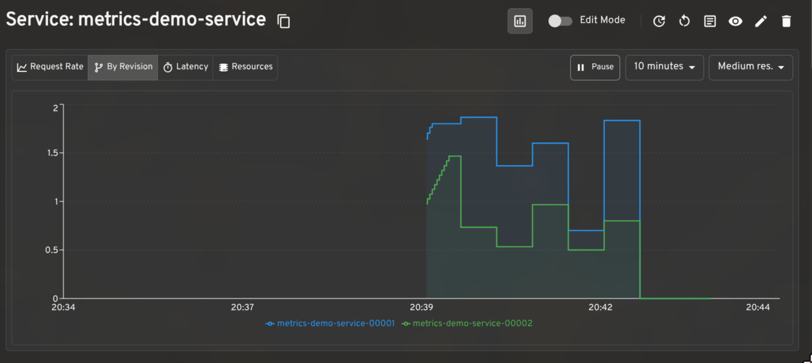
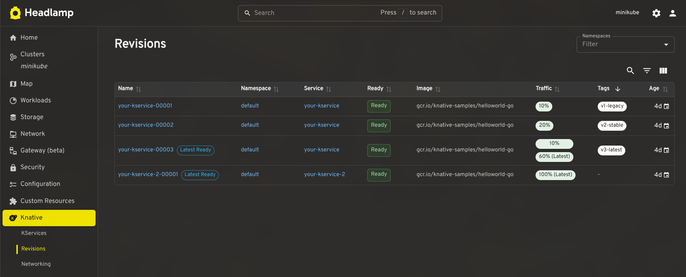
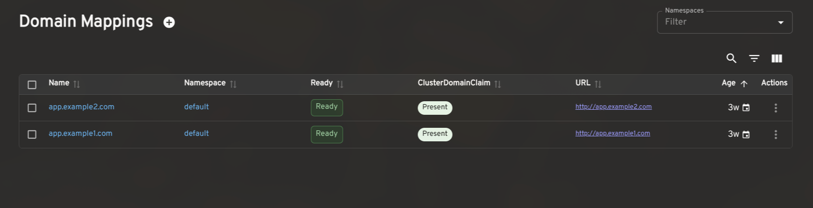
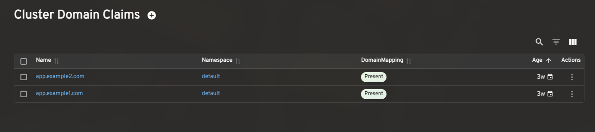

[Headlamp](https://headlamp.dev/) is an open-source, extensible Kubernetes SIG UI project designed to let you explore, manage, and debug cluster resources.

[Knative](https://knative.dev/) brings serverless workloads to Kubernetes, handling traffic routing, autoscaling, and revision management so teams can deploy and iterate without fighting infrastructure. But operating Knative workloads day-to-day can be difficult, there's still a lot of jumping between the `kn` CLI, `kubectl`, and the Kubernetes UI to get a full picture of what's running.

We built the [Headlamp Knative plugin](https://github.com/headlamp-k8s/plugins/tree/main/knative) to bridge that very gap, allowing operators to inspect, understand and act on their workloads all from a single place. This plugin was built as part of the LFX mentorship. Here's a tour of what we shipped.

Here is a short walkthrough of the Knative plugin for Headlamp:



## Integrating Knative resources with Headlamp's map view

Headlamp's resource mapping works for Knative CRDs too. You can see how KServices, Revisions, and DomainMappings relate to each other in a single graph view.

## KService management: edit traffic splits, restart pods, and view logs

A KService is the top-level resource in Knative: it manages the lifecycle of Routes, Configurations, Revisions, and everything needed to run and expose your application.

The plugin gives KServices a full detail view with an **Edit Mode** toggle for making live changes to traffic splits, autoscaling annotations, and more. Common actions like viewing the YAML, opening logs, triggering a redeploy, or restarting backing pods are surfaced in the header, gated by your current RBAC permissions.

## Traffic splitting: route across revisions for gradual rollouts and testing

Knative makes it possible to route traffic across multiple Revisions of the same service. This is useful for canary releases, gradual rollouts, tagged preview URLs, and A/B testing.

The plugin shows the traffic assigned to each Revision, the latest ready Revision, readiness status, age, and configured tags. In edit mode, you can adjust percentages and tags inline. The plugin validates that traffic sums to 100% and that tags are unique before saving. Tagged routes with a reported URL render as clickable links.

## Autoscaling configuration: view effective settings and cluster defaults

Knative's autoscaler supports a range of settings: concurrency targets, target utilization, RPS targets, min/max scale, initial scale, stable window, scale-down delay, and more. The effective value for any workload is a combination of KService-level annotations and cluster-wide ConfigMaps.

The plugin reads `config-autoscaler` and `config-defaults` and shows the effective configuration per KService in context, so you can see at a glance whether a setting is explicitly configured or falling back to the cluster default.

## Prometheus metrics: monitor request rates, latency, and resource utilization

When paired with the [Prometheus plugin for Headlamp](https://github.com/headlamp-k8s/plugins/tree/main/plugins/prometheus), the plugin renders request rate, latency, and resource utilization graphs on KService and Revision detail pages. The per-revision request rate breakdown is particularly useful when validating a traffic split in progress.

## Dashboard for other CRDs

The plugin also includes list and detail views for Revisions, DomainMappings, ClusterDomainClaims, and a cluster-level Networking overview (reading `config-network` and `config-gateway` to surface the effective ingress class, gateway settings, and backing services). These give operators a complete picture of Knative's state without leaving Headlamp.

## How to install the Knative plugin in Headlamp

1. Make sure [Knative is installed](https://knative.dev/docs/install/) in your cluster.
2. In Headlamp Desktop, open the **Plugin Catalog**, search for Knative, and click Install.
3. Reload Headlamp, a new Knative entry will appear in the sidebar.

For development or source-level setup, see the [Knative plugin README](https://github.com/headlamp-k8s/plugins/tree/main/plugins/knative). The current release is [**0.3.0-beta**](https://github.com/headlamp-k8s/plugins/releases/tag/knative-0.3.0-beta).

## Share your feedback

We'd love feedback from Knative operators and users. If you hit a bug or want support for a workflow we haven't covered, [please open an issue](https://github.com/headlamp-k8s/plugins/issues). You can also find us in the [Kubernetes Slack #headlamp channel](https://kubernetes.slack.com/archives/headlamp).