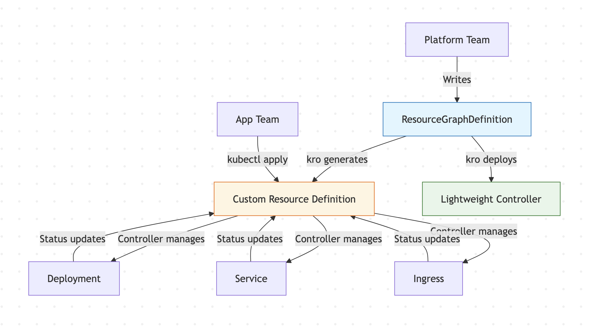
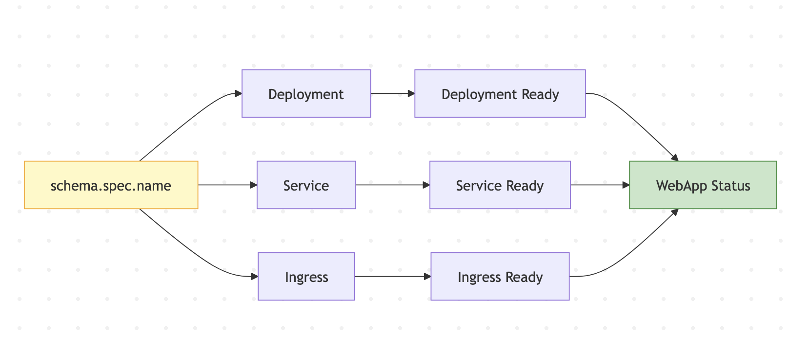
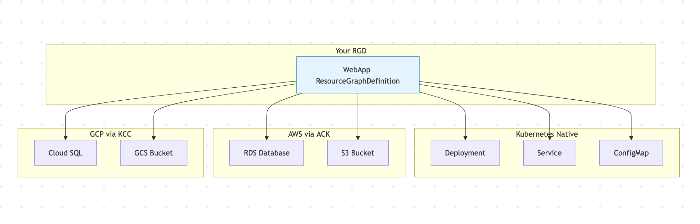

Look, I have been there. You are on the platform team and someone from anotheteam pings you on slack with what sounds like simplest request: "Hey, can i get a web app deployed ?"

Simple. Right.

You know exactly how this goes. by the time you have actually figured out what they need, you are stitching together a Deployment, a Service, an Ingress, a ConfigMap, a ServiceAccount, some network policies, and they also need a database. What started as "just a web app" turned into a 300-lines of YAML manifest file that you are now on the hook for maintaining forever.

And look, the tools we have aren't bad. Helm charts are solid for packaging. Kustomize handles overlays well enough. but helm is client side, not server-side validation, no lifecycle managemenet once the chart is applied. Kustomize gets messy when you need resources to depend on each other in a specific order. and writing a custom controller ? That's weeks of Go boilderplate for what is essentially "create resource A, wait for it to be ready, then create resource B."

There had to be better way. that's how i ended up looking at **Kube Resource Orchestrator (kro)**.

## What even is kro?

Kro - pronouced like the bird, "crow" - is a kubernetes-native project that lets you bundle multiple resources into a simgle, resuable API. No Go code required. None. Zero.

It started as an experiment over at AWS, but it didn't stay there long. Google cloud and Microsoft Azure jumped in, and it's a propoer cross-cloud effort hosted under [SIG Cloud Provider](https://github.com/kubernetes/community/tree/master/sig-cloud-provider). Anyone can use it, and honestly, more people should.

Here's the gist: you write a **ResourceGraphDefinition** (RGD) that describes a bunch of kubernetes resources and how they hook together. when someone creates an instance of your RGD, kro does the heavy lifting, then it generates the CRD, deploys a lightweight controller, and manages the whole lifecyle from creatiom through updates and drift detection.

Here's what that actually looks like:



## Let me show you what I mean

Say your platform team wants to give app teams a `WebApp` resource. One YAML file, and they are done. Here's what the RGD looks like from the platform side:

```yaml
apiVersion: kro.run/v1alpha1
kind: ResourceGraphDefinition
metadata:
  name: webapp
spec:
  schema:
    apiVersion: v1alpha1
    spec:
      name: string | default=my-app
      image: string | default=nginx
      replicas: integer | default=3 | minimum=1 | maximum=20
      enableIngress: boolean | default=false
      host: string | default=example.com
    status:
      url: ${deployment.status.conditions}
      ingressIP: ${ingress.status.loadBalancer.ingress[0].ip}

  resources:
    - id: deployment
      template:
        apiVersion: apps/v1
        kind: Deployment
        metadata:
          name: ${schema.spec.name}
        spec:
          replicas: ${schema.spec.replicas}
          selector:
            matchLabels:
              app: ${schema.spec.name}
          template:
            metadata:
              labels:
                app: ${schema.spec.name}
            spec:
              containers:
                - name: ${schema.spec.name}
                  image: ${schema.spec.image}
                  ports:
                    - containerPort: 80

    - id: service
      template:
        apiVersion: v1
        kind: Service
        metadata:
          name: ${schema.spec.name}
        spec:
          selector:
            app: ${schema.spec.name}
          ports:
            - protocol: TCP
              port: 80
              targetPort: 80

    - id: ingress
      includeWhen:
        - ${schema.spec.enableIngress == true}
      template:
        apiVersion: networking.k8s.io/v1
        kind: Ingress
        metadata:
          name: ${schema.spec.name}
        spec:
          rules:
            - host: ${schema.spec.host}
              http:
                paths:
                  - path: /
                    pathType: Prefix
                    backend:
                      service:
                        name: ${schema.spec.name}
                        port:
                          number: 80
```

A few things worth calling out here:

- The `schema` block is the only thing your app teams ever see. Everything elese is hidden - they don't need to know about Deployments or Ingresses or any of that. You control the abstraction.

- Resources reference each other with `${...}` expressions. kro figures out the dependency graph and creates things in the right order automatically. No more "oops, the Service got created before the Deployment" headaches.
  
- `includeWhen` lets you conditionally include resources. Don't need an Ingress? set `enableIngress: false` and it just... doesn't create one. Clean.
  
- The `status` block uses CEL expressions to pull info from the underlying resources and surface it back on the WebApp instance. Your users get a nice status without you having to write any controller logic.

An end user then creates a web app like this:

```yaml
apiVersion: acme.com/v1alpha1
kind: WebApp
metadata:
  name: my-app
spec:
  image: nginx:alpine
  replicas: 3
  enableIngress: true
  host: myapp.example.com
```

That's it. That's the whole thing. Kro creates the Deployment, the Service, and the Ingress, wires them together, and reports the status back on the `WebApp` resource. Your app team is happy, and you didn't have to write a single line of Go.

## How kro figures out what to do

Under the hood, kor analyzes all the CEL expressions in your RGD, builds a dependecy graph, and creates resources in the right order. If the Servuce needs the Deployment's name, it waits. If the Ingress is conditional, it only creates it when needed. Here's what that looks like for our `WebApp` example:



Kro handles the ordering for you. You just describe what you want, and it figures out how to get there.

## Why CEL, though?

Kro uses [Common Expression Language (CEL)](https://github.com/google/cel-spec) for all its expressions. If you've worked with [validating admission policies](https://kubernetes.io/docs/reference/access-authn-authz/validating-admission-policy/),  you have already seen CEL in action. It is the same language.

The `${...}` syntax lets you reference any field from any resource in the graph. Need the load balancer hostname from a Service? `${service.status.loadBalancer.ingress[0].hostname}`. Need to wait for a database to be ready before creating the app? `readyWhen` checks can poll on status conditions. You can model real-world dependencies without resorting to init container hacks or sidecar workarounds.

## What are people actually building with this?

We've been collecting examples as the project has grown, and honestly the range is wider than I expected:

**Platform abstractions** are the big one. Platform teams define a handful of RGDs -  `WebApp`, `DataPipeline`, `MLJob` — and app teams just fill in the blanks. The platform team controls defaults, enforces security policies, and decides which parameters are exposed. App teams get a simple API. Everyone wins.

**Multi-cloud resource orchestration** is another interesting use case. because kro works with any Kubernetes resource, it's plays nicely with cloud provider CRDs from [ACK](https://aws-controllers-k8s.org/), [KCC](https://github.com/GoogleCloudPlatform/k8s-config-connector), and [ASO](https://azure.github.io/azure-service-operator/). You can define an RGD that creates a GKE cluster via KCC, deploys your workloads, and sets up monitoring — all from a single API call. That's pretty powerful.

Here's what a multi-cloud setup might look like:



**SaaS multi-tenancy** is where it gets really interesting. RGDs can reference other RGDs, so you can build hierarchical resource definitions. A `Tenant` RGD can create namespaces, resource quotas, network policies, and a base application stack. Each tenant instance gets an isolated environment with zero manual setup. I have seen teams cut their tenant onboarding time from hours to minutes with this.

## Let's be real about maturity

Kro is at API version `v1alpha1`, and it's not production-ready yet, and the maintainers are upgront about that. I respect that honesty.

The community has been iterating quickly — there have been 27 releases so far, with the latest being v0.9.2. The core concepts are solid, but things like performance at scale, advanced monitoring, and certain edge cases around resource deletion are still being worked out.

That said, it's perfectly usable in development environments today. The installation is dead simple:

```bash
kubectl apply -f https://kro.run/install.yaml
```

And the [quickstart tutorial](https://kro.run/docs/getting-started/deploy-a-resource-graph-definition) will get you from zero to a working RGD in a few minutes.

## Getting involved

The project is lives under [SIG Cloud Provider](https://github.com/kubernetes/community/tree/master/sig-cloud-provider), and the [GitHub repository](https://github.com/kubernetes-sigs/kro) is open to contributions. The [examples directory](https://kro.run/examples/) has a growing collection of RGDs for various scenarios, and we had genuinely love to see more.

If you're curious, swing by the [#kro Slack channel](https://kubernetes.slack.com/archives/C081TMY9D6Y). It's still early days, and there's plenty of room to help shape where this project goes, and the maintainers are pretty responsive. Plus, if you run into weird edge cases, someone there has probably already hit the same thing.  

Give it a try. Worst case, you save yourself from writing another custom controller.
