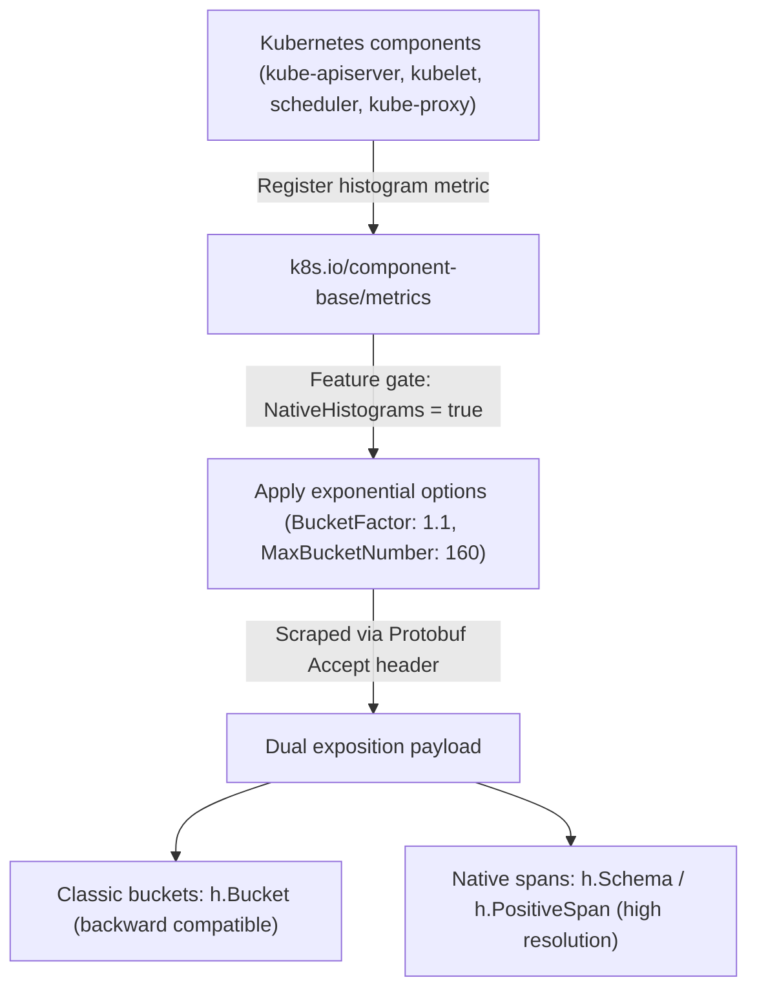

I'm excited to announce that native histogram support for Kubernetes metrics is graduating to Beta and is enabled by default in Kubernetes v1.37!

_Native histograms_ (previously introduced as Alpha in Kubernetes v1.36 under [KEP-5808](https://www.kubernetes.dev/resources/keps/5808/))
bring high-resolution, low-cardinality observability to Kubernetes metrics.
By adopting [Prometheus Native Histograms](https://prometheus.io/docs/specs/native_histograms/), Kubernetes components now expose latency and duration metrics with far greater accuracy while significantly reducing telemetry storage and scraping overhead.

## Why move beyond classic histograms?

Since the early days of Kubernetes observability, duration and latency metrics (such as API server request latencies or scheduling durations) have relied on **classic Prometheus histograms**.

Classic histograms require metric authors to define a static list of cumulative bucket boundaries (`le` labels), such as `0.005, 0.01, 0.025, 0.05, 0.1, 0.25, 0.5, 1, 2.5, 5, 10`. While familiar, this approach introduces three major challenges:

1. **The Bucket Guessing Game**: If a workload's latency profile changes, for example, shifting into microsecond ranges or experiencing long-tail tail latencies beyond the highest bucket, the histogram loses visibility. Specifying bucket boundaries upfront requires knowing the distribution before observing it
2. **High Cardinality & Storage Cost**: With classic histograms, each bucket boundary is exported as a separate time series (`_bucket{le="..."}`). A histogram with 10 buckets across multiple labels multiplies the number of time series by 10, increasing memory consumption in Prometheus and inflating time series database (TSDB) storage costs
3. **Interpolation Error in Quantiles**: Calculating percentiles using `histogram_quantile()` relies on linear interpolation between static bucket boundaries. When bucket spans are coarse, quantile calculations can suffer from significant estimation error

## What are Prometheus native histograms?

[Prometheus Native Histograms](https://prometheus.io/docs/specs/native_histograms/) replace static user-defined buckets with **dynamic, exponential buckets**.

Instead of emitting a separate time series for every single bucket boundary, a _native histogram_ is stored as a single time series containing a rich schema of positive and negative spans, zero thresholds, and exponential scaling factors.

* **High Resolution Automatically**: Exponential buckets dynamically adjust to any value range — from nanoseconds to hours — without requiring pre-configured bucket boundaries
* **Up to 90% Fewer Time Series**: By consolidating buckets into structured spans within a single time series, scraping and storage overhead are dramatically reduced
* **Accurate Quantile Calculation**: Quantiles can be calculated with mathematical bounds on error (≃5% worst-case relative error under default settings) across the entire spectrum of observations

## How native histograms work in Kubernetes

In Kubernetes, native histogram support is implemented directly inside the shared metrics subsystem (`k8s.io/component-base/metrics`).



### 1. Dual exposition for zero breaking changes
A primary design requirement for KEP-5808 was **zero disruption** for existing observability stacks. When the `NativeHistograms` feature gate is enabled, Kubernetes components use **dual exposition**:

* **Classic buckets (`h.Bucket`)** are still emitted alongside native spans. Existing Prometheus servers, dashboards, and alerting rules that rely on traditional text scraping or classic bucket labels continue to work unmodified
* **Native spans (`h.Schema`, `h.PositiveSpan`)** are included in the same Protobuf payload for collectors that understand native histograms

### 2. Tuned default exponential configuration
When `NativeHistograms` is enabled, the `k8s.io/component-base/metrics` package automatically applies standardized exponential options to all histogram metrics:

* **`BucketFactor: 1.1`**: Configures exponential buckets where each bucket is at most 10% wider than the preceding one. This guarantees a mathematically bounded worst-case relative error of at most ~5% for quantile calculations regardless of whether an operation takes 1 millisecond or 10 seconds.
* **`MaxBucketNumber: 160`**: Caps the maximum number of buckets per histogram to 160. Following OpenTelemetry SDK recommendations for base-2 exponential histogram aggregation, this limit protects component memory usage even under extreme outlier distributions.

### 3. Broad component support
Because native histograms are integrated into `component-base/metrics`, all major Kubernetes control plane and node components inherit support automatically, including:
* **`kube-apiserver`** (e.g., `apiserver_request_duration_seconds`, authentication/authorization metrics, validation latencies)
* **`kube-scheduler`** (e.g., `scheduler_plugin_execution_duration_seconds`, `scheduler_scheduling_algorithm_duration_seconds`)
* **`kubelet`** (node-level container runtime and pod lifecycle metrics)
* **`kube-controller-manager`** and **`kube-proxy`**

## How to scrape native histograms

The simple answer: upgrade to Kubernetes v1.37, and it works.

Because Kubernetes v1.37 enables `NativeHistograms` by default, your cluster is already emitting dual-exposition metrics. How you configure Prometheus to scrape native histograms depends on your Prometheus version:

### 1. Prometheus scrape configuration by version

* **Prometheus 3.0+ (Recommended)**: Use explicit per-job configuration in your `scrape_configs` rather than global flags (the global `--enable-feature=native-histograms` flag is deprecated in Prometheus 3.9+):

  ```yaml
  scrape_configs:
    - job_name: 'kubernetes-apiservers'
      scrape_native_histograms: true
      always_scrape_classic_histograms: true  # Recommended during transition
  ```

  You must read the caution in [Migrating dashboards and alerts](/docs/reference/instrumentation/native-histograms/#migrating-dashboards-and-alerts) in the Native Histograms documentation. In summary: always set `always_scrape_classic_histograms: true` during your transition period. Without this setting, Prometheus will only ingest the native format and stop ingesting classic `_bucket`, `_count`, and `_sum` series. Setting `always_scrape_classic_histograms: true` ensures existing dashboards (`histogram_quantile(..._bucket...)`) and alerts continue to work while you migrate them to native histograms.

* **Prometheus 2.40 – 2.x**: Enable Native Histograms globally by starting Prometheus with the feature flag:
  ```bash
  prometheus --enable-feature=native-histograms
  ```
  Note that in Prometheus 2.x, this is an all-or-nothing setting for all scrape targets.

### 2. Verify Protobuf dual exposition

Standard Prometheus text scraping (`application/openmetrics-text` or plain text format) only transfers classic buckets. When `scrape_native_histograms` is enabled, Prometheus automatically negotiates **Protobuf format** with Kubernetes endpoints.

You can verify that a Kubernetes component is exporting native histograms using `curl` with an `Accept` header specifying Protobuf. For example:

```bash
## THIS IS NOT SECURE. ONLY DO THIS IN A TEST CONTEXT.
curl --insecure \
  -H "Accept: application/vnd.google.protobuf;proto=io.prometheus.client.MetricFamily;encoding=delimited" \
  --header "Authorization: Bearer $(cat /var/run/secrets/kubernetes.io/serviceaccount/token)" \
  https://localhost:6443/metrics
```

When decoded, the returned `MetricFamily` for histogram metrics (like `apiserver_request_duration_seconds`) will contain both traditional `bucket` entries and populated `schema` / `positive_span` fields.

## Querying native histograms in PromQL

Once native histograms are ingested into Prometheus, you can query them using standard PromQL histogram functions without needing static `le` bucket labels or `_bucket` suffixes:

```promql
# 1. Calculating P99 latency for a single target:
# Classic histogram (requires _bucket suffix):
histogram_quantile(0.99, rate(apiserver_request_duration_seconds_bucket[5m]))

# Native histogram (operates directly on the metric name):
histogram_quantile(0.99, rate(apiserver_request_duration_seconds[5m]))

# 2. Aggregating across multiple instances (e.g., all API servers):
# Classic histogram (requires sum by (le) to preserve bucket boundaries):
histogram_quantile(0.99, sum by (le) (rate(apiserver_request_duration_seconds_bucket[5m])))

# Native histogram (no grouping by le required!):
histogram_quantile(0.99, sum(rate(apiserver_request_duration_seconds[5m])))
```

With native histograms, functions like `histogram_quantile()` operate directly on the dynamic exponential spans inside the time series, producing highly accurate quantiles without static bucket interpolation error.

For official documentation on querying Native Histograms in PromQL, see:
* [PromQL `histogram_quantile` documentation](https://prometheus.io/docs/prometheus/latest/querying/functions/#histogram_quantile)
* [PromQL `histogram_fraction` documentation](https://prometheus.io/docs/prometheus/latest/querying/functions/#histogram_fraction)
* [PromQL `histogram_sum` documentation](https://prometheus.io/docs/prometheus/latest/querying/functions/#histogram_count-and-histogram_sum)
* [PromQL `histogram_count` documentation](https://prometheus.io/docs/prometheus/latest/querying/functions/#histogram_count-and-histogram_sum)
* [PromQL `histogram_count` documentation](https://prometheus.io/docs/prometheus/latest/querying/functions/#histogram_count)
* [PromQL `histogram_stddev` and `histogram_stdvar` documentation](https://prometheus.io/docs/prometheus/latest/querying/functions/#histogram_stddev-and-histogram_stdvar)

## Dashboard Migration & Rollback Strategy

### Recommended Migration Workflow

To safely transition your monitoring infrastructure to Native Histograms without breaking existing alerts or dashboards, I recommend a four-step migration workflow:

1. **Enable Both Formats**: In your Prometheus 3.x scrape config, set `scrape_native_histograms: true` AND `always_scrape_classic_histograms: true` so both formats are collected safely during transition
2. **Migrate Queries**: Update your Grafana dashboards and Prometheus alerting rules from classic quantile queries (`histogram_quantile(..._bucket...)`) to native histogram queries (`histogram_quantile(...)`), and replace references to classic `_count` and `_sum` series with `histogram_count(...)` and `histogram_sum(...)`
3. **Verify in Staging/Production**: Validate that all dashboards and SLO alerts fire and graph correctly using the new native histogram queries
4. **Unlock ~10x Storage Savings**: Once migration is complete, set `always_scrape_classic_histograms: false`. Prometheus will stop ingesting the static `_bucket`, `_count`, and `_sum` time series, reducing your histogram time series count by up to 90%!

### Opt-out and rollback flexibility

Because native histograms are dual-exposed, using them is entirely opt-in from a collector perspective:

* **Instant Collector Rollback**: If you need to stop ingesting native histograms, simply set `scrape_native_histograms: false` in your Prometheus job configuration. No Kubernetes restart is required, and Prometheus will immediately resume scraping only the classic format without data loss
* **Component Feature Gate Rollback**: Administrators can also disable the feature gate on Kubernetes components using `--feature-gates=NativeHistograms=false` (requires component restart)

## What's next & how to get involved

As native histograms progress toward General Availability (GA) in future Kubernetes releases, SIG Instrumentation will continue evaluating ecosystem readiness, performance characteristics, and long-term plans for eventually deprecating static classic buckets once native histogram adoption becomes ubiquitous across the monitoring community.

* Read the [KEP-5808 page](https://www.kubernetes.dev/resources/keps/5808/) or the [KEP GitHub issue](https://kep.k8s.io/5808) to learn more.
* Read the [Prometheus Native Histograms specification](https://prometheus.io/docs/specs/native_histograms/) and [PromQL querying functions documentation](https://prometheus.io/docs/prometheus/latest/querying/functions/#histogram_quantile)
* Get involved with [SIG Instrumentation](https://github.com/kubernetes/community/tree/main/sig-instrumentation) on Slack in **#sig-instrumentation** or join the weekly SIG meetings

## Acknowledgements

A huge thank you to contributors across **SIG Instrumentation** and component owners who collaborated on the design, implementation, testing, and review of native histograms in Kubernetes!
