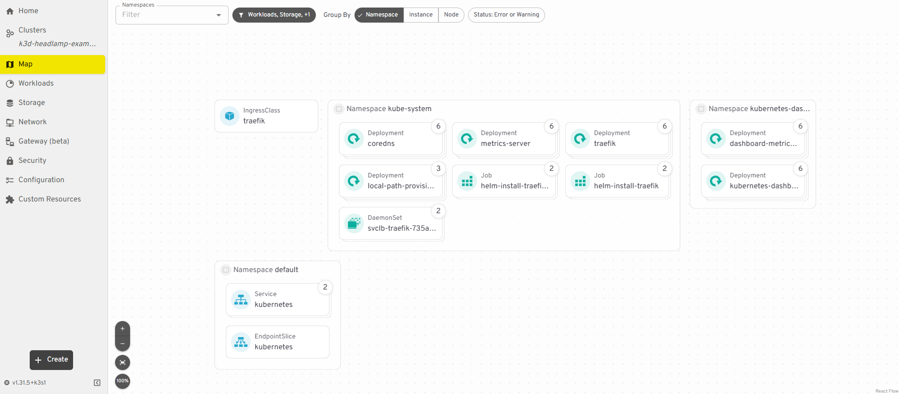

*This article was originally published on the Headlamp blog and is mirrored here for wider reach.*

With Kubernetes Dashboard now archived, teams need a clear path forward that does not disrupt how they already work. This guide is written for that moment, so the switch feels routine instead of risky.


Kubernetes Dashboard has been a pillar of the Kubernetes world, helping teams both build and learn. It offered a way to see what was running, check a pod, and feel less lost. Now that Dashboard is archived, many teams are asking the same question:

What is the replacement, and how can the move happen without breaking workflows?

This guide walks through that move. It keeps the steps clear, but it also explains why each step matters. By the end, you'll have a working Headlamp setup and a clean exit from Dashboard.

## 1. Before You Start: Know What Is Changing

Kubernetes Dashboard and Headlamp both show what is running in a cluster, but they work differently.

- When Headlamp runs on the desktop, it uses your existing kubeconfig to connect to one or more clusters and can be extended with plugins.
- When Headlamp runs inside a cluster, it uses a Kubernetes ServiceAccount to access the API and follow RBAC rules.
- Kubernetes Dashboard, in contrast, only runs in-cluster and always relies on ServiceAccount tokens.

Understanding these models early helps you choose the right setup and permissions.

### To recap:

- Dashboard runs inside a cluster and is usually accessed through `port-forward` or Ingress. It often relies on ServiceAccount tokens.
- Headlamp can run on your desktop or in-cluster.
  - On desktop, it reads your kubeconfig, like `kubectl` does.
  - In-cluster, it can use a ServiceAccount and follow RBAC like any other workload.

### 1.1 How Kubernetes Dashboard Works

Dashboard is a web app that runs inside your cluster.

- It is installed in the cluster, often with Helm.
- A single Dashboard is typically run per cluster.
- Access is usually through `kubectl port-forward` or an Ingress.
- Login is done with a Bearer token, often from a ServiceAccount.
- It includes forms that help create resources.
- It leans on tables and lists for navigation.

### 1.2 How Headlamp Works

Headlamp acts more like a Kubernetes client with a UI.

- It can run on your desktop or in a cluster.
- It reads your kubeconfig, like `kubectl` does.
- It can show more than one cluster in one place.
- It favors YAML when creating or changing resources.
- It includes list views and a visual map.
- Features can be added with plugins.

### 1.3 What Stays the Same

Many workflows will feel familiar:

- Browse workloads and resources
- Filter by namespace
- Inspect YAML, events, and status
- View logs
- Take actions your RBAC allows

### 1.4 What Changes

A few things will feel different:

- Login shifts from pasted tokens to kubeconfig (and sometimes SSO).
- Creation shifts from forms to "apply YAML."
- Multi-cluster becomes the norm, not a special case.
- The map view shows how resources connect.

## 2. Pre-Migration Checklist

This checklist is here to make the switch steady and predictable. It helps you catch the small surprises that slow teams down, like the wrong cluster context or missing permissions. It also keeps your security model intact. Headlamp should rely on the same identity and RBAC you already trust in Kubernetes. Once that is in place, you can move faster in a UI that is straightforward to navigate and works well as your clusters and workloads grow.

By the end of this section, you will have a way to prove the migration worked before turning off Dashboard.

### 2.1 Write Down What You Use Today

List the basics:

- Which clusters you use (dev, staging, prod)
- Which namespaces you touch most
- What you do most often (view, edit, scale, delete, debug)
- How you access Dashboard today (port-forward or Ingress)
- How you log in (ServiceAccount token, and which RBAC bindings)

This is your baseline.

### 2.2 Check That kubeconfig Works

Headlamp relies on kubeconfig, especially on desktop. Confirm your kubeconfig works before installing anything.

```bash
kubectl config current-context
```

Then try:

```bash
kubectl get nodes
```

If nodes cannot be listed, test in a namespace you can access:

```bash
kubectl get pods -n <namespace>
```

If these work, Headlamp can use the same identity and RBAC.

### 2.3 Pick a Rollout Plan

There is no need to rush. Most teams choose one of these:

#### Parallel rollout (recommended)

- Install Headlamp.
- Let people try it.
- Keep Dashboard for a short time.
- Remove Dashboard after the team is ready.

#### Cutover

- Install Headlamp.
- Switch docs and links.
- Remove Dashboard soon after.

Parallel rollout is safer for shared clusters.

### 2.4 Decide Where Headlamp Will Run

Either option works. Many teams use both.

#### Desktop

- Relies on your kubeconfig
- Consumes no cluster resources
- No port-forward needed
- Multi-cluster works out of the box

#### In-cluster

- Works well for shared, browser access
- Can be managed like other cluster apps
- Often paired with Ingress and SSO

### 2.5 Note Optional Dependencies

These are common. They can be handled later.

- `metrics-server` (for CPU and memory graphs)
- Ingress (for an in-cluster URL)
- OIDC / SSO (for browser sign-in)
- Cleanup of old Dashboard ServiceAccounts and RBAC

## 3. Choose Where Headlamp Will Run (Desktop or In-Cluster)

Headlamp offers two different methods of getting started. It can run on your desktop or inside a cluster — there is no rigid way to use it. The best choice depends on what you need day to day. For the quickest startup with the least setup, desktop is usually the most direct path. For a shared URL that a platform team can manage, running in-cluster is often the better fit.

This section helps you pick the option that matches your team, your access model, and how you want to operate going forward.

### Option A: Desktop (User-Managed)

Desktop Headlamp runs on each user's machine. It reads the same kubeconfig you use with `kubectl`. This keeps access tied to each user's identity and RBAC.

#### Why teams pick it

- No in-cluster service to deploy or expose.
- It consumes no cluster CPU or memory.
- It relies on your kubeconfig and RBAC.
- It works with many clusters in one app.
- No port-forward is needed for day-to-day use.

### Option B: In-Cluster (Best for Shared Access)

In-cluster Headlamp is installed as a Kubernetes workload (often via Helm). This lets cluster admins manage it like other in-cluster apps.

- Cluster admins manage install, upgrades, and configuration through the Helm chart and standard Kubernetes tooling.
- Admins control Ingress and can set up OIDC login for shared access.
- It supports shared use in team environments.

## 4. Install Headlamp (Desktop and In-Cluster)

The goal here is to create a Headlamp setup that fits your workflow. Desktop will be up and running quickly because Headlamp uses your local kubeconfig and does not add anything to the cluster. In-cluster install runs like any other Kubernetes workload, so it can be managed, secured, and shared. Either way, you are setting up a UI that respects the same RBAC rules you already rely on.

By the end of this section, you should be able to open Headlamp and confirm that the same clusters and namespaces you use today are visible.

### 4.1 Desktop Install (Fastest Way to Start)

Install Headlamp on your machine. Then open it like any other app. Headlamp reads your kubeconfig and uses the same identity and RBAC rules as `kubectl`.

#### Windows

Install with WinGet:

```powershell
winget install headlamp
```

Or with Chocolatey:

```powershell
choco install headlamp
```

#### macOS

Install with Homebrew:

```bash
brew install --cask headlamp
```

#### Linux

Install with Flatpak (Flathub):

```bash
flatpak install flathub io.kinvolk.Headlamp
```

### Quick check

1. Launch Headlamp.
2. Confirm a cluster context is visible.
3. Open a namespace you can access and confirm workloads are listed. Headlamp will only show actions your RBAC allows.

### 4.2 In-Cluster Install (Shared Access)

Use this path for a shared UI that the platform team can manage. Headlamp supports in-cluster deployment with Helm or a YAML manifest.

### Install with Helm

Add the repo and update:

```bash
helm repo add headlamp https://kubernetes-sigs.github.io/headlamp/
helm repo update
```

Create a namespace (example):

```bash
kubectl create namespace headlamp
```

Install the chart:

```bash
helm install headlamp headlamp/headlamp --namespace headlamp
```

### Install with a YAML manifest (optional)

Headlamp also provides a YAML manifest that can be applied and then adjusted to fit your needs. See the canonical instructions in [Installing Headlamp in a cluster — Using simple YAML](https://headlamp.dev/docs/latest/installation/in-cluster/#using-simple-yaml).

### Check the install

Confirm the pod is running:

```bash
kubectl get pods -n headlamp
```

Confirm the service exists:

```bash
kubectl get svc -n headlamp
```

#### Access it (two common ways)

_Quick test with port-forward._ This is the fastest way to verify the service works:

```bash
kubectl port-forward -n headlamp svc/headlamp 8080:80
```

Then open: <http://localhost:8080>

_Shared access with Ingress._ For a stable URL, expose the service through your Ingress controller. The exact Ingress YAML depends on your setup. Headlamp's OIDC callback URL is your public URL plus `/oidc-callback`, so Ingress and TLS settings matter.

### 4.3 Updating Headlamp

Updates depend on how Headlamp was installed. Package managers upgrade in place. DMG or EXE installs update by reinstalling the newer download.

#### macOS

If installed with Homebrew, run:

```bash
brew upgrade headlamp
```

If installed from a DMG, download the newest DMG and drag Headlamp into `/Applications`, replacing the old version. DMG installs do not auto-upgrade.

#### Windows

If installed with WinGet, run:

```powershell
winget upgrade headlamp
```

If installed with Chocolatey, run:

```powershell
choco upgrade headlamp
```

If installed from the EXE, download the newest installer and run it again. EXE installs do not auto-upgrade.

#### Linux

If installed with Flatpak, run:

```bash
flatpak update io.kinvolk.Headlamp
```

If installed with AppImage, download the newest AppImage and run that file instead.

If installed with a tarball, download the newest tarball, extract it, and run the new `headlamp` binary.

### 4.4 Notes for In-Cluster Access (Keep It Safe)

Treat an in-cluster UI like any other cluster-facing service. Use TLS, lock down who can reach it, and rely on Kubernetes auth and RBAC to control what users can do.

## 5. Authentication and RBAC

A new UI should not mean a new security model. Headlamp does not decide what a user can do — Kubernetes does. Headlamp reflects the same authentication and RBAC rules your cluster already enforces.

In this section, you will line up how people sign in and confirm that permissions behave as expected. When you finish, users should see only what they are allowed to see, and they should be able to do only what they are allowed to do.

This section covers two setups: desktop and in-cluster.

### 5.1 Desktop: Use kubeconfig

On desktop, Headlamp reads your kubeconfig and uses the same credentials you use with `kubectl`. There is no separate token login flow to manage.

#### Step 1: Confirm your kubeconfig works

```bash
kubectl config current-context
```

Then test access:

```bash
kubectl get nodes
```

If nodes cannot be listed, test a namespace you can access:

```bash
kubectl get pods -n <namespace>
```

If these commands work, your kubeconfig and credentials are valid for Headlamp too.

#### Step 2: Point Headlamp at the right kubeconfig (if needed)

Headlamp can use the default kubeconfig path. It can also use a custom file path. Set `KUBECONFIG` to choose a specific file.

Example:

```bash
KUBECONFIG=/path/to/config headlamp
```

More than one kubeconfig file can be loaded at once. On Unix systems, separate paths with `:`. On Windows, separate paths with `;`.

#### What to expect in the UI

Headlamp adapts to your RBAC permissions. If permission to edit or delete a resource is missing, Headlamp will not offer those actions.

### 5.2 In-Cluster: Shared Access Needs a Sign-In Plan

In-cluster Headlamp is shared by many users. A clear plan for sign-in and access is required. Headlamp supports OpenID Connect (OIDC) for a "Sign in" flow.

Most teams choose one of these patterns:

- A. Configure Headlamp with OIDC (built-in).
- B. Put an auth layer in front of Headlamp (common in enterprises).

#### A. Built-In OIDC (Headlamp)

To use OIDC, Headlamp needs:

- Client ID
- Client secret
- Issuer URL
- (Optional) scopes

The OIDC provider must also allow Headlamp's callback URL. The callback is your Headlamp URL plus `/oidc-callback`.

Example: `https://headlamp.example.com/oidc-callback`

Ingress note: if Headlamp is behind an Ingress or load balancer, make sure it forwards `X-Forwarded-Proto`. If it does not, Headlamp may generate an `http` callback URL instead of `https`, which can break login.

#### B. Auth Layer in Front of Headlamp

Some teams protect Headlamp with an identity-aware proxy or a platform auth system. This keeps sign-in consistent across tools.

Headlamp docs include an example using OpenUnison, which can deploy Headlamp with hardened defaults and integrate with identity providers.

### 5.3 RBAC: Keep It Least-Privilege

Kubernetes security starts with API authentication and authorization (RBAC). Headlamp respects those rules.

#### Practical guidance

- Start with the lowest permissions that still let users do their job.
- If Dashboard used a high-privilege ServiceAccount token, plan to remove or tighten that access after the move.
- For in-cluster, treat the UI like any other endpoint. Use TLS and limit network access.

### 5.4 Quick Troubleshooting

#### Desktop: "Cluster is not visible"

The kubeconfig may not be in the default location. Point Headlamp to the file with `KUBECONFIG` or a file path.

#### In-cluster: "OIDC login fails after redirect"

Confirm the provider allows `https://YOUR_URL/oidc-callback`. If Ingress is in use, make sure it forwards `X-Forwarded-Proto`.

## 6. Manage Multiple Clusters

This is one of the biggest practical shifts from Kubernetes Dashboard. Dashboard is typically visited one cluster at a time. Headlamp is built for the way teams work now, where dev, staging, and prod live side by side. Instead of juggling tabs or switching tools, one UI stays open and clusters change as the work moves.

The key idea: if `kubectl` can reach a cluster, Headlamp can usually reach it too. This section shows how Headlamp finds your clusters and how to move between them without losing your place.

### Clusters Come From Your kubeconfig

Headlamp reads clusters from your kubeconfig files. That means the clusters reachable with `kubectl` can also show up in Headlamp.

### Switch Clusters in the UI

Once Headlamp loads your kubeconfig, the cluster selector switches between clusters. This reduces friction when moving between dev, staging, and prod.

### Optional: Use More Than One kubeconfig File

If you keep separate kubeconfig files, they can be loaded together. Headlamp supports multiple kubeconfig paths in `KUBECONFIG`.

Unix/macOS/Linux (`:` separator):

```bash
KUBECONFIG=~/.kube/dev:~/.kube/prod headlamp
```

Windows (`;` separator):

```powershell
$env:KUBECONFIG="$HOME\.kube\dev;$HOME\.kube\prod"
```

### Optional: Add a Cluster From Inside Headlamp

Clusters can also be added by loading additional kubeconfig files from the UI.

### Permissions Stay the Same

Multi-cluster does not change security rules. Each cluster still enforces its own RBAC. Headlamp shows only what your identity can do in the selected cluster.

## 7. Navigate and Understand Resources

This is where things should start to feel familiar again. For anyone who used Kubernetes Dashboard, the core resource views in Headlamp will be recognizable right away. Pods, deployments, services, and namespaces are all still here. What changes is how quickly you can move between them and understand how they connect.

This section walks through the layout, shows where to find what you need, and introduces a few tools that help build context faster when something goes wrong.

### Find Resources in Familiar Places

Headlamp groups resources in a way that maps closely to Dashboard:

- Workloads for Pods, Deployments, StatefulSets, and Jobs
- Network for Services and Ingress
- Storage for PersistentVolumes and Claims
- Configuration for ConfigMaps and Secrets
- Nodes for cluster infrastructure

Namespace filtering is at the top of the UI, the same place as in Dashboard.

### Inspect and Edit Resources

From any list, clicking into a resource shows the details:

- Status and conditions
- Events
- Labels and annotations
- The full YAML definition

If RBAC allows it, YAML can be edited directly from the UI. If it does not, Headlamp shows the resource as read-only. This matches how `kubectl` behaves.

### Use Search and Filters to Move Faster

Headlamp adds faster search and filtering across lists. This helps when clusters or namespaces get large. Views can be narrowed without jumping between pages.

### Understand Relationships With Map View

Dashboard mostly shows resources as lists. Headlamp also includes a Map View.


_View of resource relationships in Headlamp_
Map View shows how resources relate to each other:

- Deployments
- ReplicaSets
- Pods
- Services

This helps during troubleshooting. Instead of clicking through several pages, the connections are visible at once. Missing links or broken relationships are faster to spot.

### When to Use Lists vs Map View

- Use lists when the target resource is already known.
- Use Map View when the goal is to understand why something is not working.

Both views work on the same data. The choice is about how much context you want at that moment.

## 8. Deploy Applications With YAML

For many Kubernetes Dashboard users, this is where the differences between Dashboard and Headlamp become noticeable. Dashboard guided users with forms. Headlamp leans into manifests. That shift is not about making things harder — it is about making what gets deployed clearer and more repeatable. When YAML is applied, the cluster receives exactly what is on the page, and the same manifest can be reused in Git, CI, or any other workflow.

This section shows how to deploy with YAML in Headlamp and how to keep the process manageable for anyone used to a wizard.

### From Forms to Manifests

In Kubernetes Dashboard, applications were often deployed by filling in a form:

- Container image
- Replicas
- Service type

Headlamp does not include the same wizard. Instead, YAML is applied directly from the UI.

This matches how most teams deploy today:

- Manifests live in Git.
- CI/CD applies them.
- Helm or GitOps tools manage changes.

Headlamp fits into that flow rather than replacing it.

### Create Resources Using YAML

To deploy an application in Headlamp:

1. Select a cluster and namespace.
2. Click Create.
3. Paste or upload a YAML manifest.
4. Review it.
5. Click Apply.

The resource appears immediately in the UI. If the manifest is not valid, Headlamp shows the same errors the Kubernetes API would return.

### Generate YAML Quickly

If the Dashboard wizard is missed, YAML can still be generated quickly. For example:

```bash
kubectl create deployment nginx \
  --image=nginx \
  --dry-run=client \
  -o yaml > nginx.yaml
```

Edit the file if needed, then paste it into Headlamp and apply it. This produces a repeatable manifest instead of an object created only through a UI.

### What About Helm or GitOps?

Both work well with Headlamp.

- Install with Helm as usual.
- Deploy with GitOps pipelines as usual.
- Use Headlamp to view, inspect, and debug what is running.

Headlamp does not replace those tools. It provides visibility into what they create.

### What to Expect Compared to Dashboard

- No multi-step deploy form.
- More direct work with YAML.
- Clearer visibility into what is actually applied to the cluster.
- The same manifest can be reused in CI, Git, or other tools.

## 9. Deploy and Debug Workloads

Day-to-day debugging is a key area for both Kubernetes UIs. For anyone who used Kubernetes Dashboard, it was the place to open logs, check events, and figure out why something was failing. Headlamp supports those same workflows and reduces a few common friction points along the way.

This section walks through the core debugging loop in Headlamp — from logs and exec to metrics and events — so troubleshooting can happen without leaving the UI.

### View Logs

Pod logs can be viewed directly in the UI.

To check logs:

1. Open Workloads.
2. Select Pods.
3. Click a pod.
4. Open the Logs tab.

If the pod has more than one container, the view can switch between containers. Logs stream live, which helps during rollouts or active incidents.

### Exec Into Running Pods

Headlamp also opens a shell inside a container.

From a pod view:

- Open the pod actions menu.
- Choose Terminal or Exec.

This opens an interactive session inside the container. It replaces the need to switch back to the terminal for quick checks.

This action follows RBAC rules. If `kubectl exec` is not permitted, Headlamp will not allow it either.

### Check Metrics and Resource Usage

Headlamp can show CPU and memory usage for Pods and Nodes. This works the same way it did in Dashboard.

A few things to know:

- Metrics require `metrics-server` to be installed in the cluster.
- If metrics are missing, Headlamp shows a clear notice.
- Once metrics are available, usage appears on pod and node views.

This makes it straightforward to answer questions like:

- Is this pod using too much memory?
- Is a node under pressure?

### View Events When Something Goes Wrong

Events are often the fastest way to understand failures. In Headlamp:

- Events are visible on resource detail pages.
- Warnings and errors are tied to Pods, Nodes, or Deployments.

This is often the first place to look when a workload is stuck or crashes.

### How This Compares to Dashboard

#### What stays the same

- Log viewing
- Event inspection
- RBAC-aware actions

#### What improves

- Built-in exec sessions
- Clearer layout and filtering
- Fewer context switches between UI and CLI

## 10. Remove Kubernetes Dashboard

This is the last step, and it should feel routine. Kubernetes functionality is not being removed — an old access path and an extra moving part are. The goal is to reduce the surface area of your environment once Headlamp is proven and the team is comfortable.

This section confirms the common workflows still work, then walks through uninstalling Dashboard and cleaning up any leftover ServiceAccounts or RBAC that were only there to support it.

Removing Dashboard reduces clutter and avoids keeping unused access paths around.

### Confirm Headlamp Covers Your Needs

Before uninstalling anything, confirm:

- Users can access the clusters they need in Headlamp.
- Common tasks work:
  - Browse resources
  - Deploy with YAML
  - View logs and events
  - Exec into Pods (if allowed)
- RBAC behaves as expected for different roles.

Once these checks pass, Dashboard is ready to be removed.

### Uninstall the Dashboard

If Kubernetes Dashboard was installed with Helm, remove it with:

```bash
helm uninstall kubernetes-dashboard -n kubernetes-dashboard
```

If Dashboard was installed by a manifest or add-on, remove it using the same method that installed it.

After removal, confirm the resources are gone:

```bash
kubectl get pods -n kubernetes-dashboard
```

### Clean Up Access Artifacts (Recommended)

Many Dashboard setups used dedicated ServiceAccounts and cluster-wide roles.

Review and remove anything that was created only for Dashboard access, such as:

- ServiceAccounts
- Role bindings or cluster role bindings
- Old documentation that points users to Dashboard URLs or port-forward commands

This reduces long-lived credentials and unused permissions.

### Communicate the Change

Make sure the team knows:

- Headlamp is now the primary Kubernetes UI.
- How to access it (desktop or URL).
- Where to go for help if something feels different.

## 11. Post-Migration Checklist

The checklist below covers the basics that matter most: access, RBAC, and the tasks people do every day. It also confirms cleanup is real and not assumed.

### Access and visibility

- Headlamp opens without errors.
- Users can access the correct clusters.
- Namespace filtering works as expected.
- Multi-cluster switching behaves correctly.

### Authentication and RBAC

- Desktop users access clusters using kubeconfig.
- In-cluster users can sign in using the chosen auth method.
- Users only see actions their RBAC allows.
- No unexpected permission errors appear during normal use.

### Core workflows

- Resources load under Workloads, Network, and Configuration.
- YAML can be viewed and edited where permissions allow.
- Applications can be deployed using Create and YAML.
- Logs load correctly for running Pods.
- Exec works for users who are allowed to use it.
- Metrics appear if `metrics-server` is installed.

### Operational confidence

- Teams can troubleshoot without switching tools.
- Map View helps explain relationships during debugging.
- Platform or DevOps teams know how Headlamp is installed and managed.

### Cleanup confirmation

- Kubernetes Dashboard is no longer running.
- Dashboard-only ServiceAccounts and RBAC bindings are removed.
- Internal docs no longer reference Dashboard URLs or port-forward commands.

### Team alignment

- The team knows Headlamp is the default Kubernetes UI.
- Onboarding docs point new users to Headlamp.
- There is a clear path for feedback or questions.

The move from Kubernetes Dashboard to Headlamp is complete. Your team can rely on the same Kubernetes access model, work across clusters, and follow workflows that match how Kubernetes is already used. From here, Headlamp becomes the default UI, whether on the desktop or in shared environments. As needs grow, it can stay as-is or be extended with plugins and new views over time.

To help shape what comes next, join the Headlamp community and contribute at [headlamp.dev](https://headlamp.dev).
