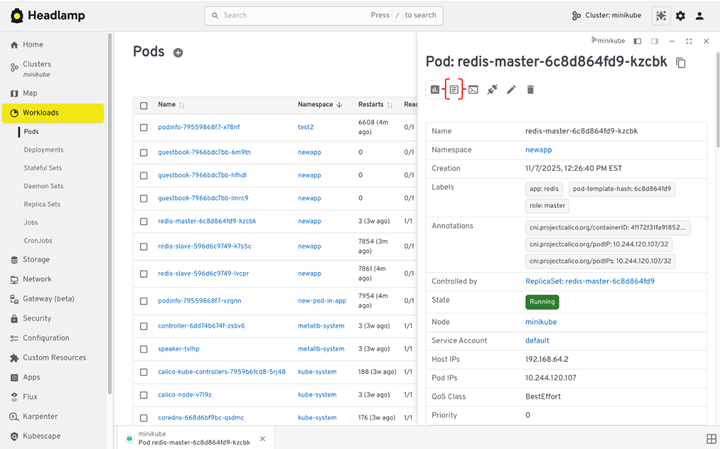

## 1. Before you start: know what is changing

Kubernetes Dashboard and Headlamp both show what is running in a cluster, but they work differently. When Headlamp runs on the desktop, it uses your existing kubeconfig to connect to one or more clusters and can be extended with plugins. When Headlamp runs inside a cluster, it uses a Kubernetes ServiceAccount to access the API and follow RBAC rules. Kubernetes Dashboard, in contrast, only runs in-cluster and always relies on service account tokens. Understanding these models early helps you choose the right setup and permissions.

### 1.1 How Kubernetes Dashboard works

Dashboard is a web app that runs inside your cluster.

- You install it in the cluster, often with Helm.
- You usually run one Dashboard per cluster.
- You often reach it with `kubectl port-forward` or an ingress.
- You log in with a Bearer token. That token is often from a service account.
- It includes forms that help you create resources.
- It leans on tables and lists for navigation.

It feels like this: a UI that lives with the cluster.

### 1.2 How Headlamp works

Headlamp acts more like a Kubernetes client with a UI.

- It can run on your desktop or in a cluster.
- It reads your kubeconfig, like kubectl does.
- It can show more than one cluster in one place.
- It favors YAML when you create or change resources.
- It includes list views and a visual map.
- You can add features with plugins.

Headlamp is a UI that follows your identity, not your cluster.

### 1.3 What stays the same

Many workflows will feel familiar:

- Browse workloads and resources
- Filter by namespace
- Inspect YAML, events, and status
- View logs
- Take actions your RBAC allows

### 1.4 What changes

A few things will feel different:

- Login shifts from pasted tokens to kubeconfig (and sometimes SSO).
- Creation shifts from forms to "apply YAML."
- Multi-cluster becomes normal, not a special case.
- The map view helps you see how resources connect.

---

## 2. Pre-migration checklist

This checklist helps you avoid surprises during the switch. It makes sure Headlamp can use the same identity and permissions you already trust in Kubernetes. It also gives you a quick way to prove the migration worked before you turn off Dashboard.

### 2.1 Write down what you use today

List the basics:

- Which clusters you use (dev, staging, prod)
- Which namespaces you touch most
- What you do most often (view, edit, scale, delete, debug)
- How you access Dashboard today (port-forward or ingress)
- How you log in (service account token, and which RBAC bindings)

This is your baseline.

### 2.2 Check that kubeconfig works

Headlamp uses kubeconfig, especially on desktop. Make sure yours works before you install anything.

Run:

```shell
kubectl config current-context
```

Then try:

```shell
kubectl get nodes
```

If you cannot list nodes, test in a namespace you can access:

```shell
kubectl get pods -n <namespace>
```

If these work, Headlamp can use the same identity and RBAC.

### 2.3 Pick a rollout plan

There is no need to rush. Most teams choose one of these:

**Parallel rollout (recommended)**

- Install Headlamp
- Let people try it
- Keep Dashboard for a short time
- Remove Dashboard after the team is ready

**Cutover**

- Install Headlamp
- Switch docs and links
- Remove Dashboard soon after

Parallel rollout is safer for shared clusters.

### 2.4 Decide where Headlamp will run

You can use either option. Many teams use both.

**Desktop**

- Uses your kubeconfig
- Uses no cluster resources
- No port-forward needed
- Multi-cluster works out of the box

**In-cluster**

- Works well for shared, browser access
- Can be managed like other cluster apps
- Often paired with ingress and SSO

### 2.5 Note optional dependencies

These are common. You can handle them later.

- `metrics-server` (for CPU and memory graphs)
- ingress (for an in-cluster URL)
- OIDC / SSO (for browser sign-in)
- cleanup of old Dashboard service accounts and RBAC

---

## 3. Choose where Headlamp will run (desktop or in-cluster)

Headlamp can run on your desktop or inside a cluster. Both work well, but they fit different needs. Desktop is the fastest way to start because it uses your kubeconfig and does not run in the cluster. In-cluster is best when you need a shared URL and want the platform team to manage upgrades and access.

### Option A: Desktop (user-managed)

Desktop Headlamp runs on each user's machine. It reads the same kubeconfig you use with kubectl. This keeps access tied to each user's identity and RBAC.

**Why teams pick it**

- No in-cluster service to deploy or expose.
- It uses no cluster CPU or memory.
- It uses your kubeconfig and RBAC.
- It works with many clusters in one app.
- You do not need port-forward for day-to-day use.

### Option B: In-cluster (best for shared access)

In-cluster Headlamp is installed as a Kubernetes workload (often via Helm). This lets cluster admins manage it like other in-cluster apps.

- Cluster admins manage install, upgrades, and configuration through the Helm chart and standard Kubernetes tooling.
- Admins control ingress and can set up OIDC login for shared access.
- It supports shared use in team environments.

---

## 4. Install Headlamp (desktop and in-cluster)

This section gets Headlamp running. Follow the path you chose in Section 3.

### 4.1 Desktop install (fastest way to start)

Install Headlamp on your machine. Then open it like any other app. Headlamp reads your kubeconfig and uses the same identity and RBAC rules as kubectl.

**Windows**

Install with WinGet:

```shell
winget install headlamp
```

Or with Chocolatey:

```shell
choco install headlamp
```

**macOS**

Install with Homebrew:

```shell
brew install --cask headlamp
```

**Linux**

Install with Flatpak (Flathub):

```shell
flatpak install flathub io.kinvolk.Headlamp
```

**Quick check**

1. Launch Headlamp.
2. Confirm you can see a cluster context.
3. Open a namespace you can access and confirm you can list workloads. Headlamp will only show actions your RBAC allows.

### 4.2 In-cluster install (shared access)

Use this path when you want a shared UI that the platform team can manage. Headlamp supports in-cluster deployment with Helm or a YAML manifest.

**Install with Helm**

Add the repo and update:

```shell
helm repo add headlamp https://kubernetes-sigs.github.io/headlamp/
helm repo update
```

Create a namespace (example):

```shell
kubectl create namespace headlamp
```

Install the chart:

```shell
helm install headlamp headlamp/headlamp --namespace headlamp
```

**Install with a YAML manifest (optional)**

Headlamp also provides a YAML manifest you can apply and then adjust to your needs.

**Check the install**

Confirm the pod is running:

```shell
kubectl get pods -n headlamp
```

Confirm the service exists:

```shell
kubectl get svc -n headlamp
```

**Access it (two common ways)**

_Quick test with port-forward_

This is the fastest way to verify the service works:

```shell
kubectl port-forward -n headlamp svc/headlamp 8080:80
```

Then open: http://localhost:8080

_Shared access with ingress_

If you want a stable URL, expose the service through your ingress controller. Your exact ingress YAML depends on your setup. Headlamp's OIDC callback URL is your public URL plus `/oidc-callback`, so ingress and TLS settings matter.

### 4.3 Updating Headlamp

Updates depend on how you installed Headlamp. Package managers upgrade in place. DMG or EXE installs update by reinstalling the newer download.

**macOS**

If you installed with Homebrew, run:

```shell
brew upgrade headlamp
```

If you installed from a DMG, download the newest DMG and drag Headlamp into `/Applications`, replacing the old version. DMG installs do not auto upgrade.

**Windows**

If you installed with WinGet, run:

```shell
winget upgrade headlamp
```

If you installed with Chocolatey, run:

```shell
choco upgrade headlamp
```

If you installed from the EXE, download the newest installer and run it again. EXE installs do not auto upgrade.

**Linux**

If you installed with Flatpak, run:

```shell
flatpak update io.kinvolk.Headlamp
```

If you installed with AppImage, download the newest AppImage and run that file instead.

If you installed with a tarball, download the newest tarball, extract it, and run the new headlamp binary.

### 4.4 Notes for in-cluster access (keep it safe)

Treat an in-cluster UI like any other cluster-facing service. Use TLS, lock down who can reach it, and rely on Kubernetes auth and RBAC to control what users can do.

---

## 5. Authentication and RBAC

Headlamp uses the Kubernetes API the same way kubectl does. Your cluster still decides who can do what. Headlamp only shows actions your identity is allowed to take.

This section covers two setups: desktop and in-cluster.

### 5.1 Desktop: use kubeconfig

On desktop, Headlamp reads your kubeconfig and uses the same credentials you use with kubectl. There is no separate token login flow to manage.

**Step 1: Confirm your kubeconfig works**

Run:

```shell
kubectl config current-context
```

Then test access:

```shell
kubectl get nodes
```

If you cannot list nodes, test a namespace you can access:

```shell
kubectl get pods -n <namespace>
```

If these commands work, your kubeconfig and credentials are valid for Headlamp too.

**Step 2: Point Headlamp at the right kubeconfig (if needed)**

Headlamp can use the default kubeconfig path. It can also use a custom file path. You can set `KUBECONFIG` to choose a specific file.

Example:

```shell
KUBECONFIG=/path/to/config headlamp
```

You can also use more than one kubeconfig file at once. On Unix systems, separate paths with `:`. On Windows, separate paths with `;`.

**What to expect in the UI**

Headlamp adapts to your RBAC permissions. If you do not have permission to edit or delete a resource, Headlamp will not offer those actions.

### 5.2 In-cluster: shared access needs a sign-in plan

In-cluster Headlamp is shared by many users. You need a clear plan for sign-in and access. Headlamp supports OpenID Connect (OIDC) for a "Sign in" flow.

You will usually choose one of these patterns:

- **A.** Configure Headlamp with OIDC (built-in).
- **B.** Put an auth layer in front of Headlamp (common in enterprises).

**A. Built-in OIDC (Headlamp)**

To use OIDC, Headlamp needs:

- Client ID
- Client secret
- Issuer URL
- (Optional) scopes

Your OIDC provider must also allow Headlamp's callback URL. The callback is your Headlamp URL plus:

- `/oidc-callback`

Example:

- `https://headlamp.example.com/oidc-callback`

**Ingress note**

If Headlamp is behind an ingress or load balancer, make sure it forwards `X-Forwarded-Proto`. If it does not, Headlamp may generate an `http` callback URL instead of `https`. That can break login.

**B. Auth layer in front of Headlamp**

Some teams protect Headlamp with an identity-aware proxy or a platform auth system. This keeps sign-in consistent across tools. Headlamp docs include an example using OpenUnison, which can deploy Headlamp with hardened defaults and integrate with identity providers.

### 5.3 RBAC: keep it least privilege

Kubernetes security starts with API authentication and authorization (RBAC). Headlamp respects those rules.

Practical guidance:

- Start with the lowest permissions that still let users do their job.
- If Dashboard used a high-privilege service account token, plan to remove or tighten that access after the move.
- For in-cluster, treat the UI like any other endpoint. Use TLS and limit network access.

### 5.4 Quick troubleshooting

**Desktop: "I do not see my cluster"**

Your kubeconfig may not be in the default location. Point Headlamp to the file with `KUBECONFIG` or a file path.

**In-cluster: "OIDC login fails after redirect"**

Confirm your provider allows `https://YOUR_URL/oidc-callback`. If you use ingress, make sure it forwards `X-Forwarded-Proto`.

---

## 6. Manage Multiple Clusters

Kubernetes Dashboard is usually tied to one cluster at a time. Headlamp is built for multi-cluster work. It is a client that follows your kubeconfig, not a single cluster install. That means you can keep one UI open and switch clusters as you work.

### Clusters come from your kubeconfig

Headlamp reads clusters from your kubeconfig files. That means the clusters you can access with kubectl can also show up in Headlamp.

### Switch clusters in the UI

Once Headlamp loads your kubeconfig, you can switch clusters using the cluster selector. This makes it easier to move between dev, staging, and prod without changing tools.

### Optional: use more than one kubeconfig file

If you keep separate kubeconfig files, you can load them together. Headlamp supports multiple kubeconfig paths in `KUBECONFIG`.

Unix/macOS/Linux (`:` separator):

```shell
KUBECONFIG=~/.kube/dev:~/.kube/prod headlamp
```

Windows (`;` separator):

```powershell
$env:KUBECONFIG="$HOME\.kube\dev;$HOME\.kube\prod"
```

### Optional: add a cluster from inside Headlamp

You can also add clusters by loading additional kubeconfig files from the UI.

### Permissions stay the same

Multi-cluster does not change security rules. Each cluster still enforces its own RBAC. Headlamp shows only what your identity can do in the selected cluster.

---

## 7. Navigate and Understand Resources

If you used Kubernetes Dashboard, this part will feel familiar. Headlamp keeps the same core resource views, but makes it easier to move around and understand what is connected.

### Find resources in familiar places

Headlamp groups resources in a way that maps closely to Dashboard:

- **Workloads** for Pods, Deployments, StatefulSets, and Jobs
- **Network** for Services and Ingress
- **Storage** for PersistentVolumes and Claims
- **Configuration** for ConfigMaps and Secrets
- **Nodes** for cluster infrastructure

You can filter by namespace at the top of the UI, just like in Dashboard.

### Inspect and edit resources

From any list, you can click into a resource to see details:

- Status and conditions
- Events
- Labels and annotations
- The full YAML definition

If your RBAC allows it, you can edit YAML directly from the UI. If it does not, Headlamp shows the resource as read-only. This matches how kubectl behaves.

### Use search and filters to move faster

Headlamp adds faster search and filtering across lists. This helps when clusters or namespaces get large. You can narrow views without jumping between pages.

### Understand relationships with Map View

Dashboard mostly shows resources as lists. Headlamp also includes a Map View.

Map View shows how resources relate to each other:

- Deployments
- ReplicaSets
- Pods
- Services

This helps when you are troubleshooting. Instead of clicking through several pages, you can see the connections at once. You can spot missing links or broken relationships faster.

### When to use lists vs Map View

- Use **lists** when you know what resource you are looking for.
- Use **Map View** when you are trying to understand why something is not working.

Both views work on the same data. You are just choosing how much context you want at that moment.

---

## 8. Deploy Applications with YAML

This is the biggest change for most Kubernetes Dashboard users. Dashboard relied on forms. Headlamp relies on manifests. The goal is not to slow you down. It is to align the UI with how Kubernetes is usually run in practice.

### From forms to manifests

In Kubernetes Dashboard, you often deployed an app by filling in a form:

- container image
- replicas
- service type

Headlamp does not include the same wizard. Instead, it lets you apply YAML directly from the UI.

This matches how most teams deploy today:

- manifests live in Git
- CI/CD applies them
- Helm or GitOps tools manage changes

Headlamp fits into that flow rather than replacing it.

### Create resources using YAML

To deploy an application in Headlamp:

1. Select a cluster and namespace.
2. Click **Create**.
3. Paste or upload a YAML manifest.
4. Review it.
5. Click **Apply**.


The resource appears immediately in the UI.

If the manifest is not valid, Headlamp shows the same errors you would see from the Kubernetes API.

### Generate YAML the easy way

If you miss the Dashboard wizard, you can still generate YAML quickly.

For example:

```shell
kubectl create deployment nginx \
  --image=nginx \
  --dry-run=client \
  -o yaml > nginx.yaml
```

You can edit the file if needed, then paste it into Headlamp and apply it.

This gives you a repeatable manifest instead of an object created only through a UI.

### What if you use Helm or GitOps?

That works well with Headlamp.

- Install with Helm as usual.
- Deploy with GitOps pipelines as usual.
- Use Headlamp to view, inspect, and debug what is running.

Headlamp does not replace those tools. It gives you visibility into what they create.

### What to expect compared to Dashboard

- You will not see a multi-step deploy form.
- You will work more with YAML.
- You gain clarity about what is actually applied to the cluster.
- The same manifest can be reused in CI, Git, or other tools.

---

## 9. Deploy and Debug Workloads

One of the main reasons people used Kubernetes Dashboard was day-to-day debugging. Headlamp covers the same tasks and adds a few useful upgrades.

### View logs

You can view pod logs directly in the UI.

To check logs:

1. Open **Workloads**.
2. Select **Pods**.
3. Click a pod.
4. Open the **Logs** tab.



If the pod has more than one container, you can switch between containers. Logs stream live, which helps during rollouts or active incidents.

### Exec into running pods

Headlamp also lets you open a shell inside a container.

From a pod view:

- Open the pod actions menu.
- Choose **Terminal** or **Exec**.

This opens an interactive session inside the container. It replaces the need to switch back to the terminal for quick checks.

This action follows RBAC rules. If you cannot run `kubectl exec`, Headlamp will not allow it either.

### Check metrics and resource usage

Headlamp can show CPU and memory usage for pods and nodes. This works the same way it did in Dashboard.

A few things to know:

- Metrics require `metrics-server` to be installed in the cluster.
- If metrics are missing, Headlamp shows a clear notice.
- Once metrics are available, usage appears on pod and node views.

This makes it easy to answer simple questions:

- Is this pod using too much memory?
- Is a node under pressure?

### View events when something goes wrong

Events are often the fastest way to understand failures.

In Headlamp, you can:

- View events on resource detail pages.
- See warnings and errors tied to pods, nodes, or deployments.

This is often the first place to look when a workload is stuck or crashes.

### How this compares to Dashboard

**What stays the same:**

- Log viewing
- Event inspection
- RBAC-aware actions

**What improves:**

- Built-in exec sessions
- Clearer layout and filtering
- Fewer context switches between UI and CLI

---

## 10. Remove Kubernetes Dashboard

After Headlamp is working and your team is comfortable using it, you can remove Kubernetes Dashboard. This is the final cleanup step.

Removing Dashboard reduces clutter and avoids keeping unused access paths around.

### Confirm Headlamp covers your needs

Before uninstalling anything, make sure:

- Users can access the clusters they need in Headlamp.
- Common tasks work:
  - browse resources
  - deploy with YAML
  - view logs and events
  - exec into pods (if allowed)
- RBAC behaves as expected for different roles.

Once these checks pass, you are ready to remove Dashboard.

### Uninstall the Dashboard

If you installed Kubernetes Dashboard with Helm, remove it with:

```shell
helm uninstall kubernetes-dashboard -n kubernetes-dashboard
```

If Dashboard was installed by a manifest or addon, remove it using the same method you used to install it.

After removal, confirm the resources are gone:

```shell
kubectl get pods -n kubernetes-dashboard
```

### Clean up access artifacts (recommended)

Many Dashboard setups used dedicated service accounts and cluster-wide roles.

Review and remove anything that was created only for Dashboard access, such as:

- service accounts
- role bindings or cluster role bindings
- old documentation that points users to Dashboard URLs or port-forward commands

This reduces long-lived credentials and unused permissions.

### Communicate the change

Make sure your team knows:

- Headlamp is now the primary Kubernetes UI.
- How to access it (desktop or URL).
- Where to go for help if something feels different.

---

## 11. Post-Migration Checklist

This final checklist helps you confirm the migration is complete. It gives you confidence that Headlamp is working as expected and that nothing important was left behind.

### Access and visibility

- [ ] Headlamp opens without errors.
- [ ] Users can access the correct clusters.
- [ ] Namespace filtering works as expected.
- [ ] Multi-cluster switching behaves correctly.

### Authentication and RBAC

- [ ] Desktop users access clusters using kubeconfig.
- [ ] In-cluster users can sign in using the chosen auth method.
- [ ] Users only see actions their RBAC allows.
- [ ] No unexpected permission errors appear during normal use.

### Core workflows

- [ ] Resources load under Workloads, Network, and Configuration.
- [ ] YAML can be viewed and edited where permissions allow.
- [ ] Applications can be deployed using Create and YAML.
- [ ] Logs load correctly for running pods.
- [ ] Exec works for users who are allowed to use it.
- [ ] Metrics appear if metrics-server is installed.

### Operational confidence

- [ ] Teams can troubleshoot without switching tools.
- [ ] Map View helps explain relationships during debugging.
- [ ] Platform or DevOps teams know how Headlamp is installed and managed.

### Cleanup confirmation

- [ ] Kubernetes Dashboard is no longer running.
- [ ] Dashboard-only service accounts and RBAC bindings are removed.
- [ ] Internal docs no longer reference Dashboard URLs or port-forward commands.

### Team alignment

- [ ] The team knows Headlamp is the default Kubernetes UI.
- [ ] Onboarding docs point new users to Headlamp.
- [ ] There is a clear path for feedback or questions.

---

You've now completed the move from Kubernetes Dashboard to Headlamp. Your team can use the same Kubernetes access model, work across clusters, and rely on workflows that match how Kubernetes is used today. From here, Headlamp becomes your default UI, whether on the desktop or in shared environments. As your needs grow, you can keep using it as-is or extend it with plugins and new views over time.

If you want to help shape what comes next, join the Headlamp community and contribute at [headlamp.dev](https://headlamp.dev).
