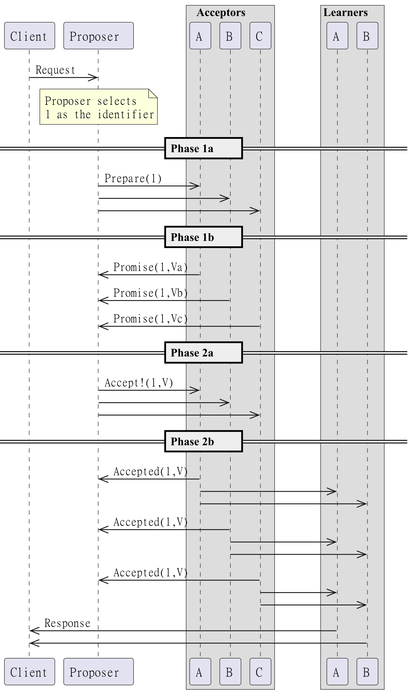
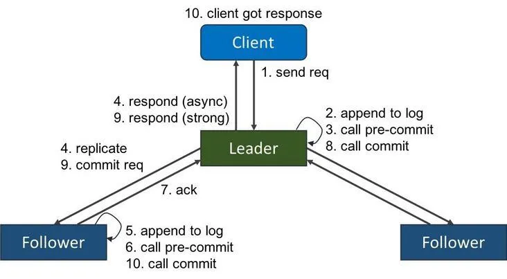
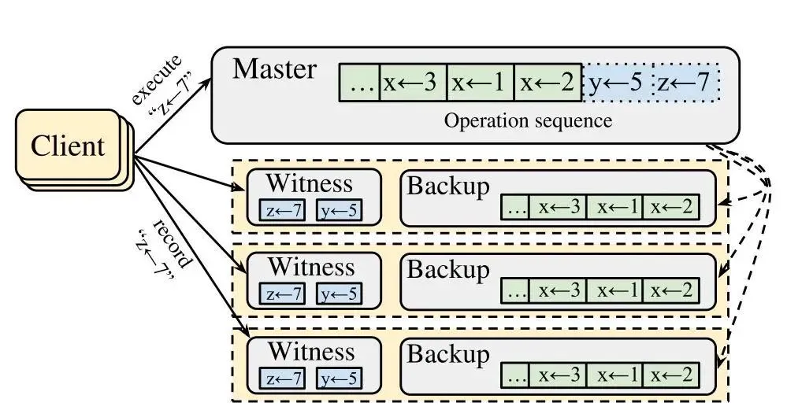

_"This post gives a brief introduction about the Curp consensus protocol by comparing it with the traditional protocals and discussing about the critical parts of it._

# CURP — Revisit the Consensus Protocol

## Introduction of consensus

Consensus protocol is a protocol to keep the information consistent and durable in multiple servers, and the property is kept even if some servers fail. When we talk about consensus, usually protocols like classic Paxos or Raft come into our minds. They are the foundation of many later invented protocols like Multi-Paxos or Fast-Paxos. Let’s first review these two protocols to see how they work.

First let’s take a look at Paxos, which is shown in the below graph. Paxos has two phases. The first phase is Prepare, and its main assignment is to take a Slot on the Log. The second phase is Accept, which makes sure this specific Slot has been explicitly occupied, and not taken by others between two phases. When Client receives OK response from the majority of servers, it means this particular record has been submitted and a consensus is reached. Here we can take Client and Proposer as a whole, and there are two messages delivered in the whole process and one message in each phase respectively.

Then let’s move on to talk about Raft, which is also shown below. In Raft protocol a Client sends a request to the leader server, then the leader broadcast the request to all the follower servers. When the leader collects the OK response from the majority of all servers, including itself, a consensus is reached, then it tells the result to Client. There are two messages delivered during the process, one is between Client and the leader, the other is between the leader and the followers.

It thus can be told that the above two protocols take two RTTs to complete a request and reach a consensus. It usually does not have a big impact on performance if the protocol runs in a single data center, while the situation is totally different if we run the protocol in multiple data centers. Because the latency between the data-centers is too high, up to hundreds of milliseconds. Therefore, in multi-data center scenarios, it is critical to reduce the number of messages delivered in the process.
Then, the next question is “Are two phases necessary?”. The answer is yes if we want to keep the following properties:

1. Any committed request cannot be revised or lost.
2. The order of committed requests cannot be revised or lost.

In terms of the protocol that has no leader, like Paxos, one-message delivery can only make sure that the majority learns the message, but the ordering is out of control. And for the protocol that has a leader (e.g., Raft), two messages are also required to duplicate the message to all the servers, as one message can only make sure the leader learns the request. In other words, one-message delivery can only make the leader decide the execution sequence (the 2nd property),but cannot guarantee the committed request will not be lost, since only the leader is entitled to acquire this particular request.

Then how do we come up with a way to reduce one number of message delivery? The answer is to compromise the second property, which is to abandon the “globally unique execution order” and change it to “guarantee a globally unique execution order for conflicting requests, and irrelevant requests can be executed out of order”. The CURP protocol introduces this idea and partially gives up the second property. Let’s see how CURP works in the next section.

## CURP protocol

We won’t discuss all the details of the CURP protocol for it’s too complicated, so only the critical parts will be covered. Here’s the process diagram of the CURP protocol:

To start with, let’s describe the main procedures briefly below:

1. The Client sends a request to all the CURP servers including the master (leader).
2. Every server maintains a waiting pool, which is the blue part in the above graph. The requests in the waiting pool maybe haven’t reached a consensus yet.
3. Once a server receives a request from the Client, it checks if the request conflicts with the requests in the waiting pool.
4. If there’s a conflict, the server rejects the Client request.
5. Otherwise, it accepts the request and let the Client knows.
6. If the Client received no less than (f + (f + 1)/ 2 + 1) Accept replies, including the reply from the master, it knows the request has been committed. Otherwise, Client waits for the master server to duplicate the request to the follower servers. Once the duplication process completes, the request is removed from the waiting pool and the master server tells the Client that the request has been committed.

It’s not easy to understand the protocol if we only list the above four steps. Let me put it in a question-and-answer format for further explanations.

**Q1: Why can the Client make sure a request is committed when no less than (f + (f + 1)/ 2 + 1) Accept responses including the reply from the master are received?**

A1: Because the waiting pool is exclusive as conflict requests won’t be in the same pool at the same time, once a request is accepted by the majority, the other conflict request won’t get the majority vote until the previous one is removed. Even if there’s f server failures, we can easily recover the request from the remaining (f + 1)/ 2 + 1 servers, which are also the majority of the remaining servers. So as a result CURP protocol keeps the committed request and the ordering of the conflicting requests.

**Q2: The number (f + (f + 1)/ 2 + 1) is strange, why not f + 1?**

A2: The reason is the recovery procedure requires the number. In the worst case, there are at most f failures, we must find out the committed requests in the waiting pool according to the remaining informed (f + 1)/ 2 + 1 servers, which are the majority of all remaining servers.
The consensus protocol allows at most f server failures, so the remaining server is f+1. In the worst case, all failed servers contain that request, then the remaining f+1 still have at least (f+1_)/2+1 servers containing that particular request, accounting for the vast majority and is convenient for the recovery process to restore the request and prevent any losses.

**Q3: Do all the requests reach the consensus after one message delivery?**

A3: It is not guaranteed. If there’s no conflicting request, one message is enough to reach the consensus. Otherwise, in terms of conflicting requests, the Client must wait for the master (leader) server to complete synchronization, which takes another message delivery. Then the Client can confirm that the request is committed. In this case, two messages are delivered, similar to Raft. Therefore, 1RTT for the best case and 2RTT for the worst case.

**Q4: How does the master duplicate the message to the follower servers?**

A4: The same as Raft.

**Q5: What is the recovery process for the CURP protocol?**

A5: First, the recovery process needs to elect a new master (leader), which is the same as Raft. Then the process can be roughly divided into two modules. For the synchronized request, the recovery process is consistent with the Raft protocol. For the requests that have not been synchronized yet, they need to be collected from all servers. When f+1 servers (including the new leader itself) are collected information, keep the requests that appear at least (f+1)/2+1 times, because these requests may have been committed, thus cannot be lost.

## Summary

We find that the CURP protocol is very similar to the Raft protocol except for the waiting pool. The pool is used to keep the ordering of the conflicting requests, making sure there’s at most one request committed among all the conflicts. In other words, all requests need to wait for the synchronization of the master at the time when the pool is sorting conflicting requests. The waiting pool is the root reason for the outperforming result.

To sum up, under optimal condition, the CURP takes one round of message delivery to reach consensus. In the worst case, it takes two rounds of message delivery to achieve consensus, just as the Raft protocol.

For more details about the CURP protocol, please refer to the original paper.

Xline, an open source project by DatenLord, is a geo-distributed KV store for metadata management, which is based on the CURP protocol.

GitHub Links: <https://github.com/xline-kv/Xline>
