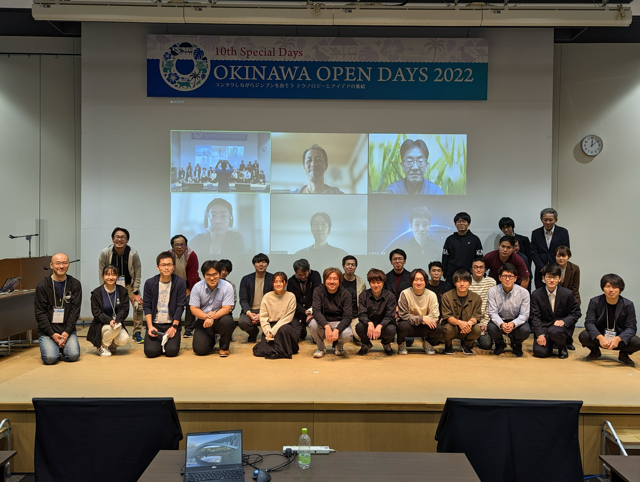

## About Our Team

We are organizers of [Kubernetes Upstream Training in Japan](https://github.com/kubernetes-sigs/contributor-playground/tree/master/japan).
Our team is composed of members who actively contribute to Kubernetes, including individuals who hold roles such as member, reviewer, approver, and chair.

Our goal is to increase the number of Kubernetes contributors and foster the growth of the community.
While Kubernetes community is friendly and collaborative, newcomers may find the first step of contributing to be a bit challenging.
Our training program aims to lower that barrier and create an environment where even beginners can participate smoothly.

## What is Kubernetes Upstream Training in Japan?

Our training started in 2019 and is held 1 to 2 times a year.
Initially, Kubernetes Upstream Training was conducted as a co-located event of KubeCon (Kubernetes Contributor Summit),
but we launched Kubernetes Upstream Training in Japan with the aim of increasing Japanese contributors by hosting a similar event in Japan.

Before the pandemic, the training was held in person, but since 2020, it has been conducted online.
The training offers the following content for those who have not yet contributed to Kubernetes:

* Introduction to Kubernetes community
* Overview of Kubernetes codebase and how to create your first PR
* Tips and encouragement to lower participation barriers, such as language
* How to set up the development environment
* Hands-on session using [kubernetes-sigs/contributor-playground](https://github.com/kubernetes-sigs/contributor-playground)

At the beginning of the program, we explain why contributing to Kubernetes is important and who can contribute.
We emphasize that contributing to Kubernetes allows you to make a global impact and that Kubernetes community is looking forward to your contributions!

We also explain Kubernetes community, SIGs, and Working Groups.
Next, we explain the roles and responsibilities of Member, Reviewer, Approver, Tech Lead, and Chair.
Additionally, we introduce the communication tools we primarily use, such as Slack, GitHub, and mailing lists.
Some Japanese speakers may feel that communicating in English is a barrier.
Additionally, those who are new to the community need to understand where and how communication takes place.
We emphasize the importance of taking that first step, which is the most important aspect we focus on in our training!

We then go over the structure of Kubernetes codebase, the main repositories, how to create a PR, and the CI/CD process using [Prow](https://docs.prow.k8s.io/).
We explain in detail the process from creating a PR to getting it merged.

After several lectures, participants get to experience hands-on work using [kubernetes-sigs/contributor-playground](https://github.com/kubernetes-sigs/contributor-playground), where they can create a simple PR.
The goal is for participants to get a feel for the process of contributing to Kubernetes.

At the end of the program, we also provide a detailed explanation of setting up the development environment for contributing to the `kubernetes/kubernetes` repository,
including building code locally, running tests efficiently, and setting up clusters.

## Interview with Participants

We conducted interviews with those who participated in our training program.
We asked them about their reasons for joining, their impressions, and their future goals.

### [Keita Mochizuki](https://github.com/mochizuki875) ([NTT DATA Group Corporation](https://www.nttdata.com/global/en/about-us/profile))

**Junya:** Why did you decide to participate in Kubernetes Upstream Training?

**Keita:** Actually, I participated twice, in 2020 and 2022.
In 2020, I had just started learning about Kubernetes and wanted to try getting involved in activities outside of work, so I signed up after seeing the event on Twitter by chance.
However, I didn’t have much knowledge at the time, and contributing to OSS felt like something beyond my reach.
As a result, my understanding after the training was shallow, and I left with more of a "hmm, okay" feeling.

In 2022, I participated again when I was at a stage where I was seriously considering starting contributions.
This time, I did prior research and was able to resolve my questions during the lectures, making it a very productive experience.

**Junya:** How did you feel after participating?

**Keita:** I felt that the significance of this training greatly depends on the participant's mindset.
The training itself consists of general explanations and simple hands-on exercises, but it doesn’t mean that attending the training will immediately lead to contributions.

**Junya:** What is your purpose for contributing?

**Keita:** My initial motivation was to "gain a deep understanding of Kubernetes and build a track record," meaning "contributing itself was the goal."
Nowadays, I also contribute to address bugs or constraints I discover during my work.
Additionally, through contributing, I’ve become less hesitant to analyze undocumented features directly from the source code.

**Junya:** What has been challenging about contributing?

**Keita:** The most difficult part was taking the first step. Contributing to OSS requires a certain level of knowledge, and leveraging resources like this training and support from others was essential.
One phrase that stuck with me was, "Once you take the first step, it becomes easier to move forward."
Also, in terms of continuing contributions as part of my job, the most challenging aspect is presenting the outcomes as achievements.
To keep contributing over time, it’s important to align it with business goals and strategies, but upstream contributions don’t always lead to immediate results that can be directly tied to performance.
Therefore, it’s crucial to ensure mutual understanding with managers and gain their support.

**Junya:** What are your future goals?

**Keita:** My goal is to contribute to areas with a larger impact.
So far, I’ve mainly contributed by fixing smaller bugs as my primary focus was building a track record,
but moving forward, I’d like to challenge myself with contributions that have a greater impact on Kubernetes users or that address issues related to my work.
Recently, I’ve also been working on reflecting the changes I’ve made to the codebase into the official documentation,
and I see this as a step toward achieving my goals.

**Junya:** Thank you very much!

## [WIP] 2 more interviews...

## Future of Kubernetes Upstream Training

We plan to continue hosting Kubernetes Upstream Training in Japan and look forward to welcoming many new contributors.
Our next session is scheduled to take place at the end of November during [CloudNative Days Winter 2024](https://event.cloudnativedays.jp/cndw2024).

Moreover, our goal is to expand these training programs not only in Japan but also around the world.
[Kubernetes celebrates its 10th anniversary](https://kubernetes.io/blog/2024/06/06/10-years-of-kubernetes/) this year, and for the community to become even more active, it's crucial for people across the globe to continue contributing.
While Upstream Training is already held in several regions, we aim to bring it to even more places.

We hope that as more people join Kubernetes community and contribute, our community will become even more vibrant!
