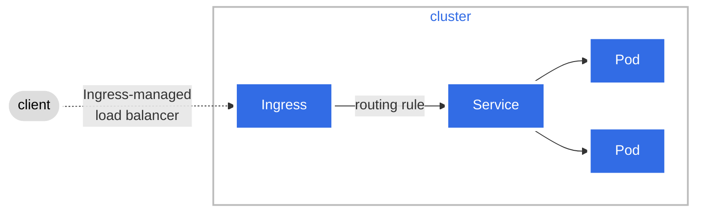

<!--Overview-->

This guide shows you how to create, edit and share diagrams using the Mermaid
JavaScript library. Mermaid.js allows you to generate diagrams using a simple
markdown-like syntax inside Markdown files. You can also use Mermaid to
generate `.svg` or `.png` image files that you can add to your documentation.

The target audience for this guide is anybody wishing to learn about Mermaid
and/or how to create and add diagrams to Kubernetes documentation.

Figure 1 outlines the topics covered in this section. 


flowchart LR
subgraph m[Mermaid.js]
direction TB
S[ ]-.-
C[build<br>diagrams<br>with markdown] -->
D[on-line<br>live editor]
end
A[Why are diagrams<br>useful?] --> m
m --> N[3 x methods<br>for creating<br>diagrams]
N --> T[Examples]
T --> X[Styling<br>and<br>captions]
X --> V[Tips]


    classDef box fill:#fff,stroke:#000,stroke-width:1px,color:#000;
    classDef spacewhite fill:#ffffff,stroke:#fff,stroke-width:0px,color:#000
    class A,C,D,N,X,m,T,V box
    class S spacewhite

%% you can hyperlink Mermaid diagram nodes to a URL using click statements

click A "https://mermaid-js.github.io/mermaid-live-editor/edit/#eyJjb2RlIjoiZmxvd2NoYXJ0IExSXG4gICAgc3ViZ3JhcGggbVtNZXJtYWlkLmpzXVxuICAgIGRpcmVjdGlvbiBUQlxuICAgICAgICBTWyBdLS4tXG4gICAgICAgIENbYnVpbGQ8YnI-ZGlhZ3JhbXM8YnI-d2l0aCBtYXJrZG93bl0gLS0-XG4gICAgICAgIERbb24tbGluZTxicj5saXZlIGVkaXRvcl1cbiAgICBlbmRcbiAgICBBW1doeSBhcmUgZGlhZ3JhbXM8YnI-dXNlZnVsP10gLS0-IG1cbiAgICBtIC0tPiBOWzMgeCBtZXRob2RzPGJyPmZvciBjcmVhdGluZzxicj5kaWFncmFtc11cbiAgICBOIC0tPiBUW0V4YW1wbGVzXVxuICAgIFQgLS0-IFhbU3R5bGluZzxicj5hbmQ8YnI-Y2FwdGlvbnNdXG4gICAgWCAtLT4gVltUaXBzXVxuICAgIFxuIFxuICAgIGNsYXNzRGVmIGJveCBmaWxsOiNmZmYsc3Ryb2tlOiMwMDAsc3Ryb2tlLXdpZHRoOjFweCxjb2xvcjojMDAwO1xuICAgIGNsYXNzRGVmIHNwYWNld2hpdGUgZmlsbDojZmZmZmZmLHN0cm9rZTojZmZmLHN0cm9rZS13aWR0aDowcHgsY29sb3I6IzAwMFxuICAgIGNsYXNzIEEsQyxELE4sWCxtLFQsViBib3hcbiAgICBjbGFzcyBTIHNwYWNld2hpdGUiLCJtZXJtYWlkIjoie1xuICBcInRoZW1lXCI6IFwiZGVmYXVsdFwiXG59IiwidXBkYXRlRWRpdG9yIjpmYWxzZSwiYXV0b1N5bmMiOnRydWUsInVwZGF0ZURpYWdyYW0iOnRydWV9" _blank
click C "https://mermaid-js.github.io/mermaid-live-editor/edit/#eyJjb2RlIjoiZmxvd2NoYXJ0IExSXG4gICAgc3ViZ3JhcGggbVtNZXJtYWlkLmpzXVxuICAgIGRpcmVjdGlvbiBUQlxuICAgICAgICBTWyBdLS4tXG4gICAgICAgIENbYnVpbGQ8YnI-ZGlhZ3JhbXM8YnI-d2l0aCBtYXJrZG93bl0gLS0-XG4gICAgICAgIERbb24tbGluZTxicj5saXZlIGVkaXRvcl1cbiAgICBlbmRcbiAgICBBW1doeSBhcmUgZGlhZ3JhbXM8YnI-dXNlZnVsP10gLS0-IG1cbiAgICBtIC0tPiBOWzMgeCBtZXRob2RzPGJyPmZvciBjcmVhdGluZzxicj5kaWFncmFtc11cbiAgICBOIC0tPiBUW0V4YW1wbGVzXVxuICAgIFQgLS0-IFhbU3R5bGluZzxicj5hbmQ8YnI-Y2FwdGlvbnNdXG4gICAgWCAtLT4gVltUaXBzXVxuICAgIFxuIFxuICAgIGNsYXNzRGVmIGJveCBmaWxsOiNmZmYsc3Ryb2tlOiMwMDAsc3Ryb2tlLXdpZHRoOjFweCxjb2xvcjojMDAwO1xuICAgIGNsYXNzRGVmIHNwYWNld2hpdGUgZmlsbDojZmZmZmZmLHN0cm9rZTojZmZmLHN0cm9rZS13aWR0aDowcHgsY29sb3I6IzAwMFxuICAgIGNsYXNzIEEsQyxELE4sWCxtLFQsViBib3hcbiAgICBjbGFzcyBTIHNwYWNld2hpdGUiLCJtZXJtYWlkIjoie1xuICBcInRoZW1lXCI6IFwiZGVmYXVsdFwiXG59IiwidXBkYXRlRWRpdG9yIjpmYWxzZSwiYXV0b1N5bmMiOnRydWUsInVwZGF0ZURpYWdyYW0iOnRydWV9" _blank
click D "https://mermaid-js.github.io/mermaid-live-editor/edit/#eyJjb2RlIjoiZmxvd2NoYXJ0IExSXG4gICAgc3ViZ3JhcGggbVtNZXJtYWlkLmpzXVxuICAgIGRpcmVjdGlvbiBUQlxuICAgICAgICBTWyBdLS4tXG4gICAgICAgIENbYnVpbGQ8YnI-ZGlhZ3JhbXM8YnI-d2l0aCBtYXJrZG93bl0gLS0-XG4gICAgICAgIERbb24tbGluZTxicj5saXZlIGVkaXRvcl1cbiAgICBlbmRcbiAgICBBW1doeSBhcmUgZGlhZ3JhbXM8YnI-dXNlZnVsP10gLS0-IG1cbiAgICBtIC0tPiBOWzMgeCBtZXRob2RzPGJyPmZvciBjcmVhdGluZzxicj5kaWFncmFtc11cbiAgICBOIC0tPiBUW0V4YW1wbGVzXVxuICAgIFQgLS0-IFhbU3R5bGluZzxicj5hbmQ8YnI-Y2FwdGlvbnNdXG4gICAgWCAtLT4gVltUaXBzXVxuICAgIFxuIFxuICAgIGNsYXNzRGVmIGJveCBmaWxsOiNmZmYsc3Ryb2tlOiMwMDAsc3Ryb2tlLXdpZHRoOjFweCxjb2xvcjojMDAwO1xuICAgIGNsYXNzRGVmIHNwYWNld2hpdGUgZmlsbDojZmZmZmZmLHN0cm9rZTojZmZmLHN0cm9rZS13aWR0aDowcHgsY29sb3I6IzAwMFxuICAgIGNsYXNzIEEsQyxELE4sWCxtLFQsViBib3hcbiAgICBjbGFzcyBTIHNwYWNld2hpdGUiLCJtZXJtYWlkIjoie1xuICBcInRoZW1lXCI6IFwiZGVmYXVsdFwiXG59IiwidXBkYXRlRWRpdG9yIjpmYWxzZSwiYXV0b1N5bmMiOnRydWUsInVwZGF0ZURpYWdyYW0iOnRydWV9" _blank
click N "https://mermaid-js.github.io/mermaid-live-editor/edit/#eyJjb2RlIjoiZmxvd2NoYXJ0IExSXG4gICAgc3ViZ3JhcGggbVtNZXJtYWlkLmpzXVxuICAgIGRpcmVjdGlvbiBUQlxuICAgICAgICBTWyBdLS4tXG4gICAgICAgIENbYnVpbGQ8YnI-ZGlhZ3JhbXM8YnI-d2l0aCBtYXJrZG93bl0gLS0-XG4gICAgICAgIERbb24tbGluZTxicj5saXZlIGVkaXRvcl1cbiAgICBlbmRcbiAgICBBW1doeSBhcmUgZGlhZ3JhbXM8YnI-dXNlZnVsP10gLS0-IG1cbiAgICBtIC0tPiBOWzMgeCBtZXRob2RzPGJyPmZvciBjcmVhdGluZzxicj5kaWFncmFtc11cbiAgICBOIC0tPiBUW0V4YW1wbGVzXVxuICAgIFQgLS0-IFhbU3R5bGluZzxicj5hbmQ8YnI-Y2FwdGlvbnNdXG4gICAgWCAtLT4gVltUaXBzXVxuICAgIFxuIFxuICAgIGNsYXNzRGVmIGJveCBmaWxsOiNmZmYsc3Ryb2tlOiMwMDAsc3Ryb2tlLXdpZHRoOjFweCxjb2xvcjojMDAwO1xuICAgIGNsYXNzRGVmIHNwYWNld2hpdGUgZmlsbDojZmZmZmZmLHN0cm9rZTojZmZmLHN0cm9rZS13aWR0aDowcHgsY29sb3I6IzAwMFxuICAgIGNsYXNzIEEsQyxELE4sWCxtLFQsViBib3hcbiAgICBjbGFzcyBTIHNwYWNld2hpdGUiLCJtZXJtYWlkIjoie1xuICBcInRoZW1lXCI6IFwiZGVmYXVsdFwiXG59IiwidXBkYXRlRWRpdG9yIjpmYWxzZSwiYXV0b1N5bmMiOnRydWUsInVwZGF0ZURpYWdyYW0iOnRydWV9" _blank
click T "https://mermaid-js.github.io/mermaid-live-editor/edit/#eyJjb2RlIjoiZmxvd2NoYXJ0IExSXG4gICAgc3ViZ3JhcGggbVtNZXJtYWlkLmpzXVxuICAgIGRpcmVjdGlvbiBUQlxuICAgICAgICBTWyBdLS4tXG4gICAgICAgIENbYnVpbGQ8YnI-ZGlhZ3JhbXM8YnI-d2l0aCBtYXJrZG93bl0gLS0-XG4gICAgICAgIERbb24tbGluZTxicj5saXZlIGVkaXRvcl1cbiAgICBlbmRcbiAgICBBW1doeSBhcmUgZGlhZ3JhbXM8YnI-dXNlZnVsP10gLS0-IG1cbiAgICBtIC0tPiBOWzMgeCBtZXRob2RzPGJyPmZvciBjcmVhdGluZzxicj5kaWFncmFtc11cbiAgICBOIC0tPiBUW0V4YW1wbGVzXVxuICAgIFQgLS0-IFhbU3R5bGluZzxicj5hbmQ8YnI-Y2FwdGlvbnNdXG4gICAgWCAtLT4gVltUaXBzXVxuICAgIFxuIFxuICAgIGNsYXNzRGVmIGJveCBmaWxsOiNmZmYsc3Ryb2tlOiMwMDAsc3Ryb2tlLXdpZHRoOjFweCxjb2xvcjojMDAwO1xuICAgIGNsYXNzRGVmIHNwYWNld2hpdGUgZmlsbDojZmZmZmZmLHN0cm9rZTojZmZmLHN0cm9rZS13aWR0aDowcHgsY29sb3I6IzAwMFxuICAgIGNsYXNzIEEsQyxELE4sWCxtLFQsViBib3hcbiAgICBjbGFzcyBTIHNwYWNld2hpdGUiLCJtZXJtYWlkIjoie1xuICBcInRoZW1lXCI6IFwiZGVmYXVsdFwiXG59IiwidXBkYXRlRWRpdG9yIjpmYWxzZSwiYXV0b1N5bmMiOnRydWUsInVwZGF0ZURpYWdyYW0iOnRydWV9" _blank
click X "https://mermaid-js.github.io/mermaid-live-editor/edit/#eyJjb2RlIjoiZmxvd2NoYXJ0IExSXG4gICAgc3ViZ3JhcGggbVtNZXJtYWlkLmpzXVxuICAgIGRpcmVjdGlvbiBUQlxuICAgICAgICBTWyBdLS4tXG4gICAgICAgIENbYnVpbGQ8YnI-ZGlhZ3JhbXM8YnI-d2l0aCBtYXJrZG93bl0gLS0-XG4gICAgICAgIERbb24tbGluZTxicj5saXZlIGVkaXRvcl1cbiAgICBlbmRcbiAgICBBW1doeSBhcmUgZGlhZ3JhbXM8YnI-dXNlZnVsP10gLS0-IG1cbiAgICBtIC0tPiBOWzMgeCBtZXRob2RzPGJyPmZvciBjcmVhdGluZzxicj5kaWFncmFtc11cbiAgICBOIC0tPiBUW0V4YW1wbGVzXVxuICAgIFQgLS0-IFhbU3R5bGluZzxicj5hbmQ8YnI-Y2FwdGlvbnNdXG4gICAgWCAtLT4gVltUaXBzXVxuICAgIFxuIFxuICAgIGNsYXNzRGVmIGJveCBmaWxsOiNmZmYsc3Ryb2tlOiMwMDAsc3Ryb2tlLXdpZHRoOjFweCxjb2xvcjojMDAwO1xuICAgIGNsYXNzRGVmIHNwYWNld2hpdGUgZmlsbDojZmZmZmZmLHN0cm9rZTojZmZmLHN0cm9rZS13aWR0aDowcHgsY29sb3I6IzAwMFxuICAgIGNsYXNzIEEsQyxELE4sWCxtLFQsViBib3hcbiAgICBjbGFzcyBTIHNwYWNld2hpdGUiLCJtZXJtYWlkIjoie1xuICBcInRoZW1lXCI6IFwiZGVmYXVsdFwiXG59IiwidXBkYXRlRWRpdG9yIjpmYWxzZSwiYXV0b1N5bmMiOnRydWUsInVwZGF0ZURpYWdyYW0iOnRydWV9" _blank
click V "https://mermaid-js.github.io/mermaid-live-editor/edit/#eyJjb2RlIjoiZmxvd2NoYXJ0IExSXG4gICAgc3ViZ3JhcGggbVtNZXJtYWlkLmpzXVxuICAgIGRpcmVjdGlvbiBUQlxuICAgICAgICBTWyBdLS4tXG4gICAgICAgIENbYnVpbGQ8YnI-ZGlhZ3JhbXM8YnI-d2l0aCBtYXJrZG93bl0gLS0-XG4gICAgICAgIERbb24tbGluZTxicj5saXZlIGVkaXRvcl1cbiAgICBlbmRcbiAgICBBW1doeSBhcmUgZGlhZ3JhbXM8YnI-dXNlZnVsP10gLS0-IG1cbiAgICBtIC0tPiBOWzMgeCBtZXRob2RzPGJyPmZvciBjcmVhdGluZzxicj5kaWFncmFtc11cbiAgICBOIC0tPiBUW0V4YW1wbGVzXVxuICAgIFQgLS0-IFhbU3R5bGluZzxicj5hbmQ8YnI-Y2FwdGlvbnNdXG4gICAgWCAtLT4gVltUaXBzXVxuICAgIFxuIFxuICAgIGNsYXNzRGVmIGJveCBmaWxsOiNmZmYsc3Ryb2tlOiMwMDAsc3Ryb2tlLXdpZHRoOjFweCxjb2xvcjojMDAwO1xuICAgIGNsYXNzRGVmIHNwYWNld2hpdGUgZmlsbDojZmZmZmZmLHN0cm9rZTojZmZmLHN0cm9rZS13aWR0aDowcHgsY29sb3I6IzAwMFxuICAgIGNsYXNzIEEsQyxELE4sWCxtLFQsViBib3hcbiAgICBjbGFzcyBTIHNwYWNld2hpdGUiLCJtZXJtYWlkIjoie1xuICBcInRoZW1lXCI6IFwiZGVmYXVsdFwiXG59IiwidXBkYXRlRWRpdG9yIjpmYWxzZSwiYXV0b1N5bmMiOnRydWUsInVwZGF0ZURpYWdyYW0iOnRydWV9" _blank



Figure 1. Topics covered in this section.

All you need to begin working with Mermaid is the following:

* Basic understanding of markdown.
* Using the Mermaid live editor.
* Using [Hugo shortcodes](/docs/contribute/style/hugo-shortcodes/).
* Using the [Hugo  shortcode](https://gohugo.io/content-management/shortcodes/#figure).   
* Performing [Hugo local previews](/docs/contribute/new-content/open-a-pr/#preview-locally).
* Familiar with the [Contributing new content](/docs/contribute/new-content/) process.


You can click on each diagram in this section to view the code and rendered
diagram in the Mermaid live editor.


<!--body-->

## Why you should use diagrams in documentation

Diagrams improve documentation clarity and comprehension. There are advantages for both the user and the contributor.

The user benefits include:

* __Friendly landing spot__. A detailed text-only greeting page could
  intimidate users, in particular, first-time Kubernetes users. 
* __Faster grasp of concepts__. A diagram can help users understand the key
  points of a complex topic. Your diagram can serve as a visual learning guide
  to dive into the topic details. 
* __Better retention__. For some, it is easier to recall pictures rather than text.

The contributor benefits include:

* __Assist in developing the structure and content__ of your contribution. For
  example, you can start with a simple diagram covering the high-level points
  and then dive into details.  
* __Expand and grow the user community__. Easily consumed documentation
  augmented with diagrams attracts new users who might previously have been
  reluctant to engage due to perceived complexities. 

You should consider your target audience. In addition to experienced K8s
users, you will have many who are new to Kubernetes. Even a simple diagram can
assist new users in absorbing Kubernetes concepts. They become emboldened and
more confident to further explore Kubernetes and the documentation.  

## Mermaid

[Mermaid](https://mermaid-js.github.io/mermaid/#/) is an open source
JavaScript library that allows you to create, edit and easily share diagrams
using a simple, markdown-like syntax configured inline in Markdown files.

The following lists features of Mermaid: 

* Simple code syntax.
* Includes a web-based tool allowing you to code and preview your diagrams.
* Supports multiple formats including flowchart, state and sequence.
* Easy collaboration with colleagues by sharing a per-diagram URL. 
* Broad selection of shapes, lines, themes and styling. 

The following lists advantages of using Mermaid:

* No need for separate, non-Mermaid diagram tools.
* Adheres to existing PR workflow. You can think of Mermaid code as just
  Markdown text included in your PR.
* Simple tool builds simple diagrams. You don't want to get bogged down
  (re)crafting an overly complex and detailed picture. Keep it simple! 

Mermaid provides a simple, open and transparent method for the SIG communities
to add, edit and collaborate on diagrams for new or existing documentation.


You can still use Mermaid to create/edit diagrams even if it's not supported
in your environment. This method is called __Mermaid+SVG__ and is explained
below.


### Live editor

The [Mermaid live editor](https://mermaid-js.github.io/mermaid-live-editor) is
a web-based tool that enables you to create, edit and review diagrams. 

The following lists live editor functions:

* Displays Mermaid code and rendered diagram. 
* Generates a URL for each saved diagram. The URL is displayed in the URL
  field of your browser. You can share the URL with colleagues who can access
  and modify the diagram. 
* Option to download `.svg` or `.png` files. 


The live editor is the easiest and fastest way to create and edit Mermaid diagrams. 


## Methods for creating diagrams

Figure 2 outlines the three methods to generate and add diagrams.


graph TB
A[Contributor]
B[Inline<br><br>Mermaid code<br>added to .md file]
C[Mermaid+SVG<br><br>Add mermaid-generated<br>svg file to .md file]
D[External tool<br><br>Add external-tool-<br>generated svg file<br>to .md file]

    A --> B
    A --> C
    A --> D

    classDef box fill:#fff,stroke:#000,stroke-width:1px,color:#000;
    class A,B,C,D box

%% you can hyperlink Mermaid diagram nodes to a URL using click statements

click A "https://mermaid-js.github.io/mermaid-live-editor/edit/#eyJjb2RlIjoiZ3JhcGggVEJcbiAgICBBW0NvbnRyaWJ1dG9yXVxuICAgIEJbSW5saW5lPGJyPjxicj5NZXJtYWlkIGNvZGU8YnI-YWRkZWQgdG8gLm1kIGZpbGVdXG4gICAgQ1tNZXJtYWlkK1NWRzxicj48YnI-QWRkIG1lcm1haWQtZ2VuZXJhdGVkPGJyPnN2ZyBmaWxlIHRvIC5tZCBmaWxlXVxuICAgIERbRXh0ZXJuYWwgdG9vbDxicj48YnI-QWRkIGV4dGVybmFsLXRvb2wtPGJyPmdlbmVyYXRlZCBzdmcgZmlsZTxicj50byAubWQgZmlsZV1cblxuICAgIEEgLS0-IEJcbiAgICBBIC0tPiBDXG4gICAgQSAtLT4gRFxuXG4gICAgY2xhc3NEZWYgYm94IGZpbGw6I2ZmZixzdHJva2U6IzAwMCxzdHJva2Utd2lkdGg6MXB4LGNvbG9yOiMwMDA7XG4gICAgY2xhc3MgQSxCLEMsRCBib3giLCJtZXJtYWlkIjoie1xuICBcInRoZW1lXCI6IFwiZGVmYXVsdFwiXG59IiwidXBkYXRlRWRpdG9yIjpmYWxzZSwiYXV0b1N5bmMiOnRydWUsInVwZGF0ZURpYWdyYW0iOmZhbHNlfQ" _blank

click B "https://mermaid-js.github.io/mermaid-live-editor/edit/#eyJjb2RlIjoiZ3JhcGggVEJcbiAgICBBW0NvbnRyaWJ1dG9yXVxuICAgIEJbSW5saW5lPGJyPjxicj5NZXJtYWlkIGNvZGU8YnI-YWRkZWQgdG8gLm1kIGZpbGVdXG4gICAgQ1tNZXJtYWlkK1NWRzxicj48YnI-QWRkIG1lcm1haWQtZ2VuZXJhdGVkPGJyPnN2ZyBmaWxlIHRvIC5tZCBmaWxlXVxuICAgIERbRXh0ZXJuYWwgdG9vbDxicj48YnI-QWRkIGV4dGVybmFsLXRvb2wtPGJyPmdlbmVyYXRlZCBzdmcgZmlsZTxicj50byAubWQgZmlsZV1cblxuICAgIEEgLS0-IEJcbiAgICBBIC0tPiBDXG4gICAgQSAtLT4gRFxuXG4gICAgY2xhc3NEZWYgYm94IGZpbGw6I2ZmZixzdHJva2U6IzAwMCxzdHJva2Utd2lkdGg6MXB4LGNvbG9yOiMwMDA7XG4gICAgY2xhc3MgQSxCLEMsRCBib3giLCJtZXJtYWlkIjoie1xuICBcInRoZW1lXCI6IFwiZGVmYXVsdFwiXG59IiwidXBkYXRlRWRpdG9yIjpmYWxzZSwiYXV0b1N5bmMiOnRydWUsInVwZGF0ZURpYWdyYW0iOmZhbHNlfQ" _blank

click C "https://mermaid-js.github.io/mermaid-live-editor/edit/#eyJjb2RlIjoiZ3JhcGggVEJcbiAgICBBW0NvbnRyaWJ1dG9yXVxuICAgIEJbSW5saW5lPGJyPjxicj5NZXJtYWlkIGNvZGU8YnI-YWRkZWQgdG8gLm1kIGZpbGVdXG4gICAgQ1tNZXJtYWlkK1NWRzxicj48YnI-QWRkIG1lcm1haWQtZ2VuZXJhdGVkPGJyPnN2ZyBmaWxlIHRvIC5tZCBmaWxlXVxuICAgIERbRXh0ZXJuYWwgdG9vbDxicj48YnI-QWRkIGV4dGVybmFsLXRvb2wtPGJyPmdlbmVyYXRlZCBzdmcgZmlsZTxicj50byAubWQgZmlsZV1cblxuICAgIEEgLS0-IEJcbiAgICBBIC0tPiBDXG4gICAgQSAtLT4gRFxuXG4gICAgY2xhc3NEZWYgYm94IGZpbGw6I2ZmZixzdHJva2U6IzAwMCxzdHJva2Utd2lkdGg6MXB4LGNvbG9yOiMwMDA7XG4gICAgY2xhc3MgQSxCLEMsRCBib3giLCJtZXJtYWlkIjoie1xuICBcInRoZW1lXCI6IFwiZGVmYXVsdFwiXG59IiwidXBkYXRlRWRpdG9yIjpmYWxzZSwiYXV0b1N5bmMiOnRydWUsInVwZGF0ZURpYWdyYW0iOmZhbHNlfQ" _blank

click D "https://mermaid-js.github.io/mermaid-live-editor/edit/#eyJjb2RlIjoiZ3JhcGggVEJcbiAgICBBW0NvbnRyaWJ1dG9yXVxuICAgIEJbSW5saW5lPGJyPjxicj5NZXJtYWlkIGNvZGU8YnI-YWRkZWQgdG8gLm1kIGZpbGVdXG4gICAgQ1tNZXJtYWlkK1NWRzxicj48YnI-QWRkIG1lcm1haWQtZ2VuZXJhdGVkPGJyPnN2ZyBmaWxlIHRvIC5tZCBmaWxlXVxuICAgIERbRXh0ZXJuYWwgdG9vbDxicj48YnI-QWRkIGV4dGVybmFsLXRvb2wtPGJyPmdlbmVyYXRlZCBzdmcgZmlsZTxicj50byAubWQgZmlsZV1cblxuICAgIEEgLS0-IEJcbiAgICBBIC0tPiBDXG4gICAgQSAtLT4gRFxuXG4gICAgY2xhc3NEZWYgYm94IGZpbGw6I2ZmZixzdHJva2U6IzAwMCxzdHJva2Utd2lkdGg6MXB4LGNvbG9yOiMwMDA7XG4gICAgY2xhc3MgQSxCLEMsRCBib3giLCJtZXJtYWlkIjoie1xuICBcInRoZW1lXCI6IFwiZGVmYXVsdFwiXG59IiwidXBkYXRlRWRpdG9yIjpmYWxzZSwiYXV0b1N5bmMiOnRydWUsInVwZGF0ZURpYWdyYW0iOmZhbHNlfQ" _blank

 

Figure 2. Methods to create diagrams.


### Inline

Figure 3 outlines the steps to follow for adding a diagram using the Inline
method. 


graph LR
A[1. Use live editor<br> to create/edit<br>diagram] -->
B[2. Store diagram<br>URL somewhere] -->
C[3. Copy Mermaid code<br>to page markdown file] -->
D[4. Add caption]


    classDef box fill:#fff,stroke:#000,stroke-width:1px,color:#000;
    class A,B,C,D box

%% you can hyperlink Mermaid diagram nodes to a URL using click statements

click A "https://mermaid-js.github.io/mermaid-live-editor/edit/#eyJjb2RlIjoiZ3JhcGggTFJcbiAgICBBWzEuIFVzZSBsaXZlIGVkaXRvcjxicj4gdG8gY3JlYXRlL2VkaXQ8YnI-ZGlhZ3JhbV0gLS0-XG4gICAgQlsyLiBTdG9yZSBkaWFncmFtPGJyPlVSTCBzb21ld2hlcmVdIC0tPlxuICAgIENbMy4gQ29weSBNZXJtYWlkIGNvZGU8YnI-dG8gcGFnZSBtYXJrZG93biBmaWxlXSAtLT5cbiAgICBEWzQuIEFkZCBjYXB0aW9uXVxuIFxuXG4gICAgY2xhc3NEZWYgYm94IGZpbGw6I2ZmZixzdHJva2U6IzAwMCxzdHJva2Utd2lkdGg6MXB4LGNvbG9yOiMwMDA7XG4gICAgY2xhc3MgQSxCLEMsRCBib3hcbiAgICAiLCJtZXJtYWlkIjoie1xuICBcInRoZW1lXCI6IFwiZGVmYXVsdFwiXG59IiwidXBkYXRlRWRpdG9yIjpmYWxzZSwiYXV0b1N5bmMiOnRydWUsInVwZGF0ZURpYWdyYW0iOmZhbHNlfQ" _blank

click B "https://mermaid-js.github.io/mermaid-live-editor/edit/#eyJjb2RlIjoiZ3JhcGggTFJcbiAgICBBWzEuIFVzZSBsaXZlIGVkaXRvcjxicj4gdG8gY3JlYXRlL2VkaXQ8YnI-ZGlhZ3JhbV0gLS0-XG4gICAgQlsyLiBTdG9yZSBkaWFncmFtPGJyPlVSTCBzb21ld2hlcmVdIC0tPlxuICAgIENbMy4gQ29weSBNZXJtYWlkIGNvZGU8YnI-dG8gcGFnZSBtYXJrZG93biBmaWxlXSAtLT5cbiAgICBEWzQuIEFkZCBjYXB0aW9uXVxuIFxuXG4gICAgY2xhc3NEZWYgYm94IGZpbGw6I2ZmZixzdHJva2U6IzAwMCxzdHJva2Utd2lkdGg6MXB4LGNvbG9yOiMwMDA7XG4gICAgY2xhc3MgQSxCLEMsRCBib3hcbiAgICAiLCJtZXJtYWlkIjoie1xuICBcInRoZW1lXCI6IFwiZGVmYXVsdFwiXG59IiwidXBkYXRlRWRpdG9yIjpmYWxzZSwiYXV0b1N5bmMiOnRydWUsInVwZGF0ZURpYWdyYW0iOmZhbHNlfQ" _blank

click C "https://mermaid-js.github.io/mermaid-live-editor/edit/#eyJjb2RlIjoiZ3JhcGggTFJcbiAgICBBWzEuIFVzZSBsaXZlIGVkaXRvcjxicj4gdG8gY3JlYXRlL2VkaXQ8YnI-ZGlhZ3JhbV0gLS0-XG4gICAgQlsyLiBTdG9yZSBkaWFncmFtPGJyPlVSTCBzb21ld2hlcmVdIC0tPlxuICAgIENbMy4gQ29weSBNZXJtYWlkIGNvZGU8YnI-dG8gcGFnZSBtYXJrZG93biBmaWxlXSAtLT5cbiAgICBEWzQuIEFkZCBjYXB0aW9uXVxuIFxuXG4gICAgY2xhc3NEZWYgYm94IGZpbGw6I2ZmZixzdHJva2U6IzAwMCxzdHJva2Utd2lkdGg6MXB4LGNvbG9yOiMwMDA7XG4gICAgY2xhc3MgQSxCLEMsRCBib3hcbiAgICAiLCJtZXJtYWlkIjoie1xuICBcInRoZW1lXCI6IFwiZGVmYXVsdFwiXG59IiwidXBkYXRlRWRpdG9yIjpmYWxzZSwiYXV0b1N5bmMiOnRydWUsInVwZGF0ZURpYWdyYW0iOmZhbHNlfQ" _blank

click D "https://mermaid-js.github.io/mermaid-live-editor/edit/#eyJjb2RlIjoiZ3JhcGggTFJcbiAgICBBWzEuIFVzZSBsaXZlIGVkaXRvcjxicj4gdG8gY3JlYXRlL2VkaXQ8YnI-ZGlhZ3JhbV0gLS0-XG4gICAgQlsyLiBTdG9yZSBkaWFncmFtPGJyPlVSTCBzb21ld2hlcmVdIC0tPlxuICAgIENbMy4gQ29weSBNZXJtYWlkIGNvZGU8YnI-dG8gcGFnZSBtYXJrZG93biBmaWxlXSAtLT5cbiAgICBEWzQuIEFkZCBjYXB0aW9uXVxuIFxuXG4gICAgY2xhc3NEZWYgYm94IGZpbGw6I2ZmZixzdHJva2U6IzAwMCxzdHJva2Utd2lkdGg6MXB4LGNvbG9yOiMwMDA7XG4gICAgY2xhc3MgQSxCLEMsRCBib3hcbiAgICAiLCJtZXJtYWlkIjoie1xuICBcInRoZW1lXCI6IFwiZGVmYXVsdFwiXG59IiwidXBkYXRlRWRpdG9yIjpmYWxzZSwiYXV0b1N5bmMiOnRydWUsInVwZGF0ZURpYWdyYW0iOmZhbHNlfQ" _blank




Figure 3. Inline Method steps.


The following lists the steps you should follow for adding a diagram using the Inline method:

1. Create your diagram using the live editor. 
2. Store the diagram URL somewhere for later access.
3. Copy the mermaid code to the location in your `.md` file where you want the diagram to appear. 
4. Add a caption below the diagram using Markdown text.

A Hugo build runs the Mermaid code and turns it into a diagram.


You may find keeping track of diagram URLs is cumbersome. If so, make a note
in the `.md` file that the Mermaid code is self-documenting. Contributors can
copy the Mermaid code to and from the live editor for diagram edits.


Here is a sample code snippet contained in an `.md` file:    

```
---
title: My PR
---
Figure 17 shows a simple A to B process.
some markdown text
...
 
    graph TB
    A --> B


Figure 17. A to B
more text
```

You must include the Hugo Mermaid shortcode
tags at the start and end of the Mermaid code block. You should add a diagram
caption below the diagram. 


For more details on diagram captions, see [How to use captions](#how-to-use-captions).

The following lists advantages of the Inline method:

* Live editor tool. 
* Easy to copy Mermaid code to and from the live editor and your `.md` file.
* No need for separate `.svg` image file handling.
* Content text, diagram code and diagram caption contained in the same `.md` file.

You should use the [local](/docs/contribute/new-content/open-a-pr/#preview-locally)
and Netlify previews to verify the diagram is properly rendered. 


The Mermaid live editor feature set may not support the [kubernetes/website](https://github.com/kubernetes/website) Mermaid feature set.  
And please, note that contributors can mention `kubernetes/website` as `k/website`.
You might see a syntax error or a blank screen after the Hugo build.
If that is the case, consider using the Mermaid+SVG method. 


### Mermaid+SVG

Figure 4 outlines the steps to follow for adding a diagram using the Mermaid+SVG method.


flowchart LR
A[1. Use live editor<br> to create/edit<br>diagram]
B[2. Store diagram<br>URL somewhere]
C[3. Generate .svg file<br>and download to<br>images/ folder]
subgraph w[ ]
direction TB
D[4. Use figure shortcode<br>to reference .svg<br>file in page<br>.md file] -->
E[5. Add caption]
end
A --> B
B --> C
C --> w

    classDef box fill:#fff,stroke:#000,stroke-width:1px,color:#000;
    class A,B,C,D,E,w box

click A "https://mermaid-js.github.io/mermaid-live-editor/edit/#eyJjb2RlIjoiZmxvd2NoYXJ0IExSXG4gICAgQVsxLiBVc2UgbGl2ZSBlZGl0b3I8YnI-IHRvIGNyZWF0ZS9lZGl0PGJyPmRpYWdyYW1dXG4gICAgQlsyLiBTdG9yZSBkaWFncmFtPGJyPlVSTCBzb21ld2hlcmVdXG4gICAgQ1szLiBHZW5lcmF0ZSAuc3ZnIGZpbGU8YnI-YW5kIGRvd25sb2FkIHRvPGJyPmltYWdlcy8gZm9sZGVyXVxuICAgIHN1YmdyYXBoIHdbIF1cbiAgICBkaXJlY3Rpb24gVEJcbiAgICBEWzQuIFVzZSBmaWd1cmUgc2hvcnRjb2RlPGJyPnRvIHJlZmVyZW5jZSAuc3ZnPGJyPmZpbGUgaW4gcGFnZTxicj4ubWQgZmlsZV0gLS0-XG4gICAgRVs1LiBBZGQgY2FwdGlvbl1cbiAgICBlbmRcbkEgLS0-IEJcbkIgLS0-IENcbkMgLS0-IHdcblxuICAgIGNsYXNzRGVmIGJveCBmaWxsOiNmZmYsc3Ryb2tlOiMwMDAsc3Ryb2tlLXdpZHRoOjFweCxjb2xvcjojMDAwO1xuICAgIGNsYXNzIEEsQixDLEQsRSx3IGJveFxuICAgICIsIm1lcm1haWQiOiJ7XG4gIFwidGhlbWVcIjogXCJkZWZhdWx0XCJcbn0iLCJ1cGRhdGVFZGl0b3IiOmZhbHNlLCJhdXRvU3luYyI6dHJ1ZSwidXBkYXRlRGlhZ3JhbSI6dHJ1ZX0" _blank

click B "https://mermaid-js.github.io/mermaid-live-editor/edit/#eyJjb2RlIjoiZmxvd2NoYXJ0IExSXG4gICAgQVsxLiBVc2UgbGl2ZSBlZGl0b3I8YnI-IHRvIGNyZWF0ZS9lZGl0PGJyPmRpYWdyYW1dXG4gICAgQlsyLiBTdG9yZSBkaWFncmFtPGJyPlVSTCBzb21ld2hlcmVdXG4gICAgQ1szLiBHZW5lcmF0ZSAuc3ZnIGZpbGU8YnI-YW5kIGRvd25sb2FkIHRvPGJyPmltYWdlcy8gZm9sZGVyXVxuICAgIHN1YmdyYXBoIHdbIF1cbiAgICBkaXJlY3Rpb24gVEJcbiAgICBEWzQuIFVzZSBmaWd1cmUgc2hvcnRjb2RlPGJyPnRvIHJlZmVyZW5jZSAuc3ZnPGJyPmZpbGUgaW4gcGFnZTxicj4ubWQgZmlsZV0gLS0-XG4gICAgRVs1LiBBZGQgY2FwdGlvbl1cbiAgICBlbmRcbkEgLS0-IEJcbkIgLS0-IENcbkMgLS0-IHdcblxuICAgIGNsYXNzRGVmIGJveCBmaWxsOiNmZmYsc3Ryb2tlOiMwMDAsc3Ryb2tlLXdpZHRoOjFweCxjb2xvcjojMDAwO1xuICAgIGNsYXNzIEEsQixDLEQsRSx3IGJveFxuICAgICIsIm1lcm1haWQiOiJ7XG4gIFwidGhlbWVcIjogXCJkZWZhdWx0XCJcbn0iLCJ1cGRhdGVFZGl0b3IiOmZhbHNlLCJhdXRvU3luYyI6dHJ1ZSwidXBkYXRlRGlhZ3JhbSI6dHJ1ZX0" _blank

click C "https://mermaid-js.github.io/mermaid-live-editor/edit/#eyJjb2RlIjoiZmxvd2NoYXJ0IExSXG4gICAgQVsxLiBVc2UgbGl2ZSBlZGl0b3I8YnI-IHRvIGNyZWF0ZS9lZGl0PGJyPmRpYWdyYW1dXG4gICAgQlsyLiBTdG9yZSBkaWFncmFtPGJyPlVSTCBzb21ld2hlcmVdXG4gICAgQ1szLiBHZW5lcmF0ZSAuc3ZnIGZpbGU8YnI-YW5kIGRvd25sb2FkIHRvPGJyPmltYWdlcy8gZm9sZGVyXVxuICAgIHN1YmdyYXBoIHdbIF1cbiAgICBkaXJlY3Rpb24gVEJcbiAgICBEWzQuIFVzZSBmaWd1cmUgc2hvcnRjb2RlPGJyPnRvIHJlZmVyZW5jZSAuc3ZnPGJyPmZpbGUgaW4gcGFnZTxicj4ubWQgZmlsZV0gLS0-XG4gICAgRVs1LiBBZGQgY2FwdGlvbl1cbiAgICBlbmRcbkEgLS0-IEJcbkIgLS0-IENcbkMgLS0-IHdcblxuICAgIGNsYXNzRGVmIGJveCBmaWxsOiNmZmYsc3Ryb2tlOiMwMDAsc3Ryb2tlLXdpZHRoOjFweCxjb2xvcjojMDAwO1xuICAgIGNsYXNzIEEsQixDLEQsRSx3IGJveFxuICAgICIsIm1lcm1haWQiOiJ7XG4gIFwidGhlbWVcIjogXCJkZWZhdWx0XCJcbn0iLCJ1cGRhdGVFZGl0b3IiOmZhbHNlLCJhdXRvU3luYyI6dHJ1ZSwidXBkYXRlRGlhZ3JhbSI6dHJ1ZX0" _blank

click D "https://mermaid-js.github.io/mermaid-live-editor/edit/#eyJjb2RlIjoiZmxvd2NoYXJ0IExSXG4gICAgQVsxLiBVc2UgbGl2ZSBlZGl0b3I8YnI-IHRvIGNyZWF0ZS9lZGl0PGJyPmRpYWdyYW1dXG4gICAgQlsyLiBTdG9yZSBkaWFncmFtPGJyPlVSTCBzb21ld2hlcmVdXG4gICAgQ1szLiBHZW5lcmF0ZSAuc3ZnIGZpbGU8YnI-YW5kIGRvd25sb2FkIHRvPGJyPmltYWdlcy8gZm9sZGVyXVxuICAgIHN1YmdyYXBoIHdbIF1cbiAgICBkaXJlY3Rpb24gVEJcbiAgICBEWzQuIFVzZSBmaWd1cmUgc2hvcnRjb2RlPGJyPnRvIHJlZmVyZW5jZSAuc3ZnPGJyPmZpbGUgaW4gcGFnZTxicj4ubWQgZmlsZV0gLS0-XG4gICAgRVs1LiBBZGQgY2FwdGlvbl1cbiAgICBlbmRcbkEgLS0-IEJcbkIgLS0-IENcbkMgLS0-IHdcblxuICAgIGNsYXNzRGVmIGJveCBmaWxsOiNmZmYsc3Ryb2tlOiMwMDAsc3Ryb2tlLXdpZHRoOjFweCxjb2xvcjojMDAwO1xuICAgIGNsYXNzIEEsQixDLEQsRSx3IGJveFxuICAgICIsIm1lcm1haWQiOiJ7XG4gIFwidGhlbWVcIjogXCJkZWZhdWx0XCJcbn0iLCJ1cGRhdGVFZGl0b3IiOmZhbHNlLCJhdXRvU3luYyI6dHJ1ZSwidXBkYXRlRGlhZ3JhbSI6dHJ1ZX0" _blank

click E "https://mermaid-js.github.io/mermaid-live-editor/edit/#eyJjb2RlIjoiZmxvd2NoYXJ0IExSXG4gICAgQVsxLiBVc2UgbGl2ZSBlZGl0b3I8YnI-IHRvIGNyZWF0ZS9lZGl0PGJyPmRpYWdyYW1dXG4gICAgQlsyLiBTdG9yZSBkaWFncmFtPGJyPlVSTCBzb21ld2hlcmVdXG4gICAgQ1szLiBHZW5lcmF0ZSAuc3ZnIGZpbGU8YnI-YW5kIGRvd25sb2FkIHRvPGJyPmltYWdlcy8gZm9sZGVyXVxuICAgIHN1YmdyYXBoIHdbIF1cbiAgICBkaXJlY3Rpb24gVEJcbiAgICBEWzQuIFVzZSBmaWd1cmUgc2hvcnRjb2RlPGJyPnRvIHJlZmVyZW5jZSAuc3ZnPGJyPmZpbGUgaW4gcGFnZTxicj4ubWQgZmlsZV0gLS0-XG4gICAgRVs1LiBBZGQgY2FwdGlvbl1cbiAgICBlbmRcbkEgLS0-IEJcbkIgLS0-IENcbkMgLS0-IHdcblxuICAgIGNsYXNzRGVmIGJveCBmaWxsOiNmZmYsc3Ryb2tlOiMwMDAsc3Ryb2tlLXdpZHRoOjFweCxjb2xvcjojMDAwO1xuICAgIGNsYXNzIEEsQixDLEQsRSx3IGJveFxuICAgICIsIm1lcm1haWQiOiJ7XG4gIFwidGhlbWVcIjogXCJkZWZhdWx0XCJcbn0iLCJ1cGRhdGVFZGl0b3IiOmZhbHNlLCJhdXRvU3luYyI6dHJ1ZSwidXBkYXRlRGlhZ3JhbSI6dHJ1ZX0" _blank




Figure 4. Mermaid+SVG method steps.

The following lists the steps you should follow for adding a diagram using the Mermaid+SVG method:

1. Create your diagram using the live editor. 
2. Store the diagram URL somewhere for later access.
3. Generate an `.svg` image file for the diagram and download it to the appropriate `images/` folder. 
4. Use the `` shortcode to reference the diagram in the `.md` file. 
5. Add a caption using the `` shortcode's `caption` parameter.

For example, use the live editor to create a diagram called `boxnet`.
Store the diagram URL somewhere for later access. Generate and download a
`boxnet.svg` file to the appropriate `../images/` folder. 

Use the `` shortcode in your PR's `.md` file to reference
the `.svg` image file and add a caption.

```json

```

For more details on diagram captions, see [How to use captions](#how-to-use-captions).


The `` shortcode is the preferred method for adding `.svg` image files
to your documentation. You can also use the standard markdown image syntax like so:
``.
And you will need to add a caption below the diagram. 


You should add the live editor URL as a comment block in the `.svg` image file using a text editor.
For example, you would include the following at the beginning of the `.svg` image file:

```
<!-- To view or edit the mermaid code, use the following URL: -->
<!-- https://mermaid-js.github.io/mermaid-live-editor/edit/#eyJjb ... <remainder of the URL> -->
```

The following lists advantages of the Mermaid+SVG method:

* Live editor tool.
* Live editor tool supports the most current Mermaid feature set.  
* Employ existing [kubernetes/website](https://github.com/kubernetes/website) methods for handling `.svg` image files.
* Environment doesn't require Mermaid support.

Be sure to check that your diagram renders properly using the
[local](/docs/contribute/new-content/open-a-pr/#preview-locally)
and Netlify previews.

### External tool

Figure 5 outlines the steps to follow for adding a diagram using the External Tool method. 

First, use your external tool to create the diagram and save it as an `.svg`
or `.png` image file. After that, use the same steps as the __Mermaid+SVG__
method for adding `.svg` image files.


flowchart LR
A[1. Use external<br>tool to create/edit<br>diagram]
B[2. If possible, save<br>diagram coordinates<br>for contributor<br>access]
C[3. Generate .svg <br>or.png file<br>and download to<br>appropriate<br>images/ folder]
subgraph w[ ]
direction TB
D[4. Use figure shortcode<br>to reference svg or<br>png file in<br>page .md file] -->
E[5. Add caption]
end
A --> B
B --> C
C --> w
classDef box fill:#fff,stroke:#000,stroke-width:1px,color:#000;
class A,B,C,D,E,w box

click A "https://mermaid-js.github.io/mermaid-live-editor/edit/#eyJjb2RlIjoiZmxvd2NoYXJ0IExSXG4gICAgQVsxLiBVc2UgZXh0ZXJuYWw8YnI-dG9vbCB0byBjcmVhdGUvZWRpdDxicj5kaWFncmFtXVxuICAgIEJbMi4gSWYgcG9zc2libGUsIHNhdmU8YnI-ZGlhZ3JhbSBjb29yZGluYXRlczxicj5mb3IgY29udHJpYnV0b3I8YnI-YWNjZXNzXVxuICAgIENbMy4gR2VuZXJhdGUgLnN2ZyA8YnI-b3IucG5nIGZpbGU8YnI-YW5kIGRvd25sb2FkIHRvPGJyPmFwcHJvcHJpYXRlPGJyPmltYWdlcy8gZm9sZGVyXVxuICAgIHN1YmdyYXBoIHdbIF1cbiAgICBkaXJlY3Rpb24gVEJcbiAgICBEWzQuIFVzZSBmaWd1cmUgc2hvcnRjb2RlPGJyPnRvIHJlZmVyZW5jZSBzdmcgb3I8YnI-cG5nIGZpbGUgaW48YnI-cGFnZSAubWQgZmlsZV0gLS0-XG4gICAgRVs1LiBBZGQgY2FwdGlvbl1cbiAgICBlbmRcbiAgICBBIC0tPiBCXG4gICAgQiAtLT4gQ1xuICAgIEMgLS0-IHdcbiAgICBjbGFzc0RlZiBib3ggZmlsbDojZmZmLHN0cm9rZTojMDAwLHN0cm9rZS13aWR0aDoxcHgsY29sb3I6IzAwMDtcbiAgICBjbGFzcyBBLEIsQyxELEUsdyBib3hcbiAgICAiLCJtZXJtYWlkIjoie1xuICBcInRoZW1lXCI6IFwiZGVmYXVsdFwiXG59IiwidXBkYXRlRWRpdG9yIjpmYWxzZSwiYXV0b1N5bmMiOnRydWUsInVwZGF0ZURpYWdyYW0iOmZhbHNlfQ"

click B "https://mermaid-js.github.io/mermaid-live-editor/edit/#eyJjb2RlIjoiZmxvd2NoYXJ0IExSXG4gICAgQVsxLiBVc2UgZXh0ZXJuYWw8YnI-dG9vbCB0byBjcmVhdGUvZWRpdDxicj5kaWFncmFtXVxuICAgIEJbMi4gSWYgcG9zc2libGUsIHNhdmU8YnI-ZGlhZ3JhbSBjb29yZGluYXRlczxicj5mb3IgY29udHJpYnV0b3I8YnI-YWNjZXNzXVxuICAgIENbMy4gR2VuZXJhdGUgLnN2ZyA8YnI-b3IucG5nIGZpbGU8YnI-YW5kIGRvd25sb2FkIHRvPGJyPmFwcHJvcHJpYXRlPGJyPmltYWdlcy8gZm9sZGVyXVxuICAgIHN1YmdyYXBoIHdbIF1cbiAgICBkaXJlY3Rpb24gVEJcbiAgICBEWzQuIFVzZSBmaWd1cmUgc2hvcnRjb2RlPGJyPnRvIHJlZmVyZW5jZSBzdmcgb3I8YnI-cG5nIGZpbGUgaW48YnI-cGFnZSAubWQgZmlsZV0gLS0-XG4gICAgRVs1LiBBZGQgY2FwdGlvbl1cbiAgICBlbmRcbiAgICBBIC0tPiBCXG4gICAgQiAtLT4gQ1xuICAgIEMgLS0-IHdcbiAgICBjbGFzc0RlZiBib3ggZmlsbDojZmZmLHN0cm9rZTojMDAwLHN0cm9rZS13aWR0aDoxcHgsY29sb3I6IzAwMDtcbiAgICBjbGFzcyBBLEIsQyxELEUsdyBib3hcbiAgICAiLCJtZXJtYWlkIjoie1xuICBcInRoZW1lXCI6IFwiZGVmYXVsdFwiXG59IiwidXBkYXRlRWRpdG9yIjpmYWxzZSwiYXV0b1N5bmMiOnRydWUsInVwZGF0ZURpYWdyYW0iOmZhbHNlfQ"

click C "https://mermaid-js.github.io/mermaid-live-editor/edit/#eyJjb2RlIjoiZmxvd2NoYXJ0IExSXG4gICAgQVsxLiBVc2UgZXh0ZXJuYWw8YnI-dG9vbCB0byBjcmVhdGUvZWRpdDxicj5kaWFncmFtXVxuICAgIEJbMi4gSWYgcG9zc2libGUsIHNhdmU8YnI-ZGlhZ3JhbSBjb29yZGluYXRlczxicj5mb3IgY29udHJpYnV0b3I8YnI-YWNjZXNzXVxuICAgIENbMy4gR2VuZXJhdGUgLnN2ZyA8YnI-b3IucG5nIGZpbGU8YnI-YW5kIGRvd25sb2FkIHRvPGJyPmFwcHJvcHJpYXRlPGJyPmltYWdlcy8gZm9sZGVyXVxuICAgIHN1YmdyYXBoIHdbIF1cbiAgICBkaXJlY3Rpb24gVEJcbiAgICBEWzQuIFVzZSBmaWd1cmUgc2hvcnRjb2RlPGJyPnRvIHJlZmVyZW5jZSBzdmcgb3I8YnI-cG5nIGZpbGUgaW48YnI-cGFnZSAubWQgZmlsZV0gLS0-XG4gICAgRVs1LiBBZGQgY2FwdGlvbl1cbiAgICBlbmRcbiAgICBBIC0tPiBCXG4gICAgQiAtLT4gQ1xuICAgIEMgLS0-IHdcbiAgICBjbGFzc0RlZiBib3ggZmlsbDojZmZmLHN0cm9rZTojMDAwLHN0cm9rZS13aWR0aDoxcHgsY29sb3I6IzAwMDtcbiAgICBjbGFzcyBBLEIsQyxELEUsdyBib3hcbiAgICAiLCJtZXJtYWlkIjoie1xuICBcInRoZW1lXCI6IFwiZGVmYXVsdFwiXG59IiwidXBkYXRlRWRpdG9yIjpmYWxzZSwiYXV0b1N5bmMiOnRydWUsInVwZGF0ZURpYWdyYW0iOmZhbHNlfQ"

click D "https://mermaid-js.github.io/mermaid-live-editor/edit/#eyJjb2RlIjoiZmxvd2NoYXJ0IExSXG4gICAgQVsxLiBVc2UgZXh0ZXJuYWw8YnI-dG9vbCB0byBjcmVhdGUvZWRpdDxicj5kaWFncmFtXVxuICAgIEJbMi4gSWYgcG9zc2libGUsIHNhdmU8YnI-ZGlhZ3JhbSBjb29yZGluYXRlczxicj5mb3IgY29udHJpYnV0b3I8YnI-YWNjZXNzXVxuICAgIENbMy4gR2VuZXJhdGUgLnN2ZyA8YnI-b3IucG5nIGZpbGU8YnI-YW5kIGRvd25sb2FkIHRvPGJyPmFwcHJvcHJpYXRlPGJyPmltYWdlcy8gZm9sZGVyXVxuICAgIHN1YmdyYXBoIHdbIF1cbiAgICBkaXJlY3Rpb24gVEJcbiAgICBEWzQuIFVzZSBmaWd1cmUgc2hvcnRjb2RlPGJyPnRvIHJlZmVyZW5jZSBzdmcgb3I8YnI-cG5nIGZpbGUgaW48YnI-cGFnZSAubWQgZmlsZV0gLS0-XG4gICAgRVs1LiBBZGQgY2FwdGlvbl1cbiAgICBlbmRcbiAgICBBIC0tPiBCXG4gICAgQiAtLT4gQ1xuICAgIEMgLS0-IHdcbiAgICBjbGFzc0RlZiBib3ggZmlsbDojZmZmLHN0cm9rZTojMDAwLHN0cm9rZS13aWR0aDoxcHgsY29sb3I6IzAwMDtcbiAgICBjbGFzcyBBLEIsQyxELEUsdyBib3hcbiAgICAiLCJtZXJtYWlkIjoie1xuICBcInRoZW1lXCI6IFwiZGVmYXVsdFwiXG59IiwidXBkYXRlRWRpdG9yIjpmYWxzZSwiYXV0b1N5bmMiOnRydWUsInVwZGF0ZURpYWdyYW0iOmZhbHNlfQ"

click E "https://mermaid-js.github.io/mermaid-live-editor/edit/#eyJjb2RlIjoiZmxvd2NoYXJ0IExSXG4gICAgQVsxLiBVc2UgZXh0ZXJuYWw8YnI-dG9vbCB0byBjcmVhdGUvZWRpdDxicj5kaWFncmFtXVxuICAgIEJbMi4gSWYgcG9zc2libGUsIHNhdmU8YnI-ZGlhZ3JhbSBjb29yZGluYXRlczxicj5mb3IgY29udHJpYnV0b3I8YnI-YWNjZXNzXVxuICAgIENbMy4gR2VuZXJhdGUgLnN2ZyA8YnI-b3IucG5nIGZpbGU8YnI-YW5kIGRvd25sb2FkIHRvPGJyPmFwcHJvcHJpYXRlPGJyPmltYWdlcy8gZm9sZGVyXVxuICAgIHN1YmdyYXBoIHdbIF1cbiAgICBkaXJlY3Rpb24gVEJcbiAgICBEWzQuIFVzZSBmaWd1cmUgc2hvcnRjb2RlPGJyPnRvIHJlZmVyZW5jZSBzdmcgb3I8YnI-cG5nIGZpbGUgaW48YnI-cGFnZSAubWQgZmlsZV0gLS0-XG4gICAgRVs1LiBBZGQgY2FwdGlvbl1cbiAgICBlbmRcbiAgICBBIC0tPiBCXG4gICAgQiAtLT4gQ1xuICAgIEMgLS0-IHdcbiAgICBjbGFzc0RlZiBib3ggZmlsbDojZmZmLHN0cm9rZTojMDAwLHN0cm9rZS13aWR0aDoxcHgsY29sb3I6IzAwMDtcbiAgICBjbGFzcyBBLEIsQyxELEUsdyBib3hcbiAgICAiLCJtZXJtYWlkIjoie1xuICBcInRoZW1lXCI6IFwiZGVmYXVsdFwiXG59IiwidXBkYXRlRWRpdG9yIjpmYWxzZSwiYXV0b1N5bmMiOnRydWUsInVwZGF0ZURpYWdyYW0iOmZhbHNlfQ"



Figure 5. External Tool method steps


The following lists the steps you should follow for adding a diagram using the External Tool method:

1. Use your external tool to create a diagram. 
2. Save the diagram coordinates for contributor access. For example, your tool
   may offer a link to the diagram image, or you could place the source code
   file, such as an `.xml` file, in a public repository for later contributor access.
3. Generate and save the diagram as an `.svg` or `.png` image file.
   Download this file to the appropriate `../images/` folder.
4. Use the `` shortcode to reference the diagram in the `.md` file.
5. Add a caption using the `` shortcode's `caption` parameter.

Here is the `` shortcode for the `images/apple.svg` diagram: 
```text
 
```

If your external drawing tool permits:

* You can incorporate multiple `.svg` or `.png` logos, icons and images into your diagram.
  However, make sure you observe copyright and follow the Kubernetes documentation
  [guidelines](/docs/contribute/style/content-guide/) on the use of third party content.
* You should save the diagram source coordinates for later contributor access.
  For example, your tool may offer a link to the diagram image, or you could
  place the source code file, such as an `.xml` file, somewhere for contributor access.

For more information on K8s and CNCF logos and images, check out
[CNCF Artwork](https://github.com/cncf/artwork).

The following lists advantages of the External Tool method: 

* Contributor familiarity with external tool.
* Diagrams require more detail than what Mermaid can offer.

Don't forget to check that your diagram renders correctly using the
[local](/docs/contribute/new-content/open-a-pr/#preview-locally) and Netlify previews.

## Examples

This section shows several examples of Mermaid diagrams. 


The code block examples omit the Hugo Mermaid
shortcode tags. This allows you to copy the code block into the live editor
to experiment on your own.
Note that the live editor doesn't recognize Hugo shortcodes. 


### Example 1 - Pod topology spread constraints

Figure 6 shows the diagram appearing in the
[Pod topology spread constraints](/docs/concepts/scheduling-eviction/topology-spread-constraints/#node-labels)
page.


    graph TB
    subgraph "zoneB"
    n3(Node3)
    n4(Node4)
    end
    subgraph "zoneA"
    n1(Node1)
    n2(Node2)
    end
    
    classDef plain fill:#ddd,stroke:#fff,stroke-width:4px,color:#000;
    classDef k8s fill:#326ce5,stroke:#fff,stroke-width:4px,color:#fff;
    classDef cluster fill:#fff,stroke:#bbb,stroke-width:2px,color:#326ce5;
    class n1,n2,n3,n4 k8s;
    class zoneA,zoneB cluster;

click n3 "https://mermaid-js.github.io/mermaid-live-editor/edit/#eyJjb2RlIjoiZ3JhcGggVEJcbiAgICBzdWJncmFwaCBcInpvbmVCXCJcbiAgICAgICAgbjMoTm9kZTMpXG4gICAgICAgIG40KE5vZGU0KVxuICAgIGVuZFxuICAgIHN1YmdyYXBoIFwiem9uZUFcIlxuICAgICAgICBuMShOb2RlMSlcbiAgICAgICAgbjIoTm9kZTIpXG4gICAgZW5kXG5cbiAgICBjbGFzc0RlZiBwbGFpbiBmaWxsOiNkZGQsc3Ryb2tlOiNmZmYsc3Ryb2tlLXdpZHRoOjRweCxjb2xvcjojMDAwO1xuICAgIGNsYXNzRGVmIGs4cyBmaWxsOiMzMjZjZTUsc3Ryb2tlOiNmZmYsc3Ryb2tlLXdpZHRoOjRweCxjb2xvcjojZmZmO1xuICAgIGNsYXNzRGVmIGNsdXN0ZXIgZmlsbDojZmZmLHN0cm9rZTojYmJiLHN0cm9rZS13aWR0aDoycHgsY29sb3I6IzMyNmNlNTtcbiAgICBjbGFzcyBuMSxuMixuMyxuNCBrOHM7XG4gICAgY2xhc3Mgem9uZUEsem9uZUIgY2x1c3RlcjtcbiIsIm1lcm1haWQiOiJ7XG4gIFwidGhlbWVcIjogXCJkZWZhdWx0XCJcbn0iLCJ1cGRhdGVFZGl0b3IiOmZhbHNlLCJhdXRvU3luYyI6dHJ1ZSwidXBkYXRlRGlhZ3JhbSI6dHJ1ZX0" _blank

click n4 "https://mermaid-js.github.io/mermaid-live-editor/edit/#eyJjb2RlIjoiZ3JhcGggVEJcbiAgICBzdWJncmFwaCBcInpvbmVCXCJcbiAgICAgICAgbjMoTm9kZTMpXG4gICAgICAgIG40KE5vZGU0KVxuICAgIGVuZFxuICAgIHN1YmdyYXBoIFwiem9uZUFcIlxuICAgICAgICBuMShOb2RlMSlcbiAgICAgICAgbjIoTm9kZTIpXG4gICAgZW5kXG5cbiAgICBjbGFzc0RlZiBwbGFpbiBmaWxsOiNkZGQsc3Ryb2tlOiNmZmYsc3Ryb2tlLXdpZHRoOjRweCxjb2xvcjojMDAwO1xuICAgIGNsYXNzRGVmIGs4cyBmaWxsOiMzMjZjZTUsc3Ryb2tlOiNmZmYsc3Ryb2tlLXdpZHRoOjRweCxjb2xvcjojZmZmO1xuICAgIGNsYXNzRGVmIGNsdXN0ZXIgZmlsbDojZmZmLHN0cm9rZTojYmJiLHN0cm9rZS13aWR0aDoycHgsY29sb3I6IzMyNmNlNTtcbiAgICBjbGFzcyBuMSxuMixuMyxuNCBrOHM7XG4gICAgY2xhc3Mgem9uZUEsem9uZUIgY2x1c3RlcjtcbiIsIm1lcm1haWQiOiJ7XG4gIFwidGhlbWVcIjogXCJkZWZhdWx0XCJcbn0iLCJ1cGRhdGVFZGl0b3IiOmZhbHNlLCJhdXRvU3luYyI6dHJ1ZSwidXBkYXRlRGlhZ3JhbSI6dHJ1ZX0" _blank

click n1 "https://mermaid-js.github.io/mermaid-live-editor/edit/#eyJjb2RlIjoiZ3JhcGggVEJcbiAgICBzdWJncmFwaCBcInpvbmVCXCJcbiAgICAgICAgbjMoTm9kZTMpXG4gICAgICAgIG40KE5vZGU0KVxuICAgIGVuZFxuICAgIHN1YmdyYXBoIFwiem9uZUFcIlxuICAgICAgICBuMShOb2RlMSlcbiAgICAgICAgbjIoTm9kZTIpXG4gICAgZW5kXG5cbiAgICBjbGFzc0RlZiBwbGFpbiBmaWxsOiNkZGQsc3Ryb2tlOiNmZmYsc3Ryb2tlLXdpZHRoOjRweCxjb2xvcjojMDAwO1xuICAgIGNsYXNzRGVmIGs4cyBmaWxsOiMzMjZjZTUsc3Ryb2tlOiNmZmYsc3Ryb2tlLXdpZHRoOjRweCxjb2xvcjojZmZmO1xuICAgIGNsYXNzRGVmIGNsdXN0ZXIgZmlsbDojZmZmLHN0cm9rZTojYmJiLHN0cm9rZS13aWR0aDoycHgsY29sb3I6IzMyNmNlNTtcbiAgICBjbGFzcyBuMSxuMixuMyxuNCBrOHM7XG4gICAgY2xhc3Mgem9uZUEsem9uZUIgY2x1c3RlcjtcbiIsIm1lcm1haWQiOiJ7XG4gIFwidGhlbWVcIjogXCJkZWZhdWx0XCJcbn0iLCJ1cGRhdGVFZGl0b3IiOmZhbHNlLCJhdXRvU3luYyI6dHJ1ZSwidXBkYXRlRGlhZ3JhbSI6dHJ1ZX0" _blank

click n2 "https://mermaid-js.github.io/mermaid-live-editor/edit/#eyJjb2RlIjoiZ3JhcGggVEJcbiAgICBzdWJncmFwaCBcInpvbmVCXCJcbiAgICAgICAgbjMoTm9kZTMpXG4gICAgICAgIG40KE5vZGU0KVxuICAgIGVuZFxuICAgIHN1YmdyYXBoIFwiem9uZUFcIlxuICAgICAgICBuMShOb2RlMSlcbiAgICAgICAgbjIoTm9kZTIpXG4gICAgZW5kXG5cbiAgICBjbGFzc0RlZiBwbGFpbiBmaWxsOiNkZGQsc3Ryb2tlOiNmZmYsc3Ryb2tlLXdpZHRoOjRweCxjb2xvcjojMDAwO1xuICAgIGNsYXNzRGVmIGs4cyBmaWxsOiMzMjZjZTUsc3Ryb2tlOiNmZmYsc3Ryb2tlLXdpZHRoOjRweCxjb2xvcjojZmZmO1xuICAgIGNsYXNzRGVmIGNsdXN0ZXIgZmlsbDojZmZmLHN0cm9rZTojYmJiLHN0cm9rZS13aWR0aDoycHgsY29sb3I6IzMyNmNlNTtcbiAgICBjbGFzcyBuMSxuMixuMyxuNCBrOHM7XG4gICAgY2xhc3Mgem9uZUEsem9uZUIgY2x1c3RlcjtcbiIsIm1lcm1haWQiOiJ7XG4gIFwidGhlbWVcIjogXCJkZWZhdWx0XCJcbn0iLCJ1cGRhdGVFZGl0b3IiOmZhbHNlLCJhdXRvU3luYyI6dHJ1ZSwidXBkYXRlRGlhZ3JhbSI6dHJ1ZX0" _blank



Figure 6. Pod Topology Spread Constraints.

Code block:

``` 
graph TB
   subgraph "zoneB"
       n3(Node3)
       n4(Node4)
   end
   subgraph "zoneA"
       n1(Node1)
       n2(Node2)
   end
 
   classDef plain fill:#ddd,stroke:#fff,stroke-width:4px,color:#000;
   classDef k8s fill:#326ce5,stroke:#fff,stroke-width:4px,color:#fff;
   classDef cluster fill:#fff,stroke:#bbb,stroke-width:2px,color:#326ce5;
   class n1,n2,n3,n4 k8s;
   class zoneA,zoneB cluster;
```

### Example 2 - Ingress

Figure 7 shows the diagram appearing in the [What is Ingress](/docs/concepts/services-networking/ingress/#what-is-ingress) page.


graph LR;
client([client])-. Ingress-managed <br> load balancer .->ingress[Ingress];
ingress-->|routing rule|service[Service];
subgraph cluster
ingress;
service-->pod1[Pod];
service-->pod2[Pod];
end
classDef plain fill:#ddd,stroke:#fff,stroke-width:4px,color:#000;
classDef k8s fill:#326ce5,stroke:#fff,stroke-width:4px,color:#fff;
classDef cluster fill:#fff,stroke:#bbb,stroke-width:2px,color:#326ce5;
class ingress,service,pod1,pod2 k8s;
class client plain;
class cluster cluster;

click client "https://mermaid-js.github.io/mermaid-live-editor/edit/#eyJjb2RlIjoiZ3JhcGggIExSXG4gIGNsaWVudChbY2xpZW50XSktLiBJbmdyZXNzLW1hbmFnZWQgPGJyPiBsb2FkIGJhbGFuY2VyIC4tPmluZ3Jlc3NbSW5ncmVzc107XG4gIGluZ3Jlc3MtLT58cm91dGluZyBydWxlfHNlcnZpY2VbU2VydmljZV07XG4gIHN1YmdyYXBoIGNsdXN0ZXJcbiAgaW5ncmVzcztcbiAgc2VydmljZS0tPnBvZDFbUG9kXTtcbiAgc2VydmljZS0tPnBvZDJbUG9kXTtcbiAgZW5kXG4gIGNsYXNzRGVmIHBsYWluIGZpbGw6I2RkZCxzdHJva2U6I2ZmZixzdHJva2Utd2lkdGg6NHB4LGNvbG9yOiMwMDA7XG4gIGNsYXNzRGVmIGs4cyBmaWxsOiMzMjZjZTUsc3Ryb2tlOiNmZmYsc3Ryb2tlLXdpZHRoOjRweCxjb2xvcjojZmZmO1xuICBjbGFzc0RlZiBjbHVzdGVyIGZpbGw6I2ZmZixzdHJva2U6I2JiYixzdHJva2Utd2lkdGg6MnB4LGNvbG9yOiMzMjZjZTU7XG4gIGNsYXNzIGluZ3Jlc3Msc2VydmljZSxwb2QxLHBvZDIgazhzO1xuICBjbGFzcyBjbGllbnQgcGxhaW47XG4gIGNsYXNzIGNsdXN0ZXIgY2x1c3RlcjtcbiIsIm1lcm1haWQiOiJ7XG4gIFwidGhlbWVcIjogXCJkZWZhdWx0XCJcbn0iLCJ1cGRhdGVFZGl0b3IiOmZhbHNlLCJhdXRvU3luYyI6dHJ1ZSwidXBkYXRlRGlhZ3JhbSI6ZmFsc2V9" _blank

click ingress "https://mermaid-js.github.io/mermaid-live-editor/edit/#eyJjb2RlIjoiZ3JhcGggIExSXG4gIGNsaWVudChbY2xpZW50XSktLiBJbmdyZXNzLW1hbmFnZWQgPGJyPiBsb2FkIGJhbGFuY2VyIC4tPmluZ3Jlc3NbSW5ncmVzc107XG4gIGluZ3Jlc3MtLT58cm91dGluZyBydWxlfHNlcnZpY2VbU2VydmljZV07XG4gIHN1YmdyYXBoIGNsdXN0ZXJcbiAgaW5ncmVzcztcbiAgc2VydmljZS0tPnBvZDFbUG9kXTtcbiAgc2VydmljZS0tPnBvZDJbUG9kXTtcbiAgZW5kXG4gIGNsYXNzRGVmIHBsYWluIGZpbGw6I2RkZCxzdHJva2U6I2ZmZixzdHJva2Utd2lkdGg6NHB4LGNvbG9yOiMwMDA7XG4gIGNsYXNzRGVmIGs4cyBmaWxsOiMzMjZjZTUsc3Ryb2tlOiNmZmYsc3Ryb2tlLXdpZHRoOjRweCxjb2xvcjojZmZmO1xuICBjbGFzc0RlZiBjbHVzdGVyIGZpbGw6I2ZmZixzdHJva2U6I2JiYixzdHJva2Utd2lkdGg6MnB4LGNvbG9yOiMzMjZjZTU7XG4gIGNsYXNzIGluZ3Jlc3Msc2VydmljZSxwb2QxLHBvZDIgazhzO1xuICBjbGFzcyBjbGllbnQgcGxhaW47XG4gIGNsYXNzIGNsdXN0ZXIgY2x1c3RlcjtcbiIsIm1lcm1haWQiOiJ7XG4gIFwidGhlbWVcIjogXCJkZWZhdWx0XCJcbn0iLCJ1cGRhdGVFZGl0b3IiOmZhbHNlLCJhdXRvU3luYyI6dHJ1ZSwidXBkYXRlRGlhZ3JhbSI6ZmFsc2V9" _blank

click service "https://mermaid-js.github.io/mermaid-live-editor/edit/#eyJjb2RlIjoiZ3JhcGggIExSXG4gIGNsaWVudChbY2xpZW50XSktLiBJbmdyZXNzLW1hbmFnZWQgPGJyPiBsb2FkIGJhbGFuY2VyIC4tPmluZ3Jlc3NbSW5ncmVzc107XG4gIGluZ3Jlc3MtLT58cm91dGluZyBydWxlfHNlcnZpY2VbU2VydmljZV07XG4gIHN1YmdyYXBoIGNsdXN0ZXJcbiAgaW5ncmVzcztcbiAgc2VydmljZS0tPnBvZDFbUG9kXTtcbiAgc2VydmljZS0tPnBvZDJbUG9kXTtcbiAgZW5kXG4gIGNsYXNzRGVmIHBsYWluIGZpbGw6I2RkZCxzdHJva2U6I2ZmZixzdHJva2Utd2lkdGg6NHB4LGNvbG9yOiMwMDA7XG4gIGNsYXNzRGVmIGs4cyBmaWxsOiMzMjZjZTUsc3Ryb2tlOiNmZmYsc3Ryb2tlLXdpZHRoOjRweCxjb2xvcjojZmZmO1xuICBjbGFzc0RlZiBjbHVzdGVyIGZpbGw6I2ZmZixzdHJva2U6I2JiYixzdHJva2Utd2lkdGg6MnB4LGNvbG9yOiMzMjZjZTU7XG4gIGNsYXNzIGluZ3Jlc3Msc2VydmljZSxwb2QxLHBvZDIgazhzO1xuICBjbGFzcyBjbGllbnQgcGxhaW47XG4gIGNsYXNzIGNsdXN0ZXIgY2x1c3RlcjtcbiIsIm1lcm1haWQiOiJ7XG4gIFwidGhlbWVcIjogXCJkZWZhdWx0XCJcbn0iLCJ1cGRhdGVFZGl0b3IiOmZhbHNlLCJhdXRvU3luYyI6dHJ1ZSwidXBkYXRlRGlhZ3JhbSI6ZmFsc2V9" _blank

click pod1 "https://mermaid-js.github.io/mermaid-live-editor/edit/#eyJjb2RlIjoiZ3JhcGggIExSXG4gIGNsaWVudChbY2xpZW50XSktLiBJbmdyZXNzLW1hbmFnZWQgPGJyPiBsb2FkIGJhbGFuY2VyIC4tPmluZ3Jlc3NbSW5ncmVzc107XG4gIGluZ3Jlc3MtLT58cm91dGluZyBydWxlfHNlcnZpY2VbU2VydmljZV07XG4gIHN1YmdyYXBoIGNsdXN0ZXJcbiAgaW5ncmVzcztcbiAgc2VydmljZS0tPnBvZDFbUG9kXTtcbiAgc2VydmljZS0tPnBvZDJbUG9kXTtcbiAgZW5kXG4gIGNsYXNzRGVmIHBsYWluIGZpbGw6I2RkZCxzdHJva2U6I2ZmZixzdHJva2Utd2lkdGg6NHB4LGNvbG9yOiMwMDA7XG4gIGNsYXNzRGVmIGs4cyBmaWxsOiMzMjZjZTUsc3Ryb2tlOiNmZmYsc3Ryb2tlLXdpZHRoOjRweCxjb2xvcjojZmZmO1xuICBjbGFzc0RlZiBjbHVzdGVyIGZpbGw6I2ZmZixzdHJva2U6I2JiYixzdHJva2Utd2lkdGg6MnB4LGNvbG9yOiMzMjZjZTU7XG4gIGNsYXNzIGluZ3Jlc3Msc2VydmljZSxwb2QxLHBvZDIgazhzO1xuICBjbGFzcyBjbGllbnQgcGxhaW47XG4gIGNsYXNzIGNsdXN0ZXIgY2x1c3RlcjtcbiIsIm1lcm1haWQiOiJ7XG4gIFwidGhlbWVcIjogXCJkZWZhdWx0XCJcbn0iLCJ1cGRhdGVFZGl0b3IiOmZhbHNlLCJhdXRvU3luYyI6dHJ1ZSwidXBkYXRlRGlhZ3JhbSI6ZmFsc2V9" _blank

click pod2 "https://mermaid-js.github.io/mermaid-live-editor/edit/#eyJjb2RlIjoiZ3JhcGggIExSXG4gIGNsaWVudChbY2xpZW50XSktLiBJbmdyZXNzLW1hbmFnZWQgPGJyPiBsb2FkIGJhbGFuY2VyIC4tPmluZ3Jlc3NbSW5ncmVzc107XG4gIGluZ3Jlc3MtLT58cm91dGluZyBydWxlfHNlcnZpY2VbU2VydmljZV07XG4gIHN1YmdyYXBoIGNsdXN0ZXJcbiAgaW5ncmVzcztcbiAgc2VydmljZS0tPnBvZDFbUG9kXTtcbiAgc2VydmljZS0tPnBvZDJbUG9kXTtcbiAgZW5kXG4gIGNsYXNzRGVmIHBsYWluIGZpbGw6I2RkZCxzdHJva2U6I2ZmZixzdHJva2Utd2lkdGg6NHB4LGNvbG9yOiMwMDA7XG4gIGNsYXNzRGVmIGs4cyBmaWxsOiMzMjZjZTUsc3Ryb2tlOiNmZmYsc3Ryb2tlLXdpZHRoOjRweCxjb2xvcjojZmZmO1xuICBjbGFzc0RlZiBjbHVzdGVyIGZpbGw6I2ZmZixzdHJva2U6I2JiYixzdHJva2Utd2lkdGg6MnB4LGNvbG9yOiMzMjZjZTU7XG4gIGNsYXNzIGluZ3Jlc3Msc2VydmljZSxwb2QxLHBvZDIgazhzO1xuICBjbGFzcyBjbGllbnQgcGxhaW47XG4gIGNsYXNzIGNsdXN0ZXIgY2x1c3RlcjtcbiIsIm1lcm1haWQiOiJ7XG4gIFwidGhlbWVcIjogXCJkZWZhdWx0XCJcbn0iLCJ1cGRhdGVFZGl0b3IiOmZhbHNlLCJhdXRvU3luYyI6dHJ1ZSwidXBkYXRlRGlhZ3JhbSI6ZmFsc2V9" _blank



Figure 7. Ingress

Code block:



### Example 3 - K8s system flow

Figure 8 depicts a Mermaid sequence diagram showing the system flow between
K8s components to start a container. 

{{< figure src="/docs/images/diagram-guide-example-3.svg" alt="K8s system flow diagram" class="diagram-large" caption="Figure 8. K8s system flow diagram" link="https://mermaid-js.github.io/mermaid-live-editor/edit/#eyJjb2RlIjoiJSV7aW5pdDp7XCJ0aGVtZVwiOlwibmV1dHJhbFwifX0lJVxuc2VxdWVuY2VEaWFncmFtXG4gICAgYWN0b3IgbWVcbiAgICBwYXJ0aWNpcGFudCBhcGlTcnYgYXMgY29udHJvbCBwbGFuZTxicj48YnI-YXBpLXNlcnZlclxuICAgIHBhcnRpY2lwYW50IGV0Y2QgYXMgY29udHJvbCBwbGFuZTxicj48YnI-ZXRjZCBkYXRhc3RvcmVcbiAgICBwYXJ0aWNpcGFudCBjbnRybE1nciBhcyBjb250cm9sIHBsYW5lPGJyPjxicj5jb250cm9sbGVyPGJyPm1hbmFnZXJcbiAgICBwYXJ0aWNpcGFudCBzY2hlZCBhcyBjb250cm9sIHBsYW5lPGJyPjxicj5zY2hlZHVsZXJcbiAgICBwYXJ0aWNpcGFudCBrdWJlbGV0IGFzIG5vZGU8YnI-PGJyPmt1YmVsZXRcbiAgICBwYXJ0aWNpcGFudCBjb250YWluZXIgYXMgbm9kZTxicj48YnI-Y29udGFpbmVyPGJyPnJ1bnRpbWVcbiAgICBtZS0-PmFwaVNydjogMS4ga3ViZWN0bCBjcmVhdGUgLWYgcG9kLnlhbWxcbiAgICBhcGlTcnYtLT4-ZXRjZDogMi4gc2F2ZSBuZXcgc3RhdGVcbiAgICBjbnRybE1nci0-PmFwaVNydjogMy4gY2hlY2sgZm9yIGNoYW5nZXNcbiAgICBzY2hlZC0-PmFwaVNydjogNC4gd2F0Y2ggZm9yIHVuYXNzaWduZWQgcG9kcyhzKVxuICAgIGFwaVNydi0-PnNjaGVkOiA1LiBub3RpZnkgYWJvdXQgcG9kIHcgbm9kZW5hbWU9XCIgXCJcbiAgICBzY2hlZC0-PmFwaVNydjogNi4gYXNzaWduIHBvZCB0byBub2RlXG4gICAgYXBpU3J2LS0-PmV0Y2Q6IDcuIHNhdmUgbmV3IHN0YXRlXG4gICAga3ViZWxldC0-PmFwaVNydjogOC4gbG9vayBmb3IgbmV3bHkgYXNzaWduZWQgcG9kKHMpXG4gICAgYXBpU3J2LT4-a3ViZWxldDogOS4gYmluZCBwb2QgdG8gbm9kZVxuICAgIGt1YmVsZXQtPj5jb250YWluZXI6IDEwLiBzdGFydCBjb250YWluZXJcbiAgICBrdWJlbGV0LT4-YXBpU3J2OiAxMS4gdXBkYXRlIHBvZCBzdGF0dXNcbiAgICBhcGlTcnYtLT4-ZXRjZDogMTIuIHNhdmUgbmV3IHN0YXRlIiwibWVybWFpZCI6IntcbiAgXCJ0aGVtZVwiOiBcImRlZmF1bHRcIlxufSIsInVwZGF0ZUVkaXRvciI6ZmFsc2UsImF1dG9TeW5jIjp0cnVlLCJ1cGRhdGVEaWFncmFtIjp0cnVlfQ" >}}


Code block:

```
%%{init:{"theme":"neutral"}}%%
sequenceDiagram
    actor me
    participant apiSrv as control plane<br><br>api-server
    participant etcd as control plane<br><br>etcd datastore
    participant cntrlMgr as control plane<br><br>controller<br>manager
    participant sched as control plane<br><br>scheduler
    participant kubelet as node<br><br>kubelet
    participant container as node<br><br>container<br>runtime
    me->>apiSrv: 1. kubectl create -f pod.yaml
    apiSrv-->>etcd: 2. save new state
    cntrlMgr->>apiSrv: 3. check for changes
    sched->>apiSrv: 4. watch for unassigned pods(s)
    apiSrv->>sched: 5. notify about pod w nodename=" "
    sched->>apiSrv: 6. assign pod to node
    apiSrv-->>etcd: 7. save new state
    kubelet->>apiSrv: 8. look for newly assigned pod(s)
    apiSrv->>kubelet: 9. bind pod to node
    kubelet->>container: 10. start container
    kubelet->>apiSrv: 11. update pod status
    apiSrv-->>etcd: 12. save new state
```

## How to style diagrams

You can style one or more diagram elements using well-known CSS nomenclature.
You accomplish this using two types of statements in the Mermaid code.

* `classDef` defines a class of style attributes.
* `class` defines one or more elements to apply the class to. 

In the code for
[figure 7](https://mermaid-js.github.io/mermaid-live-editor/edit/#eyJjb2RlIjoiZ3JhcGggIExSXG4gIGNsaWVudChbY2xpZW50XSktLiBJbmdyZXNzLW1hbmFnZWQgPGJyPiBsb2FkIGJhbGFuY2VyIC4tPmluZ3Jlc3NbSW5ncmVzc107XG4gIGluZ3Jlc3MtLT58cm91dGluZyBydWxlfHNlcnZpY2VbU2VydmljZV07XG4gIHN1YmdyYXBoIGNsdXN0ZXJcbiAgaW5ncmVzcztcbiAgc2VydmljZS0tPnBvZDFbUG9kXTtcbiAgc2VydmljZS0tPnBvZDJbUG9kXTtcbiAgZW5kXG4gIGNsYXNzRGVmIHBsYWluIGZpbGw6I2RkZCxzdHJva2U6I2ZmZixzdHJva2Utd2lkdGg6NHB4LGNvbG9yOiMwMDA7XG4gIGNsYXNzRGVmIGs4cyBmaWxsOiMzMjZjZTUsc3Ryb2tlOiNmZmYsc3Ryb2tlLXdpZHRoOjRweCxjb2xvcjojZmZmO1xuICBjbGFzc0RlZiBjbHVzdGVyIGZpbGw6I2ZmZixzdHJva2U6I2JiYixzdHJva2Utd2lkdGg6MnB4LGNvbG9yOiMzMjZjZTU7XG4gIGNsYXNzIGluZ3Jlc3Msc2VydmljZSxwb2QxLHBvZDIgazhzO1xuICBjbGFzcyBjbGllbnQgcGxhaW47XG4gIGNsYXNzIGNsdXN0ZXIgY2x1c3RlcjtcbiIsIm1lcm1haWQiOiJ7XG4gIFwidGhlbWVcIjogXCJkZWZhdWx0XCJcbn0iLCJ1cGRhdGVFZGl0b3IiOmZhbHNlLCJhdXRvU3luYyI6dHJ1ZSwidXBkYXRlRGlhZ3JhbSI6dHJ1ZX0),
you can see examples of both.

```
classDef k8s fill:#326ce5,stroke:#fff,stroke-width:4px,color:#fff; // defines style for the k8s class
class ingress,service,pod1,pod2 k8s; // k8s class is applied to elements ingress, service, pod1 and pod2.
```

You can include one or multiple `classDef` and `class` statements in your diagram.
You can also use the official K8s `#326ce5` hex color code for K8s components in your diagram.

For more information on styling and classes, see
[Mermaid Styling and classes docs](https://mermaid-js.github.io/mermaid/#/flowchart?id=styling-and-classes).

## How to use captions

A caption is a brief description of a diagram. A title or a short description
of the diagram are examples of captions. Captions aren't meant to replace
explanatory text you have in your documentation. Rather, they serve as a
"context link" between that text and your diagram. 

The combination of some text and a diagram tied together with a caption help
provide a concise representation of the information you wish to convey to the
user. 

Without captions, you are asking the user to scan the text above or below the
diagram to figure out a meaning. This can be frustrating for the user. 

Figure 9 lays out the three components for proper captioning: diagram, diagram
caption and the diagram referral.


flowchart
A[Diagram<br><br>Inline Mermaid or<br>SVG image files]
B[Diagram Caption<br><br>Add Figure Number. and<br>Caption Text]
C[Diagram Referral<br><br>Reference Figure Number<br>in text]

    classDef box fill:#fff,stroke:#000,stroke-width:1px,color:#000;
    class A,B,C box

click A "https://mermaid-js.github.io/mermaid-live-editor/edit#eyJjb2RlIjoiZmxvd2NoYXJ0XG4gICAgQVtEaWFncmFtPGJyPjxicj5JbmxpbmUgTWVybWFpZCBvcjxicj5TVkcgaW1hZ2UgZmlsZXNdXG4gICAgQltEaWFncmFtIENhcHRpb248YnI-PGJyPkFkZCBGaWd1cmUgTnVtYmVyLiBhbmQ8YnI-Q2FwdGlvbiBUZXh0XVxuICAgIENbRGlhZ3JhbSBSZWZlcnJhbDxicj48YnI-UmVmZXJlbmVuY2UgRmlndXJlIE51bWJlcjxicj5pbiB0ZXh0XVxuXG4gICAgY2xhc3NEZWYgYm94IGZpbGw6I2ZmZixzdHJva2U6IzAwMCxzdHJva2Utd2lkdGg6MXB4LGNvbG9yOiMwMDA7XG4gICAgY2xhc3MgQSxCLEMgYm94IiwibWVybWFpZCI6IntcbiAgXCJ0aGVtZVwiOiBcImRlZmF1bHRcIlxufSIsInVwZGF0ZUVkaXRvciI6ZmFsc2UsImF1dG9TeW5jIjp0cnVlLCJ1cGRhdGVEaWFncmFtIjpmYWxzZX0" _blank

click B "https://mermaid-js.github.io/mermaid-live-editor/edit#eyJjb2RlIjoiZmxvd2NoYXJ0XG4gICAgQVtEaWFncmFtPGJyPjxicj5JbmxpbmUgTWVybWFpZCBvcjxicj5TVkcgaW1hZ2UgZmlsZXNdXG4gICAgQltEaWFncmFtIENhcHRpb248YnI-PGJyPkFkZCBGaWd1cmUgTnVtYmVyLiBhbmQ8YnI-Q2FwdGlvbiBUZXh0XVxuICAgIENbRGlhZ3JhbSBSZWZlcnJhbDxicj48YnI-UmVmZXJlbmVuY2UgRmlndXJlIE51bWJlcjxicj5pbiB0ZXh0XVxuXG4gICAgY2xhc3NEZWYgYm94IGZpbGw6I2ZmZixzdHJva2U6IzAwMCxzdHJva2Utd2lkdGg6MXB4LGNvbG9yOiMwMDA7XG4gICAgY2xhc3MgQSxCLEMgYm94IiwibWVybWFpZCI6IntcbiAgXCJ0aGVtZVwiOiBcImRlZmF1bHRcIlxufSIsInVwZGF0ZUVkaXRvciI6ZmFsc2UsImF1dG9TeW5jIjp0cnVlLCJ1cGRhdGVEaWFncmFtIjpmYWxzZX0" _blank

click C "https://mermaid-js.github.io/mermaid-live-editor/edit#eyJjb2RlIjoiZmxvd2NoYXJ0XG4gICAgQVtEaWFncmFtPGJyPjxicj5JbmxpbmUgTWVybWFpZCBvcjxicj5TVkcgaW1hZ2UgZmlsZXNdXG4gICAgQltEaWFncmFtIENhcHRpb248YnI-PGJyPkFkZCBGaWd1cmUgTnVtYmVyLiBhbmQ8YnI-Q2FwdGlvbiBUZXh0XVxuICAgIENbRGlhZ3JhbSBSZWZlcnJhbDxicj48YnI-UmVmZXJlbmVuY2UgRmlndXJlIE51bWJlcjxicj5pbiB0ZXh0XVxuXG4gICAgY2xhc3NEZWYgYm94IGZpbGw6I2ZmZixzdHJva2U6IzAwMCxzdHJva2Utd2lkdGg6MXB4LGNvbG9yOiMwMDA7XG4gICAgY2xhc3MgQSxCLEMgYm94IiwibWVybWFpZCI6IntcbiAgXCJ0aGVtZVwiOiBcImRlZmF1bHRcIlxufSIsInVwZGF0ZUVkaXRvciI6ZmFsc2UsImF1dG9TeW5jIjp0cnVlLCJ1cGRhdGVEaWFncmFtIjpmYWxzZX0" _blank


Figure 9. Caption Components.


You should always add a caption to each diagram in your documentation.


**Diagram**

The `Mermaid+SVG` and `External Tool` methods generate `.svg` image files.

Here is the `` shortcode for the diagram defined in an
`.svg` image file saved to `/images/docs/components-of-kubernetes.svg`:

```none

```

You should pass the `src`, `alt`, `class` and `caption` values into the
`` shortcode. You can adjust the size of the diagram using
`diagram-large`, `diagram-medium` and `diagram-small` classes.  


Diagrams created using the `Inline` method don't use the ``
shortcode. The Mermaid code defines how the diagram will render on your page.


See [Methods for creating diagrams](#methods-for-creating-diagrams)
for more information on the different methods for creating diagrams.

**Diagram Caption**

Next, add a diagram caption.

If you define your diagram in an `.svg` image file, then you should use the
`` shortcode's `caption` parameter.

```none

```

If you define your diagram using inline Mermaid code, then you should use Markdown text.

```none
Figure 4. Kubernetes Architecture Components
```

The following lists several items to consider when adding diagram captions: 

* Use the `` shortcode to add a diagram caption for `Mermaid+SVG`
  and `External Tool` diagrams. 
* Use simple Markdown text to add a diagram caption for the `Inline` method.
* Prepend your diagram caption with `Figure NUMBER.`. You must use `Figure`
  and the number must be unique for each diagram in your documentation page.
  Add a period after the number.  
* Add your diagram caption text after the `Figure NUMBER.` on the same line.
  You must puncuate the caption with a period. Keep the caption text short.
* Position your diagram caption __BELOW__ your diagram.

**Diagram Referral**

Finally, you can add a diagram referral. This is used inside your text and
should precede the diagram itself. It allows a user to connect your text with
the associated diagram. The `Figure NUMBER` in your referral and caption must
match.   

You should avoid using spatial references such as `..the image below..` or
`..the following figure ..` 

Here is an example of a diagram referral:

```text
Figure 10 depicts the components of the Kubernetes architecture.
The control plane ...
```
Diagram referrals are optional and there are cases where they might not be
suitable. If you are not sure, add a diagram referral to your text to see if
it looks and sounds okay. When in doubt, use a diagram referral.

**Complete picture**

Figure 10 shows the Kubernetes Architecture diagram that includes the diagram,
diagram caption and diagram referral. The `` shortcode
renders the diagram, adds the caption and includes the optional `link`
parameter so you can hyperlink the diagram. The diagram referral is contained
in this paragraph. 

Here is the `` shortcode for this diagram:

```

```



## Tips

* Always use the live editor to create/edit your diagram. 
  
* Always use Hugo local and Netlify previews to check out how the diagram
  appears in the documentation.
  
* Include diagram source pointers such as a URL, source code location, or
  indicate the code is self-documenting.
  
* Always use diagram captions.
  
* Very helpful to include the diagram `.svg` or `.png` image and/or Mermaid
  source code in issues and PRs.

* With the `Mermaid+SVG` and `External Tool` methods, use `.svg` image files
  because they stay sharp when you zoom in on the diagram.

* Best practice for `.svg` files is to load it into an SVG editing tool and use the
  "Convert text to paths" function.
  This ensures that the diagram renders the same on all systems, regardless of font
  availability and font rendering support.
  
* No Mermaid support for additional icons or artwork.
  
* Hugo Mermaid shortcodes don't work in the live editor.
  
* Any time you modify a diagram in the live editor, you __must__ save it
  to generate a new URL for the diagram.
  
* Click on the diagrams in this section to view the code and diagram rendering
  in the live editor.

* Look over the source code of this page, `diagram-guide.md`, for more examples.
  
* Check out the [Mermaid docs](https://mermaid-js.github.io/mermaid/#/)
  for explanations and examples.

Most important, __Keep Diagrams Simple__.
This will save time for you and fellow contributors, and allow for easier reading
by new and experienced users.


